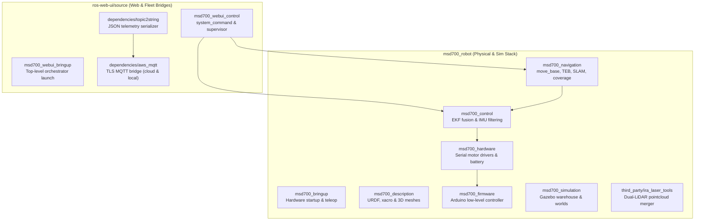

# ROS Package Registry

<RoleBadge role="developer" />

This document provides a comprehensive registry of all ROS 1 Noetic packages within the MSD700 workspace across `msd700_robot` and `ros-web-ui/source`, detailing package roles, key launch files, active nodes, published/subscribed topics, and parameters.

## Workspace Package Layout

## Package Directory: `msd700_robot`

### 1. `msd700_navigation`
The core autonomous movement, SLAM mapping, and area coverage package.

- **Primary Nodes**:
  - `move_base`: Standard ROS navigation action server utilizing `navfn/NavfnROS` for global path planning and `teb_local_planner/TebLocalPlannerROS` for trajectory optimization.
  - `path_coverage_node.py`: Boustrophedon sweep planner computing serpentine paths and handling real-time obstacle replanning using `libs/coverage_geometry.py`.
  - `slam_gmapping`: 2D laser-based SLAM mapping node generating occupancy grids.
  - `amcl`: Adaptive Monte Carlo Localization particle filter for static map localization.
- **Key Launch Files**:
  - `msd700_navigation.launch`: Full navigation bringup with map server, AMCL, and move_base.
  - `msd700_boustrophedon.launch`: Area coverage execution stack with `path_coverage_node`.
  - `msd700_slam.launch`: Gmapping SLAM launch with teleoperation.
  - `msd700_explore.launch`: Autonomous SLAM frontier exploration (`explore_lite`).

### 2. `msd700_control`
Manages state estimation, coordinate transform hierarchies, and sensor fusion.

- **Primary Nodes**:
  - `ekf_localization_node` (`robot_localization`): Extended Kalman Filter fusing wheel encoder odometry (`/wheel/odom`) and IMU sensor data (`/imu/data`) into a stable `/odometry/filtered` topic.
  - `imu_filter_node` (`imu_tools`): Madgwick AHRS sensor filter converting raw angular rate and acceleration into orientation quaternions.
- **Key Launch Files**:
  - `robot_localization.launch`: Configures and launches EKF fusion with parameter loading from `ekf_localization_config.yaml`.
  - `imu_filter.launch`: Launches Madgwick orientation estimation.

### 3. `msd700_description`
Defines physical kinematic structures, collision geometries, and sensor placements using URDF and Xacro.

- **Primary URDF Models**:
  - `urdf/msd700_field.urdf.xacro`: True-scale production robot model (0.90 x 0.70 m, 4 casters, centered drive axle, Velodyne mast).
  - `urdf/velodyne/VLP_16.urdf.xacro`: High-fidelity 16-channel 3D LiDAR model and Gazebo sensor plugins.
  - `urdf/turtlebot3_waffle.urdf.xacro`: Legacy small-scale prototype model.

### 4. `msd700_hardware` & `msd700_firmware`
Handles low-level hardware interfaces, motor actuation, encoder pulse counting, and battery status.

- **Hardware Architecture**:
  - `serial_launch.launch`: Connects host serial ports to the low-level Arduino/Teensy microcontroller over `/dev/ttyUSB*` at 115200 baud.
  - Arduino firmware executes closed-loop PID velocity control, listens for `/cmd_vel` velocity commands, and publishes wheel encoder tick counts.

### 5. `msd700_simulation`
Gazebo simulation environment for testing navigation algorithms in software.

- **Key Environments**:
  - `msd700_warehouse_nav.launch`: Launches the 14 x 21 m AWS RoboMaker Small Warehouse with true-scale `msd700_field` robot model.
  - `scripts/fetch_sim_worlds.sh`: On-demand downloader for 3D simulation meshes (12 MB) from GitHub `ros1` branch.

### 6. `third_party/ira_laser_tools`
Merges multiple 2D LiDAR scanners or converts 3D pointclouds into virtual planar scans.

- **Nodes**:
  - `laserscan_multi_merger`: Merges dual planar LiDARs into a single 360-degree `/scan` topic.

## Package Directory: `ros-web-ui/source`

### 1. `msd700_webui_control`
Bridges web commands and dashboard telemetry to physical robot hardware.

- **Key Nodes**:
  - `system_command.py`: Subscribes to MQTT `/system_command`, manages the exclusive operating lease, dispatches actions, and publishes `/system_feedback`.
  - `operation_supervisor.py`: Autonomous mission sequencer managing Autopilot waypoint advancement and latching `/string/operation_snapshot`.
  - `switch_mode.py`: ROS service orchestrator dynamically switching between `idle`, `navigation`, and `mapping` mode launch stacks.
  - `hardware_monitor.py`: Background watchdog verifying that critical sensor processes and USB devices remain healthy.

### 2. `dependencies/topic2string`
High-performance serialization layer converting heavy ROS message types to JSON strings.

- **Key Nodes**:
  - `robotpose_from_string.py` / `robotpose_to_string`: 25 Hz pose telemetry serializer.
  - `laserscan_to_string.py`: 2 Hz compressed laser scan serializer.
  - `map_compression_node` / `map_decompression_node`: Base64 zlib compression for live SLAM occupancy grids.

### 3. `dependencies/aws_mqtt`
Encrypted transport bridge linking local ROS topics to the central HiveMQ broker.

- **Launch Files**:
  - `nakayama_msd.launch`: Robot-side bridge connecting onboard ROS topics to cloud HiveMQ on port 8883 (TLS).
  - `nakayama_cloud.launch`: Server-side bridge translating MQTT topics into per-unit cloud ROS topics.
  - `local_msd.launch`: Unit-side bridge connecting to local Mosquitto broker (`127.0.0.1:1883`).

## Related Documentation

- [Architecture](/id/development/architecture): High-level system structure and seams.
- [Sensor Fusion and Control](/id/development/sensor-fusion-and-control): Detailed EKF and sensor pipeline setup.
- [State and Behavior](/id/development/state-and-behavior): Detailed state machines for all control nodes.
