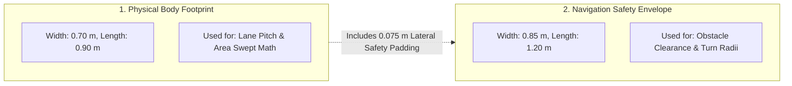
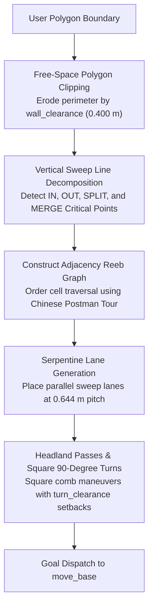
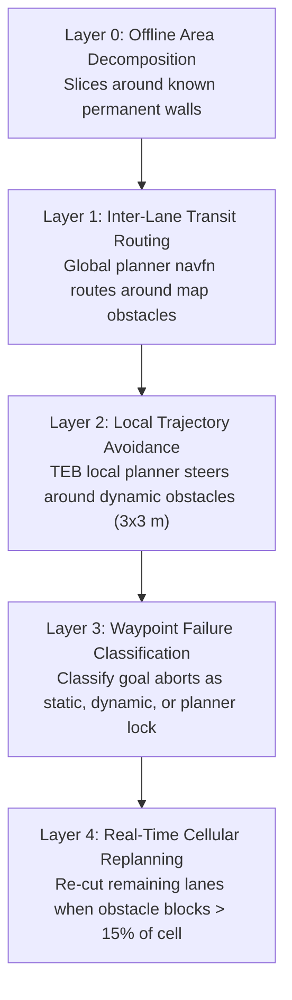
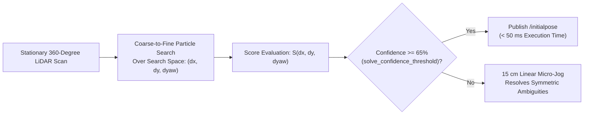

# Arsitektur Cakupan Boustrophedon & Alignment Zero-Spin

<RoleBadge role="developer" />

Dokumen ini menyediakan spesifikasi algoritmik komprehensif untuk pipeline perencanaan cakupan Boustrophedon Cellular Decomposition, perhitungan clearance dual-geometri, manajemen obstacle lima-layer, dan alignment zero-spin particle align validator.

## Dua Geometri Robot

Prinsip desain fundamental dalam perencanaan cakupan MSD700 adalah bahwa **robot memiliki dua dimensi geometris berbeda yang digunakan untuk perhitungan berbeda**:

| Definisi Geometris | Dimensi Ukuran | Penggunaan Algoritmik |
| --- | --- | --- |
| **Physical Body** (`~body_footprint`) | panjang 0,90 m x lebar 0,70 m | Menentukan pitch lane dan perhitungan attainment area yang tersapu. |
| **Costmap Safety Envelope** | panjang 1,20 m x lebar 0,85 m | Menegakkan clearance TEB local planner dan feasibility belokan. |

Envelope dan body berada di `costmap_common_params_field.yaml` dan `msd700_coverage/config/robot/field.yaml`. `path_coverage_node` membaca poligon footprint dari `/move_base/global_costmap/footprint` dan menurunkan inscribed/circumscribed radii darinya (`coverage_geometry.py`); pitch lane selalu berasal dari physical body, bukan envelope ber-padding.

### Konstanta Clearance Turunan (`src/msd700_coverage/coverage_geometry.py`)

Dengan TEB menyala (`min_obstacle_dist 0.05`, `safety_margin 0.0`):

| Konstanta Clearance | Nilai | Formula Matematis |
| --- | --- | --- |
| `wall_clearance` | **0,400 m** | $r_{\text{inscribed}} (0.350\text{ m}) + d_{\min} (0.05\text{ m})$ |
| `turn_clearance` | **0,620 m** | $r_{\text{circumscribed}} (0.570\text{ m}) + d_{\min} (0.05\text{ m})$ |
| `pitch` | **0,644 m** | $w_{\text{body}} (0.70\text{ m}) \times (1 - \text{overlap} (0.08))$ |

Tanpa TEB (fallback `min_obstacle_dist 0.15`): `wall_clearance 0.500 m`, `turn_clearance 0.720 m`.

`lane_edge_clearance` (jarak minimum dari batas cell ke tengah lane) dipatok **0,35 m** di `config/boustrophedon_params.yaml`, tidak dibiarkan `auto` (= `wall_clearance`); `lane_end_clearance` tetap `auto` (= `turn_clearance`).

### Batas Geometris Fisik (TEB menyala):
- **Koridor tersempit yang dapat dimasuki robot**: **0,80 m** ($2 \times \text{wall\_clearance}$).
- **Koridor tersempit dimana robot dapat pivot 180 derajat**: **1,24 m** ($2 \times \text{turn\_clearance}$).
- **Strip batas yang tak terjangkau di sepanjang dinding**: **0,05 m** ($\text{wall\_clearance} - \frac{w_{\text{body}}}{2}$).

::: info Attainment vs Cakupan Mentah
Karena strip perimeter 0,05 m tidak dapat dilintasi tanpa collision, ruangan persegi panjang (misalnya 3 x 6 m) mencapai cakupan maksimum teoretis sekitar **95%**. Performa sistem diukur menggunakan **Attainment Ratio** (fraksi lantai terjangkau yang benar-benar tersapu), bukan persentase area mentah yang tidak disesuaikan.
:::

---

## Algoritma Boustrophedon Cellular Decomposition

Planner cakupan mendekomposisi batas poligonal konkaf sembarang dengan obstacle internal menjadi sub-sel cembung yang bebas-obstacle:

### Klasifikasi Critical Point:
Selama progresi sweep line vertikal sepanjang sumbu $x$, vertex boundary diklasifikasikan berdasarkan konektivitas lokal ruang bebas:
1. **IN Critical Point**: Sel baru terbuka saat ruang bebas meluas.
2. **OUT Critical Point**: Sel berakhir saat boundary konvergen.
3. **SPLIT Critical Point**: Obstacle internal membagi sel aktif menjadi dua sub-sel paralel yang berbeda.
4. **MERGE Critical Point**: Dua sub-sel paralel bergabung kembali melewati trailing edge sebuah obstacle.

---

## Manajemen Obstacle Lima-Layer

---

## Alignment Orientasi Zero-Spin (Particle Align Validator)

Ketika robot ditempatkan pada pose yang tidak diketahui di atas peta yang telah direkam sebelumnya, AMCL tradisional memerlukan rotasi di tempat 360 derajat untuk mengumpulkan dispersi partikel.

MSD700 mengimplementasikan **pencarian partikel coarse-to-fine** (`particle_align_validator.py`) untuk menghitung orientasi dan posisi secara instan tanpa gerakan. Dashboard memicunya lewat service `/align/solve_pose` (tombol Auto Align milik Map Sync, via `align_checker`):

### Formulasi Matematis:
Diberikan $N$ titik laser scan $\mathbf{p}_i = [x_i, y_i]^T$ dan peta occupancy grid statis $M(x, y)$, scan matcher menemukan transformasi rigid $(\Delta x, \Delta y, \Delta \theta)$ yang memaksimalkan skor korelasi:

$$S(\Delta x, \Delta y, \Delta \theta) = \sum_{i=1}^N M\left( \mathbf{R}(\Delta \theta) \mathbf{p}_i + \begin{bmatrix} \Delta x \\ \Delta y \end{bmatrix} \right)$$

Dimana $\mathbf{R}(\Delta \theta)$ adalah matriks rotasi 2D:
$$\mathbf{R}(\Delta \theta) = \begin{bmatrix} \cos(\Delta \theta) & -\sin(\Delta \theta) \\ \sin(\Delta \theta) & \cos(\Delta \theta) \end{bmatrix}$$

Ketika confidence skor kecocokan melebihi $65\%$, pose estimasi dipublikasikan ke `/initialpose`, melokalisasi robot dalam waktu kurang dari $50\text{ ms}$ dengan gerakan rotasi nol.

---

## Rotasi di Tempat: Guard Dihapus, Sumber Diperbaiki

Zero-spin alignment menghilangkan *alasan* untuk berputar. Dulu ada node `rotation_guard` di antara `twist_mux` dan base yang menol-kan belokan di tempat yang otonom; node itu **telah dihapus** (`twist_mux.launch` mendokumentasikan penghapusannya). Setiap spin yang dulu ditangkapnya kini dihentikan di sumbernya masing-masing, dan guard tersebut terukur bukan penyebab kegagalan belokan.

### Apa yang Dimatikan di Sumbernya

| Sumber | Sebelumnya | Sekarang |
| --- | --- | --- |
| `rotate_recovery` | Anak tangga terakhir dari tangga recovery move_base | Tidak dimuat. `recovery_behaviors` hanya mencantumkan dua reset costmap, tak satu pun memerintahkan gerakan |
| TEB terminal pivot | Berputar menghadap heading goal di setiap waypoint | Ketat. `yaw_goal_tolerance: 0.15` (run coverage: `0.10`): waypoint kini membawa heading nyata dari click-drag, sehingga pivot mendarat pada orientasi pilihan operator |
| TEB initial pivot | Berputar di tempat ketika jalur mengarah ke belakang robot | Tetap berputar, tidak mundur: `allow_init_with_backwards_motion: false`, karena VLP-16 tidak melihat apa pun dalam 0,40 m di belakang robot |
| Perintah `SYNC` (`nav_controller`) | 10 detik open-loop `0.5 rad/s`, tanpa pengecekan obstacle | No-op. Gunakan Auto Align, yang melakukan scan-match terlebih dahulu |

Arbitrasi gerakan kini berada di `twist_mux` semata: navigasi pada `/mux/nav_vel` (prioritas 10), keyboard pada inputnya sendiri (prioritas 90), emergency stop membanjiri `/mux/emergency_vel` (prioritas 255). Node yang menulis `/cmd_vel` langsung melewati tangga ini dan tidak dapat dihentikan olehnya.

## Dokumentasi Terkait

- [Simulasi](/id/development/ros/simulation): Lingkungan pengujian warehouse dan model skala.
- [Kontrak Pesan](/id/development/message-contracts): Envelope perintah cakupan dan protokol ACK.
- [State dan Perilaku](/id/development/state-and-behavior): Finite state machine navigasi dan cakupan.
