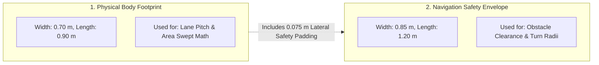
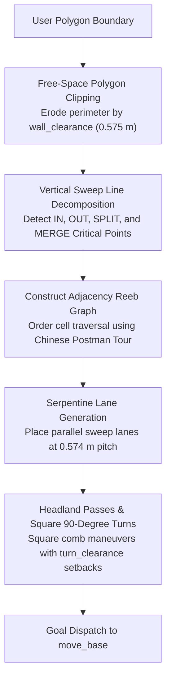
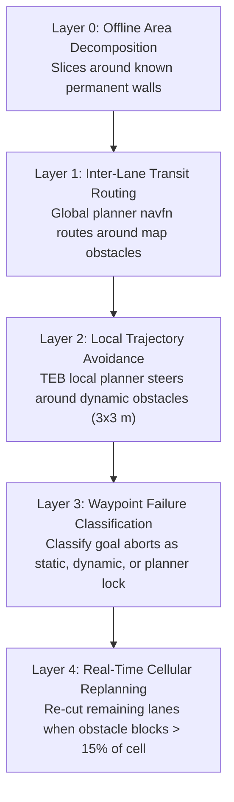
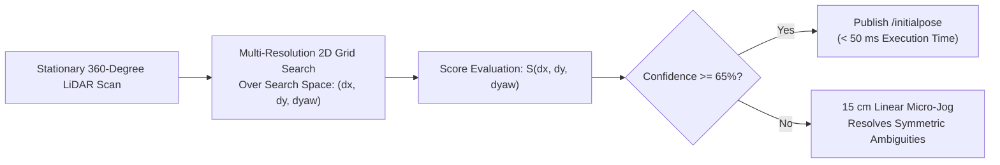
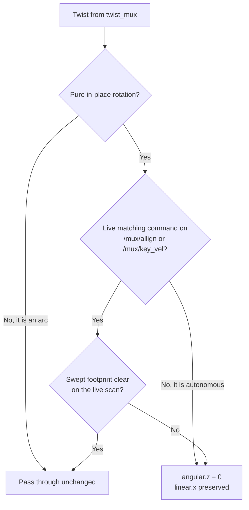

# Arsitektur Cakupan Boustrophedon & Alignment Zero-Spin

<RoleBadge role="developer" />

Dokumen ini menyediakan spesifikasi algoritmik komprehensif untuk pipeline perencanaan cakupan Boustrophedon Cellular Decomposition, perhitungan clearance dual-geometri, manajemen obstacle lima-layer, dan alignment zero-spin Correlative Scan Matcher (CSM).

## Dua Geometri Robot

Prinsip desain fundamental dalam perencanaan cakupan MSD700 adalah bahwa **robot memiliki dua dimensi geometris berbeda yang digunakan untuk perhitungan berbeda**:

| Definisi Geometris | Dimensi Ukuran | Penggunaan Algoritmik |
| --- | --- | --- |
| **Physical Body** (`~body_footprint`) | panjang 0,90 m x lebar 0,70 m | Menentukan pitch lane dan perhitungan attainment area yang tersapu. |
| **Costmap Safety Envelope** | panjang 1,20 m x lebar 0,85 m | Menegakkan clearance TEB local planner dan feasibility belokan. |

Envelope costmap dalam `costmap_common_params.yaml` mencakup padding keselamatan yang disengaja (0,075 m lateral dan 0,150 m longitudinal per sisi). `path_coverage_node` membaca envelope langsung dari `/move_base/global_costmap/footprint` untuk mempertahankan sinkronisasi dengan planner navigasi.

### Konstanta Clearance Turunan (`libs/coverage_geometry.py`)

| Konstanta Clearance | Nilai | Formula Matematis |
| --- | --- | --- |
| `wall_clearance` | **0,575 m** | $r_{\text{inscribed}} (0.425\text{ m}) + d_{\min} (0.150\text{ m})$ |
| `turn_clearance` | **0,885 m** | $r_{\text{circumscribed}} (0.735\text{ m}) + d_{\min} (0.150\text{ m})$ |
| `pitch` | **0,574 m** | $w_{\text{body}} (0.70\text{ m}) \times (1 - \text{overlap} (0.18))$ |

### Batas Geometris Fisik:
- **Koridor tersempit yang dapat dimasuki robot**: **1,15 m** ($2 \times \text{wall\_clearance}$).
- **Koridor tersempit dimana robot dapat pivot 180 derajat**: **1,77 m** ($2 \times \text{turn\_clearance}$).
- **Koridor tersempit yang layak disapu 2-lane**: **1,72 m**.
- **Strip batas yang tak terjangkau di sepanjang dinding**: **0,225 m** ($\text{wall\_clearance} - \frac{w_{\text{body}}}{2}$).

::: info Attainment vs Cakupan Mentah
Karena strip perimeter 0,225 m tidak dapat dilintasi tanpa collision, ruangan persegi panjang (misalnya 3 x 6 m) mencapai cakupan maksimum teoretis sebesar **78,6%**. Performa sistem diukur menggunakan **Attainment Ratio** (fraksi lantai terjangkau yang benar-benar tersapu), bukan persentase area mentah yang tidak disesuaikan.
:::

---

## Algoritma Boustrophedon Cellular Decomposition

Planner cakupan mendekomposisi batas poligonal konkaf sembarang dengan obstacle internal menjadi sub-sel cembung yang bebas-obstacle:

### Klasifikasi Critical Point:
Selama progresi sweep line vertikal sepanjang sumbu $x$, vertex boundary diklasifikasikan berdasarkan konektivitas lokal ruang bebas:
1. **IN Critical Point**: Sel baru terbuka saat ruang bebas meluas.
2. **OUT Critical Point**: Sel berakhir saat boundary konvergen.
3. **SPLIT Critical Point**: Obstacle internal membagi sel aktif menjadi dua sub-sel paralel yang berbeda.
4. **MERGE Critical Point**: Dua sub-sel paralel bergabung kembali melewati trailing edge sebuah obstacle.

---

## Manajemen Obstacle Lima-Layer

---

## Alignment Orientasi Zero-Spin (Correlative Scan Matching)

Ketika robot ditempatkan pada pose yang tidak diketahui di atas peta yang telah direkam sebelumnya, AMCL tradisional memerlukan rotasi di tempat 360 derajat untuk mengumpulkan dispersi partikel.

MSD700 mengimplementasikan **Correlative Scan Matching (CSM)** untuk menghitung orientasi dan posisi secara instan tanpa gerakan:

### Formulasi Matematis:
Diberikan $N$ titik laser scan $\mathbf{p}_i = [x_i, y_i]^T$ dan peta occupancy grid statis $M(x, y)$, scan matcher menemukan transformasi rigid $(\Delta x, \Delta y, \Delta \theta)$ yang memaksimalkan skor korelasi:

$$S(\Delta x, \Delta y, \Delta \theta) = \sum_{i=1}^N M\left( \mathbf{R}(\Delta \theta) \mathbf{p}_i + \begin{bmatrix} \Delta x \\ \Delta y \end{bmatrix} \right)$$

Dimana $\mathbf{R}(\Delta \theta)$ adalah matriks rotasi 2D:
$$\mathbf{R}(\Delta \theta) = \begin{bmatrix} \cos(\Delta \theta) & -\sin(\Delta \theta) \\ \sin(\Delta \theta) & \cos(\Delta \theta) \end{bmatrix}$$

Ketika confidence skor kecocokan melebihi $65\%$, pose estimasi dipublikasikan ke `/initialpose`, melokalisasi robot dalam waktu kurang dari $50\text{ ms}$ dengan gerakan rotasi nol.

---

## Rotasi di Tempat Ditolak Secara Default

Zero-spin alignment menghilangkan *alasan* untuk berputar. Rotation guard menghilangkan *kemampuan*-nya, karena beberapa bagian dari stack masih mencoba melakukan spin sendiri.

`rotation_guard` (`msd700_control`) berada di antara `twist_mux` dan base, pada jalur `cmd_vel` yang dibagikan, sehingga ia mencakup setiap sumber rotasi sekaligus alih-alih satu plugin per satu waktu. Sebuah perintah dihitung sebagai rotasi di tempat ketika `|angular.z| > 0.05` dan `|linear.x| <= 0.05`; busur dan gerakan garis-lurus lolos tanpa perubahan, karena keduanya mentranslasikan footprint sekaligus memutarnya, dan local planner sudah menangani kasus itu.

Rotasi di tempat mencapai roda hanya jika **kedua** gerbang setuju:

**Gerbang 1, consent.** Rotasi yang dihormati hanya yang diminta oleh manusia: **Auto Align** dari Map Sync (`/mux/allign`, dipublikasikan oleh `align_checker` setelah operator menekan tombol) dan **manual WASD** (`/mux/key_vel`, diketik secara lokal atau di-relay dari dashboard). Twist keluaran harus berputar dengan arah sama dan tidak lebih cepat dari yang diminta sumber tersebut, dalam toleransi 5%, dan consent kedaluwarsa 1 detik setelah sumber berhenti mempublikasikan. `/mux/nav_vel` sengaja tidak disertakan: semua yang otonom tiba di sana.

**Gerbang 2, geometri.** Footprint yang tersapu diuji terhadap live scan, bukan terhadap costmap. Gerbang ini didokumentasikan secara lengkap di `rotation_guard.py`; versi singkatnya adalah bahwa costmap merupakan oracle yang salah untuk rotasi, karena pita sapuan berada di dalam jangkauan minimum LiDAR dan obstacle layer meng-raytrace tanda tersebut hilang saat robot mendekatinya.

### Apa yang Dimatikan Ini

| Sumber | Sebelumnya | Sekarang |
| --- | --- | --- |
| `rotate_recovery` | Anak tangga terakhir dari tangga recovery move_base | Tidak dimuat. `recovery_behaviors` hanya mencantumkan dua reset costmap, tak satu pun memerintahkan gerakan |
| TEB terminal pivot | Berputar menghadap heading goal di setiap waypoint | Hilang. `yaw_goal_tolerance: 3.15` menerima heading akhir apa pun |
| TEB initial pivot | Berputar di tempat ketika jalur mengarah ke belakang robot | Mundur sebagai gantinya. `allow_init_with_backwards_motion: true` |
| Perintah `SYNC` (`nav_controller`) | 10 detik open-loop `0.5 rad/s`, tanpa pengecekan obstacle | No-op. Gunakan Auto Align, yang melakukan scan-match terlebih dahulu |

::: warning Heading Waypoint
`yaw_goal_tolerance: 3.15` hanya benar karena tidak ada waypoint dalam sistem ini yang membawa heading yang dipilih siapa pun. Dashboard membangun setiap pin dari klik peta dan mengisi quaternion dengan identity, sehingga toleransi ketat sebenarnya hanya membeli pivot di setiap pin untuk memenuhi field struct yang tidak diset. Jika waypoint suatu saat memperoleh heading yang nyata, ini harus dipertimbangkan ulang, dan pivot di setiap pin akan kembali bersamanya.
:::

### Escape Hatch

- `rotation_guard/allow_in_place: true` mengembalikan ke gerbang geometri saja, sehingga sumber mana pun dapat berputar selama sapuan bersih.
- `twist_mux.launch guard_rotation:=false` menghapus node sepenuhnya dan mengembalikan wiring pra-guard, tanpa pengecekan apa pun.

Tak satu pun keduanya sesuai untuk robot lapangan. Local planner yang memutuskan harus pivot sebelum dapat melanjutkan kini akan diam saja dan akhirnya membatalkan goal-nya, dan trade-off itu disengaja: goal yang dibatalkan terlihat dan dapat dipulihkan, spin buta ke rak tidak.

## Dokumentasi Terkait

- [Simulasi](/id/development/ros/simulation): Lingkungan pengujian warehouse dan model skala.
- [Kontrak Pesan](/id/development/message-contracts): Envelope perintah cakupan dan protokol ACK.
- [State dan Perilaku](/id/development/state-and-behavior): Finite state machine navigasi dan cakupan.
