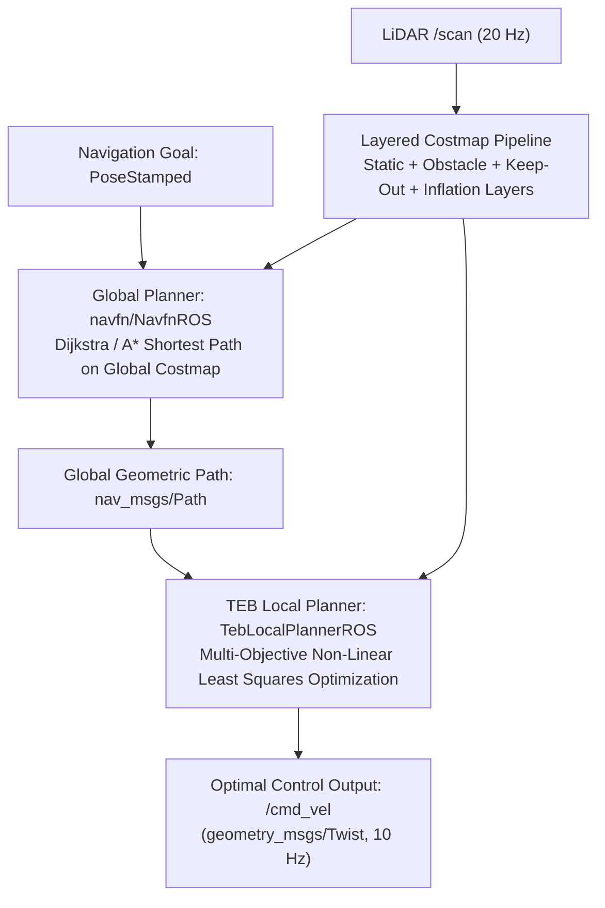

# Costmap dan Motion Planner

<RoleBadge role="developer" />

Dokumen ini merinci arsitektur costmap berlapis, algoritma perencanaan jalur global (`navfn`), dan mekanika optimisasi trajektori lokal (`teb_local_planner`) yang diimplementasikan dalam stack navigasi MSD700.

## Pipeline Perencanaan Gerak



---

## Arsitektur Costmap Berlapis

Lingkungan direpresentasikan sebagai occupancy grid 2D dimana setiap sel menyimpan nilai cost antara $0$ (ruang bebas) dan $254$ (obstacle mematikan).

### Perhitungan Cost dan Peluruhan Inflasi Eksponensial

Ketika sel obstacle teridentifikasi pada posisi $\mathbf{p}_{obs}$, cost dari sel tetangga mana pun pada jarak $d = \|\mathbf{p} - \mathbf{p}_{obs}\|$ dihitung oleh layer inflasi:

$$\text{Cost}(d) = \begin{cases}
254 & \text{if } d \le r_{\text{inscribed}} \quad (\text{Lethal Obstacle Buffer}) \\
\text{round}\left( 253 \cdot \exp\left(-\alpha \cdot (d - r_{\text{inscribed}})\right) \right) & \text{if } r_{\text{inscribed}} < d \le r_{\text{inflation}} \\
0 & \text{if } d > r_{\text{inflation}} \quad (\text{Free Space})
\end{cases}$$

### Parameter Inflasi yang Dikonfigurasi:
- **Radius Inscribed ($r_{\text{inscribed}}$)**: $0.35\text{ m}$ (setengah lebar dari footprint perencanaan, `0.90 x 0.70 m`).
- **Radius Inflasi ($r_{\text{inflation}}$)**: $0.25\text{ m}$ (diturunkan dari $0.70\text{ m}$ pada 2026-09-11).
- **Faktor Skala Cost ($\alpha$)**: $4.0$.

::: warning Pita gradien saat ini kosong
$r_{\text{inflation}} < r_{\text{inscribed}}$, sehingga kasus tengah dari fungsi cost piecewise di atas tidak
pernah berlaku: setiap sel yang terinflasi berada di dalam radius inscribed dan mengambil nilai flat $253$, dan tidak ada
yang terinflasi melewati $0.25\text{ m}$. Hasilnya adalah collar keras $0.25\text{ m}$ tanpa ekor peluruhan, dan
collar itu lebih sempit daripada setengah-lebar yang sebenarnya ditempati robot, sehingga navfn akan merutekan
garis-tengah yang tidak dapat diakomodasi oleh dinding, dan TEB harus menyimpang darinya (`inflation_dist` $0.75$,
`weight_inflation` $5.0$, ditambah pengecekan footprint, adalah hal-hal yang menahan body agar tidak menabrak dinding).
Memulihkan gradien yang nyata berarti nilai di atas $0.35\text{ m}$.
:::

```yaml
# config/costmap/costmap_common_params.yaml
footprint: [[-0.45, -0.35], [0.45, -0.35], [0.45, 0.35], [-0.45, 0.35]]
footprint_padding: 0.01

obstacle_layer:
  enabled: true
  max_obstacle_height: 2.0
  min_obstacle_height: 0.0
  obstacle_range: 5.5
  raytrace_range: 6.0
  observation_sources: laser_scan_sensor
  laser_scan_sensor:
    sensor_frame: base_scan
    data_type: LaserScan
    topic: /scan
    marking: true
    clearing: true

inflation_layer:
  enabled: true
  inflation_radius: 0.25
  cost_scaling_factor: 4.0
```

---

## Optimisasi Trajektori Timed-Elastic-Band (TEB)

`teb_local_planner` merumuskan pembentukan trajektori sebagai masalah optimisasi non-linear multi-objektif atas sekuens state robot $\mathbf{s}_k = [x_k, y_k, \theta_k]^T$ dan selisih waktu $\Delta T_k$:

$$\mathcal{B} = \left\{ \mathbf{s}_0, \Delta T_0, \mathbf{s}_1, \Delta T_1, \dots, \mathbf{s}_N \right\}$$

### Fungsi Objektif:
Planner meminimalkan jumlah tertimbang dari fungsi penalti objektif:

$$V(\mathcal{B}) = \sum_k \left( \gamma_{\text{time}} \cdot \Delta T_k^2 + \gamma_{\text{path}} \cdot \|\mathbf{s}_{k+1} - \mathbf{s}_k\|^2 + \gamma_{\text{obs}} \cdot f_{\text{obs}}(\mathbf{s}_k) + \gamma_{\text{kin}} \cdot f_{\text{kin}}(\mathbf{s}_k, \mathbf{s}_{k+1}) \right)$$

### Fungsi Penalti Kunci:
1. **Penalti Time-Optimality**:
   $$f_{\text{time}}(\Delta T_k) = \Delta T_k^2$$
   Mendorong robot mencapai goal dalam waktu minimal dalam batas kecepatan ($v_{\max} = 0.40\text{ m/s}$, $\omega_{\max} = 1.0\text{ rad/s}$).

2. **Penalti Clearance Obstacle**:
   $$f_{\text{obs}}(\mathbf{s}_k) = \begin{cases}
   \left( d_{\min} - \text{dist}(\mathbf{s}_k, \mathcal{O}) \right)^2 & \text{if } \text{dist}(\mathbf{s}_k, \mathcal{O}) < d_{\min} \\
   0 & \text{otherwise}
   \end{cases}$$
   Dimana $d_{\min} = 0.150\text{ m}$ adalah jarak clearance obstacle minimum.

3. **Constraint Kinematik Non-Holonomic**:
   Memberi penalti pada kecepatan pergeseran lateral untuk menegakkan kinematika differential drive:
   $$\dot{y}_k \cdot \cos(\theta_k) - \dot{x}_k \cdot \sin(\theta_k) = 0$$

---

## Zona Keep-Out dan Dynamic Reconfigure

1. **Layer Grid Keep-Out (`keepout_layer`)**: Subscribe ke `/msd700/keepout_grid` dimana poligon kustom operator dirasterisasi menjadi sel cost $254$, mencegah planner global dan lokal menghasilkan trajektori yang melintasi zona terlarang.
2. **Adaptasi Mode Coverage**: Selama sapuan boustrophedon, `path_coverage_node` menurunkan bobot forward drive (`weight_kinematics_forward_drive`) dari `1000.0` menjadi `5.0` melalui `dynamic_reconfigure`, memungkinkan belokan pivot comb 90 derajat yang mulus tanpa stall.

## Dokumentasi Terkait

- [Cakupan Boustrophedon](/id/development/ros/boustrophedon-and-alignment): Geometri cakupan dan dekomposisi sel.
- [Sensor Fusion & Kontrol](/id/development/ros/sensor-fusion-and-control): Estimasi state kinematik dan EKF.
- [Simulasi](/id/development/ros/simulation): Lingkungan pengujian warehouse.
