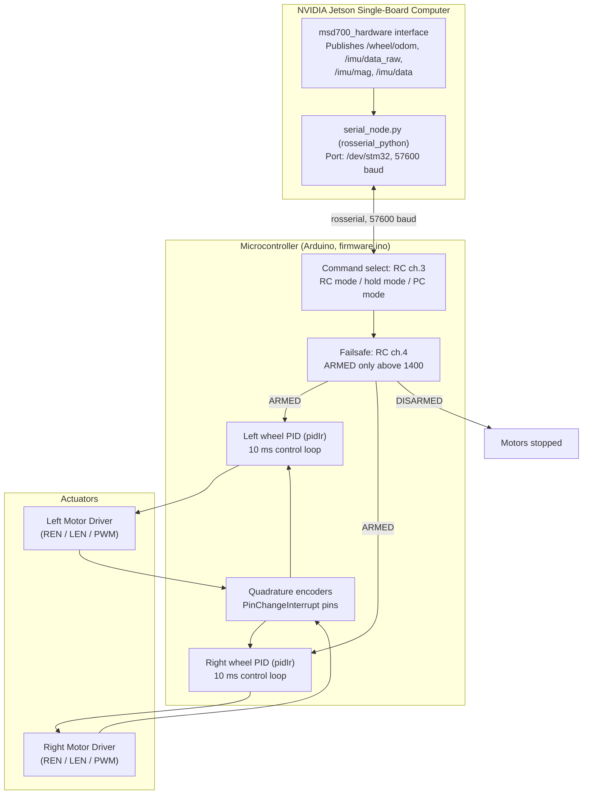

# Firmware, Mikrokontroler, dan Bus Hardware

<RoleBadge role="developer" />

Firmware mikrokontroler embedded (`msd700_firmware/firmware/firmware.ino`, Arduino) dan cara Jetson berbicara dengannya. Firmware menerima perintah dari **dua** sumber — receiver RC (Taranis X7) atau PC lewat ROS — dan menggerakkan kedua motor roda melalui loop PID per roda.

## Topologi Kontrol Embedded

Tidak ada topic `/battery_state` di mana pun dalam stack, dan tidak ada pembagi tegangan ADC baterai dalam firmware ini. Konstanta geometri roda dalam firmware (`WHEEL_RADIUS 2.75 cm`, `WHEEL_DISTANCE 23.0 cm`) cocok dengan konfigurasi odometri sisi host (`odometry_config.yaml`: radius `2.7 cm`, distance `23 cm`, `encoder_ppr 2400`).

---

## Pinout Hardware (`firmware.ino`)

| Fungsi Sinyal | Pin Mikrokontroler |
| --- | --- |
| **Right Motor REN / LEN / PWM** | Pin 4 / 5 / 9 |
| **Left Motor REN / LEN / PWM** | Pin 6 / 7 / 8 |
| **Right Encoder A / B** | Pin 52 / 12 |
| **Left Encoder A / B** | Pin 11 / 10 |
| **Status LED (merah / biru)** | Pin 30 / 31 |
| **Servo kamera** | Pin 3 (rentang 125–175, langkah 10) |
| **Ultrasonik (UART2 RX / TX)** | Pin 17 / 16 |

Tautan Jetson adalah `Serial.begin(57600)`.

---

## Kontrol Kecepatan PID Closed-Loop

Setiap roda menjalankan loop PID diskret (`pidIr`) pada periode kontrol 10 ms (`LOOP_TIME 10`):

$$\text{PWM}_k = K_p \cdot e_k + K_i \sum e_j \cdot \Delta t + K_d \cdot \frac{e_k - e_{k-1}}{\Delta t}$$

Output dijenuhkan (`constrain`) pada `MAX_PWM 250`, bukan 255 penuh 8-bit. Batas kecepatan adalah `MAX_RPM_MOVE 180` (longitudinal) dan `MAX_RPM_TURN 70` (rotasi). Kanal receiver RC melewati filter low-pass 0,25 Hz; sinyal encoder melewati filter low-pass 3 Hz.

---

## RC Failsafe (Arming)

Prototipe hanya menerima perintah gerak saat **ARMED**: kanal RC 4 harus membaca di atas 1400 (`update_failsafe()`). Di bawah itu statusnya DISARMED dan motor berhenti, apa pun perintah RC atau PC yang masuk. Sumber perintah mengikuti kanal RC 3: mode RC, mode hold, atau mode PC (ROS).

## Dokumentasi Terkait

- [Sensor Fusion & Kontrol](/id/development/ros/sensor-fusion-and-control): Integrasi odometri dan EKF.
- [Costmap & Planner](/id/development/ros/costmaps-and-planners): Parameter batas kecepatan.
- [State dan Perilaku](/id/development/state-and-behavior): State machine emergency stop.
