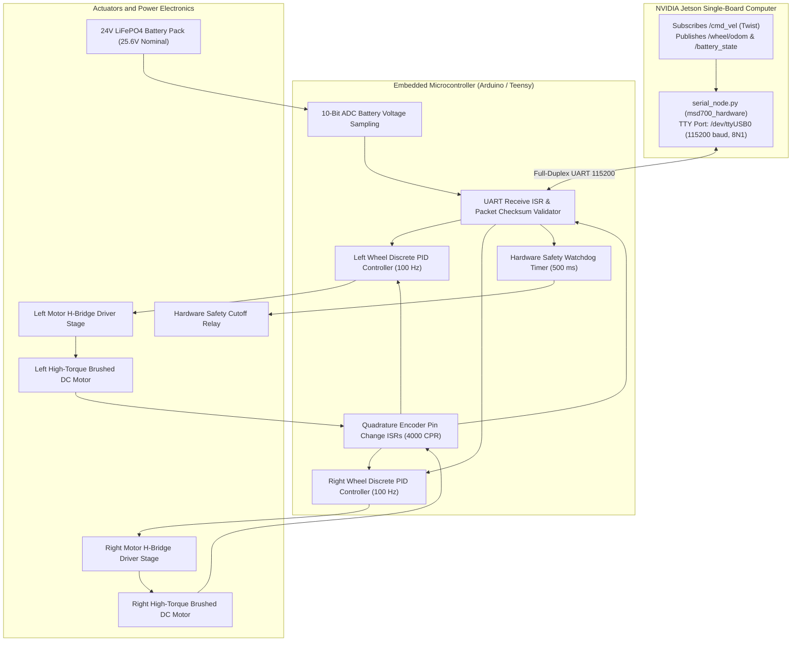

# Firmware, Mikrokontroler, dan Bus Hardware

<RoleBadge role="developer" />

Dokumen ini menyediakan spesifikasi teknis mendalam untuk firmware mikrokontroler embedded, antarmuka driver motor, decoding encoder optik, algoritma kontrol kecepatan PID diskret, dan sirkuit telemetri analog yang diimplementasikan pada robot MSD700.

## Topologi Kontrol Embedded

---

## Pinout dan Pengkabelan Elektrikal Hardware

Komunikasi antara NVIDIA Jetson dan mikrokontroler berjalan melalui USB UART kecepatan tinggi dengan isolasi optik:

| Fungsi Sinyal | Pin Mikrokontroler | Koneksi Driver / Periferal | Karakteristik Elektrikal |
| --- | --- | --- | --- |
| **Left Motor PWM** | Pin 5 (Timer 3) | Left H-Bridge Speed Gate | Logika 0 hingga 5V, PWM 20 kHz (Drive Senyap Tak Terdengar) |
| **Left Motor DIR** | Pin 4 | Left H-Bridge Direction Input | Logic High: Maju, Logic Low: Mundur |
| **Right Motor PWM** | Pin 6 (Timer 4) | Right H-Bridge Speed Gate | Logika 0 hingga 5V, PWM 20 kHz |
| **Right Motor DIR** | Pin 7 | Right H-Bridge Direction Input | Logic High: Maju, Logic Low: Mundur |
| **Left Encoder A** | Pin 2 (INT0) | Left Optical Encoder Channel A | Interrupt TTL 5V (Rising/Falling Edge) |
| **Left Encoder B** | Pin 3 (INT1) | Left Optical Encoder Channel B | Interrupt TTL 5V |
| **Right Encoder A** | Pin 18 (INT5) | Right Optical Encoder Channel A | Interrupt TTL 5V |
| **Right Encoder B** | Pin 19 (INT4) | Right Optical Encoder Channel B | Interrupt TTL 5V |
| **Battery Voltage ADC**| Pin A0 (ADC0) | Precision Resistor Divider Output | Tegangan Analog 0 hingga 5,0V |
| **E-Stop Safety Line** | Pin 12 | Hardware Relay Gate Driver | Logic High: Motor Aktif, Low: Cutoff |

---

## Kontrol Kecepatan PID Diskret Closed-Loop

Firmware menjalankan dua loop kontrol PID diskret pada $100\text{ Hz}$ ($\Delta t = 0.01\text{ s}$) dengan clamping anti-windup untuk mengontrol kecepatan roda:

### Formulasi Error Diskret:
$$e_k = v_{\text{target}} - v_{\text{measured}}$$

### Output Kontrol PID dengan Clamping:
$$\text{PWM}_k = K_p \cdot e_k + K_i \sum_{j=0}^k e_j \cdot \Delta t + K_d \cdot \frac{e_k - e_{k-1}}{\Delta t}$$

### Proteksi Integrator Anti-Windup:
Untuk mencegah integrator windup ketika motor dibebani sementara atau stall terhadap tanjakan:

$$\sum e_j \cdot \Delta t = \text{clamp}\left( \sum e_j \cdot \Delta t, -I_{\max}, I_{\max} \right)$$

$$\text{PWM}_k = \text{clamp}(\text{PWM}_k, -\text{PWM}_{\max}, \text{PWM}_{\max})$$

Dimana $\text{PWM}_{\max} = 255$ (resolusi timer $8$-bit).

---

## Sirkuit Sensing Tegangan Baterai

Robot ditenagai oleh baterai LiFePO4 24V (penuh: $29.2\text{ V}$, nominal: $25.6\text{ V}$, cutoff: $21.0\text{ V}$).

Voltage divider onboard menurunkan skala tegangan baterai ke rentang $0\text{ hingga }5\text{ V}$ dari ADC mikrokontroler:

$$V_{adc} = V_{bat} \cdot \frac{R_2}{R_1 + R_2}$$

Dimana $R_1 = 30\text{ k}\Omega$ dan $R_2 = 5.1\text{ k}\Omega$ (Rasio Divider $K_{div} = 0.1453$).

### Rekonstruksi Tegangan dalam Firmware:
$$V_{bat} = \frac{\text{ADC\_RAW}}{1024} \cdot V_{ref} \cdot \left( \frac{R_1 + R_2}{R_2} \right)$$

Dimana $V_{ref} = 5.00\text{ V}$.

---

## Hardware Safety Watchdog

Untuk mencegah kondisi robot lepas kendali yang disebabkan oleh host OS lockup atau kabel serial terputus, mikrokontroler menjalankan hardware watchdog otonom:

1. **Timer Expiry**: Register timer watchdog di-reset ke $500\text{ ms}$ pada setiap paket kecepatan yang terverifikasi checksum-nya.
2. **Safety Cutoff**: Jika tidak ada paket yang tiba selama $500\text{ ms}$, mikrokontroler segera meng-clamp output PWM motor ke nol dan menjatuhkan gate line `ESTOP_RELAY`.

## Dokumentasi Terkait

- [Sensor Fusion & Kontrol](/id/development/ros/sensor-fusion-and-control): Integrasi odometri dan EKF.
- [Costmap & Planner](/id/development/ros/costmaps-and-planners): Parameter batas kecepatan.
- [State dan Perilaku](/id/development/state-and-behavior): State machine emergency stop.
