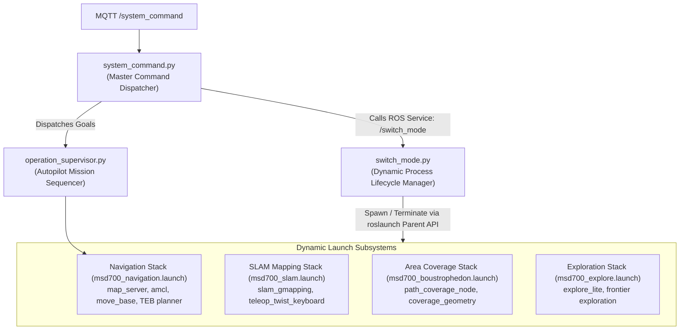
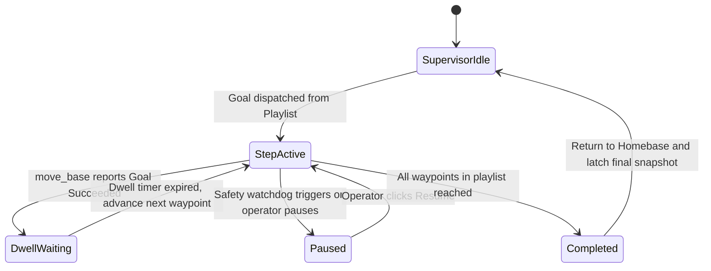

# Arsitektur Pergantian Node dan Mode Dinamis

<RoleBadge role="developer" />

Dokumen ini merinci bagaimana robot MSD700 secara dinamis berpindah antara mode operasional (`idle`, `navigation`, `mapping`, `coverage`, dan `exploration`) saat runtime menggunakan `switch_mode.py`, `system_command.py`, dan `operation_supervisor.py` tanpa me-restart ROS core utama.

## Topologi Orkestrasi Mode



---

## Mode Operasi dan Stack Node Aktif

| Mode Operasional | Node ROS Aktif | Node Nonaktif / Direaping | Jejak Memori & CPU |
| --- | --- | --- | --- |
| **`idle`** | `roscore`, `serial_node`, `imu_filter`, `robot_state_publisher`, `aws_mqtt`, `camera_client`. | `move_base`, `amcl`, `slam_gmapping`, `path_coverage_node`. | Minimal (kira-kira 5% CPU, 200 MB RAM). |
| **`navigation`** | Semua node `idle` + `map_server`, `amcl`, `move_base`, `costmap_2d`. | `slam_gmapping`, `explore_lite`. | Navigasi standar (kira-kira 25% CPU). |
| **`mapping`** | Semua node `idle` + `slam_gmapping`, `teleop`. | `amcl`, `map_server` (membaca peta live sebagai gantinya). | Sedang (kira-kira 35% CPU). |
| **`coverage`** | Semua node `navigation` + `path_coverage_node`. | `explore_lite`. | Beban misi penuh (kira-kira 40% CPU). |
| **`exploration`** | Semua node `mapping` + pencarian frontier `explore_lite`. | `amcl`. | Beban algoritmik tinggi (kira-kira 45% CPU). |

---

## Siklus Hidup Proses Dinamis via `roslaunch` Parent API

Alih-alih mengeksekusi perintah shell seperti `system("roslaunch ...")` yang meninggalkan proses zombie terlepas, `switch_mode.py` memanfaatkan API Python native `roslaunch.parent.ROSLaunchParent`:

```python
import roslaunch
import rospy

class ModeSwitcher:
    def __init__(self):
        self.current_mode = "idle"
        self.active_launch_parent = None

    def transition_to(self, target_mode, launch_file_path):
        # 1. Gracefully terminate active launch stack
        if self.active_launch_parent is not None:
            rospy.loginfo(f"Stopping active stack for mode: {self.current_mode}")
            self.active_launch_parent.shutdown()
            self.active_launch_parent = None

        # 2. Instantiate and start new launch parent
        if target_mode != "idle":
            uuid = roslaunch.rlutil.get_or_generate_uuid(None, False)
            roslaunch.configure_logging(uuid)
            self.active_launch_parent = roslaunch.parent.ROSLaunchParent(
                uuid, [launch_file_path]
            )
            self.active_launch_parent.start()

        self.current_mode = target_mode
        rospy.loginfo(f"Successfully transitioned to mode: {target_mode}")
```

### Graceful Teardown dan Pencegahan Zombie:
1. **Dispatch SIGINT**: `launch_parent.shutdown()` mengirim `SIGINT` ke semua proses child yang dikelola dalam urutan dependency terbalik.
2. **Grace Window 5 Detik**: Node diberi waktu hingga 5 detik untuk flush buffer disk (misalnya `map_saver` menulis gambar `.pgm` dan `.yaml`).
3. **Eskalasi**: Jika sebuah node gagal exit secara bersih dalam grace period, proses parent akan eskalasi ke `SIGTERM` dan `SIGKILL`, memastikan tidak ada node zombie yang tersisa di graph ROS master.

---

## Sequencing Misi Autopilot (`operation_supervisor.py`)

`operation_supervisor.py` mengelola eksekusi otonom dari rute waypoint multi-langkah dan playlist cakupan area:



### Kemampuan Kunci Supervisor:
- **Latched Operation Snapshot**: Mempublikasikan `/string/operation_snapshot` dengan QoS latched. Ketika operator mana pun membuka tab browser, state lengkap dari misi aktif (indeks waypoint aktif, sisa pin rute, dwell timer) dipulihkan dalam hitungan milidetik.
- **Pengecualian Keselamatan Autopilot**: Ketika Autopilot diaktifkan (ON), supervisor menekan pause disconnect operator 10 detik, memungkinkan misi sapuan jangka panjang berlanjut tanpa pengawasan.

## Dokumentasi Terkait

- [Daftar Paket ROS](/id/development/ros/ros-packages): Struktur paket dan definisi launch file.
- [State dan Perilaku](/id/development/state-and-behavior): Finite state machine detail dan tier watchdog.
- [Kontrak Pesan](/id/development/message-contracts): Payload pesan MQTT dan operation sync.
