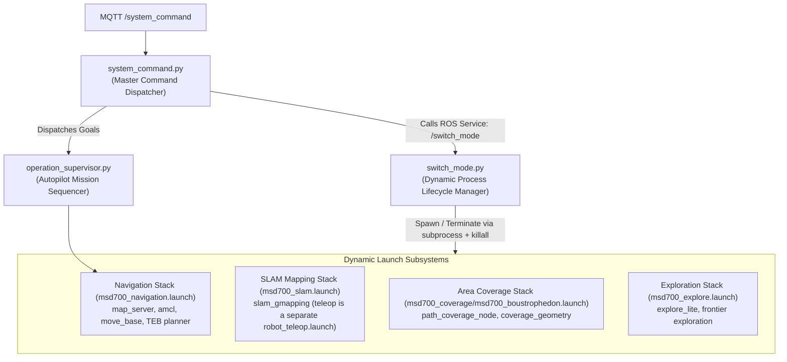
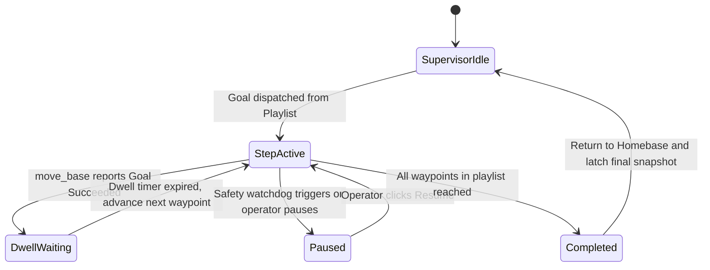

# Arsitektur Pergantian Node dan Mode Dinamis

<RoleBadge role="developer" />

Dokumen ini merinci bagaimana robot MSD700 secara dinamis berpindah antara mode operasional (`navigation`, `slam`, `explore`, `boustrophedon` — idle hanyalah "tidak ada launch stack") saat runtime menggunakan `switch_mode.py`, `system_command.py`, dan `operation_supervisor.py` tanpa me-restart ROS core utama. Nama mode berasal dari `switch_mode.yaml` dan harus cocok dengan string yang dikirim lewat service `/switch_mode`.

## Topologi Orkestrasi Mode



---

## Mode Operasi dan Stack Node Aktif

| Mode (`switch_mode.yaml`) | Launch file | Catatan |
| --- | --- | --- |
| (idle — tanpa stack) | — | Node dasar tetap berjalan (`serial_node`, `imu_filter`, `robot_state_publisher`, `aws_mqtt`, `camera_client`). |
| **`navigation`** | `msd700_navigation.launch` | `map_server`, `amcl`, `move_base`, costmap. |
| **`slam`** | `msd700_slam.launch` | Pemetaan live; teleop adalah launch terpisah, bukan bagian dari stack. |
| **`explore`** | `msd700_explore.launch` | Pencarian frontier `explore_lite`. |
| **`boustrophedon`** | `msd700_coverage/msd700_boustrophedon.launch` | `path_coverage_node`; `use_autocover` mati secara default. |

---

## Siklus Hidup Proses Dinamis via `subprocess`

`switch_mode.py` men-spawn setiap stack dengan `subprocess.Popen(cmd_list, ...)` dan menghentikannya dengan timeout dari `switch_mode.yaml`:

```yaml
timeouts:
  graceful_shutdown: 3   # seconds before escalation
  force_kill: 1          # seconds before SIGKILL
```

### Graceful Teardown dan Pencegahan Zombie:
1. **Terminate**: process group dari stack aktif diminta shutdown secara graceful.
2. **Grace Window 3 Detik**: Node diberi waktu hingga 3 detik untuk flush state (misalnya `map_saver` menulis `.pgm`/`.yaml`).
3. **Eskalasi**: melewati grace window, switcher eskalasi ke force-kill (`1 s`), dan sisa simulator di-reap dengan `killall`, memastikan tidak ada node zombie yang tersisa di graph ROS master.

---

## Sequencing Misi Autopilot (`operation_supervisor.py`)

`operation_supervisor.py` mengelola eksekusi otonom dari rute waypoint multi-langkah dan playlist cakupan area:



### Kemampuan Kunci Supervisor:
- **Latched Operation Snapshot**: Mempublikasikan `/string/operation_snapshot` dengan QoS latched. Ketika operator mana pun membuka tab browser, state lengkap dari misi aktif (indeks waypoint aktif, sisa pin rute, dwell timer) dipulihkan dalam hitungan milidetik.
- **Pengecualian Keselamatan Autopilot**: Ketika Autopilot diaktifkan (ON), supervisor menekan pause disconnect operator 10 detik, memungkinkan misi sapuan jangka panjang berlanjut tanpa pengawasan.

## Dokumentasi Terkait

- [Daftar Paket ROS](/id/development/ros/ros-packages): Struktur paket dan definisi launch file.
- [State dan Perilaku](/id/development/state-and-behavior): Finite state machine detail dan tier watchdog.
- [Kontrak Pesan](/id/development/message-contracts): Payload pesan MQTT dan operation sync.
