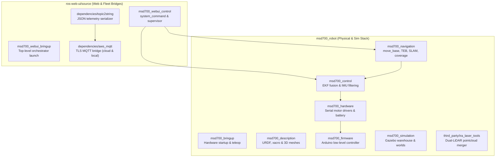

# Daftar Paket ROS

<RoleBadge role="developer" />

Dokumen ini menyediakan daftar komprehensif seluruh paket ROS 1 Noetic dalam workspace MSD700, mencakup `msd700_robot` dan `ros-web-ui/source`, dengan rincian peran paket, launch file kunci, node aktif, topic yang dipublikasikan/disubscribe, dan parameter.

## Tata Letak Paket Workspace

## Direktori Paket: `msd700_robot`

### 1. `msd700_navigation`
Paket inti untuk pergerakan otonom, pemetaan SLAM, dan cakupan area.

- **Node Utama**:
  - `move_base`: Action server navigasi ROS standar yang memanfaatkan `navfn/NavfnROS` untuk perencanaan jalur global dan `teb_local_planner/TebLocalPlannerROS` untuk optimisasi trajektori.
  - `path_coverage_node.py`: Planner sapuan boustrophedon yang menghitung jalur serpentine dan menangani replanning obstacle real-time menggunakan `libs/coverage_geometry.py`.
  - `slam_gmapping`: Node SLAM berbasis laser 2D yang menghasilkan occupancy grid.
  - `amcl`: Filter partikel Adaptive Monte Carlo Localization untuk lokalisasi pada peta statis.
- **Launch File Kunci**:
  - `msd700_navigation.launch`: Bringup navigasi lengkap dengan map server, AMCL, dan move_base.
  - `msd700_boustrophedon.launch`: Stack eksekusi cakupan area dengan `path_coverage_node`.
  - `msd700_slam.launch`: Launch SLAM Gmapping dengan teleoperasi.
  - `msd700_explore.launch`: Eksplorasi frontier SLAM otonom (`explore_lite`).

### 2. `msd700_control`
Mengelola estimasi state, hierarki transformasi koordinat, dan sensor fusion.

- **Node Utama**:
  - `ekf_localization_node` (`robot_localization`): Extended Kalman Filter yang mem-fusi odometri wheel encoder (`/wheel/odom`) dan data sensor IMU (`/imu/data`) menjadi topic `/odometry/filtered` yang stabil.
  - `imu_filter_node` (`imu_tools`): Filter sensor Madgwick AHRS yang mengonversi angular rate dan akselerasi mentah menjadi quaternion orientasi.
- **Launch File Kunci**:
  - `robot_localization.launch`: Mengonfigurasi dan menjalankan fusion EKF dengan pemuatan parameter dari `ekf_localization_config.yaml`.
  - `imu_filter.launch`: Menjalankan estimasi orientasi Madgwick.

### 3. `msd700_description`
Mendefinisikan struktur kinematik fisik, geometri collision, dan penempatan sensor menggunakan URDF dan Xacro.

- **Model URDF Utama**:
  - `urdf/msd700_field.urdf.xacro`: Model robot produksi berskala nyata (0,90 x 0,70 m, 4 caster, poros drive di tengah, mast Velodyne).
  - `urdf/velodyne/VLP_16.urdf.xacro`: Model LiDAR 3D 16-channel resolusi tinggi dan plugin sensor Gazebo.
  - `urdf/turtlebot3_waffle.urdf.xacro`: Model prototipe skala kecil legacy.

### 4. `msd700_hardware` & `msd700_firmware`
Menangani antarmuka hardware level rendah, aktuasi motor, penghitungan pulsa encoder, dan status baterai.

- **Arsitektur Hardware**:
  - `serial_launch.launch`: Menghubungkan port serial host ke mikrokontroler Arduino/Teensy level rendah melalui `/dev/ttyUSB*` pada 115200 baud.
  - Firmware Arduino menjalankan kontrol kecepatan PID closed-loop, mendengarkan perintah kecepatan `/cmd_vel`, dan mempublikasikan jumlah tick wheel encoder.

### 5. `msd700_simulation`
Lingkungan simulasi Gazebo untuk menguji algoritma navigasi secara software.

- **Environment Kunci**:
  - `msd700_warehouse_nav.launch`: Menjalankan AWS RoboMaker Small Warehouse berukuran 14 x 21 m dengan model robot `msd700_field` berskala nyata.
  - `scripts/fetch_sim_worlds.sh`: Pengunduh on-demand untuk mesh simulasi 3D (12 MB) dari branch `ros1` GitHub.

### 6. `third_party/ira_laser_tools`
Menggabungkan beberapa scanner LiDAR 2D atau mengonversi pointcloud 3D menjadi scan planar virtual.

- **Node**:
  - `laserscan_multi_merger`: Menggabungkan dua LiDAR planar menjadi satu topic `/scan` 360 derajat.

## Direktori Paket: `ros-web-ui/source`

### 1. `msd700_webui_control`
Menjembatani perintah web dan telemetri dashboard ke hardware robot fisik.

- **Node Kunci**:
  - `system_command.py`: Subscribe ke MQTT `/system_command`, mengelola lease operasi eksklusif, mendispatch aksi, dan mempublikasikan `/system_feedback`.
  - `operation_supervisor.py`: Sequencer misi otonom yang mengelola kemajuan waypoint Autopilot dan me-latch `/string/operation_snapshot`.
  - `switch_mode.py`: Orkestrator service ROS yang secara dinamis berpindah antara stack launch mode `idle`, `navigation`, dan `mapping`.
  - `hardware_monitor.py`: Watchdog latar belakang yang memverifikasi bahwa proses sensor kritis dan perangkat USB tetap sehat.

### 2. `dependencies/topic2string`
Lapisan serialisasi berperforma tinggi yang mengonversi tipe pesan ROS berat menjadi string JSON.

- **Node Kunci**:
  - `robotpose_from_string.py` / `robotpose_to_string`: Serializer telemetri pose 25 Hz.
  - `laserscan_to_string.py`: Serializer laser scan terkompresi 2 Hz.
  - `map_compression_node` / `map_decompression_node`: Kompresi zlib Base64 untuk occupancy grid SLAM live.

### 3. `dependencies/aws_mqtt`
Bridge transport terenkripsi yang menghubungkan topic ROS lokal ke broker HiveMQ pusat.

- **Launch File**:
  - `nakayama_msd.launch`: Bridge sisi robot yang menghubungkan topic ROS onboard ke HiveMQ cloud pada port 8883 (TLS).
  - `nakayama_cloud.launch`: Bridge sisi server yang menerjemahkan topic MQTT menjadi topic ROS cloud per-unit.
  - `local_msd.launch`: Bridge sisi unit yang terhubung ke broker Mosquitto lokal (`127.0.0.1:1883`).

## Dokumentasi Terkait

- [Arsitektur](/id/development/architecture): Struktur dan seam sistem level tinggi.
- [Sensor Fusion & Kontrol](/id/development/ros/sensor-fusion-and-control): Detail konfigurasi EKF dan pipeline sensor.
- [State dan Perilaku](/id/development/state-and-behavior): State machine detail untuk semua node kontrol.
