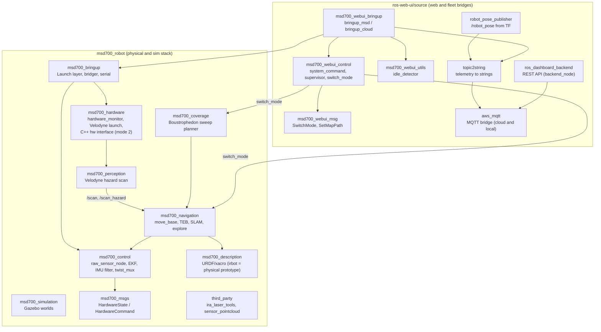

# Daftar Paket ROS

<RoleBadge role="developer" />

Dokumen ini menyediakan daftar komprehensif seluruh paket ROS 1 Noetic dalam workspace MSD700, mencakup `msd700_robot` dan `ros-web-ui/source`, dengan rincian peran paket, launch file kunci, node aktif, topic yang dipublikasikan/disubscribe, dan parameter.

## Tata Letak Paket Workspace

## Direktori Paket: `msd700_robot`

### 0. `msd700_bringup`
Lapisan launch yang merakit hardware, sim, dan navigasi menjadi stack yang bisa dijalankan.

| File launch | Tujuan | Jalan di |
| --- | --- | --- |
| `robot_navigation.launch` | Stack penuh: hardware **atau** sim + control + navigation core, RViz/teleop opsional | Robot vs sim (`use_sim`) |
| `robot_slam.launch` | Layering sama untuk mapping (gmapping/hector) | Robot vs sim (`use_sim`) |
| `robot_teleop.launch` | Drive manual: hardware/sim + control + `teleop_twist_keyboard` → `mux/key_vel` | Robot vs sim + teleop/debug |
| `lidar_scanner.launch` | Entry lidar robot nyata (default Velodyne, RPLIDAR/legacy); tidak pernah di-launch di sim | Hanya robot |
| `serial_launch.launch` | `rosserial_python` di `/dev/stm32` @57600 | Robot |
| `map_server.launch` | `map_server` di yaml relatif-paket atau absolut | Keduanya |
| `multiple_point.launch` | Mode multi-point `nav_controller.py` + `nav_gui.py` | Netral |
| `rviz_launch.launch` | Helper debug/viz (description + state publisher + rviz) | Debug |
| `teleop.launch` | `teleop_node_cmd_vel.py` | Teleop |
| `custom_model/` | Launch RPLIDAR tunggal/ganda legacy | Robot (legacy) |
| `testing/speed_test.launch` | Rig serial + teleop + bridger + `calculate.py` | Debug/test |

`bridger.launch` (geometri drive + `bridger.py`) selalu menyala, di semua mode termasuk cold idle.

### 1. `msd700_navigation`
Paket inti untuk pergerakan otonom, pemetaan SLAM, dan cakupan area.

- **Node Utama**:
  - `move_base`: Action server navigasi ROS standar yang memanfaatkan `navfn/NavfnROS` untuk perencanaan jalur global dan `teb_local_planner/TebLocalPlannerROS` untuk optimisasi trajektori.
  - `slam_gmapping`: Node SLAM berbasis laser 2D yang menghasilkan occupancy grid.
  - `amcl`: Filter partikel Adaptive Monte Carlo Localization untuk lokalisasi pada peta statis.
- **Launch File Kunci**:
  - `msd700_navigation.launch`: Bringup navigasi lengkap dengan map server, AMCL, dan move_base.
  - `msd700_slam.launch`: Launch SLAM Gmapping (teleop adalah `robot_teleop.launch` yang terpisah).
  - `msd700_explore.launch`: Eksplorasi frontier SLAM otonom (`explore_lite`).
- **Coverage berada di sebelahnya**: `msd700_coverage/launch/msd700_boustrophedon.launch` menjalankan `path_coverage_node.py`, yang merencanakan jalur serpentine dan melakukan replan di sekitar obstacle menggunakan `src/msd700_coverage/coverage_geometry.py`.

### 2. `msd700_control`
Mengelola estimasi state, hierarki transformasi koordinat, dan sensor fusion.

- **Node Utama**:
  - `ekf_localization_node` (`robot_localization`): Extended Kalman Filter yang mem-fusi odometri roda (`/wheel/odom`) dan IMU (`/imu/data`) menjadi `/odometry/filtered` pada 30 Hz, serta mem-broadcast `odom -> base_footprint`.
  - `imu_filter_node` (`imu_filter_madgwick`, di-launch oleh `imu_filter.launch` dengan `gain 0.01`, magnetometer menyala, fixed frame `odom`): Filter Madgwick AHRS atas `/imu/data_raw` + `/imu/mag`. Output-nya di-remap ke `/imu/from_filter`; `hardware_state.py` (`raw_sensor_node`) membacanya dan menerbitkan ulang attitude sebagai `/imu/data`, yang dikonsumsi EKF.
  - `raw_sensor_node` (`hardware_state.py`, di-launch oleh `hardware_state_sub.launch` pada `hardware_mode 1`): mengubah `hardware_state` dari STM32 menjadi `/wheel/odom`, `/imu/data_raw`, `/imu/mag`, dan `/imu/data`, memakai geometri di `config/pose_config.yaml`.
- **Launch File Kunci**:
  - `robot_localization.launch`: Mengonfigurasi dan menjalankan fusion EKF dengan pemuatan parameter dari `ekf_localization_config.yaml`.
  - `imu_filter.launch`: Menjalankan estimasi orientasi Madgwick.

### 3. `msd700_description`
Mendefinisikan struktur kinematik fisik, geometri collision, dan penempatan sensor menggunakan URDF dan Xacro.

- **Model URDF Utama**:
  - `urdf/irbot.urdf.xacro`: Model yang dipublikasikan **unit sungguhan** (lewat `launch/robot_description.launch.xml`, selalu aktif di `bringup_msd.launch`). Rantai tetap `base_footprint -> base_link -> laser` dan `base_link -> imu`; tinggi lidar dari `config/msd700_xacro_irbot.yaml`.
  - `urdf/msd700_field.urdf.xacro`: Model **simulasi** berskala nyata (body 0,90 x 0,70 m, 4 roda penggerak pada x = ±0,30 m / y = ±0,30 m, mast Velodyne pada 0,50 m di atas footprint). Tanpa caster, tanpa `camera_link`.
  - `urdf/velodyne/VLP_16.urdf.xacro`: Model LiDAR 3D 16-channel resolusi tinggi dan plugin sensor Gazebo.
  - `urdf/turtlebot3_waffle.urdf.xacro`: Model prototipe skala kecil legacy.

### 4. `msd700_hardware` & `msd700_firmware`
Menangani antarmuka hardware level rendah, aktuasi motor, dan penghitungan pulsa encoder.

- **Arsitektur Hardware**:
  - `serial_launch.launch` (`msd700_bringup`): Menghubungkan host ke mikrokontroler level rendah melalui `/dev/stm32` pada 57600 baud (via `rosserial_python` `serial_node.py`).
  - Firmware STM32 berbicara rosserial (`hardware_state` / `hardware_command`). Pada `hardware_mode 1` (default), `raw_sensor_node` dan `bridger.py` menangani kedua arah; interface C++ `msd700_hardware` (`msd700_hardware.launch`, `config/odometry_config.yaml`) hanya dipakai pada `hardware_mode 2`. Tidak ada topic `/battery_state` di mana pun dalam stack. Lihat [Firmware dan Perangkat Keras](/id/development/ros/firmware-and-hardware) untuk apa yang benar-benar diimplementasikan firmware.

### 5. `msd700_simulation`
Lingkungan simulasi Gazebo untuk menguji algoritma navigasi secara software.

- **Environment Kunci**:
  - `msd700_warehouse_nav.launch`: Menjalankan AWS RoboMaker Small Warehouse berukuran 13,98 x 20,91 m dengan model robot `msd700_field` berskala nyata.
  - `scripts/fetch_sim_worlds.sh`: Pengunduh on-demand untuk mesh simulasi 3D (12 MB) dari branch `ros1` GitHub.

### 6. `third_party/ira_laser_tools`
Tersedia untuk menggabungkan beberapa scanner LiDAR 2D, tetapi stack default tidak menggunakan dual merger: `pointcloud_to_laserscan` mengonversi awan Velodyne menjadi `/scan`, dengan pipeline hazard menambahkan `/scan_hazard`. Lihat [Persepsi dan Hazard Scan](/id/development/ros/perception-and-hazard-scan).

### 7. `msd700_msgs`
Kontrak message internal robot (`msd700_robot/msd700_msgs/msg/`):

- `HardwareCommand.msg`: `uint8 movement_command`, `uint8 cam_angle_command`, `float32 right_motor_speed`, `float32 left_motor_speed`.
- `HardwareState.msg`: 8× `float32 ch_ultrasonic_distance_1…_8`, `int32 right/left_motor_pulse_delta`, `float32 heading/pitch/roll`, `float32 acc/gyr/mag_x/y/z`, `float32 uwb_dist/deviation/rho/theta`.
- `WebNavCommand.msg`: `string command`, `geometry_msgs/PoseStamped pose`, `string file_path`.

### 8. `msd700_perception`
Mengubah point cloud Velodyne menjadi scan 2D yang dipakai bagian lain stack: `/scan` untuk SLAM/AMCL, `/scan_hazard` (obstacle plus lubang) untuk costmap, `/scan_holes` untuk overlay dashboard. Lihat [Persepsi dan Hazard Scan](/id/development/ros/perception-and-hazard-scan).

- **Node**: `hazard_scan_node.py` (pipeline-nya, kode library di `src/msd700_perception/`, jalur cepat C di `src_cpp/fastops.cpp`); `hazard_inspector.py` untuk debugging per tahap.
- **File launch**: `velodyne_hazard.launch` (pengganti langsung `msd700_hardware/velodyne_scanner.launch`, dipilih oleh `MSD700_HAZARD_SCAN=true`), `cloud_hazard.launch`, `hazard_scan.launch`.
- **Config**: `config/hazard_scan.yaml`.

### 9. `msd700_coverage`
Planner coverage boustrophedon di balik sweep area dan operation playlist. Lihat [Coverage Boustrophedon](/id/development/ros/boustrophedon-and-alignment).

- **Node**: `path_coverage_node.py` (dekomposisi, perencanaan lane, pengiriman goal, kepemilikan pause/resume), `autocover_node.py` (start otomatis opsional, default mati).
- **File launch**: `msd700_boustrophedon.launch` (mode `boustrophedon` di `switch_mode.yaml`), `coverage.launch`.
- **Config**: `config/boustrophedon_params.yaml`, `config/robot/field.yaml` / `prototype.yaml`.

### 10. `third_party/sensor_pointcloud`
Menggabungkan range message menjadi `PointCloud2`. Disertakan di repo, tetapi tidak di-launch oleh stack saat ini.

`msd700_movement/` adalah direktori sisa tanpa `package.xml` (script navigasi lama, `rplidar_ros`, salinan kedua `robot_pose_publisher`); catkin tidak mem-build-nya.

## Direktori Paket: `ros-web-ui/source`

### 1. `msd700_webui_control`
Menjembatani perintah web dan telemetri dashboard ke hardware robot fisik.

- **Node Kunci**:
  - `system_command.py`: Subscribe ke MQTT `/system_command`, mengelola lease operasi eksklusif, mendispatch aksi, dan mempublikasikan `/system_feedback`.
  - `operation_supervisor.py`: Sequencer misi otonom yang mengelola kemajuan waypoint Autopilot dan me-latch `/string/operation_snapshot`.
  - `switch_mode.py`: Orkestrator service ROS yang secara dinamis berpindah antara stack launch mode `navigation`, `slam`, `explore`, dan `boustrophedon` (idle = tanpa stack).
  - `hardware_monitor.py`: Watchdog latar belakang yang memverifikasi bahwa proses sensor kritis dan perangkat USB tetap sehat.

### 2. `dependencies/topic2string`
Lapisan serialisasi yang mengubah tipe pesan ROS yang berat menjadi string ringkas untuk MQTT. Sejak 2026-09-18 unit menjalankan **node C++** (`bringup_msd.launch` → `topic2string_impl:=cpp_nodes` → `launch/msd_cpp_nodes.launch`, source di `src/nodelets/`). Script Python di `scripts/` dan `launch/msd.launch` disimpan untuk rollback (`topic2string_impl:=python`); nama node dan topic sama di keduanya.

- **Node Kunci**:
  - `robotpose_msd` (`robotpose_to_string_node`): serializer telemetri pose pada 25 Hz, dilewati bila robot tidak bergerak.
  - `laserscan_to_string` (`laserscan_to_string_node`): serializer laser scan terkompresi pada 2 Hz (`publish_frequency 2.0`), dikuantisasi ke sentimeter.
  - `map_compression_node` (`map_compression_node`, `src/nodelets/map_compression.cpp`): mengompresi occupancy grid live (`base64(zlib(...))`, sel dikemas sebagai int8), dikirim saat berubah plus heartbeat, dan burst setelah map di-reset.

### 3. `dependencies/aws_mqtt`
Bridge transport terenkripsi yang menghubungkan topic ROS lokal ke broker HiveMQ pusat.

- **Launch File**:
  - `nakayama_msd.launch`: Bridge sisi robot yang menghubungkan topic ROS onboard ke HiveMQ cloud pada port 8883 (TLS).
  - `nakayama_cloud.launch`: Bridge sisi server yang menerjemahkan topic MQTT menjadi topic ROS cloud per-unit.
  - `local_msd.launch`: Bridge sisi unit yang terhubung ke broker Mosquitto lokal (`127.0.0.1:1883`).

### 4. `msd700_webui_bringup`
File launch tingkat atas yang menyalakan satu sisi sistem secara utuh.

- `bringup_msd.launch`: unit. Base yang selalu aktif (`twist_mux`, `bridger`, robot description, hardware monitor), `topic2string` (default C++), bridge MQTT, `system_command`, `switch_mode`, idle detector.
- `bringup_cloud.launch`: server cloud. Relay per unit atau fleet (`use_unit_relays`, `use_multi_unit_bridge`), backend, rosbridge.
- `bringup_local_server.launch`: separuh server lokal di unit (backend, rosbridge, `topic2string/local.launch`) di container terpisah yang memakai roscore yang sama.
- `debug_local.launch`: cloud + unit di satu mesin untuk debugging.

### 5. `msd700_webui_msg`
Tipe message dan service untuk pergantian mode: `SwitchModeMsg.msg`, `SwitchMode.srv`, `SetMapPath.srv`.

### 6. `msd700_webui_utils`
- `idle_detector.py` (`idle_detector.launch`, dijalankan `bringup_msd.launch`): memantau pose robot di TF dan melaporkan apakah robot benar-benar bergerak; `system_command.py` memakainya untuk pengecekan stuck/idle.
- `string_monitor.py`: tool debug yang melaporkan ukuran payload `std_msgs/String` di sebuah topic.

### 7. `dependencies/robot_pose_publisher`
Node C++ yang menerbitkan pose robot di frame `map` dari TF sebagai `/robot_pose`, yang kemudian di-serialize `topic2string` untuk dashboard.

### 8. `dependencies/ROS-dashboard-backend` (paket `ros_dashboard_backend`)
REST API Node.js (`scripts/backend_node`, `admin_api.js`, `enroll_api.js`, `sync_*.js`), di-launch oleh `launch/ros_dashboard_backend.launch`. Lihat [Referensi API](/id/development/api-reference).

## Dokumentasi Terkait

- [Arsitektur](/id/development/architecture): Struktur dan seam sistem level tinggi.
- [Sensor Fusion & Kontrol](/id/development/ros/sensor-fusion-and-control): Detail konfigurasi EKF dan pipeline sensor.
- [State dan Perilaku](/id/development/state-and-behavior): State machine detail untuk semua node kontrol.
