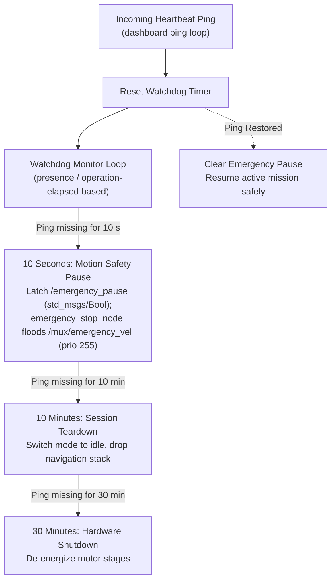

# Pengawas Keselamatan dan Supervisi Heartbeat

<RoleBadge role="developer" />

Software onboard memantau kesehatan komunikasi melalui watchdog sliding-window kontinu, berjalan di dalam `system_command.py`. Ini adalah mekanisme keselamatan internal robot tanpa UI dashboard sendiri; untuk bagaimana operator melihat efeknya (field `in_use`/lease, activity state yang dapat dipaksakan), lihat [Arsitektur § Matriks Kepemilikan dan Persistensi State](/id/development/architecture#matriks-kepemilikan-dan-persistensi-state) dan [Navigasi: Manual Override & Autopilot](/id/development/webui/navigation/manual-and-autopilot).

## Tingkatan Waktu Watchdog Heartbeat

1. **10 Detik (Motion Pause)**: Jika tidak ada heartbeat valid yang masuk selama 10 detik (`ping_pause_timeout 10.0`), `system_command.py` me-latch `/emergency_pause` (`std_msgs/Bool`) dan `emergency_stop_node` membanjiri zero-twist pada `/mux/emergency_vel` pada prioritas 255. Robot melambat hingga berhenti total tanpa membatalkan goal `move_base` yang aktif. Ketika komunikasi pulih, pause dilepas dan gerakan berlanjut secara otomatis.
2. **10 Menit (Session Teardown)**: Jika operator tetap terputus selama 10 menit, sesi navigasi atau mapping aktif dibongkar secara graceful untuk mencegah motor overheating.
3. **30 Menit (Hardware Shutdown)**: Setelah 30 menit ketidakhadiran terus-menerus, driver hardware mati ke mode standby daya-rendah.

::: warning Pengecualian Mode Autopilot
Ketika Mode Autopilot aktif, pause komunikasi 10 detik ditangguhkan. Robot melanjutkan rute otonomnya bahkan jika operator menutup laptop mereka atau melewati zona mati Wi-Fi. Lihat [Navigasi: Manual Override & Autopilot](/id/development/webui/navigation/manual-and-autopilot) dan [Mapping: Manual Override & Eksplorasi Otonom](/id/development/webui/mapping/manual-and-autonomous) untuk apa yang memicu pengecualian ini dari masing-masing layar.
:::

## Terkait

- [Arsitektur § Matriks Kepemilikan dan Persistensi State](/id/development/architecture#matriks-kepemilikan-dan-persistensi-state)
- [Navigasi: Manual Override & Autopilot](/id/development/webui/navigation/manual-and-autopilot)
- [Mapping: Manual Override & Eksplorasi Otonom](/id/development/webui/mapping/manual-and-autonomous)
- [Daftar Paket ROS](/id/development/ros/ros-packages)
