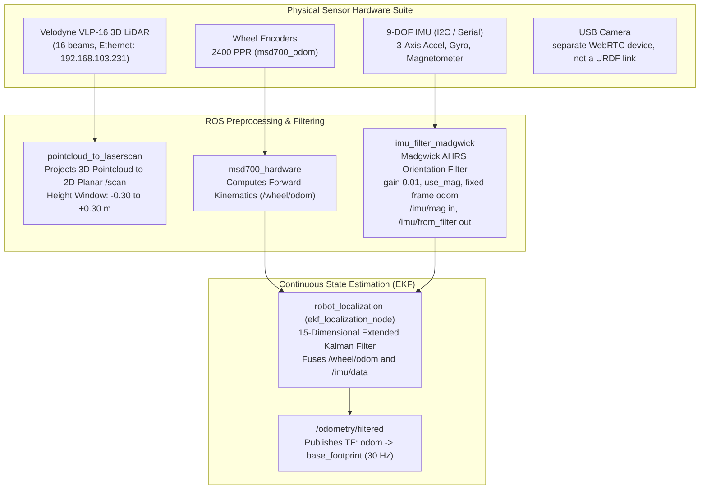
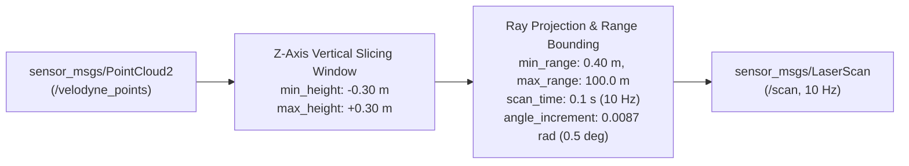

# Sensor Fusion, Kinematika, dan Estimasi State

<RoleBadge role="developer" />

Dokumen ini menyediakan spesifikasi matematis dan arsitektural yang menyeluruh untuk pipeline estimasi state, konfigurasi Extended Kalman Filter (EKF), filtering orientasi IMU, dan kinematika differential drive yang diimplementasikan pada robot MSD700.

## Arsitektur Persepsi dan Fusion

---

## Kinematika Maju Differential Drive

Robot lapangan memiliki empat roda penggerak (depan/belakang kiri/kanan pada $x = \pm 0.30\text{ m}$, $y = \pm 0.30\text{ m}$); odometri mem-fusi-kannya sebagai pasangan diferensial.

### Parameter Kinematik (`msd700_hardware/config/odometry_config.yaml`):
- Radius Roda: $r = 0.027\text{ m}$ ($2.7\text{ cm}$).
- Track Gauge (jarak antara centerline roda): $L = 0.23\text{ m}$ ($23\text{ cm}$).
- Resolusi Encoder: $PPR = 2400\text{ pulses/revolution}$.

### Perhitungan Displacement per Periode Kontrol $\Delta t$:
Dengan delta encoder kiri $\Delta \text{ticks}_L$ dan delta encoder kanan $\Delta \text{ticks}_R$:

$$\Delta s_L = \frac{2 \pi r \cdot \Delta \text{ticks}_L}{PPR}, \quad \Delta s_R = \frac{2 \pi r \cdot \Delta \text{ticks}_R}{PPR}$$

Displacement linear $\Delta s$ dan perubahan heading $\Delta \theta$:

$$\Delta s = \frac{\Delta s_R + \Delta s_L}{2}, \quad \Delta \theta = \frac{\Delta s_R - \Delta s_L}{L}$$

### Integrasi Odometri Diskret:
Dalam frame lokal robot dengan integrasi Runge-Kutta orde-2 (midpoint):

$$x_{k+1} = x_k + \Delta s \cdot \cos\left(\theta_k + \frac{\Delta \theta}{2}\right)$$

$$y_{k+1} = y_k + \Delta s \cdot \sin\left(\theta_k + \frac{\Delta \theta}{2}\right)$$

$$\theta_{k+1} = \theta_k + \Delta \theta$$

---

## Filter Orientasi Madgwick AHRS IMU

Data IMU mentah pada `/imu/data_raw` diproses oleh `imu_filter_madgwick` untuk menurunkan orientasi quaternion bebas-drift $\mathbf{q} = [q_w, q_x, q_y, q_z]^T$. Filter berjalan dengan `gain 0.01`, `use_mag true`, fixed frame `odom`, membaca `/imu/mag` dan mempublikasikan output terfusi pada `/imu/from_filter` (yang dikonsumsi EKF sebagai `imu0`):

### Optimisasi Gradient Descent:
$$\mathbf{q}_{k+1} = \mathbf{q}_k + \left( \frac{1}{2} \mathbf{q}_k \otimes \mathbf{\omega}_{gyro} - \beta \frac{\nabla \mathbf{f}}{\|\nabla \mathbf{f}\|} \right) \Delta t$$

- $\mathbf{\omega}_{gyro} = [0, \omega_x, \omega_y, \omega_z]^T$: Vektor angular rate dari gyroscope.
- $\nabla \mathbf{f}$: Gradient fungsi objektif yang menyelaraskan vektor gravitasi accelerometer terukur dengan gravitasi earth-frame referensi $[0, 0, 1]^T$.
- $\beta$ (`gain`) $= 0.01$: Parameter laju divergensi filter yang menyeimbangkan responsivitas gyroscope terhadap noise getaran accelerometer.

---

## Extended Kalman Filter (EKF) 15-Dimensi

Node estimasi state (`ekf_localization_node` dari `robot_localization`) mempertahankan vektor variabel acak Gaussian 15-state:

$$\mathbf{x} = \begin{bmatrix} x & y & z & \phi & \theta & \psi & \dot{x} & \dot{y} & \dot{z} & \dot{\phi} & \dot{\theta} & \dot{\psi} & \ddot{x} & \ddot{y} & \ddot{z} \end{bmatrix}^T$$

Dimana:
- $x, y, z$: Posisi 3D dalam frame odometri ($z$ di-clamp ke $0$ dalam mode 2D).
- $\phi, \theta, \psi$: Roll, pitch, dan yaw (sudut Euler).
- $\dot{x}, \dot{y}, \dot{z}$: Kecepatan linear body-frame.
- $\dot{\phi}, \dot{\theta}, \dot{\psi}$: Kecepatan sudut.
- $\ddot{x}, \ddot{y}, \ddot{z}$: Akselerasi linear.

### Process Update (Langkah Prediksi):
$$\hat{\mathbf{x}}_{k|k-1} = \mathbf{f}(\hat{\mathbf{x}}_{k-1|k-1}, \mathbf{u}_k)$$

$$\mathbf{P}_{k|k-1} = \mathbf{F}_k \mathbf{P}_{k-1|k-1} \mathbf{F}_k^T + \mathbf{Q}$$

- $\mathbf{F}_k = \left. \frac{\partial \mathbf{f}}{\partial \mathbf{x}} \right|_{\hat{\mathbf{x}}_{k-1|k-1}}$: Matriks Jacobian state transition.
- $\mathbf{Q}$: Matriks Kovarians Process Noise diagonal (merefleksikan dinamika yang tak termodelkan dan wheel slip).

### Measurement Update (Langkah Koreksi):
$$\mathbf{K}_k = \mathbf{P}_{k|k-1} \mathbf{H}_k^T \left( \mathbf{H}_k \mathbf{P}_{k|k-1} \mathbf{H}_k^T + \mathbf{R}_k \right)^{-1}$$

$$\hat{\mathbf{x}}_{k|k} = \hat{\mathbf{x}}_{k|k-1} + \mathbf{K}_k \left( \mathbf{z}_k - \mathbf{h}(\hat{\mathbf{x}}_{k|k-1}) \right)$$

$$\mathbf{P}_{k|k} = (\mathbf{I} - \mathbf{K}_k \mathbf{H}_k) \mathbf{P}_{k|k-1}$$

- $\mathbf{z}_k$: Vektor pengukuran yang mem-fusi kecepatan $\dot{x}$ dari odometri roda (`odom0: /wheel/odom`), serta roll/pitch plus yaw rate dari IMU terfilter (`imu0`, frame `odom`). Roll dan pitch berasal dari IMU; filter berjalan pada $30\text{ Hz}$ dalam frame `odom`.
- $\mathbf{R}_k$: Matriks Kovarians Measurement Noise dari `ekf_localization_config.yaml` (process dan initial covariance dalam file; lihat yaml untuk nilai yang disetel).

---

## Pipeline Proyeksi PointCloud LiDAR

Sensor Velodyne VLP-16 menghasilkan 300.000 titik/detik melintasi 16 laser ring. Untuk meminimalkan utilisasi CPU sambil mempertahankan kesadaran obstacle spasial, `pointcloud_to_laserscan` mengiris point cloud 3D menjadi scan planar 2D laju tinggi:

Ini menjaga pita $\pm 0.30\text{ m}$ di sekitar sensor di dalam costmap navigasi sementara return di luarnya (pantulan lantai, langit-langit) dibuang. Pipeline kedua (`cloud_hazard.launch`) mem-fitting ground dan mengawasi pita $0.08$–$0.65\text{ m}$ di atasnya untuk lubang dan drop-off, mempublikasikan `/scan_hazard`.

## Dokumentasi Terkait

- [Costmap & Planner](/id/development/ros/costmaps-and-planners): Layer navigasi dan inflation obstacle.
- [Firmware & Perangkat Keras](/id/development/ros/firmware-and-hardware): Penghitungan pulsa mikrokontroler dan loop PID.
- [Simulasi](/id/development/ros/simulation): Verifikasi sensor Gazebo berskala nyata.
