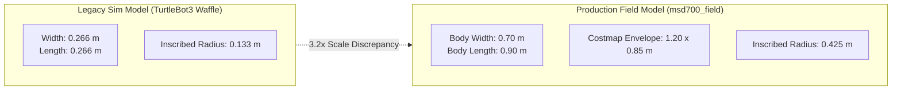
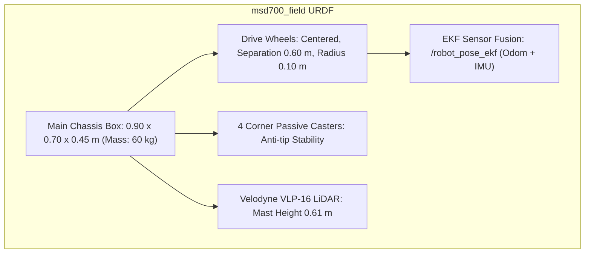

# Simulasi

<RoleBadge role="developer" />

Dokumen ini menjelaskan bagaimana robot MSD700 disimulasikan di Gazebo pada skala fisik yang sebenarnya, lingkungan AWS RoboMaker Small Warehouse, konfigurasi sensor, dan apa yang bisa dan tidak bisa divalidasi oleh simulator.

Untuk geometri perencanaan cakupan yang diturunkan dari dimensi robot fisik, lihat [Cakupan Boustrophedon](/id/development/ros/boustrophedon-and-alignment).

## Latar Belakang: Model Dimensi Skala Nyata

Setup simulator lama dalam repository menggunakan model TurtleBot3 Waffle: footprint **0,266 x 0,266 m** pada wheel track 0,287 m. Sebagai perbandingan, robot produksi MSD700 yang sesungguhnya berukuran **0,90 x 0,70 m**, direpresentasikan dalam costmap navigasi sebagai footprint berpadding **1,20 x 0,85 m**.



### Konsekuensi dari Kesenjangan Skala:
1. **Isu Lorong Sempit yang Tidak Dapat Direproduksi**: Laporan dunia-nyata tentang kegagalan path planning di koridor warehouse sempit tidak dapat direproduksi pada TurtleBot dengan radius 0,133 m.
2. **Kebocoran Konfigurasi**: Parameter legacy (`robot_width: 0.32`) tersisa dalam konfigurasi cakupan hingga pemodelan skala-nyata menggantikannya.
3. **Ketidaksesuaian Skala Lingkungan**: Peta TurtleBot standar tidak memiliki clearance yang memadai untuk robot 0,9 x 0,7 m:
   - `turtlebot_world`: Clearance maksimum 0,39 m (tidak dapat menampung radius inscribed 0,425 m di mana pun).
   - `AWS RoboMaker Small Warehouse`: Clearance maksimum **3,68 m** (58% lantai yang dapat dilalui, 38% dapat pivot di tempat).

## Dunia Simulasi: AWS Small Warehouse

Simulator menstandarkan pada lingkungan [AWS RoboMaker Small Warehouse](https://github.com/aws-robotics/aws-robomaker-small-warehouse-world): sebuah hall industri 13,98 x 20,91 m dengan 234 m² ruang lantai terbuka, rak penyimpanan, pallet jack, dan obstacle.

Aset mesh 3D (12 MB) diambil sesuai permintaan agar repository git tetap ringan:

```bash
rosrun msd700_simulation fetch_sim_worlds.sh
```

::: warning Pemilihan Branch Upstream
AWS RoboMaker diarsipkan pada 2025-09-10. Branch GitHub default-nya hanya berisi README deprecation. Aset simulasi berada di branch **`ros1`**, yang di-clone secara eksplisit oleh `fetch_sim_worlds.sh`.
:::

### Koordinat Spawn dan Clearance

Pose spawn default yang telah diverifikasi adalah **`x: 0.50, y: -2.40, yaw: 1.5708 (menghadap Utara)`**, menyediakan clearance terbuka **3,79 m**.

| Nama Lokasi | Koordinat (x, y) | Radius Clearance | Status |
| --- | --- | --- | --- |
| **Default Warehouse Spawn** | `(0.50, -2.40)` | **3,79 m** | Terverifikasi Aman (Default) |
| Alternate Bay 1 | `(1.81, -7.25)` | 2,47 m | Aman |
| Alternate Bay 2 | `(0.81, 2.75)` | 1,49 m | Aman |
| Shelving Clutter (Tidak Valid) | `(4.00, 1.00)` | **0,29 m** | **BERBAHAYA**: Di dalam zona collision rak |

## Model URDF Robot: `msd700_field`

Robot fisik dimodelkan dalam `msd700_description/urdf/msd700_field.urdf.xacro` dengan plugin Gazebo di `msd700_field.gazebo.xacro`.



### Spesifikasi Fisik:
- **Dimensi**: panjang 0,90 m, lebar 0,70 m, tinggi 0,45 m, massa 60 kg.
- **Geometri Drive**: Skid-steer / differential drive terpusat di titik tengah untuk memastikan envelope belokan yang simetris.
- **Empat Caster Sudut**: Menghilangkan osilasi pitching dan roll yang menyebabkan LiDAR planar menciptakan obstacle lantai palsu.
- **LiDAR Velodyne VLP-16**: Ditinggikan 0,61 m di atas tanah pada mast mounting, menyamai unit fisik.
- **Frame ROS Terstandarisasi**: Menggunakan konvensi frame standar (`base_footprint`, `base_link`, `base_scan`, `imu_link`, `odom`, `map`).

## Menjalankan Stack Simulasi

### 1. Simulasi Lengkap dengan Integrasi Web UI
```bash
roslaunch msd700_simulation msd700_warehouse_nav.launch
```

### 2. Pemetaan SLAM di Warehouse
```bash
roslaunch msd700_simulation msd700_warehouse_slam.launch
```

### 3. Parameterisasi Move Base (`sim_body`)
Launch file menerima `sim_body:=field` (default untuk launch warehouse) untuk mengonfigurasi costmap bagi footprint 1,20 x 0,85 m, atau `sim_body:=waffle` untuk pengujian skala-kecil legacy.

## Dokumentasi Terkait

- [Cakupan Boustrophedon](/id/development/ros/boustrophedon-and-alignment): Perhitungan jalur geometris dan toleransi clearance.
- [Struktur Repository](/id/development/repository-structure): Tata letak direktori paket simulasi.
- [Arsitektur](/id/development/architecture): Topologi komunikasi sistem lengkap.
