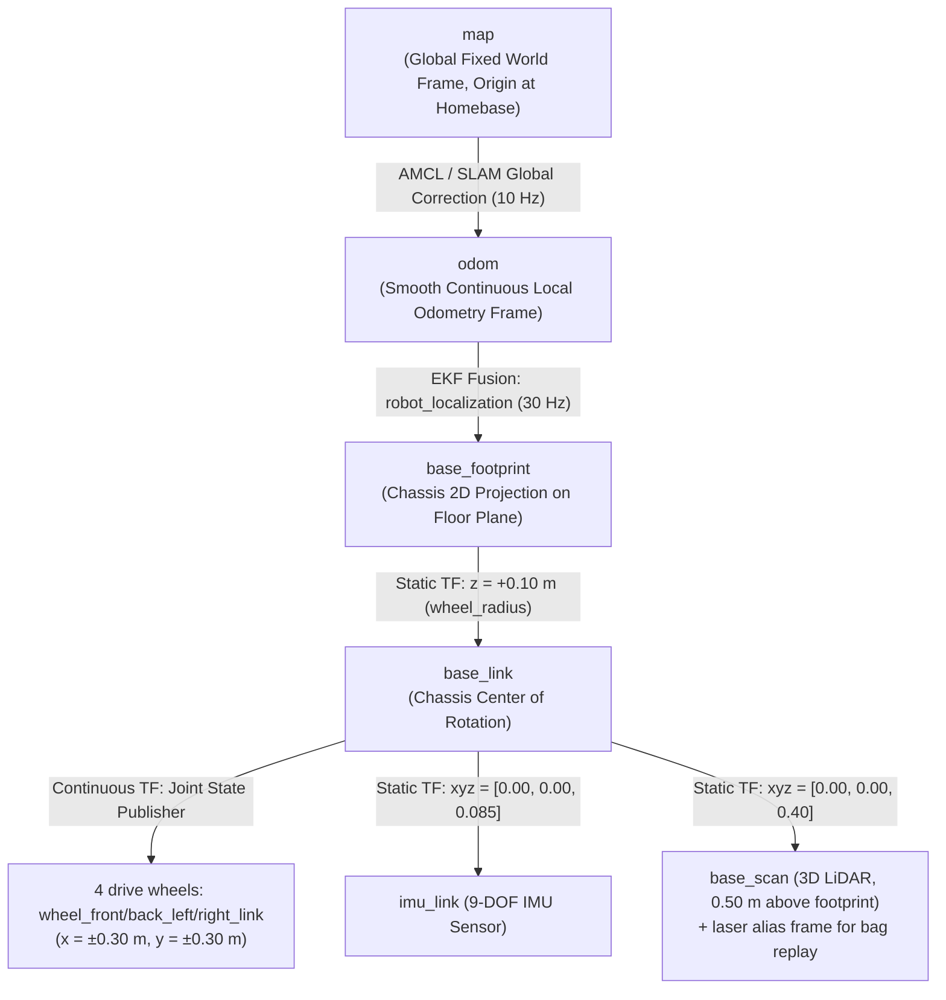
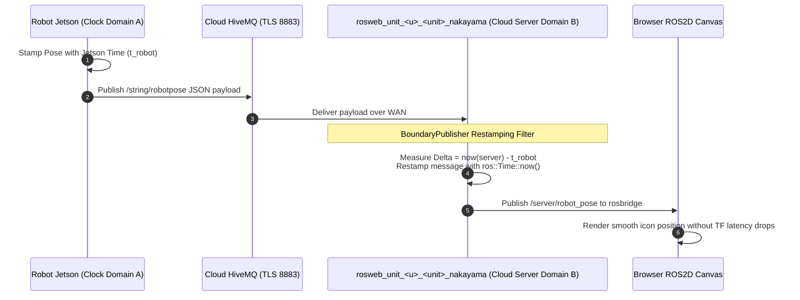

# Frame Koordinat, Transformasi, dan Arsitektur TF

<RoleBadge role="developer" />

Dokumen ini menyediakan spesifikasi komprehensif untuk pohon transformasi koordinat (`tf` / `tf2`), frame referensi spasial, broadcaster transformasi dinamis, offset sensor, dan restamping clock lintas-mesin yang diimplementasikan dalam sistem robot MSD700.

## Hierarki Frame Koordinat (Pohon TF)

Pohon transformasi koordinat mematuhi ROS REP-103 (Standard Units of Measure & Coordinate Conventions) dan REP-105 (Coordinate Frames for Mobile Platforms):



Tidak ada `camera_link` pada robot lapangan: kamera adalah perangkat USB/WebRTC terpisah, bukan link URDF.

---

## Publisher Transformasi dan Laju Update

| Edge Transformasi | Node Broadcaster | Laju | Sumber Matematis | Perilaku Saat Terputus |
| --- | --- | --- | --- | --- |
| `map -> odom` | `amcl` / `slam_gmapping` | 10 Hz | Mengoreksi drift odometrik terhadap occupancy grid laser statis. | Lompatan diskret saat terlokalisasi; mempertahankan transformasi terakhir jika laser scan terputus. |
| `odom -> base_footprint` | `robot_localization` (`ekf_localization_node`) | 30 Hz | Fusion kontinu kecepatan wheel encoder dan yaw/angular rate IMU. | Trajektori jangka pendek yang kontinu, halus, dan bebas-drift. |
| `base_footprint -> base_link` | `robot_state_publisher` | Statis | Offset elevasi tetap ($z = 0.10\text{ m}$ = radius roda). | Transformasi tetap dari URDF. |
| `base_link -> base_scan` | `robot_state_publisher` | Statis | Mast LiDAR ($x = 0$, $z = 0.40\text{ m}$ dari `base_link`, $0.50\text{ m}$ di atas footprint); frame alias `laser` terpasang untuk replay bag. | Transformasi tetap dari URDF. |
| `base_link -> imu_link` | `robot_state_publisher` | Statis | Mounting chassis fisik ($z \approx 0.085\text{ m}$ = `body_center_z`). | Transformasi tetap dari URDF. |

---

## Konvensi Koordinat Spasial (REP-103)

MSD700 secara ketat menerapkan sistem koordinat Cartesian tangan-kanan:

```
        +X (Forward / Roll Axis)
           ▲
           │
           │
           │
 ◄─────────┼─────────► +Y (Left / Pitch Axis)
           │
           ▼
        +Z (Upward / Yaw Axis)
```

- **$+X$**: Mengarah lurus ke depan sepanjang arah utama pergerakan robot.
- **$+Y$**: Mengarah lurus ke kiri melintasi lebar lateral robot.
- **$+Z$**: Mengarah vertikal ke atas tegak lurus terhadap bidang lantai.
- **Sudut Rotasi**: Mengikuti aturan tangan-kanan (rotasi Counter-Clockwise di sekitar $+Z$ berkorespondensi dengan yaw rate positif $+\dot{\theta}$).

---

## Restamping Domain Clock Lintas-Mesin (`BoundaryPublisher`)

Ketika telemetri (seperti pose robot dan laser scan) dijembatani dari robot fisik melalui internet ke server cloud, **drift clock antar mesin fisik menghasilkan peringatan ekstrapolasi `TF_OLD_DATA`** jika timestamp dievaluasi secara langsung.



### Mengapa Restamping Bersifat Krusial:
1. **Keterbatasan RTC Jetson**: SBC fisik di lingkungan lapangan tanpa akses NTP dapat boot dengan clock yang menyimpang hingga hitungan detik atau bahkan bulan.
2. **Buffer Eviction**: Jika pesan pose yang masuk membawa timestamp di masa lalu relatif terhadap ROS master server, `tf2_ros::Buffer` langsung membuangnya, mencegah kanvas web merender pergerakan robot.
3. **Solusi `BoundaryPublisher`**: `patch_time.py` melucuti timestamp hardware robot dan me-restamp payload geometrik dengan `ros::Time::now()` saat memasuki ROS master server.

## Dokumentasi Terkait

- [Sensor Fusion & Kontrol](/id/development/ros/sensor-fusion-and-control): Estimasi state kinematik dan EKF.
- [Costmap & Planner](/id/development/ros/costmaps-and-planners): Frame koordinat costmap navigasi.
- [Protokol rosbridge](/id/development/rosbridge-protocol): Serialisasi topic WebSocket.
