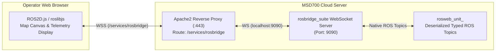

# WebSocket dan Protokol rosbridge

<RoleBadge role="developer" />

Dokumen ini merinci antarmuka WebSocket yang disediakan oleh `rosbridge_suite`, menjelaskan spesifikasi protokol JSON, format langganan pesan, skema pemanggilan layanan, teknik kompresi, dan integrasi rendering kanvas web.

## Ikhtisar Arsitektur rosbridge

Dasbor web berinteraksi dengan topik dan layanan ROS langsung melalui `rosbridge_server` melalui koneksi WebSocket yang persisten.



## Titik Akhir Koneksi

| Lingkungan | Protokol & Jalur | Pelabuhan Tujuan |
| --- | --- | --- |
| **Server Produksi** | `wss://msd.nglobal.jp/services/rosbridge` | Diproksi ke internal `localhost:9090` |
| **Server Pengembangan** | `ws://<server-ip>:9091` | Arahkan WebSocket ke wadah dev rosbridge |
| **Unit Server Lokal** | `ws://<unit-ip>:9090` | Arahkan WebSocket ke onboard `rosbridge_suite` |

## Operasi Protokol rosbridge

Protokol rosbridge v2 menggunakan operasi JSON standar (`op`):

### 1. Berlangganan Topik (`op: "subscribe"`)
Memulai streaming topik ROS ke browser:

```json
{
  "op": "subscribe",
  "id": "sub_robot_pose_1",
  "topic": "/unit_01JZ8P9WZ0UNIT00000000000/server/robot_pose",
  "type": "geometry_msgs/PoseStamped",
  "throttle_rate": 40,
  "queue_length": 1,
  "compression": "none"
}
```

- `topic`: Nama topik ROS yang sepenuhnya memenuhi syarat termasuk namespace unit ULID.
- `throttle_rate`: Waktu minimum dalam milidetik antar pesan (misalnya 40 ms = 25 Hz).
- `compression`: Mendukung `none` atau `png` (untuk jaringan hunian bandwidth tinggi).

### 2. Penerbitan Topik (`op: "publish"`)
Menerbitkan pesan ROS yang diketik dari browser ke master ROS:

```json
{
  "op": "publish",
  "id": "pub_cmd_vel_1",
  "topic": "/unit_01JZ8P9WZ0UNIT00000000000/server/key_vel",
  "type": "geometry_msgs/Twist",
  "msg": {
    "linear": { "x": 0.35, "y": 0.0, "z": 0.0 },
    "angular": { "x": 0.0, "y": 0.0, "z": 0.50 }
  }
}
```

### 3. Permintaan Layanan (`op: "call_service"`)
Memanggil layanan ROS secara sinkron:

```json
{
  "op": "call_service",
  "id": "srv_call_102",
  "service": "/unit_01JZ8P9WZ0UNIT00000000000/server/global_localization",
  "args": {}
}
```

- **Amplop Respons Layanan**:
```json
{
  "op": "service_response",
  "id": "srv_call_102",
  "service": "/unit_01JZ8P9WZ0UNIT00000000000/server/global_localization",
  "values": {},
  "result": true
}
```

## Langganan Kanvas Web Utama

Dasbor web (`ROS-dashboard-next-ts`) berlangganan topik visual utama berikut:

| Pengidentifikasi Topik | Jenis Pesan ROS | Tujuan di Atas Kanvas |
| --- | --- | --- |
| `/server/robot_pose` | `geometry_msgs/PoseStamped` | Memperbarui posisi ikon robot 2D dan arah panah (25 Hz). |
| `/server/slam/map` | `nav_msgs/OccupancyGrid` | Merender bitmap denah lantai SLAM langsung di kanvas EaselJS. |
| `/server/scan` | `sensor_msgs/LaserScan` | Membuat titik sinar laser merah di sekitar robot. |
| `/server/move_base/NavfnROS/plan` | `nav_msgs/Path` | Membuat lintasan navigasi terencana menjadi biru global. |
| `/server/move_base/TebLocalPlannerROS/local_plan` | `nav_msgs/Path` | Membuat garis lintasan lokal yang dinamis. |
| `/server/boustrophedon_path` | `nav_msgs/Path` | Menampilkan jalur sapuan cakupan area boustrophedon oranye. |

## Ketahanan Frontend dan Pemulihan Diri

1. **`ROS2D.js` Stage Prototype Patch**: Untuk mencegah error ketika objek stage EaselJS kehilangan fungsi transformasi koordinat ROS selama pemasangan ulang komponen secara cepat, frontend secara dinamis memasukkan metode `globalToRos` dan `rosToGlobal` ke dalam `createjs.Stage.prototype` sebelum instantiasi penampil.
2. **Reconnection Debounce**: Jika WebSocket terputus, klien menunggu tiga kali upaya koneksi ulang berturut-turut sebelum memunculkan peringatan pemutusan sambungan, sehingga mencegah UI berkedip selama gangguan jaringan sementara.

## Dokumentasi Terkait

- [Kontrak Pesan](/id/development/message-contracts): MQTT dan kontrak topik berseri.
- [Arsitektur](/id/development/architecture): Model dua mesin dan perutean rosbridge.
- [Referensi API](/id/development/api-reference): Titik akhir HTTP REST API.