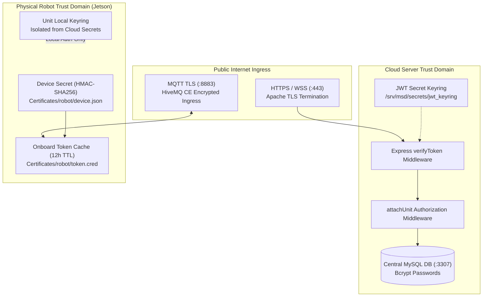
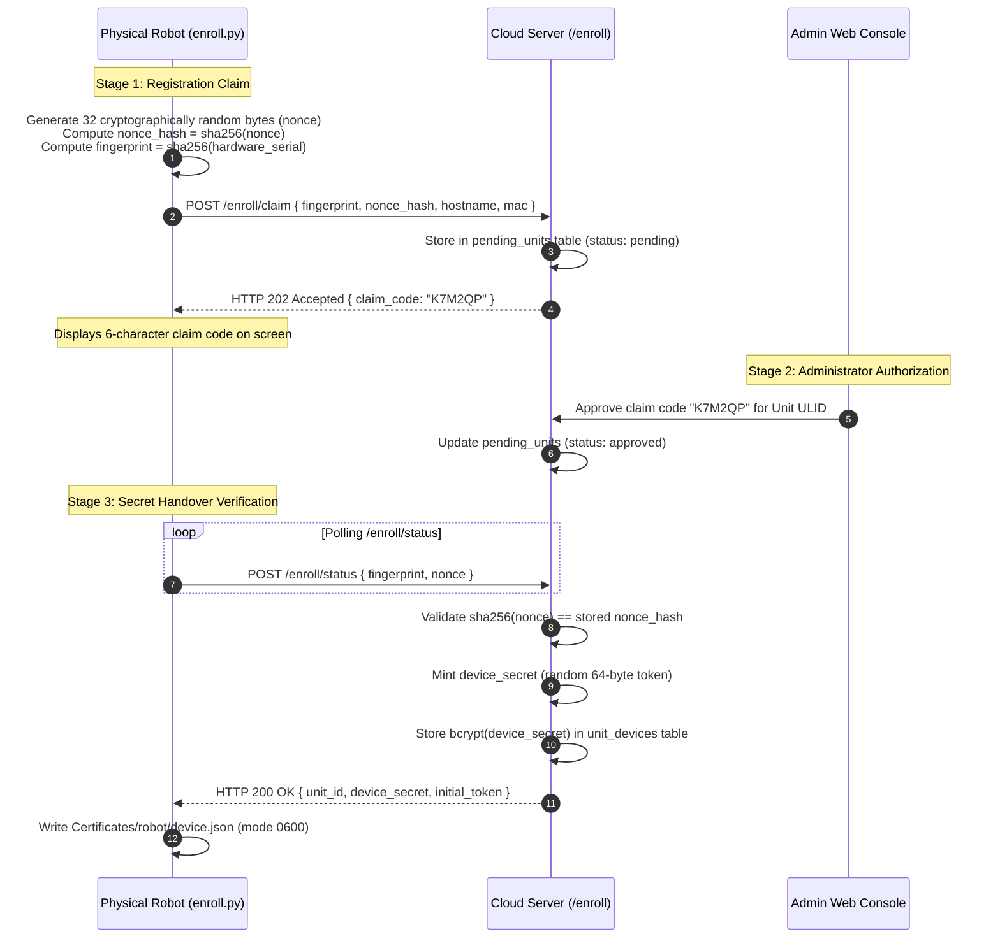
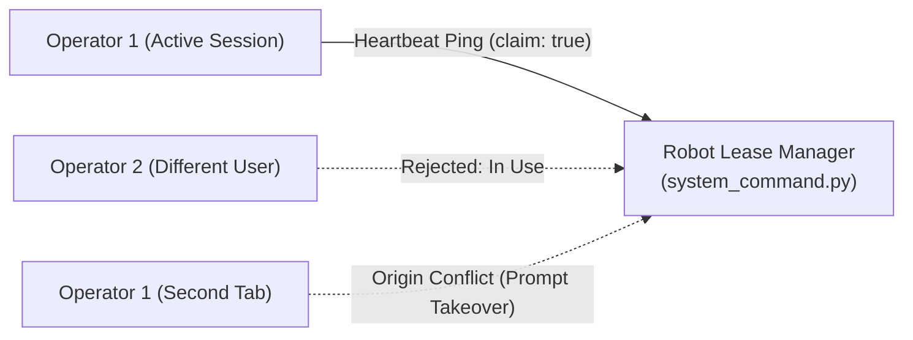

# Keamanan dan Otentikasi

<RoleBadge role="developer" />

Dokumen ini merinci model keamanan, mekanisme otentikasi kriptografi, isolasi domain kepercayaan, dan kebijakan kontrol akses yang diterapkan di seluruh platform robotika MSD700.

## Ikhtisar Arsitektur Keamanan

MSD700 menerapkan pertahanan mendalam di seluruh frontend web, backend cloud, perantara pesan, dan komputer papan tunggal (SBC) Jetson fisik.



## Tiga Domain Perwalian Independen

Batasan keamanan dipisahkan menjadi tiga domain kepercayaan yang tidak dapat dipertukarkan:

| Kepercayaan Domain | Otoritas Penerbit | Tujuan Token | Titik Akhir Validasi | Aturan Isolasi |
| --- | --- | --- | --- | --- |
| **Domain Operator** | Backend Server Cloud (`backend_node`) | Mengautentikasi operator manusia yang mengakses dasbor web. | `verifyToken` di semua rute `/api/*` | Tidak dapat digunakan langsung oleh robot; ditolak pada rute `/local/*`. |
| **Robot Cloud Domain** | Layanan Pendaftaran Cloud (`/enroll/token`) | Mengautentikasi robot fisik yang terhubung ke HiveMQ dan server media cloud. | TLS HiveMQ + awan `media-server` | Dicakup secara ketat pada ULID yang ditetapkan robot; berlaku selama 12 jam. |
| **Satuan Domain Lokal** | Backend Lokal Terintegrasi (`backend_local`) | Mengautentikasi operator LAN lokal dan klien streaming video onboard. | `/local/*` titik akhir | Token cloud ditolak dengan tegas untuk memastikan kedaulatan offline lokal. |

## Pendaftaran Perangkat Keras Kriptografi (Protokol Nonce)

Robot yang belum terdaftar mendaftarkan dirinya ke server cloud melalui jabat tangan kriptografi tiga tahap.



### Mengapa Protokol Nonce 32-Byte Penting:
- **MAC / Perlindungan Spoofing Sidik Jari**: Alamat MAC perangkat keras dan nomor seri disiarkan di jaringan lokal dan terlihat di konsol admin. Tanpa rahasia, penyerang yang memalsukan alamat MAC dapat mengklaim kredensial saat robot fisik dimatikan.
- **Verifikasi Sekali Pakai**: Nonce teks biasa dikirimkan tepat satu kali melalui TLS selama penyerahan kredensial akhir. Setelah diverifikasi, server menghapus nonce yang tertunda.
- **Penyimpanan Rahasia Nol Mentah**: Basis data cloud hanya menyimpan hash `bcrypt` dari `device_secret`. Bahkan kebocoran database lengkap tidak membahayakan rahasia perangkat robot yang aktif.

## Gantungan Kunci JWT dan Rotasi Rahasia Tanpa Waktu Henti

Token autentikasi diverifikasi berdasarkan **JWT Keyring** yang disimpan di `/srv/msd/secrets/jwt_keyring`, bukan satu variabel lingkungan statis.

```json
{
  "active_kid": "key_2026_08_a",
  "keys": {
    "key_2026_08_a": {
      "secret": "9a8b7c6d5e4f3a2b1c0d...",
      "created_at": "2026-08-01T00:00:00Z"
    },
    "key_2026_07_b": {
      "secret": "1f2e3d4c5b6a7f8e9d0c...",
      "created_at": "2026-07-01T00:00:00Z"
    }
  }
}
```

### Aturan Rotasi Gantungan Kunci:
1. **Kunci Penandatanganan Aktif**: Semua token akses dan penyegaran yang baru dibuat ditandatangani dengan kunci yang diidentifikasi oleh `active_kid`.
2. **Verifikasi Grace Window**: Ketika token masuk tiba, `verifyToken` memeriksa tanda tangannya terhadap `active_kid`. Jika verifikasi gagal, verifikasi akan menguji kunci sebelumnya di gantungan kunci sebelum menolak dengan HTTP 401.
3. **Gangguan Sesi Nol**: Rotasi rahasia dalam produksi tidak memaksa semua operator aktif untuk login ulang secara bersamaan.

## Keamanan Sewa Operasi: Mencegah Pengambilalihan Multi-Operator

Untuk mencegah perintah yang bertentangan dari pengguna atau tab browser secara bersamaan, akses ke aktuasi motor diatur oleh **sewa pengoperasian eksklusif** yang disimpan dalam memori pada robot fisik.



- **Kedaluwarsa Detak Jantung**: Sewa berlaku selama 15 detik dan harus diperbarui melalui ping berkala.
- **Pemisahan Akun vs Sesi**:
  - `in_use`: Jika akun pengguna lain memegang sewa, eksekusi perintah diblokir.
  - `origin_conflict`: Jika akun pengguna yang sama membuka tab kedua atau beralih dari cloud ke jaringan lokal, UI akan meminta pengambilalihan secara eksplisit daripada mengganggu tab aktif secara diam-diam.

## Keamanan Jaringan dan Penghentian TLS

1. **Apache Reverse Proxy**: Semua lalu lintas HTTP, SSE, dan WebSocket eksternal menghentikan TLS di port Apache 443 menggunakan sertifikat dari Let's Encrypt (`/etc/letsencrypt/live/`).
2. **HiveMQ Mutual Transport Security**: Robot terhubung ke HiveMQ pada port 8883 melalui TLS. Sertifikat Keystore PKCS#12 berada di `/srv/msd/secrets/hivemq/keystore.p12`.
3. **Isolasi Kontainer**: Kontainer backend berkomunikasi melalui jaringan jembatan Docker internal (`ros_backend_net`), sehingga tidak mengekspos database internal atau port rosbridge langsung ke internet publik.

## Dokumentasi Terkait

- [Arsitektur](/id/development/architecture): Topologi platform lengkap dan domain kepercayaan.
- [Kontrak Pesan](/id/development/message-contracts): Definisi payload pendaftaran perangkat keras.
- [Referensi API](/id/development/api-reference): Otentikasi pengguna dan titik akhir penyegaran sesi.