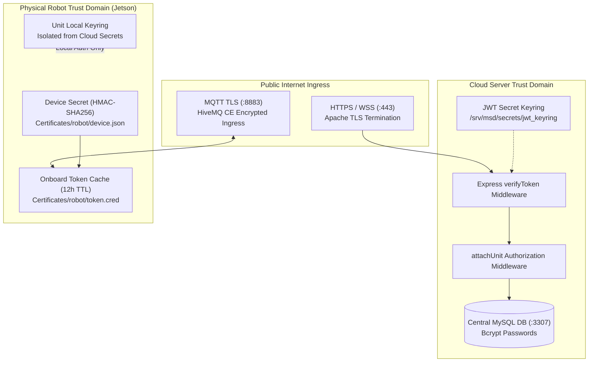
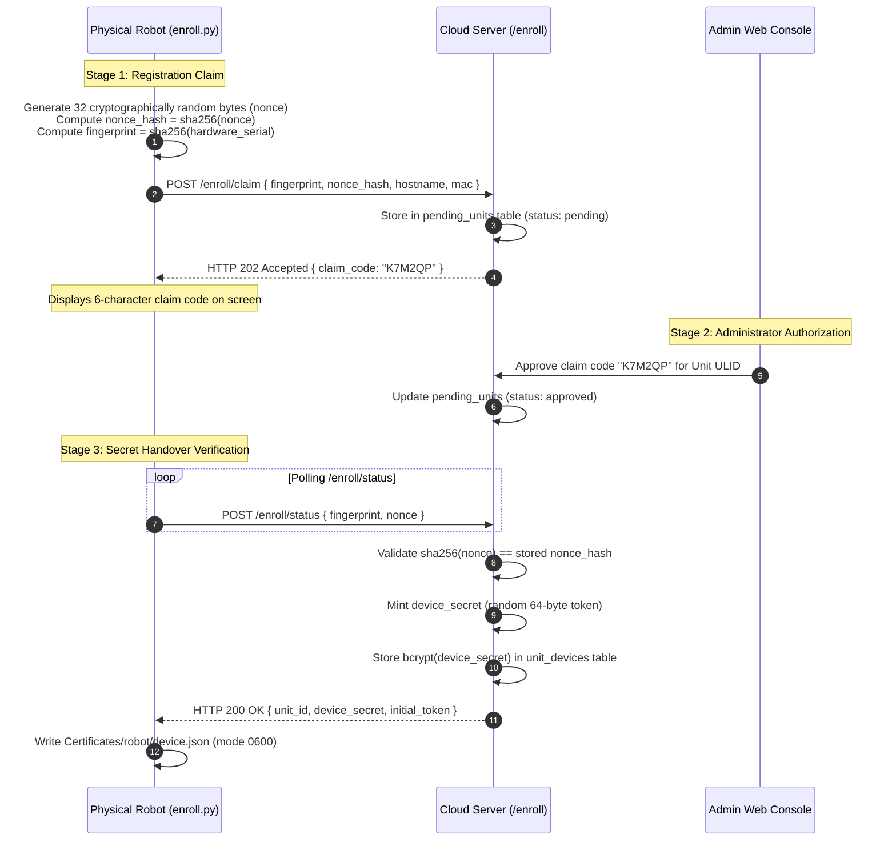
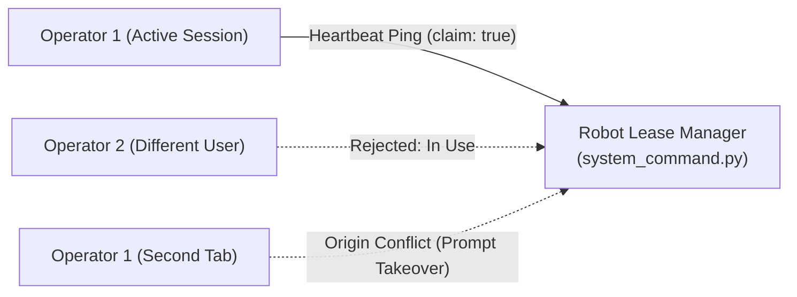

# Security and Authentication

<RoleBadge role="developer" />

This document details the security model, cryptographic authentication mechanisms, trust domain isolation, and access control policies implemented across the MSD700 robotics platform.

## Security Architecture Overview

MSD700 enforces defense-in-depth across the web frontend, cloud backend, message broker, and physical Jetson single-board computers (SBCs).



## Three Independent Trust Domains

Security boundaries are separated into three non-interchangeable trust domains:

| Trust Domain | Issuer Authority | Token Purpose | Validation Endpoint | Isolation Rule |
| --- | --- | --- | --- | --- |
| **Operator Domain** | Cloud Server Backend (`backend_node`) | Authenticates human operators accessing the web dashboard. | `verifyToken` on all `/api/*` routes | Cannot be used directly by robots; rejected on `/local/*` routes. |
| **Robot Cloud Domain** | Cloud Enrolment Service (`/enroll/token`) | Authenticates physical robots connecting to HiveMQ and cloud media servers. | HiveMQ TLS + cloud `media-server` | Scoped strictly to the robot's assigned ULID; valid for 12 hours. |
| **Unit Local Domain** | Onboard Local Backend (`backend_local`) | Authenticates local LAN operators and onboard video streaming clients. | `/local/*` endpoints | Cloud tokens are strictly rejected to ensure local offline sovereignty. |

## Cryptographic Hardware Enrolment (The Nonce Protocol)

Unenrolled robots register themselves with the cloud server through a three-stage cryptographic handshake.



### Why the 32-Byte Nonce Protocol Is Critical:
- **MAC / Fingerprint Spoofing Protection**: Hardware MAC addresses and serial numbers are broadcast on local networks and visible in the admin console. Without the secret nonce, an attacker spoofing a MAC address could claim credentials while the physical robot is powered off.
- **Single-Use Verification**: The plaintext nonce is transmitted exactly once over TLS during final credential handover. Once verified, the server clears the pending nonce.
- **Zero Raw Secret Storage**: The cloud database stores only the `bcrypt` hash of `device_secret`. Even a complete database leak does not compromise active robot device secrets.

## JWT Keyring and Zero-Downtime Secret Rotation

Authentication tokens are verified against a **JWT Keyring** stored in `/srv/msd/secrets/jwt_keyring` rather than a single static environment variable.

```json
{
  "active_kid": "key_2026_08_a",
  "keys": {
    "key_2026_08_a": {
      "secret": "9a8b7c6d5e4f3a2b1c0d...",
      "created_at": "2026-08-01T00:00:00Z"
    },
    "key_2026_07_b": {
      "secret": "1f2e3d4c5b6a7f8e9d0c...",
      "created_at": "2026-07-01T00:00:00Z"
    }
  }
}
```

### Keyring Rotation Rules:
1. **Active Signing Key**: All newly minted access and refresh tokens are signed with the key identified by `active_kid`.
2. **Grace Window Verification**: When an incoming token arrives, `verifyToken` checks its signature against `active_kid`. If verification fails, it tests previous keys in the keyring before rejecting with HTTP 401.
3. **Zero Session Disruption**: Rotating secrets in production does not force all active operators to re-login simultaneously.

## Operating Lease Security: Preventing Multi-Operator Takeover

To prevent conflicting commands from simultaneous users or browser tabs, access to motor actuation is governed by an **exclusive operating lease** held in memory on the physical robot.



- **Heartbeat Expiry**: The lease is valid for 15 seconds and must be renewed by periodic pings.
- **Account vs Session Separation**:
  - `in_use`: If another user account holds the lease, command execution is blocked.
  - `origin_conflict`: If the same user account opens a second tab or switches from cloud to local network, the UI prompts for explicit takeover rather than silently interrupting the active tab.

## Network Security and TLS Termination

1. **Apache Reverse Proxy**: All external HTTP, SSE, and WebSocket traffic terminates TLS at Apache port 443 using certificates from Let's Encrypt (`/etc/letsencrypt/live/`).
2. **HiveMQ Mutual Transport Security**: Robots connect to HiveMQ on port 8883 over TLS. Keystore PKCS#12 certificates reside in `/srv/msd/secrets/hivemq/keystore.p12`.
3. **Container Isolation**: Backend containers communicate across internal Docker bridge networks (`ros_backend_net`), exposing no internal database or rosbridge ports directly to the public internet.

## Related Documentation

- [Architecture](/id/development/architecture): Full platform topology and trust domains.
- [Message Contracts](/id/development/message-contracts): Hardware enrolment payload definitions.
- [API Reference](/id/development/api-reference): User authentication and session refresh endpoints.
