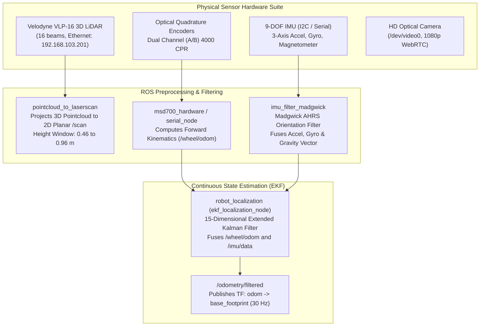
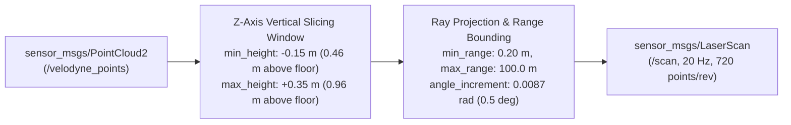

# Sensor Fusion, Kinematika, dan Estimasi Keadaan

<RoleBadge role="developer" />

Dokumen ini memberikan spesifikasi matematis dan arsitektur lengkap dari pipa estimasi keadaan, konfigurasi Extended Kalman Filter (EKF), pemfilteran orientasi IMU, dan kinematika penggerak diferensial yang diterapkan pada robot MSD700.

## Persepsi dan Arsitektur Fusi

---

## Kinematika Maju Penggerak Diferensial

Robot fisik beroperasi sebagai platform penggerak diferensial dua roda yang didukung oleh empat roda kastor pasif.

### Parameter Kinematik:
- Radius Roda: $r = 0,075\text{ m}$ (Diameter Roda: $0,150\text{ m}$).
- Pengukur Track (Jarak antara garis tengah roda penggerak): $L = 0,580\text{ m}$.
- Resolusi Encoder: $CPR = 4000\text{ hitungan/revolusi}$ (setelah $4\times$ decoding kuadratur).
- Rasio Pengurangan Gearbox: $N = 30:1$.

### Perhitungan Perpindahan per Periode Kontrol $\Delta t$:
Diberikan delta encoder kiri $\Delta \text{ticks}_L$ dan delta encoder kanan $\Delta \text{ticks}_R$:

$$\Delta s_L = \frac{2 \pi r \cdot \Delta \text{ticks}_L}{CPR \cdot N}, \quad \Delta s_R = \frac{2 \pi r \cdot \Delta \text{ticks}_R}{CPR \cdot N}$$

Perpindahan linier $\Delta s$ dan perubahan arah $\Delta \theta$:

$$\Delta s = \frac{\Delta s_R + \Delta s_L}{2}, \quad \Delta \theta = \frac{\Delta s_R - \Delta s_L}{L}$$

### Integrasi Odometri Diskrit:
Dalam bingkai lokal robot dengan integrasi Runge-Kutta orde ke-2 (titik tengah):

$$x_{k+1} = x_k + \Delta s \cdot \cos\left(\theta_k + \frac{\Delta \theta}{2}\kanan)$$

$$y_{k+1} = y_k + \Delta s \cdot \sin\left(\theta_k + \frac{\Delta \theta}{2}\kanan)$$

$$\theta_{k+1} = \theta_k + \Delta \theta$$

---

## Filter Orientasi IMU Madgwick AHRS

Data IMU mentah di `/imu/data_raw` ($50\text{ Hz}$) diproses oleh `imu_filter_madgwick` untuk memperoleh orientasi angka empat bebas drift $\mathbf{q} = [q_w, q_x, q_y, q_z]^T$:

### Optimasi Penurunan Gradien:
$$\mathbf{q}_{k+1} = \mathbf{q}_k + \left( \frac{1}{2} \mathbf{q}_k \otimes \mathbf{\omega}_{gyro} - \beta \frac{\nabla \mathbf{f}}{\|\nabla \mathbf{f}\|} \kanan) \Delta t$$

- $\mathbf{\omega}_{gyro} = [0, \omega_x, \omega_y, \omega_z]^T$: Vektor kecepatan sudut dari giroskop.
- $\nabla \mathbf{f}$: Gradien fungsi tujuan menyelaraskan vektor gravitasi akselerometer terukur dengan referensi gravitasi kerangka bumi $[0, 0, 1]^T$.
- $\beta = 0,05$: Filter parameter tingkat divergensi yang menyeimbangkan respons giroskop terhadap kebisingan getaran akselerometer.

---

## Filter Kalman Diperluas (EKF) 15 Dimensi

Node estimasi keadaan (`ekf_localization_node` dari `robot_localization`) mempertahankan vektor variabel acak Gaussian 15 keadaan:

$$\mathbf{x} = \begin{bmatrix} x & y & z & \phi & \theta & \psi & \dot{x} & \dot{y} & \dot{z} & \dot{\phi} & \dot{\theta} & \dot{\psi} & \ddot{x} & \ddot{y} & \ddot{z} \end{bmatrix}^T$$

Dimana:
- $x, y, z$: posisi 3D dalam bingkai odometri ($z$ dijepit ke $0$ dalam mode 2D).
- $\phi, \theta, \psi$: Roll, pitch, dan yaw (sudut Euler).
- $\dot{x}, \dot{y}, \dot{z}$: Kecepatan linier kerangka badan.
- $\dot{\phi}, \dot{\theta}, \dot{\psi}$: Kecepatan sudut.
- $\ddot{x}, \ddot{y}, \ddot{z}$: Akselerasi linier.

### Pembaruan Proses (Langkah Prediksi):
$$\hat{\mathbf{x}}_{k|k-1} = \mathbf{f}(\hat{\mathbf{x}}_{k-1|k-1}, \mathbf{u}_k)$$

$$\mathbf{P}_{k|k-1} = \mathbf{F}_k \mathbf{P}_{k-1|k-1} \mathbf{F}_k^T + \mathbf{Q}$$

- $\mathbf{F}_k = \kiri. \frac{\partial \mathbf{f}}{\partial \mathbf{x}} \right|_{\hat{\mathbf{x}}_{k-1|k-1}}$: Matriks Jacobian transisi keadaan.
- $\mathbf{Q}$: Matriks Kovariansi Kebisingan Proses Diagonal (mencerminkan dinamika dan slip roda yang tidak dimodelkan).

### Pembaruan Pengukuran (Langkah Koreksi):
$$\mathbf{K}_k = \mathbf{P}_{k|k-1} \mathbf{H}_k^T \kiri( \mathbf{H}_k \mathbf{P}_{k|k-1} \mathbf{H}_k^T + \mathbf{R}_k \kanan)^{-1}$$

$$\hat{\mathbf{x}}_{k|k} = \hat{\mathbf{x}}_{k|k-1} + \mathbf{K}_k \kiri( \mathbf{z}_k - \mathbf{h}(\hat{\mathbf{x}}_{k|k-1}) \kanan)$$

$$\mathbf{P}_{k|k} = (\mathbf{I} - \mathbf{K}_k \mathbf{H}_k) \mathbf{P}_{k|k-1}$$

- $\mathbf{z}_k$: Pengukuran kecepatan fusi vektor $\dot{x}$ dari odometri roda, dan yaw absolut $\psi$ dan kecepatan sudut $\dot{\psi}$ dari IMU.
- $\mathbf{R}_k$: Matriks Kovariansi Kebisingan Pengukuran disetel untuk varians sensor ($R_{\dot{x}, \text{roda}} = 10^{-3}$, $R_{\psi, \text{imu}} = 10^{-4}$).

---

## Saluran Proyeksi LiDAR PointCloud

Sensor Velodyne VLP-16 menghasilkan 300.000 titik/detik di 16 cincin laser. Untuk meminimalkan penggunaan CPU sekaligus menjaga kewaspadaan terhadap hambatan spasial, `pointcloud_to_laserscan` membagi titik cloud 3D menjadi pemindaian planar 2D berkecepatan tinggi:

Hal ini memastikan bahwa hambatan (seperti kaki meja, palet rendah, dan personel berdiri) dalam zona ketinggian $0,46\text{ m}$ hingga $0,96\text{ m}$ dimasukkan ke dalam peta biaya navigasi tanpa kekacauan pantulan lantai.

## Dokumentasi Terkait

- [Peta Biaya dan Perencana](/id/development/costmaps-and-planners): Lapisan navigasi dan hambatan inflasi.
- [Firmware dan Perangkat Keras](/id/development/firmware-and-hardware): Penghitungan pulsa mikrokontroler dan loop PID.
- [Simulasi](/id/development/simulation): Verifikasi sensor Gazebo skala sebenarnya.