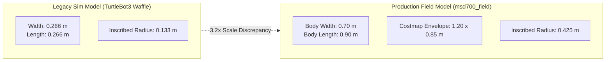
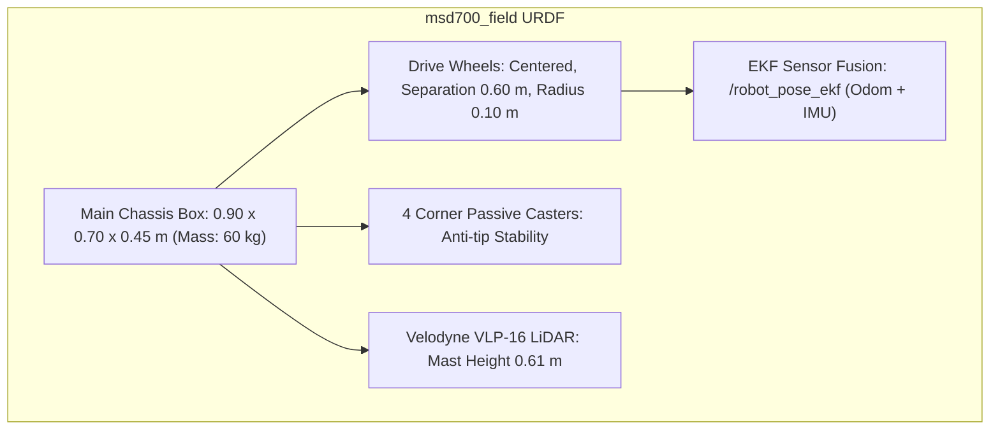

#Simulasi

<RoleBadge role="developer" />

Dokumen ini menjelaskan bagaimana robot MSD700 disimulasikan di Gazebo pada skala fisik sebenarnya, lingkungan Gudang Kecil AWS RoboMaker, konfigurasi sensor, dan apa yang dapat dan tidak dapat divalidasi oleh simulator.

Untuk geometri perencanaan cakupan yang diperoleh dari dimensi fisik robot, lihat [Cakupan Boustrophedon](/id/development/boustrophedon-and-alignment).

## Latar Belakang: Model Dimensi Skala Sebenarnya

Pengaturan simulator lama di repositori menggunakan model TurtleBot3 Waffle: **0,266 x 0,266 m** tapak pada lintasan roda 0,287 m. Sebaliknya, robot MSD700 produksi sebenarnya berukuran **0,90 x 0,70 m**, yang direpresentasikan dalam peta biaya navigasi sebagai tapak empuk **1,20 x 0,85 m**.



### Konsekuensi dari Kesenjangan Skala:
1. **Masalah Lorong Sempit yang Tidak Dapat Direproduksi**: Laporan nyata mengenai kegagalan perencanaan jalur di koridor gudang sempit tidak dapat direproduksi pada TurtleBot dengan radius 0,133 m.
2. **Kebocoran Konfigurasi**: Parameter lama (`robot_width: 0.32`) tetap ada dalam konfigurasi cakupan hingga pemodelan skala sebenarnya menggantikannya.
3. **Ketidakcocokan Skala Lingkungan**: Peta TurtleBot standar tidak memiliki jarak yang memadai untuk robot berukuran 0,9 x 0,7 m:
   - `turtlebot_world`: Jarak bebas maksimum 0,39 m (tidak dapat memuat radius tertulis 0,425 m di mana pun).
   - `AWS RoboMaker Small Warehouse`: Jarak bebas maksimum **3,68 m** (58% lantai dapat dilintasi, 38% dapat diputar di tempat).

## Dunia Simulasi: Gudang Kecil AWS

Simulator ini terstandarisasi pada lingkungan [AWS RoboMaker Small Warehouse](https://github.com/aws-robotics/aws-robomaker-small-warehouse-world): aula industri berukuran 13,98 x 20,91 m dengan ruang lantai terbuka seluas 234 m², rak penyimpanan, dongkrak palet, dan rintangan.

Aset mesh 3D (12 MB) diambil sesuai permintaan untuk menjaga repositori git tetap ringan:

```bash
rosrun msd700_simulation fetch_sim_worlds.sh
```

::: warning Upstream Branch Selection
AWS RoboMaker diarsipkan pada 10-09-2025. Cabang GitHub defaultnya hanya berisi README penghentian. Aset simulasi berada di cabang **`ros1`**, yang dikloning oleh `fetch_sim_worlds.sh` secara eksplisit.
:::

### Koordinat dan Izin Peneluran

Pose spawn default yang terverifikasi adalah **`x: 0.50, y: -2.40, yaw: 1.5708 (facing North)`**, memberikan jarak terbuka **3,79 m**.

| Nama Lokasi | Koordinat (x, y) | Radius Jarak Bebas | Status |
| --- | --- | --- | --- |
| **Pemunculan Gudang Default** | `(0.50, -2.40)` | **3,79 m** | Terverifikasi Aman (Default) |
| Teluk Alternatif 1 | `(1.81, -7.25)` | 2,47 m | Aman |
| Teluk Alternatif 2 | `(0.81, 2.75)` | 1,49 m | Aman |
| Rak yang Berantakan (Tidak Valid) | `(4.00, 1.00)` | **0,29 m** | **BERBAHAYA**: Di dalam zona tabrakan rak |

## Model Robot URDF: `msd700_field`

Robot fisik dimodelkan di `msd700_description/urdf/msd700_field.urdf.xacro` dengan plugin Gazebo di `msd700_field.gazebo.xacro`.



### Spesifikasi Fisik:
- **Dimensi**: panjang 0,90 m, lebar 0,70 m, tinggi 0,45 m, massa 60 kg.
- **Geometri Penggerak**: Penggerak skid-steer / diferensial berpusat pada titik tengah untuk memastikan selubung belokan yang simetris.
- **Kastor Empat Sudut**: Menghilangkan osilasi pitching dan roll yang menyebabkan LiDAR planar menciptakan penghalang lantai bayangan.
- **Velodyne VLP-16 LiDAR**: Ditinggikan 0,61 m di atas tanah pada tiang pemasangan, sesuai dengan unit fisiknya.
- **Bingkai ROS Standar**: Menggunakan konvensi bingkai standar (`base_footprint`, `base_link`, `base_scan`, `imu_link`, `odom`, `map`).

## Meluncurkan Tumpukan Simulasi

### 1. Simulasi Penuh dengan Integrasi Web UI
```bash
roslaunch msd700_simulation msd700_warehouse_nav.launch
```

### 2. Pemetaan SLAM di Gudang
```bash
roslaunch msd700_simulation msd700_warehouse_slam.launch
```

### 3. Pindahkan Parameterisasi Basis (`sim_body`)
File peluncuran menerima `sim_body:=field` (default untuk peluncuran gudang) untuk mengonfigurasi peta biaya untuk tapak 1,20 x 0,85 m, atau `sim_body:=waffle` untuk pengujian skala kecil yang lama.

## Dokumentasi Terkait

- [Cakupan Boustrophedon](/id/development/boustrophedon-and-alignment): Perhitungan jalur geometris dan toleransi jarak bebas.
- [Struktur Repositori](/id/development/repository-structure): Tata letak direktori paket simulasi.
- [Arsitektur](/id/development/architecture): Topologi komunikasi sistem lengkap.