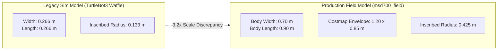
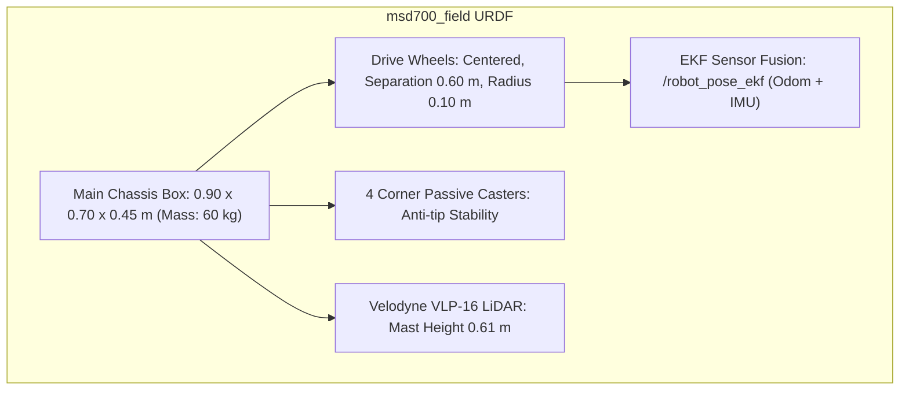

# Simulation

<RoleBadge role="developer" />

This document describes how the MSD700 robot is simulated in Gazebo at true physical scale, the AWS RoboMaker Small Warehouse environment, sensor configurations, and what the simulator can and cannot validate.

For coverage planning geometry derived from physical robot dimensions, see [Boustrophedon Coverage](/id/development/boustrophedon-and-alignment).

## Background: The True-Scale Dimension Model

Older simulator setups in the repository used TurtleBot3 Waffle models: **0.266 x 0.266 m** footprint on a 0.287 m wheel track. In contrast, the real production MSD700 robot measures **0.90 x 0.70 m**, represented in the navigation costmap as a padded **1.20 x 0.85 m** footprint.



### Consequences of the Scale Gap:
1. **Unreproducible Narrow-Aisle Issues**: Real-world reports of path planning failures in narrow warehouse corridors could not reproduce on a 0.133 m radius TurtleBot.
2. **Configuration Leakage**: A legacy parameter (`robot_width: 0.32`) lingered in coverage configurations until true-scale modeling replaced it.
3. **Environment Scale Mismatch**: Standard TurtleBot maps lacked adequate clearance for a 0.9 x 0.7 m robot:
   - `turtlebot_world`: Maximum clearance 0.39 m (cannot fit a 0.425 m inscribed radius anywhere).
   - `AWS RoboMaker Small Warehouse`: Maximum clearance **3.68 m** (58% traversable floor, 38% in-place pivotable).

## The Simulation World: AWS Small Warehouse

The simulator standardizes on the [AWS RoboMaker Small Warehouse](https://github.com/aws-robotics/aws-robomaker-small-warehouse-world) environment: a 13.98 x 20.91 m industrial hall with 234 m² of open floor space, storage racks, pallet jacks, and obstacles.

3D mesh assets (12 MB) are fetched on demand to keep the git repository lightweight:

```bash
rosrun msd700_simulation fetch_sim_worlds.sh
```

::: warning Upstream Branch Selection
AWS RoboMaker was archived on 2025-09-10. Its default GitHub branch contains only a deprecation README. The simulation assets reside on the **`ros1`** branch, which `fetch_sim_worlds.sh` clones explicitly.
:::

### Spawn Coordinates and Clearance

The verified default spawn pose is **`x: 0.50, y: -2.40, yaw: 1.5708 (facing North)`**, providing **3.79 m** of open clearance.

| Location Name | Coordinates (x, y) | Clearance Radius | Status |
| --- | --- | --- | --- |
| **Default Warehouse Spawn** | `(0.50, -2.40)` | **3.79 m** | Verified Safe (Default) |
| Alternate Bay 1 | `(1.81, -7.25)` | 2.47 m | Safe |
| Alternate Bay 2 | `(0.81, 2.75)` | 1.49 m | Safe |
| Shelving Clutter (Invalid) | `(4.00, 1.00)` | **0.29 m** | **DANGEROUS**: Inside shelf collision zone |

## The Robot URDF Model: `msd700_field`

The physical robot is modeled in `msd700_description/urdf/msd700_field.urdf.xacro` with Gazebo plugins in `msd700_field.gazebo.xacro`.



### Physical Specifications:
- **Dimensions**: 0.90 m length, 0.70 m width, 0.45 m height, mass 60 kg.
- **Drive Geometry**: Skid-steer / differential drive centered on the midpoint to ensure symmetrical turning envelopes.
- **Four Corner Casters**: Eliminates pitching and roll oscillations that cause planar LiDAR to create phantom floor obstacles.
- **Velodyne VLP-16 LiDAR**: Elevated 0.61 m above ground on a mounting mast, matching the physical unit.
- **Standardized ROS Frames**: Uses standard frame conventions (`base_footprint`, `base_link`, `base_scan`, `imu_link`, `odom`, `map`).

## Launching Simulation Stacks

### 1. Full Simulation with Web UI Integration
```bash
roslaunch msd700_simulation msd700_warehouse_nav.launch
```

### 2. SLAM Mapping in Warehouse
```bash
roslaunch msd700_simulation msd700_warehouse_slam.launch
```

### 3. Move Base Parameterization (`sim_body`)
Launch files accept `sim_body:=field` (default for warehouse launch) to configure costmaps for the 1.20 x 0.85 m footprint, or `sim_body:=waffle` for legacy small-scale testing.

## Related Documentation

- [Boustrophedon Coverage](/id/development/boustrophedon-and-alignment): Geometric path calculations and clearance tolerances.
- [Repository Structure](/id/development/repository-structure): Directory layout of simulation packages.
- [Architecture](/id/development/architecture): Full system communication topology.
