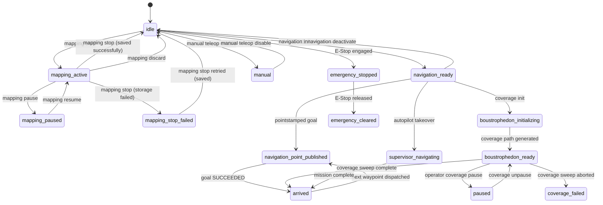
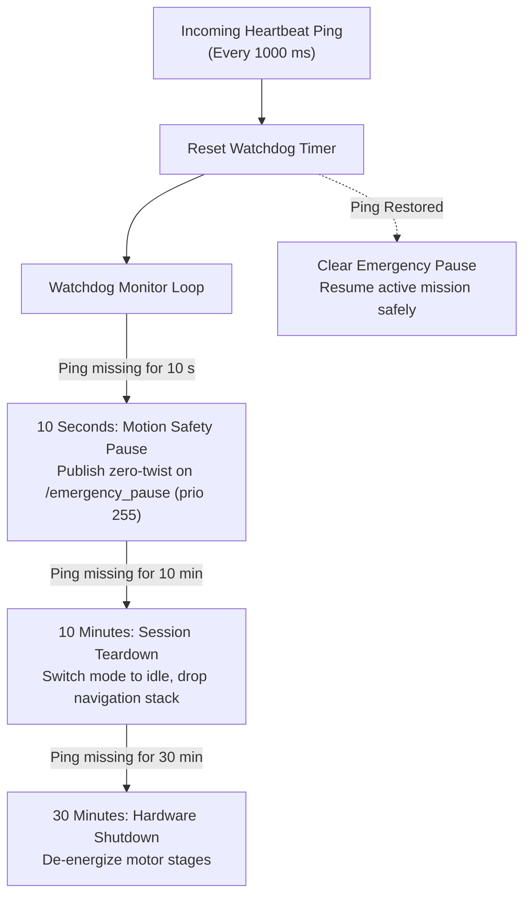
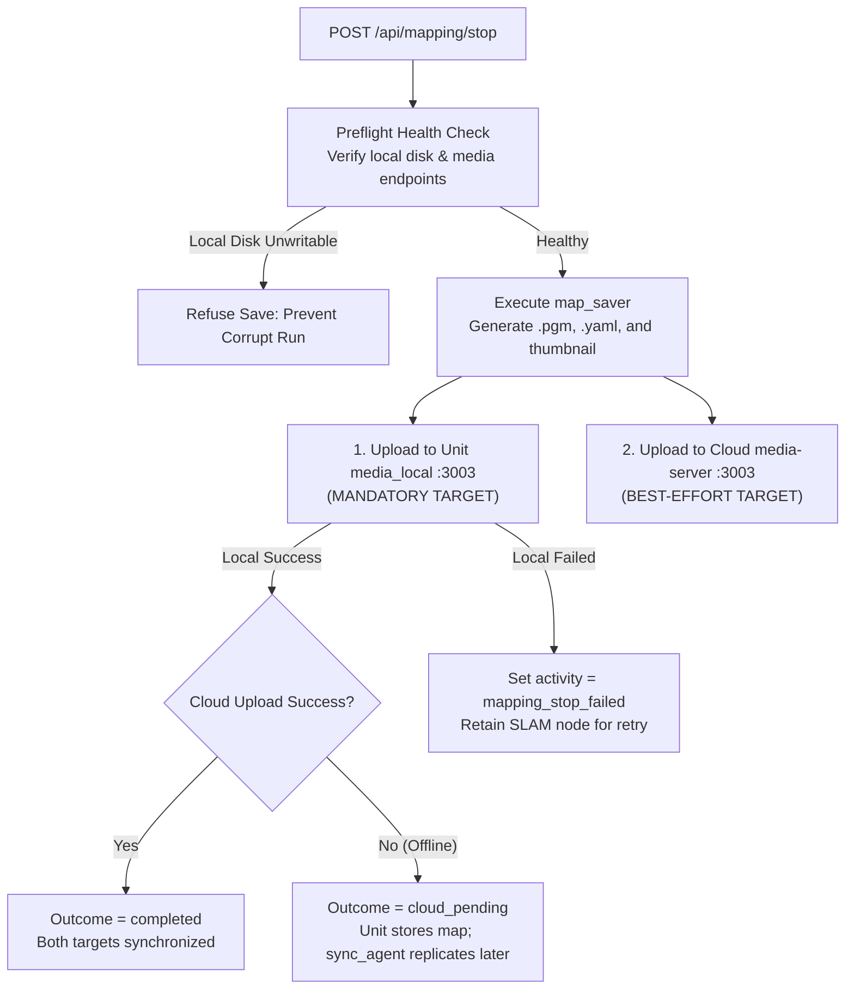
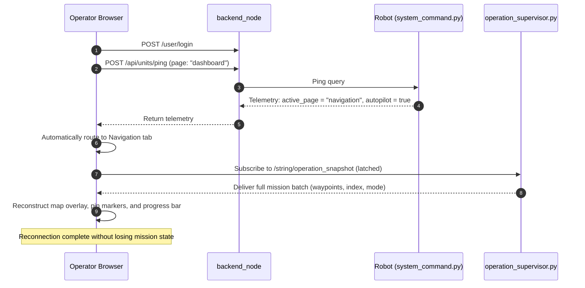

# Keadaan dan Perilaku

<RoleBadge role="developer" />

Dokumen ini merinci mesin negara terbatas yang mengatur siklus hidup robot MSD700, termasuk transisi keadaan navigasi, fase pemetaan SLAM, otonomi autopilot, pengawas keselamatan, dan mekanisme pemulihan kesalahan.

Prinsip arsitektur inti MSD700: **robot fisik adalah sumber kebenaran tertinggi**. Pengalihan, penyewaan, dan kemajuan operasional berada di komputer robot (`system_command.py` dan `operation_supervisor.py`), bertahan dari penutupan tab browser, reboot server, dan pemutusan jaringan.

## Matriks Kepemilikan dan Persistensi Negara

| Domain Negara | Pemilik Utama | Lingkup Persistensi | Konsumen Pembaca |
| --- | --- | --- | --- |
| **Aktivitas Robot** | `system_command.py` (`RobotStateTracker`) | Bertahan hingga penutupan browser dan restart backend. | Respon ping telemetri |
| **Sewa Operasi** | `system_command.py` | Bertahan melalui restart server; kedaluwarsa dalam 15 detik jika tidak disegarkan. | Umpan balik Ping (`in_use`, `origin_conflict`) |
| **Mode Autopilot / Manual** | `system_command.py` | Tetap ada di seluruh penutupan tab browser. | Respon ping telemetri |
| **Batch Misi Aktif** | `operation_supervisor.py` | Tetap ada meskipun browser ditutup; disimpan dalam RAM. | Terkunci `/string/operation_snapshot` |
| **Siklus Hidup Kontainer** | `unit_manager.js` (RAM Server) | Hanya waktu proses server; direkonstruksi oleh `adoptExisting()` saat boot. | Konsol web admin dan penuai |
| **Draf & Pilihan UI** | Peramban `sessionStorage` | Sesi seumur hidup; dibersihkan pada tab tutup. | Komponen Dashboard React |
| **Catatan & Peta Armada** | MySQL Pusat (`db`) | Penyimpanan permanen. | API REST Bagian Belakang |

::: warning Browser Storage Limitation
Menutup tab browser akan menghapus `sessionStorage`. Untuk memastikan dimulainya kembali misi dengan lancar, titik arah aktif dan batas cakupan dipasang di `/string/operation_snapshot`. Saat operator membuka kembali dasbor di tab baru, UI berlangganan topik yang terkunci ini dan sepenuhnya merekonstruksi proses aktif.
:::

## Mesin Status Aktivitas Robot

String aktivitas robot dilacak terus menerus oleh `RobotStateTracker` dan dilaporkan dalam setiap ping detak jantung.

### Status Aktivitas Lengkap

| Kunci Aktivitas | Tab UI Target | Deskripsi |
| --- | --- | --- |
| `idle` | Menganggur | Sistem diinisialisasi; pengontrol motor diaktifkan tetapi tidak ada tujuan aktif. |
| `manual` | Menganggur | Teleop manual aktif melalui kontrol keyboard WASD. |
| `mapping_active` | Pemetaan | Pemetaan SLAM aktif dengan `explore_lite` eksplorasi perbatasan. |
| `mapping_paused` | Pemetaan | Eksplorasi SLAM dihentikan sementara oleh operator. |
| `mapping_stop_failed` | Pemetaan | Gagal menyimpan peta; Status SLAM tetap aktif sehingga operator dapat mencoba lagi. |
| `navigation_ready` | Navigasi | Peta dimuat, `move_base` beroperasi, menunggu pengiriman tujuan. |
| `navigation_point_published` | Navigasi | Robot aktif melintasi menuju tujuan navigasi. |
| `boustrophedon_initializing` | Navigasi | Menghasilkan garis sapuan cakupan (dibebaskan dari batas waktu idle/macet). |
| `boustrophedon_ready` | Navigasi | Melaksanakan garis sapuan cakupan boustrophedon. |
| `supervisor_navigating` | Navigasi | Pengiriman titik jalan otonom dikelola oleh `operation_supervisor`. |
| `arrived` | Navigasi | Berhasil mencapai waypoint tujuan atau menyelesaikan cakupan area. |
| `coverage_failed` | Navigasi | Perencanaan cakupan atau eksekusi jalur dibatalkan. |
| `auto_aligning` | Navigasi | Menjalankan kalibrasi orientasi filter partikel Penyelarasan Otomatis. |
| `paused` | Navigasi | Misi dijeda oleh perintah operator eksplisit. |
| `paused_due_to_ping_loss` | (Internal) | Pengawas keselamatan menghentikan gerakan robot karena ping detak jantung menurun. |
| `emergency_stopped` | Menganggur | Penghentian darurat perangkat keras diaktifkan (kecepatan nol dijepit pada prioritas 255). |
| `emergency_cleared` | Menganggur | Penghentian darurat dilepaskan; motor siap untuk inisialisasi ulang. |

## Pengawas Keamanan dan Pengawasan Detak Jantung

Perangkat lunak onboard memantau kesehatan komunikasi melalui pengawas jendela geser yang terus menerus.

### Tingkatan Waktu Pengawas Detak Jantung:
1. **10 Detik (Jeda Gerakan)**: Jika tidak ada detak jantung valid yang muncul selama 10 detik, `system_command.py` menerapkan perintah pelintiran `/emergency_pause` pada prioritas 255. Robot melambat hingga berhenti total tanpa membatalkan sasaran aktif `move_base`. Saat komunikasi kembali, jeda akan hilang dan gerakan dilanjutkan secara otomatis.
2. **10 Menit (Sesi Teardown)**: Jika operator tetap terputus selama 10 menit, sesi navigasi atau pemetaan aktif akan dibongkar dengan baik untuk mencegah motor terlalu panas.
3. **30 Menit (Pematian Perangkat Keras)**: Setelah 30 menit tidak ada secara terus-menerus, driver perangkat keras akan mati ke mode siaga berdaya rendah.

::: warning Autopilot Mode Exemption
Saat **Mode Autopilot** aktif, jeda komunikasi 10 detik akan ditangguhkan. Robot melanjutkan rute inspeksi otonomnya meskipun operator menutup laptopnya atau berkendara melalui zona mati Wi-Fi.
:::

## Penyimpanan Peta dan Replikasi Dua Tingkat

Saat menyimpan peta SLAM melalui `POST /api/mapping/stop`, robot menulis aset peta ke dua target independen:

| Target Penyimpanan | Tingkat Persyaratan | Implikasi Kegagalan |
| --- | --- | --- |
| **Unit Server media lokal** | **Wajib** | Jika penyimpanan lokal gagal, robot tidak dapat menavigasi peta ini. Sesi SLAM tetap aktif di `mapping_stop_failed` sehingga operator dapat mencoba menyimpan kembali. |
| **Server media Cloud Central** | **Upaya Terbaik** | Jika pengunggahan cloud gagal (misalnya robot sedang offline di gudang), peta ditandai `cloud_pending`. Latar belakang `sync_agent` mereplikasi file peta secara otomatis setelah konektivitas internet kembali. |

## Koneksi Ulang dan Pemulihan Sesi

Saat operator membuka kembali tab browser yang tertutup atau masuk dari stasiun kerja baru:

### Prinsip Pemulihan:
1. **Perutean oleh `active_page`**: Frontend mengarahkan operator langsung ke tab operasional aktif (Navigasi atau Pemetaan) berdasarkan telemetri robot langsung.
2. **Pembuatan Ulang Snapshot Terkunci**: Seluruh status misi (titik jalan aktif, indeks saat ini, arah perjalanan, dan poligon cakupan) dipulihkan dari topik ROS `/string/operation_snapshot` yang terkunci.
3. **Validasi Status Hantu**: Jika cache browser menunjukkan misi sedang berlangsung tetapi robot melaporkan `idle` pada 8 sampel telemetri berturut-turut, frontend secara otomatis disetel ulang ke `idle` untuk mencegah tampilan eksekusi hantu.

## Dokumentasi Terkait

- [Kontrak Pesan](/id/development/message-contracts): Skema topik berseri dan amplop ping detak jantung.
- [Arsitektur](/id/development/architecture): Ikhtisar topologi perangkat keras dan server.
- [Referensi API](/id/development/api-reference): Titik akhir HTTP dan referensi kode kesalahan.