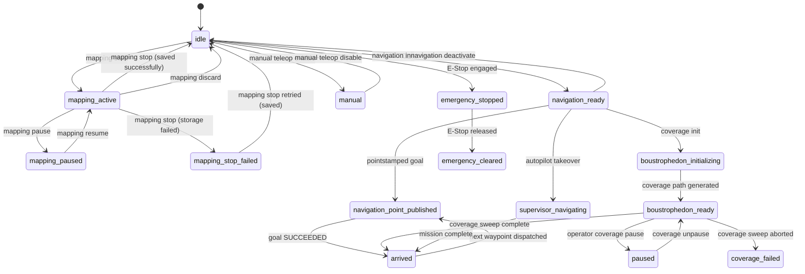
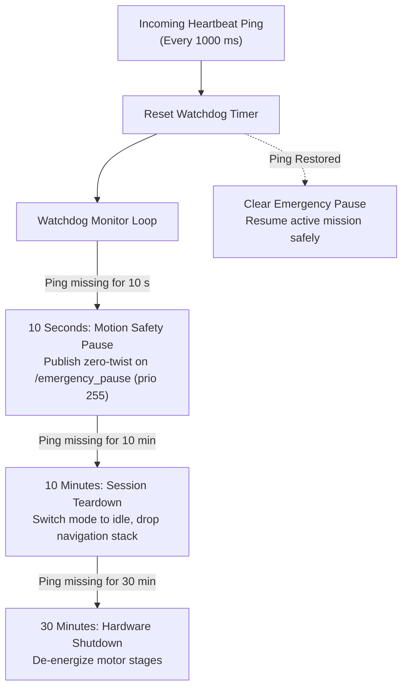
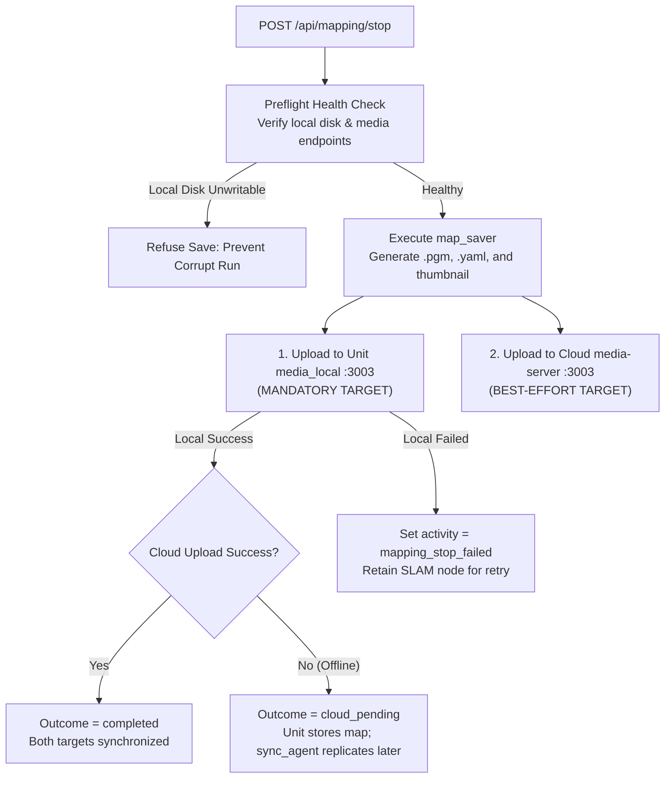
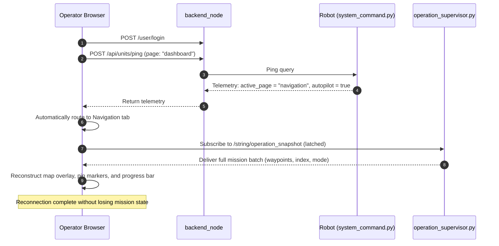

# State and Behavior

<RoleBadge role="developer" />

This document details the finite state machines governing the MSD700 robot lifecycle, including navigation state transitions, SLAM mapping phases, autopilot autonomy, safety watchdogs, and fault recovery mechanisms.

The core architectural principle of MSD700: **the physical robot is the ultimate source of truth**. Toggles, leases, and operational progress reside on the robot computer (`system_command.py` and `operation_supervisor.py`), surviving browser tab closures, server reboots, and network disconnects.

## State Ownership and Persistence Matrix

| State Domain | Primary Owner | Persistence Scope | Reader Consumer |
| --- | --- | --- | --- |
| **Robot Activity** | `system_command.py` (`RobotStateTracker`) | Persists through browser closures and backend restarts. | Telemetry ping response |
| **Operating Lease** | `system_command.py` | Persists through server restarts; expires in 15 seconds if unrefreshed. | Ping feedback (`in_use`, `origin_conflict`) |
| **Autopilot / Manual Mode** | `system_command.py` | Persists across browser tab closures. | Telemetry ping response |
| **Active Mission Batch** | `operation_supervisor.py` | Persists across browser closures; stored in RAM. | Latched `/string/operation_snapshot` |
| **Container Lifecycle** | `unit_manager.js` (Server RAM) | Server runtime only; reconstructed by `adoptExisting()` on boot. | Admin web console and reaper |
| **UI Drafts & Selections** | Browser `sessionStorage` | Session lifetime; cleared on tab close. | Dashboard React components |
| **Fleet Records & Maps** | Central MySQL (`db`) | Permanent storage. | Backend REST API |

::: warning Browser Storage Limitation
Closing a browser tab clears `sessionStorage`. To ensure seamless mission resumption, active waypoints and coverage boundaries are latched on `/string/operation_snapshot`. When an operator re-opens the dashboard in a new tab, the UI subscribes to this latched topic and fully reconstructs the active run.
:::

## Robot Activity State Machine

The robot activity string is tracked continuously by `RobotStateTracker` and reported in every heartbeat ping.

### Complete Activity States

| Activity Key | Target UI Tab | Description |
| --- | --- | --- |
| `idle` | Idle | System initialized; motor controllers enabled but no active goal. |
| `manual` | Idle | Manual teleop active via WASD keyboard controls. |
| `mapping_active` | Mapping | Active SLAM mapping with `explore_lite` frontier exploration. |
| `mapping_paused` | Mapping | SLAM exploration temporarily paused by operator. |
| `mapping_stop_failed` | Mapping | Map saving failed; SLAM state remains active so operator can retry. |
| `navigation_ready` | Navigation | Map loaded, `move_base` operational, waiting for goal dispatch. |
| `navigation_point_published` | Navigation | Robot actively traversing towards a navigation goal. |
| `boustrophedon_initializing` | Navigation | Generating coverage sweep lines (exempt from idle/stuck timeouts). |
| `boustrophedon_ready` | Navigation | Executing boustrophedon coverage sweep lines. |
| `supervisor_navigating` | Navigation | Autonomous waypoint dispatch managed by `operation_supervisor`. |
| `arrived` | Navigation | Successfully reached destination waypoint or completed coverage area. |
| `coverage_failed` | Navigation | Coverage planning or path execution aborted. |
| `auto_aligning` | Navigation | Executing Auto Align particle filter orientation calibration. |
| `paused` | Navigation | Mission paused by explicit operator command. |
| `paused_due_to_ping_loss` | (Internal) | Safety watchdog paused robot motion due to dropped heartbeat pings. |
| `emergency_stopped` | Idle | Hardware emergency stop engaged (zero velocity clamped at priority 255). |
| `emergency_cleared` | Idle | Emergency stop released; motors ready for re-initialization. |

## Safety Watchdog and Heartbeat Supervision

The onboard software monitors communication health via a continuous sliding window watchdog.

### Heartbeat Watchdog Timing Tiers:
1. **10 Seconds (Motion Pause)**: If no valid heartbeat arrives for 10 seconds, `system_command.py` asserts a latched `/emergency_pause` twist command at priority 255. The robot decelerates to a complete stop without canceling the active `move_base` goal. When communication returns, the pause is lifted and motion resumes automatically.
2. **10 Minutes (Session Teardown)**: If the operator remains disconnected for 10 minutes, the active navigation or mapping session is gracefully unloaded to prevent motor overheating.
3. **30 Minutes (Hardware Shutdown)**: After 30 minutes of continuous absence, hardware drivers power down into a low-power standby mode.

::: warning Autopilot Mode Exemption
When **Autopilot Mode** is active, the 10-second communication pause is suspended. The robot continues its autonomous inspection route even if the operator closes their laptop or drives through Wi-Fi dead zones.
:::

## Map Storage and Two-Tier Replication

When saving a SLAM map via `POST /api/mapping/stop`, the robot writes map assets to two independent targets:

| Storage Target | Requirement Level | Failure Implication |
| --- | --- | --- |
| **Unit Local media-server** | **Mandatory** | If local save fails, the robot cannot navigate this map. The SLAM session remains active in `mapping_stop_failed` so the operator can retry saving. |
| **Cloud Central media-server** | **Best Effort** | If cloud upload fails (e.g. robot is offline in a warehouse), the map is marked `cloud_pending`. The background `sync_agent` replicates the map files automatically once internet connectivity returns. |

## Session Reconnection and Recovery

When an operator reopens a closed browser tab or logs in from a new workstation:

### Recovery Principles:
1. **Routing by `active_page`**: The frontend redirects the operator directly to the active operational tab (Navigation or Mapping) based on live robot telemetry.
2. **Latched Snapshot Rebuild**: The entire mission state (active waypoints, current index, travel direction, and coverage polygons) is restored from the latched `/string/operation_snapshot` ROS topic.
3. **Ghost State Validation**: If the browser cache indicates a mission in progress but the robot reports `idle` across 8 consecutive telemetry samples, the frontend automatically resets to `idle` to prevent phantom execution displays.

### What the rebuild paints first

Order matters as much as content. The rebuild used to draw the coverage overlay only after it had
fetched the map list and waited (up to 8 s) for the live grid to scale the stage, so an operator
signing back into a running sweep watched a bare map for seconds before the areas appeared. The
overlay needs neither: it is drawn in metres straight into the scene, and the snapshot already
carries the plan. It now goes up first, and the stage-scale wait is skipped entirely for a coverage
run, which has no pins to size. Pin restoration still waits for it, because a marker added to an
unscaled stage renders at an invisible 0.01 scale.

The same rule applies when a run **starts**: the areas are painted as the plan is dispatched, not
when the robot acknowledges it. `POST /api/boustrophedon/init` answers only once `switch_mode` has
brought the coverage stack up on the robot, which is seconds of the operator watching a map with
nothing on it. A refused run clears the overlay again, and a refused single custom area redraws the
cyan drawer polygon so the operator still has an area to retry with.

## Related Documentation

- [Message Contracts](/id/development/message-contracts): Serialized topic schemas and heartbeat ping envelopes.
- [Architecture](/id/development/architecture): Hardware and server topology overview.
- [API Reference](/id/development/api-reference): HTTP endpoints and error code references.
