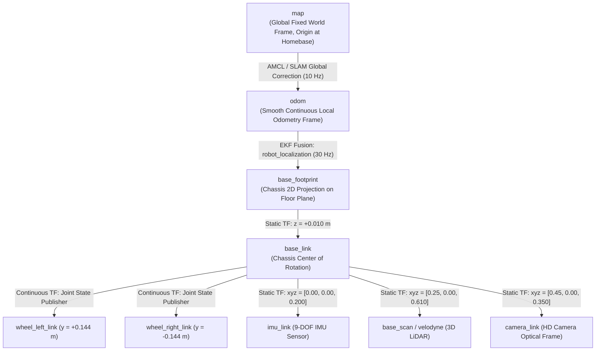
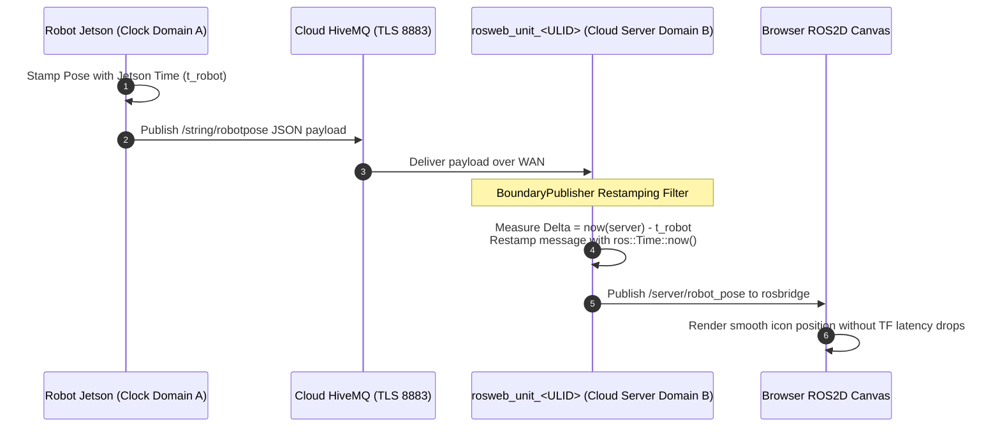

# Koordinat Frame, Transformasi, dan Arsitektur TF

<RoleBadge role="developer" />

Dokumen ini memberikan spesifikasi komprehensif tentang pohon transformasi koordinat (`tf` / `tf2`), kerangka referensi spasial, penyiar transformasi dinamis, offset sensor, dan restamping jam lintas mesin yang diterapkan dalam sistem robot MSD700.

## Hierarki Bingkai Koordinat (Pohon TF)

Pohon transformasi koordinat mematuhi ROS REP-103 (Konvensi Satuan Ukuran & Koordinat Standar) dan REP-105 (Bingkai Koordinat untuk Platform Seluler):



---

## Transformasi Penerbit dan Perbarui Tarif

| Transformasi Tepi | Node Penyiar | Nilai | Sumber Matematika | Perilaku Selama Pemadaman |
| --- | --- | --- | --- | --- |
| `map -> odom` | `amcl` / `slam_gmapping` | 10Hz | Memperbaiki penyimpangan odometrik terhadap jaringan hunian laser statis. | Lompatan diskrit saat dilokalisasi; mempertahankan transformasi terakhir jika pemindaian laser menurun. |
| `odom -> base_footprint` | `robot_localization` (`ekf_localization_node`) | 30Hz | Penggabungan berkelanjutan kecepatan encoder roda dan laju yaw/sudut IMU. | Lintasan jangka pendek yang berkesinambungan, mulus, dan bebas penyimpangan. |
| `base_footprint -> base_link` | `robot_state_publisher` | Statis | Offset ketinggian tetap ($z = 0,010\text{ m}$). | Memperbaiki transformasi dari URDF. |
| `base_link -> base_scan` | `robot_state_publisher` | Statis | Koordinat pemasangan tiang fisik ($x = 0.250\text{ m}, z = 0.610\text{ m}$). | Memperbaiki transformasi dari URDF. |
| `base_link -> imu_link` | `robot_state_publisher` | Statis | Pemasangan sasis fisik ($z = 0,200\text{ m}$). | Memperbaiki transformasi dari URDF. |
| `base_link -> camera_link` | `robot_state_publisher` | Statis | Pemasangan sasis depan ($x = 0,450\text{ m}, z = 0,350\text{ m}$). | Memperbaiki transformasi dari URDF. |

---

## Konvensi Koordinat Spasial (REP-103)

MSD700 secara ketat menerapkan sistem koordinat Cartesian tangan kanan:

```
        +X (Forward / Roll Axis)
           ▲
           │
           │
           │
 ◄─────────┼─────────► +Y (Left / Pitch Axis)
           │
           ▼
        +Z (Upward / Yaw Axis)
```

- **$+X$**: Menunjuk langsung ke depan sepanjang arah perjalanan utama robot.
- **$+Y$**: Menunjuk langsung ke kiri melintasi lebar lateral robot.
- **$+Z$**: Menunjuk vertikal ke atas tegak lurus terhadap bidang lantai.
- **Sudut Rotasi**: Ikuti aturan tangan kanan (Rotasi berlawanan arah jarum jam di sekitar $+Z$ berhubungan dengan tingkat yaw positif $+\dot{\theta}$).

---

## Penataan Ulang Domain Jam Lintas Mesin (`BoundaryPublisher`)

Saat telemetri (seperti pose robot dan pemindaian laser) dihubungkan dari robot fisik melalui internet ke server cloud, **pergeseran jam antar mesin fisik akan menghasilkan peringatan ekstrapolasi `TF_OLD_DATA`** jika stempel waktu dievaluasi secara langsung.



### Mengapa Restamping Menahan Beban:
1. **Batasan RTC Jetson**: SBC fisik di lingkungan lapangan tanpa akses NTP dapat melakukan booting dengan jam yang dimiringkan dalam hitungan detik atau bulan.
2. **Pengusiran Buffer**: Jika pesan pose yang masuk membawa stempel waktu di masa lalu yang berhubungan dengan master ROS server, `tf2_ros::Buffer` segera membuangnya, sehingga mencegah kanvas web merender gerakan robot.
3. **`BoundaryPublisher` Solusi**: `patch_time.py` menghapus stempel waktu perangkat keras robot dan memberi stempel ulang muatan geometris dengan `ros::Time::now()` saat masuk ke master ROS server.

## Dokumentasi Terkait

- [Penggabungan dan Kontrol Sensor](/id/development/sensor-fusion-and-control): Estimasi keadaan kinematik dan EKF.
- [Peta Biaya dan Perencana](/id/development/costmaps-and-planners): Bingkai koordinat peta biaya navigasi.
- [rosbridge Protocol](/id/development/rosbridge-protocol): serialisasi topik WebSocket.