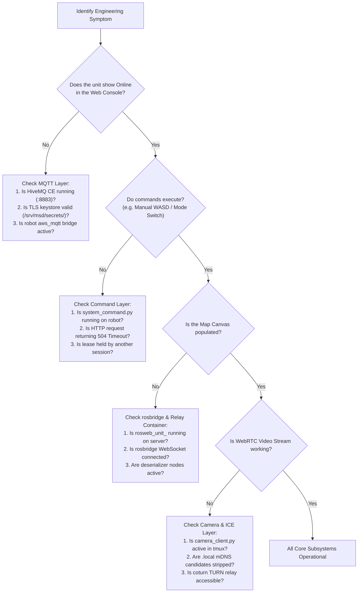

# Diagnostik dan Pemecahan Masalah Pengembang

<RoleBadge role="developer" />

Dokumen ini menyediakan alur kerja diagnostik terstruktur, pemetaan gejala-ke-penyebab, dan prosedur pemulihan untuk menyelesaikan masalah teknik umum di seluruh tumpukan MSD700.

## Diagram Alir Diagnostik Sistematis



## Mode dan Solusi Kegagalan Umum

### 1. Unit Muncul Offline (Lapisan Broker MQTT)
- **Gejala**: Lencana status unit di dasbor ditampilkan `offline`.
- **Akar Penyebab**: Robot fisik tidak dapat membuat koneksi TLS terenkripsi ke port HiveMQ 8883.
- **Langkah Diagnostik**:
  1. Periksa status kontainer HiveMQ di server: `docker ps | grep hivemq`.
  2. Verifikasi bahwa keystore sertifikat TLS (`/srv/msd/secrets/hivemq/keystore.p12`) valid dan dapat dibaca oleh UID 1001.
  3. Pada robot, periksa log jembatan MQTT: `tmux attach -t robot_services` dan periksa jendela `aws_mqtt`.

### 2. Unit Online, Namun Kanvas Peta Tetap Kosong (rosbridge/Relay Container)
- **Gejala**: Perintah berhasil, tetapi tidak ada peta, ikon robot, atau pemindaian laser yang muncul di kanvas web.
- **Akar Penyebab**: Kontainer relai on-demand `rosweb_unit_<ULID>` dihentikan oleh idle reaper, atau proksi Apache WebSocket diblokir.
- **Langkah Diagnostik**:
  1. Verifikasi apakah kontainer per unit berjalan di server: `docker ps | grep rosweb_unit`.
  2. Jika tidak ada, muat ulang halaman unit di browser untuk memicu peristiwa `touch` di `unit_manager.js`.
  3. Uji konektivitas WebSocket ke `/services/rosbridge` menggunakan alat pengembang browser.

### 3. Navigasi Macet dengan Kesalahan TF (`use_sim_time` Staleness)
- **Gejala**: Robot menolak bergerak, dan log konsol menampilkan peringatan TF berulang yang menyebutkan "waktu simulasi" atau `TF_OLD_DATA`.
- **Root Cause**: `/use_sim_time` disetel ke `true` pada master ROS melalui simulasi yang dijalankan, namun tidak ada penerbit `/clock` selama operasi robot sebenarnya.
- **Resolusi**:
  ```bash
  rosparam set /use_sim_time false
  ```
  Mulai ulang tumpukan kemunculan robot. Perhatikan bahwa memulai ulang node saja tidak akan menghapus parameter karena berada langsung di `roscore`.

### 4. Streaming Video Terhenti atau Gagal pada Wi-Fi Lokal (Kesalahan Kandidat mDNS)
- **Gejala**: Video WebRTC gagal terhubung di jaringan lokal dengan `Errno 19: No such device`.
- **Akar Penyebab**: Chrome mengeluarkan nama kandidat mDNS `.local` yang menjaga privasi. Ketika robot tidak memiliki gateway internet, `aioice` gagal mencoba bergabung dengan DNS multicast.
- **Resolusi**: Verifikasi bahwa `camera_client.py` berisi filter `_strip_mdns_candidates()` dan variabel konfigurasi ICE lokal (`LOCAL_STUN_URLS`, `LOCAL_TURN_URL`) disetel ke `none`.

### 5. Hindari Kebuntuan Peta Biaya
- **Gejala**: Gol diterima oleh `move_base`, namun robot tidak pernah bergerak maju.
- **Root Cause**: `keepout_layer` diaktifkan di `costmap_common_params.yaml` tetapi menunggu `/msd700/keepout_grid`. Jika tidak ada grid pencegahan yang dipublikasikan, peta biaya tidak pernah ditandai "saat ini".
- **Resolusi**: Pastikan `path_coverage_node` atau `system_command.py` memublikasikan grid keepout kosong pada inisialisasi.

## Dokumentasi Terkait

- [Arsitektur](/id/development/architecture): Model komunikasi dua saluran.
- [Kontrak Pesan](/id/development/message-contracts): Format topik dan muatan yang diharapkan.
- [Pengaturan: Pemecahan Masalah](/id/setup/troubleshooting): Langkah-langkah pemecahan masalah teknisi dan penerapan.