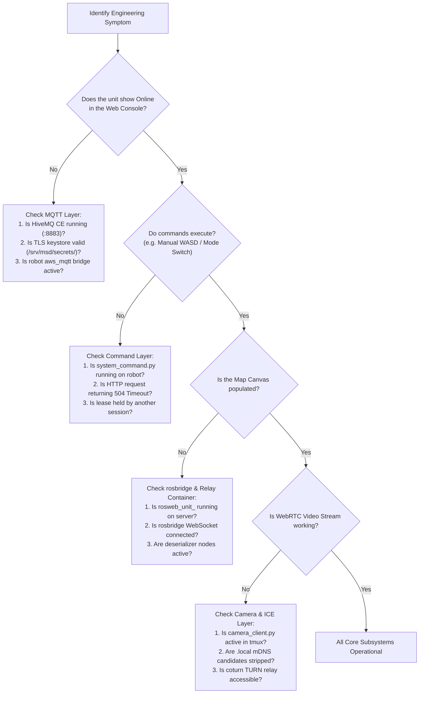

# Developer Diagnostics and Troubleshooting

<RoleBadge role="developer" />

This document provides structured diagnostic workflows, symptom-to-cause mappings, and recovery procedures for resolving common engineering issues across the MSD700 stack.

## Systematic Diagnostic Flowchart



## Common Failure Modes and Solutions

### 1. Unit Appears Offline (MQTT Broker Layer)
- **Symptom**: The unit status badge in the dashboard displays `offline`.
- **Root Cause**: The physical robot cannot establish an encrypted TLS connection to HiveMQ port 8883.
- **Diagnostic Steps**:
  1. Check HiveMQ container status on the server: `docker ps | grep hivemq`.
  2. Verify that the TLS certificate keystore (`/srv/msd/secrets/hivemq/keystore.p12`) is valid and readable by UID 1001.
  3. On the robot, inspect MQTT bridge logs: `tmux attach -t robot_services` and check the `aws_mqtt` window.

### 2. Unit Online, But Map Canvas Remains Blank (rosbridge / Relay Container)
- **Symptom**: Commands succeed, but no map, robot icon, or laser scan appears on the web canvas.
- **Root Cause**: The on-demand relay container `rosweb_unit_<ULID>` was stopped by the idle reaper, or Apache WebSocket proxying is blocked.
- **Diagnostic Steps**:
  1. Verify if the per-unit container is running on the server: `docker ps | grep rosweb_unit`.
  2. If absent, reload the unit page in the browser to trigger a `touch` event in `unit_manager.js`.
  3. Test WebSocket connectivity to `/services/rosbridge` using browser developer tools.

### 3. Navigation Freezes with TF Errors (`use_sim_time` Staleness)
- **Symptom**: The robot refuses to move, and console logs display repeated TF warnings mentioning "simulated time" or `TF_OLD_DATA`.
- **Root Cause**: `/use_sim_time` was set to `true` on the ROS master by a simulation run, but no `/clock` publisher exists during real robot operation.
- **Resolution**:
  ```bash
  rosparam set /use_sim_time false
  ```
  Restart the robot bringup stack. Note that restarting nodes alone will not clear the parameter because it resides directly on `roscore`.

### 4. Video Stream Stalls or Fails on Local Wi-Fi (mDNS Candidate Error)
- **Symptom**: WebRTC video fails to connect on a local network with `Errno 19: No such device`.
- **Root Cause**: Chrome emits privacy-preserving `.local` mDNS candidate names. When the robot has no internet gateway, `aioice` fails attempting to join multicast DNS.
- **Resolution**: Verify that `camera_client.py` contains the `_strip_mdns_candidates()` filter and that local ICE configuration variables (`LOCAL_STUN_URLS`, `LOCAL_TURN_URL`) are set to `none`.

### 5. Keep-Out Costmap Deadlock
- **Symptom**: Goals are accepted by `move_base`, but the robot never drives forward.
- **Root Cause**: `keepout_layer` is enabled in `costmap_common_params.yaml` but waiting for `/msd700/keepout_grid`. If no keep-out grid is published, costmaps are never marked "current".
- **Resolution**: Ensure `path_coverage_node` or `system_command.py` publishes an empty keepout grid on initialization.

## Related Documentation

- [Architecture](/id/development/architecture): Two-channel communication models.
- [Message Contracts](/id/development/message-contracts): Expected topic formats and payloads.
- [Setup: Troubleshooting](/id/setup/troubleshooting): Technician and deployment troubleshooting steps.
