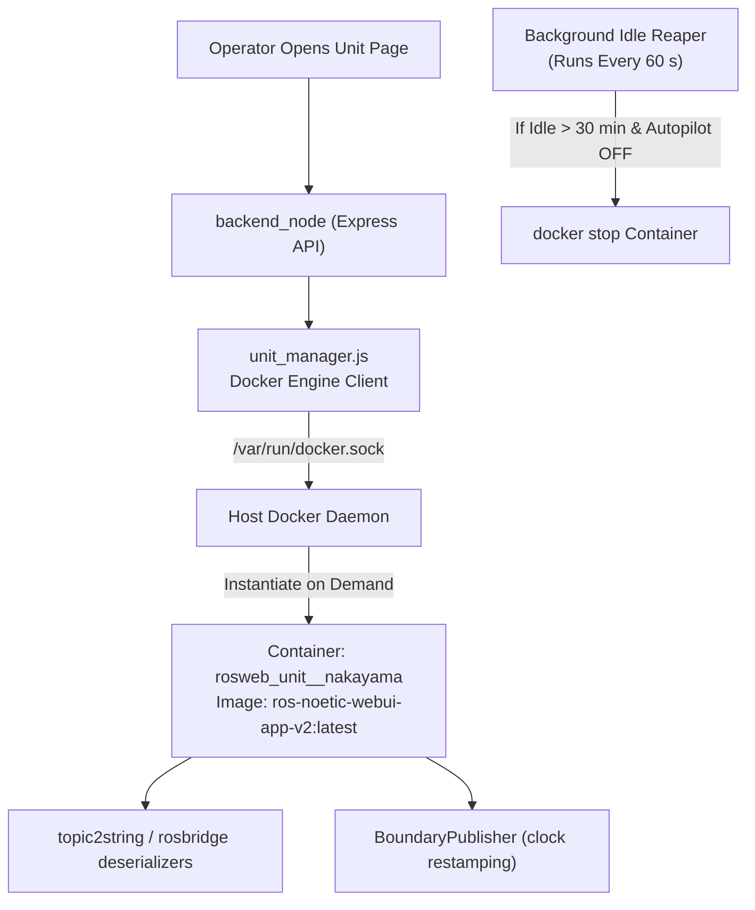
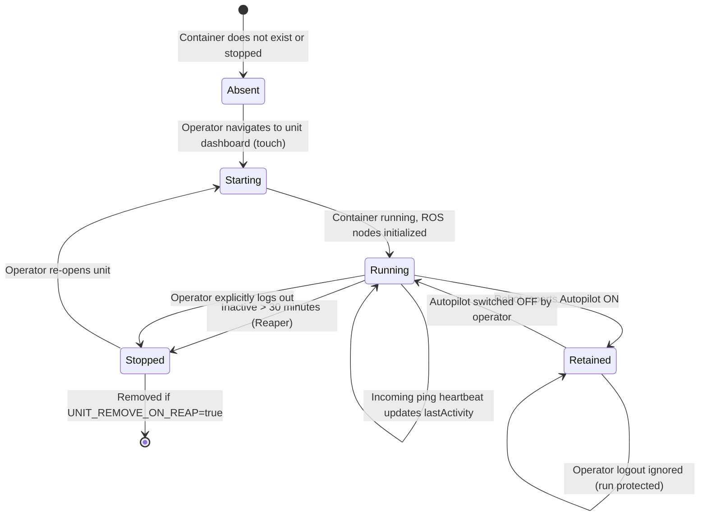

# Manajemen Siklus Hidup Kontainer Unit (Legacy)

<RoleBadge role="developer" />

::: warning Pemberitahuan Arsitektur Tergantikan
Orkestrasi siklus hidup 1-kontainer-per-unit yang dikelola oleh `unit_manager.js` **digantikan** oleh fleet relay yang dijelaskan di [Fleet Relay: Satu Kontainer untuk Setiap Unit](#fleet-relay-one-container-for-every-unit) di bawah, yang kini menjadi default. Jalur per-unit masih tersedia dan hanya berjarak satu environment variable; dokumen ini mencakup keduanya.
:::

Dokumen ini merinci manajemen siklus hidup dinamis dari kontainer relay per-unit (`rosweb_unit_<ULID>`) pada server cloud, dikelola oleh `unit_manager.js` lewat Docker socket, serta fleet relay yang menggantikannya.

## Ikhtisar Arsitektur Kontainer (Legacy)

Untuk menskalakan di seluruh fleet robot besar tanpa memboroskan CPU dan RAM server pada mesin yang idle, server hanya menyalakan sebuah kontainer relay ROS khusus ketika seorang operator membuka dashboard robot tersebut.



## State Machine Siklus Hidup Kontainer



## Aturan dan Kebijakan Siklus Hidup

### 1. Retensi Misi Autopilot
Ketika sebuah robot menjalankan misi otonom dalam **Mode Autopilot**, kontainer relay-nya memasuki state **Retained**. Kontainer Retained dikecualikan dari idle reaper 30 menit dan **tidak pernah dihentikan saat operator logout**. Ini menjamin operasi otonom berlanjut tanpa gangguan bahkan jika operator menutup laptop mereka atau keluar dari jangkauan Wi-Fi.

### 2. Idle Timeout Reaper
Reaper latar belakang menyapu setiap 60 detik (`UNIT_REAP_INTERVAL_MS: 60000`). Jika sebuah kontainer tidak memiliki ping heartbeat operator aktif selama 30 menit (`UNIT_IDLE_TIMEOUT_MS: 1800000`) dan tidak di-retain oleh Autopilot, manager memanggil `docker.stop()`.

### 3. Kebijakan Restart: `unless-stopped`
Kontainer per-unit berjalan dengan kebijakan restart Docker `unless-stopped`. Jika server host reboot, Docker secara otomatis menghidupkan kembali kontainer unit yang sebelumnya berjalan. Sebaliknya, ketika reaper secara eksplisit menghentikan sebuah kontainer, Docker menghormati state stop tersebut dan tidak menghidupkannya kembali.

## Parameter Konfigurasi

| Environment Variable | Nilai Default | Deskripsi |
| --- | --- | --- |
| `UNIT_MANAGER_ENABLED` | `true` (server), `false` (unit) | Saklar utama. Off juga menonaktifkan pelacakan holder, yang merusak handback lease saat logout. |
| `UNIT_CONTAINERS_ENABLED` | `false` | Default adalah mode fleet. Set `true` untuk kembali ke satu kontainer per robot, lalu hentikan relay. |
| `FLEET_RELAY_CONTAINER` | diturunkan dari `UNIT_MODE` | Nama kontainer relay tunggal yang di-restart reconciler. |
| `FLEET_ROSTER_POLL_MS` | `60000` | Seberapa sering roster dibaca ulang dari `units`. Sebuah backstop terhadap perubahan yang terlewat, bukan mekanisme utamanya. |
| `MULTI_UNIT_LIST` | (tidak diset) | Override opsional. ULID dipisahkan koma atau spasi. Setel ini dan roster berhenti mengikuti pendaftaran. |
| `FLEET_CLIENT_ID` | `fleet_nakayama_cloud` (prod), `fleet_dev_nakayama_cloud` (dev) | Khusus fleet relay. MQTT client id untuk satu koneksi bersama. Harus unik per broker: `clean_session` bernilai true, sehingga id ganda memutus klien lainnya dan keduanya bergantian flap. |
| `FLEET_MAX_INFLIGHT` | `200` | Khusus fleet relay. Membatasi pesan in-flight untuk seluruh fleet, di mana nilai per-unit sebesar `20` membatasi satu robot. Jika dibiarkan rendah, ledakan peta satu robot menahan update pose untuk setiap robot lainnya. |
| `UNIT_IMAGE` | `ros-noetic-webui-app-v2:latest` | Image Docker target yang diinstansiasi untuk relay unit. |
| `UNIT_IDLE_TIMEOUT_MS` | `1800000` (30 menit) | Ambang inaktivitas sebelum kontainer idle dihentikan. |
| `UNIT_REAP_INTERVAL_MS` | `60000` (1 menit) | Periode eksekusi sapuan reaper latar belakang. |
| `UNIT_REMOVE_ON_REAP` | `false` | Bila true, menghapus kontainer; bila false, mempertahankan state stopped. |
| `UNIT_MODE` | `prod` (atau `dev`) | Menetapkan sufiks penamaan kontainer (`_nakayama` vs `_nakayama_dev`). |

## Fleet Relay: Satu Kontainer untuk Setiap Unit

Desain per-unit membayar untuk setiap robot dengan sebuah kontainer utuh: build workspace-nya sendiri, sekitar 10 node relay Python-nya sendiri, dan koneksi TLS-nya sendiri ke broker. Tidak ada apa pun tentang ROS yang mengharuskan itu. Setiap topik sudah sepenuhnya berkualifikasi dengan `/unit_<ULID>/...`, dan setiap entri bridge MQTT adalah passthrough `std_msgs/String` `primitive: true`, sehingga satu proses dapat melayani seluruh fleet dengan menahan satu pasangan subscriber/publisher per unit.

Fleet relay menggabungkan **kedua paruh** dari data plane menjadi satu kontainer, `ros_web_ui_v2_unit_relays` (`_dev` suffix pada stack dev):

| Paruh | Jalur per-unit | Jalur fleet |
| --- | --- | --- |
| Relay ROS | `topic2string/launch/cloud.launch`, satu set node per unit | `topic2string/launch/cloud_multi.launch`, satu set node untuk semua unit |
| Bridge MQTT | `aws_mqtt/launch/nakayama_cloud.launch`, satu nodelet per unit | `aws_mqtt/launch/nakayama_cloud_multi.launch`, satu nodelet, satu koneksi |

`bringup_cloud.launch` mengalihkan kedua paruh sekaligus di balik `use_multi_unit_bridge:=true`, sehingga keduanya tidak pernah bisa setengah-diaktifkan.

### Dari mana peta topik berasal

roslaunch XML tidak bisa melakukan loop, yang merupakan satu-satunya alasan peta bridge dulunya per-unit. `aws_mqtt/scripts/gen_bridge_params.py` melakukan loop tersebut: ia memperluas peta di atas sebuah roster ULID dan menulis file YAML yang dimuat oleh fleet launch dalam satu `<rosparam command="load">`. Ini harus berjalan **sebelum** roslaunch, karena file tersebut dibaca saat XML diparse.

Konfigurasi yang dihasilkan memberi makan nodelet `mqtt_client/MqttClient` bawaan yang sama dengan nama topik yang sama dan flag `primitive` yang sama, sehingga sisi robot tidak bisa membedakan jalur mana yang sedang berjalan. `scripts/test/test_gen_bridge_params.py` menegaskan bahwa sebuah roster berisi satu unit mereproduksi peta inline di `nakayama_cloud.launch` entri demi entri, yang merupakan apa yang mencegah keduanya melenceng selama kedua jalur masih ada.

### Roster berasal dari database

Roster **tidak dikonfigurasi**. `fleet_roster.js` membaca setiap baris dari tabel `units` dan men-decode setiap id `BINARY(16)` menjadi ULID-nya, sehingga mendaftarkan sebuah robot adalah satu-satunya hal yang perlu dilakukan siapa pun agar robot tersebut dapat dijangkau. `MULTI_UNIT_LIST` masih meng-override ini, untuk menyematkan sebagian subset saat debugging, dan sebuah roster yang disematkan kemudian berhenti mengikuti pendaftaran.

Ini sengaja mencakup **setiap** unit, bukan unit yang terlihat oleh sebuah akun lewat rental profile yang aktif. Sebuah robot yang masa rentalnya berakhir tetap sebuah robot yang bisa menyala dan mempublikasikan, dan menjembatani sebuah unit yang idle hanya berbiaya beberapa subscriber yang tidak pernah aktif. Memfilter gagal pada arah yang lebih buruk: sebuah robot live yang tidak terjangkau karena state billing adalah sebuah koneksi yang tidak akan terpikirkan oleh siapa pun untuk dicari.

Satu query melayani dua pemanggil, dengan sengaja. `backend_node` menggunakannya sebagai sebuah modul dengan pool yang sudah dimilikinya; kontainer relay menjalankannya sebagai CLI, karena tidak ada backend yang berjalan di dalamnya. Dua implementasi akan membuat relay menjembatani satu set unit sementara backend meyakini ia menjembatani set yang lain.

### Pendaftaran me-restart relay secara otomatis

Relay membaca roster-nya sekali, saat start, karena peta topik nodelet bridge MQTT tetap pada saat load. Jadi "sebuah unit didaftarkan" harus menjadi "relay di-restart", dan `startRosterReconciler()` di `unit_manager.js` adalah yang melakukannya: setiap `FLEET_ROSTER_POLL_MS` (default 60 detik) ia membaca ulang roster dan me-restart relay jika berubah.

Melakukan polling alih-alih menyambungkan ke endpoint pendaftaran, karena pendaftaran bukan satu-satunya cara tabel tersebut berubah: penghapusan, sebuah restore profile, atau seorang admin memperbaiki sebuah baris secara manual semuanya terhitung, dan sebuah backstop yang menangkap semuanya mengalahkan sebuah event yang hanya menangkap yang umum.

Sebuah roster kosong **menunggu** alih-alih keluar. Pada instalasi baru belum ada unit yang ada, dan sebuah kontainer yang crash-looping seharusnya bukan state normal dari sebuah deployment baru; relay mencatat bahwa ia sedang menunggu dan mulai bekerja sendiri begitu unit pertama didaftarkan. Sebuah database yang tidak dapat dijangkau dilaporkan secara terpisah dari sebuah database tanpa unit, karena keduanya menginginkan respons yang berlawanan.

### Relay tidak pernah membuat ROS master

Perintahnya menunggu sebuah master dan keluar jika tidak ada yang muncul dalam 60 detik, alih-alih membiarkan roslaunch memulai satu. Jika relay memiliki master, me-restart relay akan menjatuhkan master beserta setiap kontainer lain bersamanya.

Kasus sebaliknya juga ditangani. Master hidup di dalam `backend_node`, sehingga sebuah restart backend adalah master yang **baru** dan node-node relay menjadi yatim terhadapnya: proses mereka hidup, mereka hanya sudah tidak lagi terdaftar, dan tidak ada jumlah ping yang bisa menyembuhkan itu. `unit_manager.init()` oleh karena itu me-restart relay pada setiap start backend, yang membuat sebuah redeploy backend dapat bertahan.

### Apa yang dihemat ini dan apa yang tidak

Ini **tidak** mengurangi bandwidth. Volume pesan ditentukan oleh robot, bukan oleh berapa banyak kontainer yang dijalankan cloud, dan broker mengirim pesan yang sama baik dengan cara apa pun. Satu-satunya penghematan wire adalah satu stream keepalive per koneksi yang dipensiunkan.

Yang dihematnya adalah di sisi server: jumlah proses (N x 10 node relay menjadi 10), RAM, disk (satu build workspace alih-alih N), waktu cold-start (tanpa `catkin_make` per-unit), jumlah koneksi broker, dan seluruh permukaan masalah siklus hidup per-unit.

### Mengapa tidak dilebur ke kontainer backend

Sebuah redeploy backend kemudian akan menjatuhkan seluruh data plane fleet bersamanya. Menjaga relay di kontainernya sendiri berarti sebuah code deploy bukanlah sebuah outage fleet-wide. Ini adalah penalaran yang sama yang menjaga `hivemq` di luar image aplikasi.

### Blast radius berubah bentuk

Setiap tipe relay masih merupakan prosesnya sendiri, sehingga sebuah crash hanya menghilangkan satu fungsi alih-alih segalanya. Tetapi kini crash itu menghilangkan fungsi tersebut **untuk setiap robot** alih-alih untuk satu robot. Sebelumnya: robot A mati, robot B tidak tersentuh. Sesudahnya: semua robot kehilangan overlay lidar sementara posisi, peta, dan navigasi tetap berfungsi. Koneksi MQTT tunggal adalah satu titik yang benar-benar fleet-wide: jika itu terputus, setiap robot kehilangan bridge-nya hingga reconnect (`reconnect_delay`, 5 detik).

### Menjalankannya

Tidak ada apa pun yang perlu dikonfigurasi. Relay adalah bagian dari profil normal dan mode fleet adalah default, sehingga sebuah bring-up biasa memberi Anda arsitektur yang telah digabung:

```bash
docker compose --profile server_prod up -d   # or --profile server_dev
```

| | Dev | Prod |
| --- | --- | --- |
| Kontainer relay | `ros_web_ui_v2_unit_relays_dev` | `ros_web_ui_v2_unit_relays` |
| Image | `ros-noetic-webui-app-v2:dev` | `ros-noetic-webui-app-v2:latest` |
| Override roster (opsional) | `MULTI_UNIT_LIST_DEV` | `MULTI_UNIT_LIST_PROD` |

Kedua relay berbagi satu perintah start (anchor `x-fleet-relay-command` di `docker-compose.yml`), dengan sengaja: sebuah preflight yang melindungi satu stack tetapi tidak yang lain akan lebih buruk daripada tidak ada sama sekali.

### Kembali ke satu kontainer per robot

Setel `UNIT_CONTAINERS_ENABLED=true` pada layanan backend dan hentikan relay.

::: danger Jangan pernah menjalankan kedua jalur untuk unit yang sama
Dua bridge yang subscribe ke topik MQTT yang sama mengirimkan setiap pesan dua kali. `move_base` `/result` yang terduplikasi memajukan loop ACK waypoint dua kali, yang terbaca di dashboard sebagai robot **melewati sebuah pinpoint**. ROS tidak bisa melindungi dari ini secara otomatis karena kedua set node memiliki nama yang berbeda, sehingga tidak ada yang di-auto-kill.
:::

Dua guard membuat kesalahan itu nyaring alih-alih senyap:

- Perintah start relay menolak untuk launch jika ada `/unit_<ULID>/cloud_mqtt_client` yang sudah terdaftar pada master.
- `unit_manager.init()` mencatat sebuah error yang menyebutkan setiap kontainer per-unit yang ditemukannya masih berjalan sementara dalam mode fleet.

### `UNIT_CONTAINERS_ENABLED` bukanlah `UNIT_MANAGER_ENABLED`

Mematikan seluruh manager juga akan menghentikan `holders` dari dicatat, dan holder adalah apa yang dibaca `listActorUnits()` untuk mengembalikan operating lease saat logout. Sebuah lease dipegang **pada robot** dan bertahan lebih lama dari kontainer mana pun, sehingga menonaktifkan modul ini seluruhnya akan mendamparkan sebuah lease pada setiap logout tanpa apa pun di log yang menghubungkan keduanya.

`UNIT_CONTAINERS_ENABLED=false` oleh karena itu hanya menggerbang paruh Docker. Pelacakan holder tetap menyala, manager tidak pernah terhubung ke daemon, dan `getRunningForUser()` mengembalikan kosong sehingga overlay verified-shutdown melaporkan "sudah mati" alih-alih menunggu sebuah kontainer yang tidak akan pernah muncul.

## Keamanan Docker Socket

`backend_node` berkomunikasi dengan Docker engine host lewat sebuah bind mount `/var/run/docker.sock`. Eksekusi kontainer dibatasi untuk mengelola unit yang cocok dengan namespace `rosweb_unit_*`, mencegah manipulasi kontainer sembarangan pada host.

## Dokumentasi Terkait

- [Arsitektur](/id/development/architecture): Struktur sistem level tinggi dan model dua mesin.
- [State and Behavior](/id/development/state-and-behavior): State aktivitas robot dan handover Autopilot.
- [Setup: Referensi Docker](/id/setup/docker-reference): Spesifikasi lengkap profil compose.
