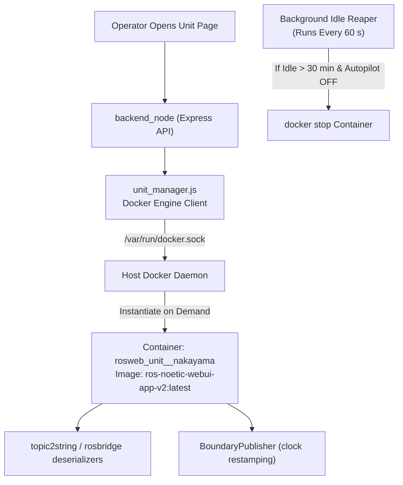
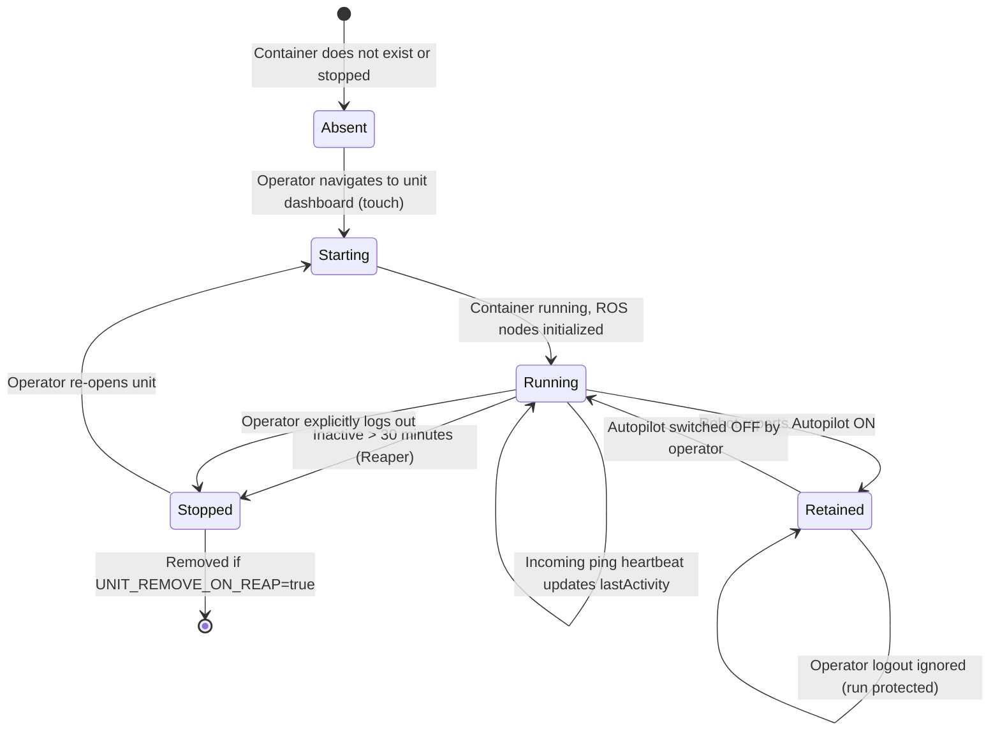

# Manajemen Siklus Hidup Kontainer Unit

<RoleBadge role="developer" />

Dokumen ini merinci manajemen siklus hidup dinamis kontainer relai per unit (`rosweb_unit_<ULID>`) di server cloud, yang dikelola secara otomatis oleh `unit_manager.js` melalui soket Docker.

## Ikhtisar Arsitektur Kontainer

Untuk menskalakan armada robot besar tanpa membuang CPU dan RAM server pada mesin yang menganggur, server memutar wadah relai ROS khusus hanya ketika operator membuka dasbor robot tersebut.

## Mesin Status Siklus Hidup Kontainer

## Aturan dan Kebijakan Siklus Hidup

### 1. Retensi Misi Autopilot
Saat robot menjalankan misi otonom dalam **Mode Autopilot**, kontainer relainya memasuki status **Ditahan**. Kontainer yang ditahan dikecualikan dari penuai menganggur selama 30 menit dan **tidak pernah dihentikan saat operator logout**. Hal ini menjamin pengoperasian otonom tetap berjalan tanpa gangguan meskipun operator menutup laptop mereka atau keluar dari jangkauan Wi-Fi.

### 2. Penuai Batas Waktu Menganggur
Penuai latar belakang menyapu setiap 60 detik (`UNIT_REAP_INTERVAL_MS: 60000`). Jika kontainer tidak memiliki ping detak jantung operator yang aktif selama 30 menit (`UNIT_IDLE_TIMEOUT_MS: 1800000`) dan tidak disimpan oleh Autopilot, manajer akan memanggil `docker.stop()`.

### 3. Kebijakan Mulai Ulang: `unless-stopped`
Kontainer per unit dijalankan dengan kebijakan mulai ulang Docker `unless-stopped`. Jika server host di-boot ulang, Docker secara otomatis menghidupkan kembali kontainer unit yang berjalan sebelumnya. Sebaliknya, ketika Reaper secara eksplisit menghentikan sebuah container, Docker akan menghormati status stop tersebut dan tidak menghidupkannya kembali.

## Parameter Konfigurasi

| Variabel Lingkungan | Nilai Bawaan | Deskripsi |
| --- | --- | --- |
| `UNIT_MANAGER_ENABLED` | `true` (server), `false` (satuan) | Mengontrol apakah orkestrasi kontainer dinamis diaktifkan. |
| `UNIT_IMAGE` | `ros-noetic-webui-app-v2:latest` | Gambar Target Docker yang dipakai untuk relai unit. |
| `UNIT_IDLE_TIMEOUT_MS` | `1800000` (30 menit) | Ambang batas ketidakaktifan sebelum kontainer yang menganggur dihentikan. |
| `UNIT_REAP_INTERVAL_MS` | `60000` (1 menit) | Periode eksekusi sapuan penuai latar belakang. |
| `UNIT_REMOVE_ON_REAP` | `false` | Jika benar, hapus wadahnya; jika salah, mempertahankan status dihentikan. |
| `UNIT_MODE` | `prod` (atau `dev`) | Menetapkan akhiran penamaan kontainer (`_nakayama` vs `_nakayama_dev`). |

## Keamanan Soket Docker

`backend_node` berkomunikasi dengan mesin Docker host melalui pengikatan `/var/run/docker.sock`. Eksekusi kontainer dibatasi untuk mengelola unit yang cocok dengan namespace `rosweb_unit_*`, mencegah manipulasi kontainer sewenang-wenang pada host.

## Dokumentasi Terkait

- [Arsitektur](/id/development/architecture): Struktur sistem tingkat tinggi dan model dua mesin.
- [Status dan Perilaku](/id/development/state-and-behavior): Status aktivitas robot dan penyerahan Autopilot.
- [Pengaturan: Referensi Docker](/id/setup/docker-reference): Lengkapi spesifikasi profil penulisan.