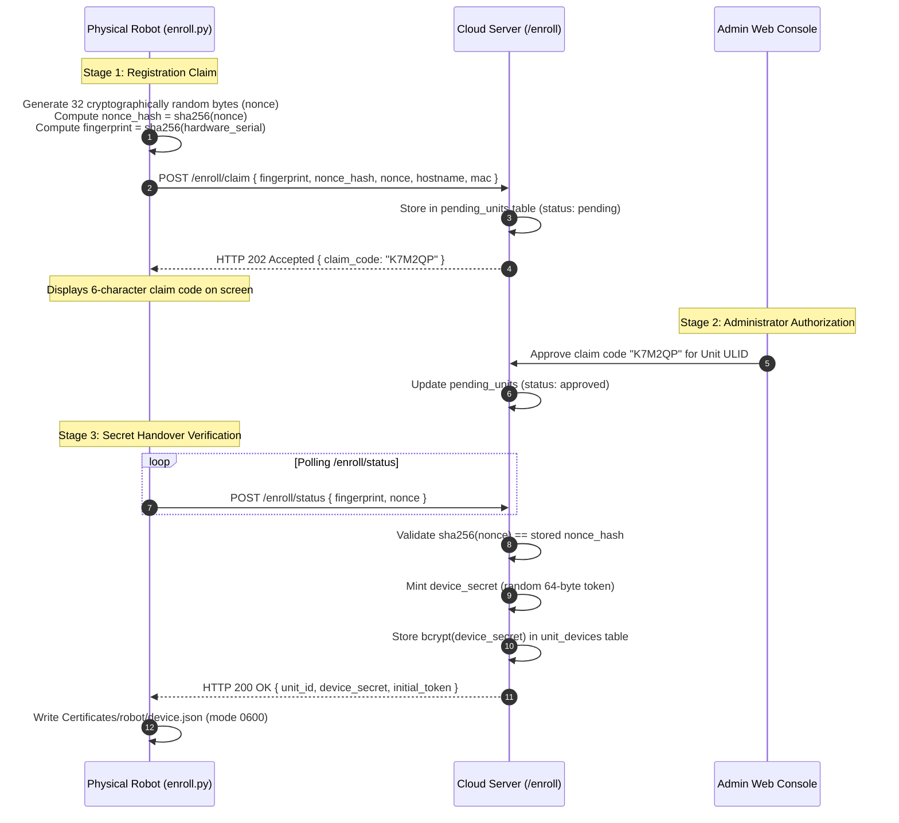

# Akun & Akses: Pendaftaran Perangkat Keras

<RoleBadge role="developer" />

Protokol kriptografi lengkap yang dipakai robot fisik untuk mendaftarkan dirinya ke server cloud dan
menerima kredensial perangkatnya sendiri, tanpa perlu ada manusia di dekat robot yang melakukan apa
pun selain membaca kode klaim di layar. Protokol ini menghasilkan kredensial Robot Cloud Domain yang
dijelaskan di [Keamanan & Token](/id/development/webui/accounts/security-and-tokens); untuk di mana
`device.json` dan cache token hasilnya berada di host robot, lihat
[Integrasi ROS](/id/development/webui/accounts/ros-integration).

## Pendaftaran perangkat keras kriptografis (protokol nonce)

Robot yang belum terdaftar mendaftarkan dirinya sendiri ke server cloud melalui jabat tangan
kriptografis tiga tahap.

### Mengapa protokol nonce 32-byte ini krusial

- **Perlindungan Terhadap Spoofing MAC / Fingerprint**: Alamat MAC dan nomor seri perangkat keras
  disiarkan di jaringan lokal dan terlihat di konsol admin. Tanpa nonce rahasia, penyerang yang
  melakukan spoofing alamat MAC bisa mengklaim kredensial saat robot fisik dalam keadaan mati.
- **Verifikasi Sekali Pakai**: Nonce plaintext dikirim melalui TLS di dalam badan POST (tidak pernah
  di query string, sehingga tidak tercatat di log akses reverse-proxy) selama proses penyerahan
  kredensial, dan sekali lagi saat pemulihan self-heal (di bawah). Server selalu memverifikasi
  `sha256(nonce)` terhadap hash yang tersimpan sebelum menerbitkan apa pun.
- **Nol Penyimpanan Rahasia Mentah**: Basis data cloud hanya menyimpan hash `bcrypt` dari
  `device_secret`. Bahkan kebocoran basis data secara menyeluruh tidak membahayakan rahasia
  perangkat robot yang aktif.

### Pemulihan self-heal: `device.json` yang hilang tanpa persetujuan baru

Robot yang kehilangan `device.json` lokalnya (disk yang dihapus, container bind-mount yang membuat
direktori kosong, bug lama) biasanya muncul kembali di kolam **pending**, dan seorang admin harus
mengadopsinya kembali ke unitnya, setiap kali. Padahal jika tidak ada apa pun pada binding yang
benar-benar berubah, itu murni menambah latensi dan sebuah antrean yang akhirnya dibiarkan begitu
saja disetujui operator.

`POST /enroll/claim` kini memotong jalur itu ketika **ketiga** syarat berikut terpenuhi:

1. Baris `pending_units` sudah berstatus `claimed` (perangkat keras ini sudah pernah menyelesaikan
   pendaftaran sebelumnya).
2. Permintaan membawa **nonce mentah**, dan `sha256(nonce)` cocok dengan `nonce_hash` yang tersimpan
   di baris tersebut. Ini adalah ambang yang sama yang harus dilewati `/enroll/status` sebelum
   penyerahan; fingerprint yang dipalsukan tidak pernah memiliki nonce-nya.
3. Sebuah baris `unit_devices` yang masih hidup masih mengikat `fingerprint` yang persis sama ini
   ke unit tempat baris tersebut disetujui (`revoked_at IS NULL`).

Server kemudian menerbitkan ulang `device_secret` di tempat dan mengembalikannya dalam respons klaim,
persis seperti jalur voucher-pendaftaran, tanpa langkah admin apa pun. Entri `unit_connection_log`
ditandai `recovery`.

Apa pun yang gagal pada pemeriksaan tersebut tetap jatuh ke kolam pending untuk ditangani manusia:
nonce yang berubah (re-image yang genuine, atau seorang penyamar), atau tidak ada binding yang hidup
(perangkat keras diadopsi ke unit lain, atau seorang admin sengaja melepas ikatannya).

### `secret_prev_hash`: satu generasi masa tenggang

`issueCredential` menyimpan `secret_hash` yang lama sebagai `secret_prev_hash` **hanya ketika**
`fingerprint` yang sama sedang mengumpulkan ulang. Robot yang menulis `device.json` baru dan
kemudian, pada percobaan ulang atau panggilan kedua yang balapan, menyajikan salinan yang dipegangnya
sesaat sebelumnya tidak terkunci karenanya. `/enroll/token` menghapus `secret_prev_hash` begitu robot
membuktikan bahwa ia memegang rahasia yang berlaku saat ini, sehingga jendela waktunya persis
"hingga penggunaan sukses pertama". Sebuah pengambilalihan (`fingerprint` berubah) tetap langsung
dipotong, tanpa masa tenggang untuk perangkat yang sedang digantikan.

## Terkait

- [Ikhtisar](/id/development/webui/accounts/overview): keempat layar Akun & Akses dan bagaimana
  hubungannya.
- [Keamanan & Token](/id/development/webui/accounts/security-and-tokens): keyring JWT, domain
  kepercayaan, dan terminasi TLS.
- [Integrasi ROS](/id/development/webui/accounts/ros-integration): bagaimana token dan lease operasi
  sampai ke robot.
- [Arsitektur](/id/development/architecture): topologi platform penuh dan domain kepercayaan.
- [State & Behavior](/id/development/state-and-behavior): mesin state di sisi robot, termasuk
  penegakan lease.
