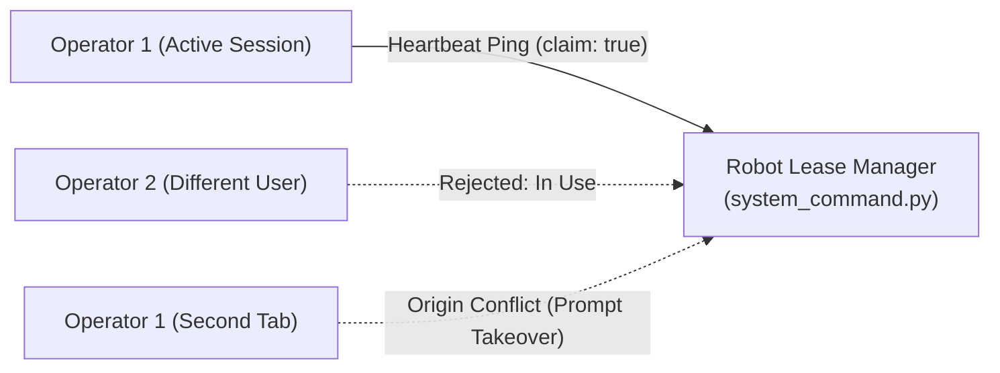

# Akun & Akses: Integrasi ROS

<RoleBadge role="developer" />

Batas antara layar Akun & Akses dan robot fisik: bagaimana token dari protokol pendaftaran benar-benar
sampai ke host robot, dan bagaimana robot itu sendiri melindungi diri dari dua operator yang mencoba
mengendalikannya secara bersamaan. Untuk layar-layar yang memulai rantai ini, lihat
[Ikhtisar](/id/development/webui/accounts/overview); untuk jabat tangan nonce lengkapnya, lihat
[Pendaftaran Perangkat Keras](/id/development/webui/accounts/enrolment); untuk mekanisme token dan
domain kepercayaan, lihat [Keamanan & Token](/id/development/webui/accounts/security-and-tokens).

## Dari pendaftaran ke host robot

Sisi robot dari protokol nonce diimplementasikan oleh `enroll.py`, yang berjalan di Jetson SBC robot:
ia membangkitkan nonce, melakukan panggilan `POST /enroll/claim` dan `POST /enroll/status` yang
dijelaskan di [Pendaftaran Perangkat Keras](/id/development/webui/accounts/enrolment), dan setelah
berhasil menulis hasilnya ke disk di host robot:

- `Certificates/robot/device.json` (mode `0600`): rahasia perangkat yang diterbitkan oleh layanan
  pendaftaran cloud.
- `Certificates/robot/token.cred`: cache token onboard, sebuah token dengan TTL 12 jam yang
  diterbitkan dari rahasia perangkat tersebut, dipakai untuk mengautentikasi ke HiveMQ dan server
  media cloud.

Kredensial ini termasuk **Robot Cloud Domain** yang dijelaskan di
[Keamanan & Token](/id/development/webui/accounts/security-and-tokens): dibatasi ketat pada ULID unit
robot ini, dan tidak pernah berlaku pada rute `/api/*` yang menghadap operator. Robot pada jaringan
lokalnya sendiri juga memegang keyring **Unit Local Domain** yang terpisah, terisolasi dari rahasia
cloud ini, sehingga operasi LAN lokal tetap berjalan bahkan ketika robot sama sekali tidak bisa
menjangkau cloud.

## Keamanan lease operasi: mencegah pengambilalihan multi-operator

Untuk mencegah perintah yang saling bertentangan dari pengguna atau tab browser yang berjalan
bersamaan, akses ke aktuasi motor diatur oleh sebuah **lease operasi eksklusif** yang dipegang di
memori pada robot fisik.

- **Kedaluwarsa Heartbeat**: Lease berlaku selama 15 detik dan harus diperbarui melalui ping berkala.
- **Pemisahan Akun vs Sesi**:
  - `in_use`: Jika akun pengguna lain memegang lease, eksekusi perintah diblokir.
  - `origin_conflict`: Jika akun pengguna yang sama membuka tab kedua atau berpindah dari jaringan
    cloud ke jaringan lokal, UI meminta pengambilalihan eksplisit alih-alih diam-diam mengganggu tab
    yang sedang aktif.

Lease itu sendiri ditegakkan sepenuhnya di robot: `system_command.py` memegangnya di memori dan
menjadi satu-satunya penentu apakah sebuah perintah dieksekusi. Peran dashboard terbatas pada
menggerakkan ini melalui UX sesi dan ping, mengirim heartbeat dan menampilkan prompt pengambilalihan;
dashboard tidak memegang atau mengarbitrase lease itu sendiri. Untuk mesin state lengkap yang dijalankan
robot seputar lease ini, lihat [State & Behavior](/id/development/state-and-behavior).

## Terkait

- [Ikhtisar](/id/development/webui/accounts/overview): keempat layar Akun & Akses dan bagaimana
  hubungannya.
- [Keamanan & Token](/id/development/webui/accounts/security-and-tokens): keyring JWT, domain
  kepercayaan, dan terminasi TLS.
- [Pendaftaran Perangkat Keras](/id/development/webui/accounts/enrolment): protokol nonce yang dipakai
  robot untuk mendaftarkan dirinya sendiri.
- [Arsitektur](/id/development/architecture): topologi platform penuh dan domain kepercayaan.
- [State & Behavior](/id/development/state-and-behavior): mesin state di sisi robot, termasuk
  penegakan lease.
