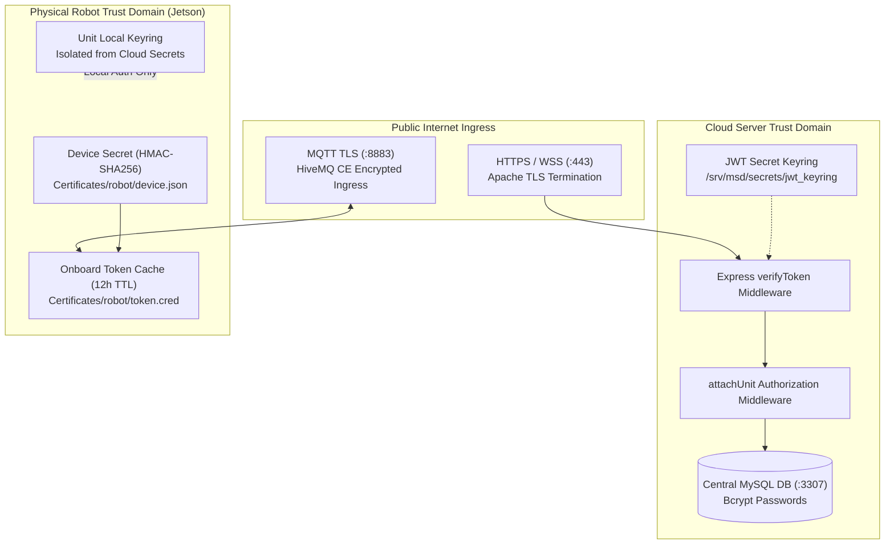

# Akun & Akses: Keamanan & Token

<RoleBadge role="developer" />

Mekanisme backend di balik [layar Akun & Akses](/id/development/webui/accounts/overview): keyring JWT
yang menandatangani dan memverifikasi token, tiga domain kepercayaan independen tempat token tersebut
berada, dan terminasi TLS yang melindunginya saat transit. Untuk bagaimana robot pertama kali
memperoleh kredensialnya sendiri, lihat
[Pendaftaran Perangkat Keras](/id/development/webui/accounts/enrolment); untuk bagaimana kredensial
tersebut sampai ke host robot, lihat [Integrasi ROS](/id/development/webui/accounts/ros-integration).

## Arsitektur domain kepercayaan

MSD700 menerapkan pertahanan berlapis (defense-in-depth) di seluruh frontend web, backend cloud,
message broker, dan single-board computer (SBC) Jetson fisik.



## Tiga domain kepercayaan independen

Batas keamanan dipisahkan menjadi tiga domain kepercayaan yang tidak dapat saling dipertukarkan:

| Domain Kepercayaan | Otoritas Penerbit | Tujuan Token | Endpoint Validasi | Aturan Isolasi |
| --- | --- | --- | --- | --- |
| **Operator Domain** | Backend Server Cloud (`backend_node`) | Mengautentikasi operator manusia yang mengakses dashboard web. | `verifyToken` di semua rute `/api/*` | Tidak bisa dipakai langsung oleh robot; ditolak pada rute `/local/*`. |
| **Robot Cloud Domain** | Layanan Pendaftaran Cloud (`/enroll/token`) | Mengautentikasi robot fisik yang terhubung ke HiveMQ dan server media cloud. | HiveMQ TLS + `media-server` cloud | Dibatasi ketat pada ULID unit yang bersangkutan; berlaku selama 12 jam. |
| **Unit Local Domain** | Backend Lokal Onboard (`backend_local`) | Mengautentikasi operator LAN lokal dan klien streaming video onboard. | Endpoint `/local/*` | Token cloud ditolak secara tegas demi menjaga kedaulatan offline lokal. |

Baris Operator Domain di atas adalah batas kepercayaan untuk login operator yang dijelaskan di
[Ikhtisar](/id/development/webui/accounts/overview): token dari domain ini berfungsi di seluruh
`/api/*` tetapi ditolak sama sekali di `/local/*`. Model ini tidak merinci baris terpisah untuk login
konsol admin sendiri; yang model ini tetapkan adalah bahwa robot itu sendiri tidak pernah menerima
token yang diterbitkan browser dalam bentuk apa pun, hanya kredensial yang diterbitkan melalui alur
pendaftaran yang dibahas di [Pendaftaran Perangkat Keras](/id/development/webui/accounts/enrolment).

## Keyring JWT dan rotasi rahasia tanpa downtime

Token autentikasi diverifikasi terhadap **JWT Keyring** yang disimpan di
`/srv/msd/secrets/jwt_keyring`, bukan satu variabel lingkungan statis tunggal.

```json
{
  "active_kid": "key_2026_08_a",
  "keys": {
    "key_2026_08_a": {
      "secret": "9a8b7c6d5e4f3a2b1c0d...",
      "created_at": "2026-08-01T00:00:00Z"
    },
    "key_2026_07_b": {
      "secret": "1f2e3d4c5b6a7f8e9d0c...",
      "created_at": "2026-07-01T00:00:00Z"
    }
  }
}
```

### Aturan rotasi keyring

1. **Kunci Penandatangan Aktif**: Semua token akses dan refresh yang baru diterbitkan ditandatangani
   dengan kunci yang diidentifikasi oleh `active_kid`.
2. **Verifikasi Jendela Masa Tenggang**: Ketika sebuah token masuk, `verifyToken` memeriksa tanda
   tangannya terhadap `active_kid`. Jika verifikasi gagal, ia menguji kunci-kunci sebelumnya di
   keyring sebelum menolak dengan HTTP 401.
3. **Nol Gangguan Sesi**: Merotasi rahasia di produksi tidak memaksa seluruh operator aktif untuk
   login ulang secara serentak.

## Keamanan jaringan dan terminasi TLS

1. **Reverse Proxy Apache**: Seluruh trafik HTTP, SSE, dan WebSocket eksternal mengakhiri TLS di
   port 443 Apache menggunakan sertifikat dari Let's Encrypt (`/etc/letsencrypt/live/`).
2. **Keamanan Transport Mutual HiveMQ**: Robot terhubung ke HiveMQ di port 8883 melalui TLS.
   Sertifikat keystore PKCS#12 berada di `/srv/msd/secrets/hivemq/keystore.p12`.
3. **Isolasi Container**: Container backend berkomunikasi melalui jaringan bridge Docker internal
   (`ros_backend_net`), tanpa mengekspos port database internal atau rosbridge langsung ke internet
   publik.

## Terkait

- [Ikhtisar](/id/development/webui/accounts/overview): keempat layar Akun & Akses dan bagaimana
  hubungannya.
- [Pendaftaran Perangkat Keras](/id/development/webui/accounts/enrolment): protokol nonce yang dipakai
  robot untuk mendaftarkan dirinya sendiri.
- [Integrasi ROS](/id/development/webui/accounts/ros-integration): bagaimana token dan lease operasi
  sampai ke robot.
- [Arsitektur](/id/development/architecture): topologi platform penuh dan domain kepercayaan.
- [State & Behavior](/id/development/state-and-behavior): mesin state di sisi robot, termasuk
  penegakan lease.
