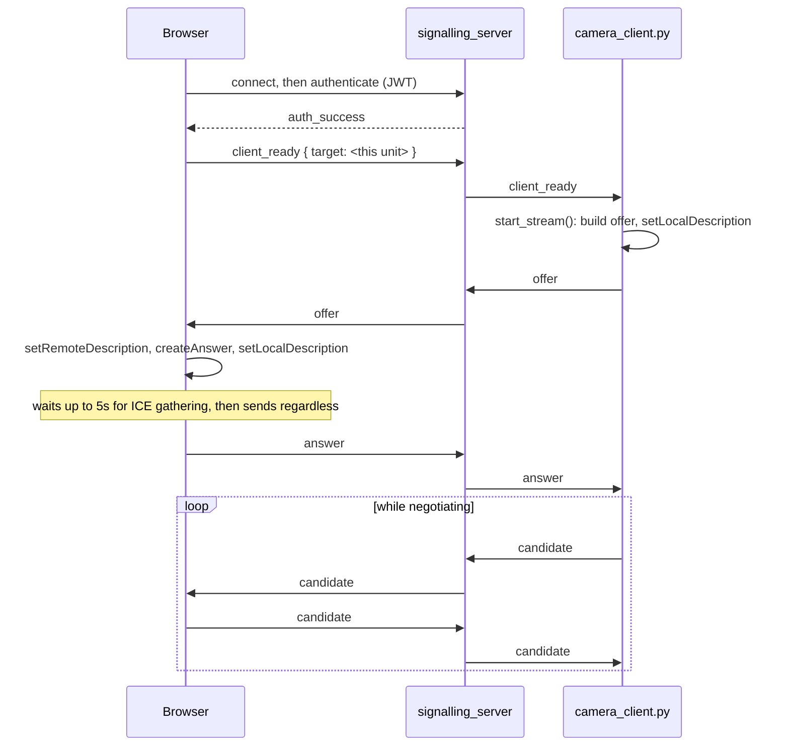

# Kamera & Tampilan Langsung

<RoleBadge role="developer" />

Widget video langsung yang ditampilkan di sidebar dashboard (`src/components/sidebar/sidebar.tsx`)
pada halaman Mapping dan Navigation: bagaimana `VideoStreamComponent` mendapatkan koneksi WebRTC ke
kamera robot, dan bagaimana browser menyadari saat koneksi tersebut diam-diam mati. Sidebar halaman
Database menampilkan thumbnail pratinjau peta statis di slot yang sama, bukan video langsung. Untuk
separuh jabat tangan ini yang di-host di robot, konfigurasi ICE `camera_client.py`, dan logika
reconnect, lihat [Integrasi ROS](/id/development/webui/camera/ros-integration).

::: info Video bersifat peer to peer; hanya negosiasi yang melewati server
`signalling_server` menukar penawaran SDP, jawaban, dan kandidat ICE antara `camera_client.py` dan
browser. Setelah koneksi terbentuk, frame video tidak pernah menyentuhnya: video mengalir langsung
antara robot dan browser, atau melalui `coturn` ketika tidak ada jalur langsung yang tersedia.
:::

## Jabat tangannya

`VideoStreamComponent` membuat `RTCPeerConnection` browser hanya setelah sebuah `offer` tiba dari
ujung pertukaran ini, bukan secara eager saat halaman dimuat. `signalling_server` sendiri adalah
relay tanpa state yang dikunci berdasarkan `target`: ia tidak pernah memeriksa isi SDP, hanya
merutekan pesan antara kedua peer yang disebutkan di dalamnya. Autentikasi hanya mensyaratkan token
valid yang terverifikasi oleh keyring dan membawa `userId` atau `username`; sebuah token robot yang
tidak memiliki `userId` ditolak di sini secara langsung, itulah sebabnya baik penerbit token cloud
maupun unit-local secara eksplisit menyertakannya (lihat
[Arsitektur § Domain kepercayaan](/id/development/architecture#trust-domain-dan-keamanan-multi-tingkat)).

## Deteksi stall di sisi browser

Selain `oniceconnectionstatechange` bawaan (yang memicu `restartIce()` bawaan browser saat statusnya
`failed`), sebuah watchdog terpisah melakukan polling `getStats()` setiap 2 detik dan memeriksa
apakah `framesDecoded` pada track video masuk masih terus bertambah. Jika nilainya tidak bergerak
selama 6 detik meskipun transport melaporkan `connected`, stream ditandai `stalled`. Inilah satu
mode kegagalan yang tidak bisa dilihat oleh mesin state ICE sendiri: proses robot mati, atau
jaringan diam-diam padam, sementara koneksi peer itu sendiri tidak pernah menyadari ada yang salah.

## URL signalling saat build

Backend signalling mana yang dihubungi oleh sebuah build dashboard tertentu ditentukan pada
**waktu build**, bukan saat runtime: `NEXT_PUBLIC_SIGNALLING_URL` dipanggang secara terpisah ke
dalam `frontend_prod` / `frontend_dev` / `frontend_local` (lihat
[Struktur Repositori § ROS-dashboard-next-ts](/id/development/repository-structure)). Build
unit-local melangkah lebih jauh lagi dengan menukar bagian *host* dari setiap URL layanan
`NEXT_PUBLIC_*`, termasuk yang ini, dengan `window.location.hostname` saat runtime, hanya
mempertahankan port dari waktu build. Image `frontend_local` yang sama ini kemudian tetap bertahan
melewati perubahan sewa DHCP atau operator yang menjangkau unit lewat hostname yang berbeda, sesuatu
yang tidak bisa dilakukan oleh URL yang murni ditentukan saat build.

## Terkait

- [Integrasi ROS](/id/development/webui/camera/ros-integration): `camera_client.py`, konfigurasi
  ICE/STUN/TURN, bug kandidat mDNS, dan logika reconnect
- [Arsitektur](/id/development/architecture): di mana `signalling_server` dan `coturn` berada dalam
  sistem yang lebih luas, dan bagaimana domain kepercayaan berlaku untuk token yang dipakai di sini
