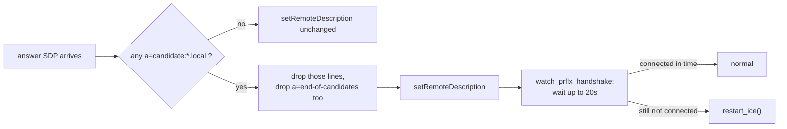

# Kamera & Tampilan Langsung: Integrasi ROS

<RoleBadge role="developer" />

Separuh sisi robot dari jabat tangan tampilan langsung yang dijelaskan di
[Ikhtisar](/id/development/webui/camera/overview): konfigurasi ICE `camera_client.py`, bug kandidat
mDNS yang merusaknya pada unit tanpa internet, dan logika reconnect yang menjaga kamera tetap hidup
melewati koneksi yang tidak stabil.

::: warning `camera_client.py` bukan node ROS
Meskipun berjalan di host robot, `camera_client.py` adalah proses Python biasa (klien WebRTC berbasis
`aiortc`) yang dijalankan di jendela tmux `camera_client` oleh `run_msd.sh`, bukan node ROS: tidak ada
registrasi topic, service, maupun node. Halaman ini diberi judul "Integrasi ROS" demi konsistensi
dengan bagian lain di seksi ini, tetapi tidak ada berkas `.launch` yang bisa dirujuk di sini.
:::

## Satu kamera, dua koneksi peer

Satu kamera fisik dibagikan oleh **dua** objek `CameraClient` independen dalam satu proses yang sama
itu (satu berpasangan dengan cloud, satu lagi berpasangan dengan dashboard apa pun yang sedang
terbuka di LAN unit itu sendiri), masing-masing dengan koneksi WebSocket dan `RTCPeerConnection`
miliknya sendiri.

| Target | WebSocket Signalling | Media / backend | STUN/TURN |
| --- | --- | --- | --- |
| Cloud production | `wss://msd.nglobal.jp/services/signalling` (Apache mem-proxy ke `:3001`) | media `:3003`, backend `:5000` | Google STUN + relay `coturn` produksi |
| Cloud dev | `ws://<server-ip>:4001` | media `:4003`, backend `:5001` | sama seperti production (satu relay, dipakai bersama) |
| Unit-local | `ws://<unit-ip>:3001` | media `:3003`, backend `:5002` | **tidak ada secara default** |

## Mengapa jalur unit-local tidak punya STUN/TURN secara default

Unit tanpa rute internet akan gagal saat `getaddrinfo` mencoba me-resolve `stun.l.google.com`, dan
`aiortc` melempar kegagalan itu langsung keluar dari `setLocalDescription`: bukan koneksi yang
terdegradasi, melainkan `start_stream()` yang mati total dan tidak ada video sama sekali, walaupun
kamera, signalling server, dan dashboard semuanya sehat. Karena browser operator dan robot berbagi
LAN yang sama dalam kasus ini, sebuah kandidat host sudah dapat dijangkau; tidak ada apa pun yang
perlu diselesaikan oleh sebuah relay.

`camera_client.py` dan `VideoStreamComponent` di dashboard sama-sama membaca konvensi yang sama untuk
daftar server ICE mereka: nilai yang tidak diset kembali ke default cloud (Google STUN plus kredensial
TURN produksi), dan string literal `none` mengosongkan daftar tersebut sama sekali alih-alih
membiarkannya tidak diset. `LOCAL_STUN_URLS` / `LOCAL_TURN_URL` / `LOCAL_TURN_USERNAME` /
`LOCAL_TURN_CREDENTIAL` di `msd700_noetic/docker/.env` secara default berisi `none` justru karena
alasan ini, dan hanya layak diset pada unit yang LAN-nya benar-benar membutuhkan relay (jaringan
tersegmentasi, jembatan Wi-Fi captive antara robot dan operator).

## Bug kandidat mDNS (2026-08-14)

Chrome versi modern tidak menaruh alamat LAN asli sebuah host di dalam kandidat ICE. Ia justru
membuat nama `<uuid>.local` acak dan mengandalkan multicast DNS untuk me-resolve-nya, sebuah fitur
privasi yang mengasumsikan sisi penerima bisa bergabung ke mDNS. Pada unit tanpa rute default, itu
tidak bisa terjadi:

```
OSError: [Errno 19] No such device
  at aioice/mdns.py, joining 224.0.0.251 with INADDR_ANY
  raised out of add_remote_candidate()
```

Detail krusialnya ada pada di mana ini dilempar: bukan per-kandidat, melainkan langsung dari
`add_remote_candidate` itu sendiri, yang membatalkan seluruh panggilan `setRemoteDescription`. Satu
kandidat yang tidak bisa di-resolve di dalam jawaban sudah cukup untuk menggagalkan seluruh negosiasi,
padahal jawaban dari browser itu sendiri juga membawa IP publik yang bisa dipakai: gejala yang persis
terbaca seperti masalah DNS, yang justru membuatnya mudah tertukar dengan kegagalan resolusi STUN yang
tidak berkaitan, yang dijelaskan di atas.

### Perbaikannya

`_strip_mdns_candidates()` menghapus baris `a=candidate:` mana pun yang alamatnya berakhiran `.local`
dari jawaban sebelum menyerahkannya ke `aiortc`, dan melakukan hal yang sama untuk kandidat yang
di-trickle di `handle_ice_candidate`. Kandidat yang paling mungkin penting untuk konektivitas sudah
hilang bagaimanapun juga, jadi ini hanya berhasil karena apa yang terjadi berikutnya:

- **`a=end-of-candidates` juga dihapus, kapan pun ada sesuatu yang lain dihapus.** Membiarkannya tetap
  ada akan memberitahu `aioice` bahwa "tidak ada kandidat lagi yang akan datang," dan sebuah agent
  dengan nol kandidat remote dan tidak ada lagi yang ditunggu akan menyatakan koneksi gagal sebelum
  pemeriksaan konektivitas browser sendiri sempat tiba.
- **Mekanisme pemulihannya adalah peer-reflexive discovery (RFC 8445 §7.2.1.3), bukan resolusi nama.**
  Robot tetap mengiklankan kandidat host-nya sendiri. Begitu pemeriksaan konektivitas STUN dari
  browser mencapai salah satunya, `aioice` mempelajari alamat asli browser dari sumber paket tersebut.
  Tidak ada nama `.local` yang perlu di-resolve sama sekali. Inilah sebabnya menghapus kandidat itu
  *membuang beban mati*, bukan menghilangkan satu-satunya jalur menuju konektivitas.
- **Sebuah batas waktu menggantikan timeout `aioice` sendiri (yang tidak ada).** Tanpa kandidat remote
  dan tanpa penanda end-of-candidates, `aioice` akan menunggu tanpa batas: perilaku yang benar jika
  peer-reflexive discovery masih akan datang, perilaku yang salah jika tab browser tertutup di
  tengah jabat tangan. `_watch_prflx_handshake()` tidur selama `MDNS_PRFLX_WAIT_S` (default 20 detik,
  cukup longgar untuk LAN di mana pemeriksaan konektivitas sebenarnya biasanya tiba dalam kurang dari
  satu detik) dan memanggil `restart_ice()` jika koneksi masih belum `connected`/`completed` pada saat
  itu.



::: warning Penghapusan berlaku untuk kedua target, tidak hanya unit-local
Kandidat mDNS sama-sama tidak berguna untuk target cloud: ia menyebut alamat yang tidak bisa
dijangkau lewat internet terlepas dari masalah DNS. Perbaikan ini berlaku tanpa syarat, bukan
digerbangi berdasarkan instance `CameraClient` mana yang sedang menangani jawaban tersebut.
:::

## Reconnect dan retry

Loop koneksi `camera_client.py` tidak pernah menyerah secara permanen. Versi sebelumnya berhenti
setelah jatah percobaan tertentu dan membiarkan kamera mati sampai seseorang me-restart `run_msd.sh`
secara manual. Delay retry menggunakan exponential backoff dengan jitter: basis 2 detik, digandakan
setiap percobaan yang gagal, dibatasi hingga maksimum 60 detik, dan diacak agar sebuah armada unit
yang berbagi satu signalling server cloud tidak melakukan retry secara serentak setelah sebuah
gangguan bersama.

Kegagalan ICE di level transport (`iceConnectionState` mencapai `failed`) memicu `restart_ice()`
secara langsung: koneksi peer lama dibongkar, koneksi baru dibangun dengan konfigurasi ICE yang sama,
track dan data channel dipasang ulang, dan penawaran baru dikirim dengan flag `isRestart`. Ini
terpisah dari me-restart kamera fisik itu sendiri, yang dibatasi lajunya menjadi sekali per 15 detik
dan saling eksklusif dengan reboot yang sedang berlangsung, karena keduanya sama-sama menyalakan
ulang `/dev/videoN` yang sama yang dipakai bersama oleh kedua instance `CameraClient`.

## Men-deploy perubahan di sini

`camera_client.py` selalu di-bind-mount, baik di jalur cloud-only maupun jalur `local_dev`. Sebuah
edit di host langsung berlaku pada kali berikutnya `run_msd.sh` (me-re)start jendela tmux-nya, tanpa
melibatkan build image. `signalling_server`, sebaliknya, adalah salah satu layanan yang
**`COPY`**-kan oleh `Dockerfile.webui-local` ke dalam image local-stack milik unit itu sendiri;
perubahan di sana membutuhkan rebuild yang sama, yang sudah diperiksa staleness-nya oleh
`docker-manager.sh` pada image dashboard dan backend (lihat
[Referensi Docker § Yang dilakukan `up`, secara berurutan](/id/setup/docker-reference#apa-yang-dilakukan-up-secara-berurutan)).
Melupakan hal ini terlihat persis seperti kegagalan staleness yang didokumentasikan di sana: stack
naik dengan bersih dan tetap menyajikan logika signalling dari sebelum perubahan itu dibuat.

## Terkait

- [Ikhtisar](/id/development/webui/camera/overview): sisi browser dari jabat tangan yang sama,
  `VideoStreamComponent`, dan deteksi stall di sisi browser
- [Arsitektur](/id/development/architecture): di mana `signalling_server` dan `coturn` berada dalam
  sistem yang lebih luas, dan domain kepercayaan untuk token yang dipakai di sini
- [Server Setup § Relay TURN](/id/setup/server-setup#_6-the-turn-relay-production-only): konfigurasi
  relay TURN produksi itu sendiri
- [Referensi Docker § Unit: run_msd.sh](/id/setup/docker-reference#unit-run-msd-sh): di mana jendela
  tmux `camera_client` dimulai
