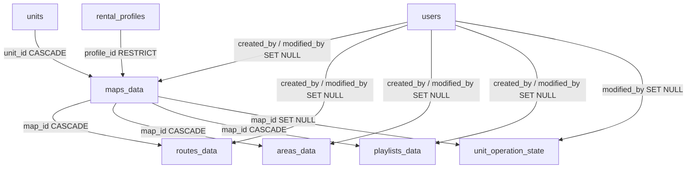

# Integrasi ROS

<RoleBadge role="developer" />

Meski namanya demikian, dipertahankan demi konsistensi dengan grup fitur ROS Web UI lainnya, fitur
Basis Data tidak punya komponen sisi-ROS sendiri: robot menghasilkan peta lewat fitur Mapping,
tetapi menelusuri, mengganti nama, dan menghapus peta yang tercatat adalah urusan MySQL-dan-REST
semata. Dokumen ini mencakup skema dan kontrak jalur data di balik halaman Basis Data. Untuk
perilaku halaman itu sendiri, lihat [Ikhtisar](/id/development/webui/database/overview) dan
[Ganti Nama & Hapus](/id/development/webui/database/rename-and-delete).

## Tabel

Skema lengkap ada di [Skema Basis Data](/id/development/database-schema); ini adalah subset yang
merupakan sebuah peta, atau sesuatu yang menyertai peta.

| Tabel | Tujuan | Kolom kunci |
| --- | --- | --- |
| `maps_data` | Sebuah peta tercatat | `unit_id` → `units` (`ON DELETE CASCADE`, robot mana yang merekamnya), `profile_id` → `rental_profiles` (`ON DELETE RESTRICT`, penyewaan mana yang memilikinya), `UNIQUE(map_name, unit_id, profile_id)` |
| `routes_data` | Rute multi-pinpoint tersimpan | `map_id` → `maps_data` (`ON DELETE CASCADE`), `route_points` (JSON), `UNIQUE(route_name, map_id)` |
| `areas_data` | Area cakupan tersimpan | `map_id` → `maps_data` (`ON DELETE CASCADE`), `area_type` (`cover`/`no_cover`), `polygon_points` (JSON), `UNIQUE(area_name, map_id)` |
| `playlists_data` | Daftar area tersusun untuk disapu berurutan | `map_id` → `maps_data` (`ON DELETE CASCADE`), `items` (JSON, snapshot geometri tiap area alih-alih referensi), `UNIQUE(playlist_name, map_id)` |

`unit_operation_state` juga membawa foreign key `map_id`, `ON DELETE SET NULL` alih-alih
`CASCADE`: menghapus peta yang sedang dimuat unit menghapus pointer itu alih-alih diblokir. Lihat
[Skema Basis Data § Data operasional (per peta)](/id/development/database-schema#data-operasional-per-peta)
untuk baris asal ini.

`users`, `units`, dan `rental_profiles` tidak diulang di sini karena merupakan tabel
identitas/akses yang dibahas pada halamannya sendiri: lihat
[Skema Basis Data § Identitas dan akses](/id/development/database-schema#identitas-dan-akses).

`maps_data.unique_map_unit (map_name, unit_id, profile_id)` adalah alasan mengapa dua robot pada
satu penyewaan bisa masing-masing memegang peta dengan nama sama tanpa tabrakan, dan mengapa halaman
Basis Data harus dicakup berdasarkan `unit_id` dan dedupe berdasarkan `id` alih-alih berdasarkan
nama (lihat [Ikhtisar § Daftar peta](/id/development/webui/database/overview#daftar-peta)).

Keempat tabel di atas mengikuti konvensi bersama `created_at` / `modified_at`, dan kolom
`created_by` / `modified_by` mereka mencatat ULID pengguna hanya untuk atribusi, tidak pernah untuk
kontrol akses; akses ke sebuah peta berjalan sepenuhnya lewat profil penyewaan yang memilikinya.
Lihat [Skema Basis Data § created_at / modified_at](/id/development/database-schema#created-at-modified-at)
untuk konvensinya dan [Skema Basis Data](/id/development/database-schema) untuk catatan
atribusinya.

## Foreign key

Subset dari [Skema Basis Data § Foreign key, lengkap](/id/development/database-schema#foreign-key-secara-lengkap)
yang relevan dengan fitur ini:

Inilah yang mendasari [Ganti Nama & Hapus § Cascade delete](/id/development/webui/database/rename-and-delete#cascade-delete):
menghapus baris `maps_data` mem-cascade ke rute, area, dan playlist-nya, dan menghapus alih-alih
memblokir status operasi mana pun yang menunjuk ke situ.

## Endpoint REST

Dari [Referensi API § Manajemen Data Peta dan Rute](/id/development/api-reference#manajemen-data-peta-dan-rute):

### Daftar Peta

`GET /api/maps_data?unit_id=<unit ULID>`

`unit_id` bersifat opsional di jalur data tetapi wajib dalam praktiknya untuk halaman Basis Data:
tanpanya respons berisi semua peta dalam cakupan penyewaan pemanggil (yang diinginkan tampilan
arsip dan admin), dengan itu daftarnya menyempit ke peta yang direkam satu robot (yang dibutuhkan
halaman ini, karena satu penyewaan bisa memiliki beberapa robot dan peta robot sesama unit tak bisa
dinavigasikan pada robot ini). Meneruskan sebuah unit yang pemanggilnya tidak punya penyewaan aktif
di situ menghasilkan `403`, bukan daftar kosong.

`GET /api/maps/:mapId` mengambil parameter `unit_id` yang sama dan menerapkan cakupan yang sama.

::: warning Nama peta hanya unik per (unit, penyewaan)
Jangan dedupe respons berdasarkan `map_name`. Dua robot pada satu penyewaan bisa masing-masing
memiliki peta dengan nama sama namun nilai `id` berbeda; membuang yang "duplikat" membuang peta
yang sungguhan. Dedupe berdasarkan `id`, dan selalu cakup berdasarkan `unit_id`.
:::

### Ganti nama dan hapus: belum terdokumentasi di sini

Bagian Manajemen Data Peta dan Rute pada Referensi API saat ini tidak mendokumentasikan endpoint
ganti nama atau hapus untuk `maps_data`. Perilaku ganti nama dan hapus halaman Basis Data
(dijelaskan di [Ganti Nama & Hapus](/id/development/webui/database/rename-and-delete)) dikonfirmasi
terhadap frontend (`updateMapName` di `services.ts`, dan panggilan hapus yang dijaga
`ConfirmDelete`), tetapi metode HTTP dan path yang persis tidak tercakup dalam materi sumber saat
ini dan tidak ditebak-tebak di sini.

### Di luar cakupan: Simpan Rute Waypoint Kustom

Bagian Referensi API yang sama juga mendokumentasikan `POST /api/routes` untuk menyimpan rute
waypoint. Endpoint itu milik fitur Navigasi, bukan Basis Data: rute tidak didaftar atau dikelola
dari halaman ini (lihat [Ikhtisar § Cakupan](/id/development/webui/database/overview#cakupan)), jadi
tidak diulang di sini.

## Terkait

- [Ikhtisar](/id/development/webui/database/overview): daftar peta, pencarian/urutan/paginasi, dan keadaan yang dibangun di atas data ini
- [Ganti Nama & Hapus](/id/development/webui/database/rename-and-delete): aksi pengubah yang dibangun di atas skema dan permukaan API ini
- [Arsitektur](/id/development/architecture)
- [Skema Basis Data](/id/development/database-schema): referensi skema lengkap untuk `ROS_DB`
