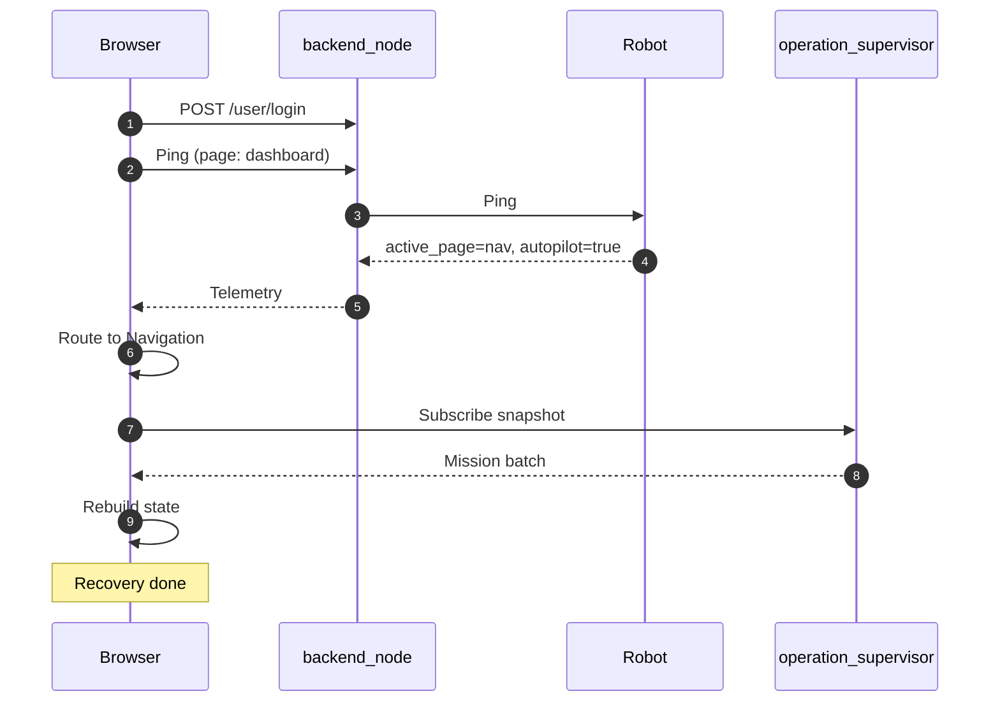

# Navigasi: Manual & Autopilot

<RoleBadge role="developer" />

Komponen sidebar `ManualAutopilotPanel` dari sudut pandang halaman Navigasi, pemetaan Robot
Activity State Machine dari kunci aktivitas ke tab dashboard, dan mekanisme rekayasa
frontend di balik rekoneksi dan pemulihan sesi di halaman ini. Untuk pola Mode List/Action Bar dan
pipeline canvas tempat panel ini berdampingan, lihat
[Ikhtisar](/id/development/webui/navigation/overview). Untuk mode point-and-go yang berinteraksi
dengannya, lihat [Pinpoint & Rute](/id/development/webui/navigation/pinpoint-and-routes).

## Manual Override dan Autopilot di halaman Navigasi

`ManualAutopilotPanel` berada di sidebar dan merupakan komponen yang sama yang dirender di halaman
Mapping, tetapi kedua toggle ini membawa bobot praktis yang berbeda di sini:

- **Manual Override** menghentikan operasi otonom yang sedang berjalan di halaman ini (pinpoint
  yang dikirim, rute multi-titik, atau sapuan cakupan) dan menyerahkan `twist_mux` ke keyboard,
  sehingga input WASD mengemudikan robot secara langsung.
- **Autopilot** menjaga jalannya run yang telah dikirim tetap hidup tanpa perlu tab browser tetap
  terbuka, karena `operation_supervisor` di sisi unit mengambil alih pengiriman run itu sendiri.

Panel yang sama juga muncul di sidebar halaman Mapping, di mana kedua toggle mengatur sesi SLAM
yang aktif alih-alih run navigasi; tulisan tersendiri untuk halaman itu membahas apa arti Manual
Override dan Autopilot di sana.

## Mesin state aktivitas: perutean ke tab dashboard

String aktivitas robot, yang dilacak oleh `RobotStateTracker` dan dilaporkan pada setiap ping
heartbeat, adalah yang menentukan tab dashboard mana yang dituju operator, termasuk saat
rekoneksi (lihat [Rekoneksi dan Pemulihan Sesi](#session-reconnection-and-recovery) di bawah).
Kedua toggle di halaman ini masing-masing mendorong robot ke aktivitas tertentu:

- Mengaktifkan **Manual Override** mendorong aktivitas robot menjadi `manual`, yang mengarahkan
  ke tab **Idle**, bukan Navigasi, terlepas dari apakah Manual Override diaktifkan dari panel
  halaman ini atau dari panel Mapping.
- Mengaktifkan **Autopilot** selama run yang telah dikirim mendorong aktivitas robot menjadi
  `supervisor_navigating`, yang mengarahkan ke tab **Navigasi**.

Tabel aktivitas lengkap:

| Kunci Aktivitas | Tab UI Target | Deskripsi |
| --- | --- | --- |
| `idle` | Idle | Sistem terinisialisasi; motor controller aktif namun tidak ada goal aktif. |
| `manual` | Idle | Teleop manual aktif lewat kontrol keyboard WASD. |
| `mapping_active` | Mapping | Pemetaan SLAM aktif dengan eksplorasi frontier `explore_lite`. |
| `mapping_paused` | Mapping | Eksplorasi SLAM dijeda sementara oleh operator. |
| `mapping_stop_failed` | Mapping | Penyimpanan peta gagal; state SLAM tetap aktif agar operator bisa mencoba lagi. |
| `navigation_ready` | Navigation | Peta dimuat, `move_base` operasional, menunggu pengiriman goal. |
| `navigation_point_published` | Navigation | Robot sedang aktif melaju menuju goal navigasi. |
| `boustrophedon_initializing` | Navigation | Membuat jalur sapu cakupan (dikecualikan dari timeout idle/stuck). |
| `boustrophedon_ready` | Navigation | Menjalankan jalur sapu cakupan boustrophedon. |
| `supervisor_navigating` | Navigation | Pengiriman waypoint otonom yang dikelola oleh `operation_supervisor`. |
| `arrived` | Navigation | Berhasil mencapai waypoint tujuan atau menyelesaikan area cakupan. |
| `coverage_failed` | Navigation | Perencanaan cakupan atau eksekusi jalur dibatalkan. |
| `auto_aligning` | Navigation | Menjalankan kalibrasi orientasi particle filter Auto Align. |
| `paused` | Navigation | Misi dijeda oleh perintah eksplisit operator. |
| `paused_due_to_ping_loss` | (Internal) | Safety watchdog menjeda gerakan robot akibat ping heartbeat yang terputus. |
| `emergency_stopped` | Idle | Emergency stop perangkat keras aktif (kecepatan nol dikunci pada prioritas 255). |
| `emergency_cleared` | Idle | Emergency stop dilepaskan; motor siap untuk diinisialisasi ulang. |

Diagram transisi state lengkap dan perilaku safety watchdog di balik `paused_due_to_ping_loss`
dibahas di [State & Perilaku](/id/development/state-and-behavior); tabel ini direproduksi di sini
karena inilah persis yang menentukan, pada login baru atau rekoneksi, apakah operator diarahkan
kembali ke Navigasi sama sekali.

## Rekoneksi dan Pemulihan Sesi

Bagian ini secara alami berat pada rekayasa frontend: membahas mekanisme state React dan canvas
yang dijalankan `mapComponent.tsx` saat operator membuka kembali tab browser yang tertutup atau
login dari workstation baru, bukan sekadar perilaku tingkat tinggi.

### Prinsip pemulihan

1. **Perutean berdasarkan `active_page`**: frontend mengarahkan operator langsung ke tab
   operasional yang aktif (Navigasi atau Mapping) berdasarkan telemetri robot secara langsung,
   menggunakan tabel aktivitas di atas.
2. **Rekonstruksi snapshot ter-latch**: seluruh state misi (waypoint aktif, indeks saat ini, arah
   perjalanan, dan polygon cakupan) dipulihkan dari topic ROS `/string/operation_snapshot` yang
   ter-latch.
3. **Validasi ghost state**: jika cache browser menunjukkan sebuah misi sedang berjalan namun
   robot melaporkan `idle` pada 8 sampel telemetri berturut-turut, frontend secara otomatis
   mereset ke `idle` untuk mencegah tampilan eksekusi hantu (phantom).

### Apa yang memicu rekonstruksi snapshot

Rekonstruksi ini tidak terbatas pada tab yang benar-benar baru. Ia berjalan setiap kali tab tidak
memiliki sesi lokal yang layak dipertahankan, yaitu salah satu dari:

- router login mengeset `nav_recovery_pending` (mengarahkan operator ke sini untuk melanjutkan),
  atau
- halaman secara otomatis menyelesaikan peta operasi untuk tab yang tidak memiliki apa pun di
  cache, atau
- `navStatus` tidak ada **atau bernilai `Idle`** dan tidak ada mode yang dipilih.

Kondisi ketiga berbunyi "atau Idle" bukan tanpa alasan. Membuka kembali peta dari halaman Database
sengaja membuang seluruh state navigasi tab (`flushNavigationRecoveryState`), dan halaman Navigasi
kemudian menyemai `navStatus` dari state awal `Idle` miliknya sendiri sesaat kemudian. Meskipun
kondisinya mensyaratkan kunci tersebut **tidak ada**, satu-satunya titik masuk yang secara sengaja
membuang state lokalnya justru satu-satunya yang tidak bisa merekonstruksinya: operator yang
meninggalkan peta dan kembali di tengah run mendapati overlay area cakupan sudah hilang, tanpa
pin, dan tidak ada cara mendapatkannya kembali selain login baru. Baik halaman maupun komponen
peta kini tidak lagi menulis status atau mode yang dipersist saat mount; hanya jalur pemulihan
yang menyemai kunci-kunci tersebut.

Snapshot yang menyebutkan peta **berbeda** dari peta yang sedang dibuka tab diabaikan alih-alih
diterapkan. Rekonstruksi ini memilih ulang peta tempat run tersebut berasal, yang benar untuk tab
yang datang tanpa peta dan salah untuk operator yang baru saja memilih satu peta secara manual.

Karena nilai ter-latch tidak bisa diandalkan untuk sampai ke subscriber MQTT yang benar-benar
baru, dashboard juga meminta supervisor untuk mempublikasikan ulang, pada detik ke-0, 0.9, 3.4,
dan 9.4. Jumlahnya sengaja dijaga sedikit karena robot yang idle tidak akan menjawab satu pun,
tetapi **jangkauan** lebih penting daripada jumlahnya: ini adalah perjalanan pulang-pergi browser
ke rosbridge ke MQTT ke unit, dan jadwal yang menyerah setelah beberapa detik akan meninggalkan
run yang sedang berjalan justru pada titik-titik lemah yang menjadi alasan kerja bandwidth
lainnya ada. Subscription bertahan lebih lama daripada jadwalnya, sehingga snapshot yang datang
belakangan tetap diterapkan.

### Apa yang digambar lebih dulu oleh rekonstruksi

Urutan sama pentingnya dengan isi. Rekonstruksi dulu menggambar overlay cakupan hanya setelah
mengambil daftar peta dan menunggu (hingga 8 detik) grid live untuk menskalakan stage, sehingga
operator yang login kembali ke sapuan yang sedang berjalan melihat peta kosong selama beberapa
detik sebelum area-area muncul. Overlay itu sebenarnya tidak membutuhkan keduanya: ia digambar
dalam satuan meter langsung ke scene, dan snapshot sudah membawa rencananya. Kini overlay itu
digambar lebih dulu, dan penantian penskalaan stage sepenuhnya dilewati untuk run cakupan, yang
tidak memiliki pin untuk diskalakan. Pemulihan pin tetap menunggu penskalaan itu, karena marker
yang ditambahkan ke stage yang belum diskalakan akan dirender pada skala 0.01 yang tak kasat
mata.

Aturan yang sama berlaku saat sebuah run **dimulai**: area-area digambar saat rencana dikirim,
bukan saat robot mengakuinya. `POST /api/boustrophedon/init` baru merespons setelah `switch_mode`
berhasil menyalakan stack cakupan di robot, yang berarti operator menatap peta tanpa apa pun
selama beberapa detik. Run yang ditolak akan menghapus overlay lagi, dan satu area custom tunggal
yang ditolak akan menggambar ulang polygon drawer cyan sehingga operator tetap memiliki area
untuk dicoba ulang.

## Terkait

- [Ikhtisar](/id/development/webui/navigation/overview): pola Mode List/Action Bar dan pipeline
  canvas tempat panel ini dan logika pemulihan berdampingan.
- [Pinpoint & Rute](/id/development/webui/navigation/pinpoint-and-routes): mode point-and-go yang
  pin dan rutenya adalah yang dipulihkan oleh alur pemulihan di atas.
- [Sinkronisasi & Penyelarasan Peta](/id/development/webui/navigation/map-sync-and-alignment)
- [Pembersihan Cakupan](/id/development/webui/navigation/coverage-cleaning)
- [Integrasi ROS](/id/development/webui/navigation/ros-integration)
- [Arsitektur](/id/development/architecture)
- [State & Perilaku](/id/development/state-and-behavior): diagram transisi state aktivitas
  lengkap dan perilaku safety watchdog di balik `paused_due_to_ping_loss`.
