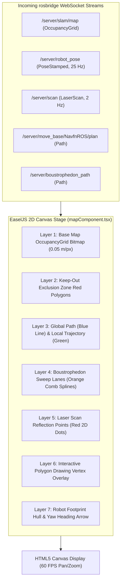

# Navigasi

<RoleBadge role="developer" />

Fitur Navigasi adalah layar `unit/navigation`. `pages/unit/navigation/index.tsx` hanyalah lapisan
layout tipis; hampir seluruh fungsionalitas sesungguhnya berada di
`src/components/navigationMap/mapComponent.tsx` (`MapComponent`) dan sub-komponen yang direndernya,
yang dijangkau lewat dropdown "Mode List" (`ModeListPanel.tsx`) dan action bar persisten
(`actionBar.tsx`). Halaman ini membahas mekanisme yang dibagikan di seluruh mode pada layar ini:
pola pergantian mode itu sendiri, pipeline rendering canvas dan matematika koordinat yang menjadi
dasar tiap mode, serta bagian-bagian UI pendukung kecil yang muncul terlepas dari mode mana yang
sedang aktif.

Setiap mode memiliki halamannya masing-masing:

| Mode / fitur | Dibahas di |
| --- | --- |
| Single Pinpoint, Multiple Pinpoint, Save/Load Route, Round Trip/Loop Route, Set Home Base, Delete All Pinpoints | [Pinpoint & Rute](/id/development/webui/navigation/pinpoint-and-routes) |
| Teleop manual (WASD), toggle Autopilot, perutean tab dashboard berdasarkan aktivitas robot, rekoneksi/pemulihan sesi | [Manual & Autopilot](/id/development/webui/navigation/manual-and-autopilot) |
| Map Sync / Auto Align | [Sinkronisasi & Penyelarasan Peta](/id/development/webui/navigation/map-sync-and-alignment) |
| Coverage Area (pembersihan boustrophedon) | [Pembersihan Cakupan](/id/development/webui/navigation/coverage-cleaning) |
| Kontrak jalur (wire contract) sisi ROS di balik semua hal di atas | [Integrasi ROS](/id/development/webui/navigation/ros-integration) |

## Satu halaman, banyak mode

Ini layak dinyatakan secara eksplisit karena mudah diasumsikan sebaliknya: Navigasi adalah **satu
rute** yang me-render **satu pohon komponen berumur panjang**, bukan sekumpulan halaman terpisah.
Memilih Single Pinpoint, Multiple Pinpoint, Set Home Base, Delete All Pinpoints, Map Sync/Auto
Align, atau Coverage Area di `ModeListPanel.tsx` adalah pemilihan mode di dalam state milik
`MapComponent` sendiri, bukan perubahan rute Next.js atau mount ulang canvas peta. Action bar
(`actionBar.tsx`) berada berdampingan dengan mode list dan menampilkan aksi yang tersedia lintas
mode, bukan per mode: Play/Pause navigasi, Stop, Return to Home Base, dan Focus View (kamera
mengikuti robot di canvas).

Karena canvas itu sendiri tidak pernah di-remount saat operator berpindah mode, pipeline rendering,
helper konversi koordinat, dan UI pendukung yang dijelaskan di bawah ini adalah infrastruktur
bersama di bawah setiap mode, bukan sesuatu yang diimplementasikan ulang oleh masing-masing mode.

## Pipeline rendering canvas

`MapComponent` menyusun tampilannya sebagai tumpukan layer EaselJS di atas satu stage HTML5
Canvas, yang dipasok oleh topic WebSocket rosbridge:



Layer 6, overlay vertex interaktif, adalah tempat Single Pinpoint, Multiple Pinpoint, dan Set Home
Base menggambar saat operator mengklik canvas; lihat
[Pinpoint & Rute](/id/development/webui/navigation/pinpoint-and-routes) untuk cara overlay itu
dikendalikan. Layer 2 dan 4 (polygon keep-out dan jalur sapu boustrophedon) adalah milik mode yang
dibahas di halaman-halaman sejenis lainnya.

## Transformasi koordinat: ruang metrik ke piksel layar

Frame koordinat ROS bersifat metrik (meter, dengan $(0, 0)$ di titik asal peta), sementara HTML5
Canvas menggunakan koordinat piksel dengan titik asal di kiri-atas $(p_x, p_y)$. Setiap klik pada
canvas dan setiap pose robot yang digambar ke atasnya melintasi batas ini.

Dengan resolusi peta $r$ (meter per piksel), tinggi citra $H$ (piksel), dan titik asal peta
$\mathbf{o} = [x_0, y_0]^T$:

**Metrik ke piksel canvas** (dipakai untuk menggambar robot, jalur, dan state ter-latch apa pun ke
peta):

$$p_x = \frac{x - x_0}{r}$$

$$p_y = H - \frac{y - y_0}{r}$$

*(Sumbu $y$ dibalik karena $Y$ ROS bertambah ke atas sementara $Y$ Canvas bertambah ke bawah.)*

**Piksel canvas ke metrik** (dipakai untuk mengonversi klik operator menjadi goal yang dikirim):

$$x = x_0 + (p_x \cdot r)$$

$$y = y_0 + ((H - p_y) \cdot r)$$

## Patch `createjs.Stage.prototype`

Kode di `rosScriptLoader.ts` yang mem-patch `createjs.Stage.prototype` sebelum canvas apa pun
dibuat terlihat janggal jika dilihat tanpa konteks, jadi ada baiknya dijelaskan alasannya. Dalam
SPA React seperti dashboard ini, komponen di-mount dan di-unmount dengan cepat selama transisi
halaman dan mode. `ROS2D.js` standar mengikat fungsi konversi koordinatnya (`globalToRos`,
`rosToGlobal`) ke satu *instance* stage pada saat pembuatannya. Ikatan tersebut bisa hilang saat
React me-render ulang, yang jika tidak ditangani akan muncul sebagai `TypeError` fatal
`this.stage.globalToRos is not a function` begitu operator mencoba mengklik canvas.

Untuk menjamin canvas tidak pernah crash dengan cara ini, `rosScriptLoader.ts` mem-patch fungsi
konversi tersebut langsung ke `createjs.Stage.prototype` itu sendiri, sebelum instantiasi, alih-alih
mengandalkan ikatan per-instance yang bertahan di setiap remount:

```typescript
// scripts/rosScriptLoader.ts
export function patchEaselJSStage(): void {
  if (typeof window === "undefined" || !(window as any).createjs) return;

  const StageProto = (window as any).createjs.Stage.prototype;

  if (!StageProto.globalToRos) {
    StageProto.globalToRos = function (x: number, y: number) {
      const rosX = (x - this.x) / (this.scaleX * this.ros2dViewer.scaleToDimensions);
      const rosY = -(y - this.y) / (this.scaleY * this.ros2dViewer.scaleToDimensions);
      return { x: rosX, y: rosY };
    };
  }

  if (!StageProto.rosToGlobal) {
    StageProto.rosToGlobal = function (rosX: number, rosY: number) {
      const x = rosX * this.scaleX * this.ros2dViewer.scaleToDimensions + this.x;
      const y = -rosY * this.scaleY * this.ros2dViewer.scaleToDimensions + this.y;
      return { x, y };
    };
  }
}
```

Penanganan klik setiap mode di halaman ini (penempatan pinpoint, penempatan home base, penggambaran
polygon) pada akhirnya memanggil `stage.globalToRos`, sehingga patch ini menjadi prasyarat untuk
semuanya, bukan detail khusus milik satu mode saja.

## UI pendukung

Ada beberapa komponen yang muncul lintas mode alih-alih menjadi milik satu mode saja:

- **`RobotStuckNotification`**: peringatan di layar yang muncul ketika robot tampak tidak mampu
  membuat kemajuan menuju goal-nya saat ini.
- **`HoverTooltip`**: tooltip kontekstual yang ditampilkan saat operator mengarahkan kursor ke
  elemen di canvas.
- **`TopToast`**: menampilkan error dari operasi save/load (misalnya save atau load rute yang
  gagal) sebagai toast sementara alih-alih dialog yang memblokir.
- **`PreviewMap`**: rendering thumbnail dari peta, berbeda dari canvas interaktif penuh.

## Terkait

- [Pinpoint & Rute](/id/development/webui/navigation/pinpoint-and-routes): Single/Multiple
  Pinpoint, Save/Load Route, Round Trip/Loop Route, Set Home Base, Delete All Pinpoints.
- [Manual & Autopilot](/id/development/webui/navigation/manual-and-autopilot): `ManualAutopilotPanel`
  yang dibagikan, perutean aktivitas-ke-tab, dan rekoneksi/pemulihan sesi.
- [Sinkronisasi & Penyelarasan Peta](/id/development/webui/navigation/map-sync-and-alignment)
- [Pembersihan Cakupan](/id/development/webui/navigation/coverage-cleaning)
- [Integrasi ROS](/id/development/webui/navigation/ros-integration)
- [Arsitektur](/id/development/architecture)
- [State & Perilaku](/id/development/state-and-behavior)
