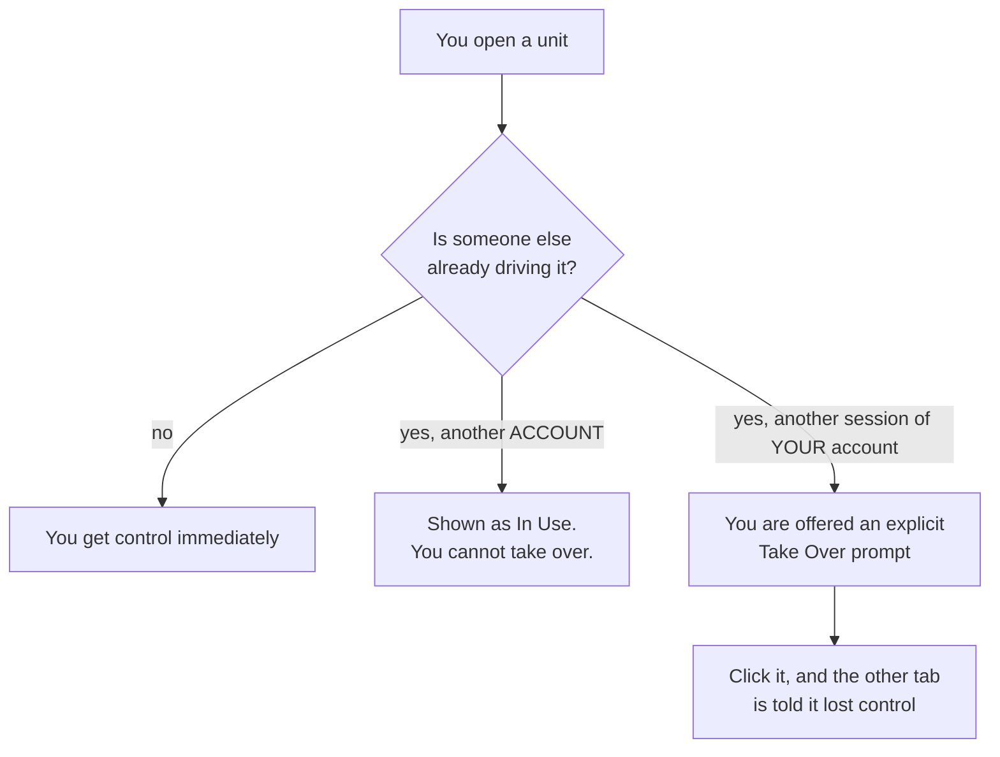
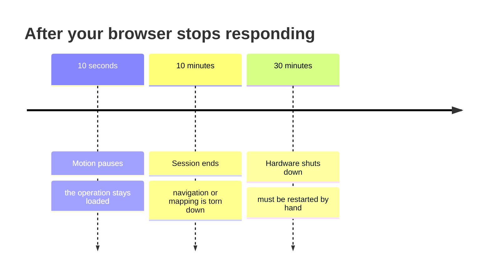
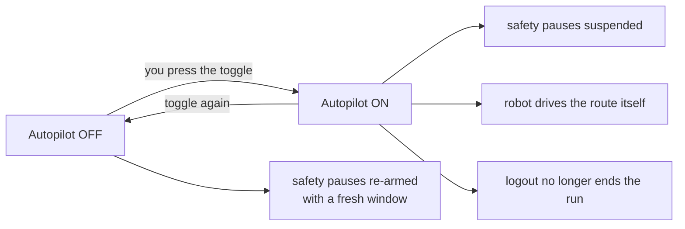
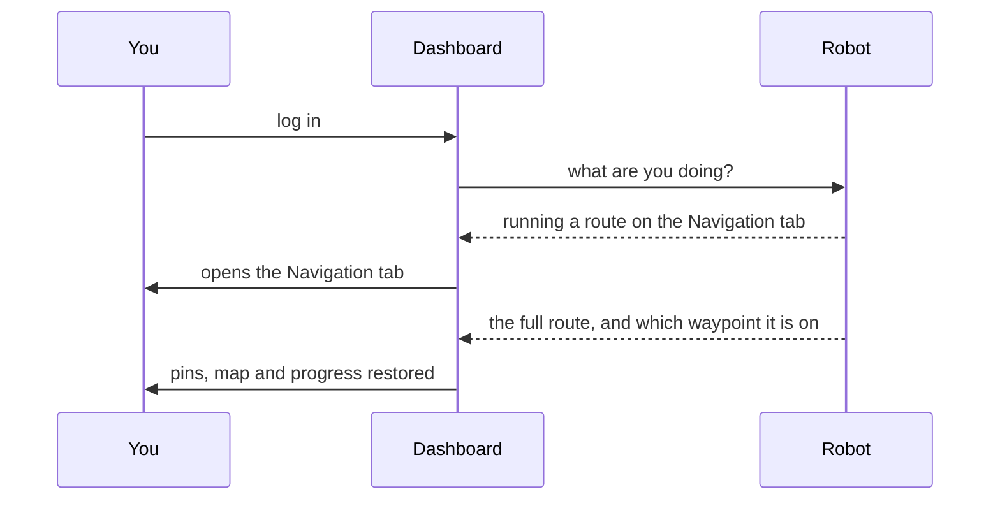

# Bagaimana Robot Berperilaku

<RoleBadge role="user" />

MSD700 melakukan beberapa hal sendiri, tanpa diminta: ia berhenti ketika Anda menghilang, ia menolak
untuk membiarkan dua orang mengemudi sekaligus, dan ia mengingat apa yang dilakukannya saat Anda kembali. Tidak satupun dari itu
bersifat sewenang-wenang, dan mengetahui aturannya membuat perbedaan antara "robot melakukan sesuatu yang aneh"
dan "tentu saja hal itu terjadi."

Halaman ini adalah versi bahasa sederhana. Detail tekniknya sudah masuk
[Keadaan dan Perilaku](/id/development/state-and-behavior).

## Apa yang sedang dilakukan robot saat ini

Dasbor selalu menampilkan satu status untuk robot. Inilah yang sebenarnya akan Anda lihat.

| Status | Berarti | Normal? |
| --- | --- | --- |
| **Menganggur** | Tidak ada yang berjalan. Siap untuk perintah. | Ya |
| **Pedoman** | Anda mengemudi dengan W-A-S-D. | Ya |
| **Sedang Berlangsung** | Mengemudi ke suatu titik, atau menjalankan rute. | Ya |
| **Tiba** | Mencapai tujuan, atau menyelesaikan liputan. | Ya |
| **Pemetaan** | Membangun peta. | Ya |
| **Dijeda** | Anda menjedanya. Ini melanjutkan dari bagian terakhirnya. | Ya |
| **Robot Terjebak** | Itu harusnya bergerak dan ternyata tidak. | Lihat [di bawah](#robot-stuck) |
| **Darurat Dihentikan** | E-Stop bertunangan. Tidak ada yang akan bergerak sampai dilepaskan. | Hanya ketika Anda melakukannya |

::: info The robot is the one keeping score, not your browser
Setiap negara bagian tersebut bergantung pada robot itu sendiri. Itu sebabnya menutup tab, menyegarkan, atau
beralih ke komputer lain tidak kehilangan operasi Anda, dan mengapa tombol beralih di
panel kembali ke apa pun yang sebenarnya dilakukan robot, bukan apa yang terakhir Anda klik.
:::

## Hanya satu orang yang mengemudi dalam satu waktu

| Apa yang Anda lihat | Artinya | Apa yang dapat Anda lakukan |
| --- | --- | --- |
| Tidak ada yang istimewa | Unitnya gratis | Berkendara |
| Lencana **Sedang Digunakan** pada daftar unit | **akun** lain sedang mengemudi | Tunggu, atau tanyakan pada mereka. Membuka unit baik-baik saja; anda hanya tidak mendapatkan kendali |
| Perintah **Ambil Alih** | Sesi lain dari akun **Anda sendiri** memiliki kendali: tab kedua, atau dasbor lokal unit itu sendiri | Ambil alih dengan sengaja, dan yang lainnya terlihat mundur |

::: warning Two of your own tabs cannot both drive
Itu disengaja. Dua tab masing-masing mengirimkan perintah ke satu robot interleave, dan tidak ada yang mau
pernah diberitahu tentang yang lain. Tab mana pun yang mengambil alih akan menang, dan tab lainnya akan diberi tahu bahwa tab tersebut kalah
daripada mengirimkan perintah secara diam-diam, tidak ada yang menerapkan.
:::

Pengendalian adalah **sewa** yang harus diperbarui. Jika browser Anda berhenti memperbaruinya, durasinya akan habis sekitar 15
beberapa detik kemudian dan unit tersebut menjadi gratis untuk orang berikutnya. Hal itulah yang membuat tab crash atau a
laptop tertutup berhenti membuat robot tidak dapat digunakan oleh siapa pun.

## Apa yang terjadi jika Anda memutuskan sambungan

Robot mengawasi dasbor Anda. Ketika ia berhenti mendengar kabar dari Anda, ada tiga hal yang terjadi
peningkatan interval.

| Setelah | Apa yang terjadi | Sembuh dengan sendirinya? |
| --- | --- | --- |
| **10 detik** | Robot berhenti bergerak. Apapun yang dilakukannya tetap dimuat di bawahnya. | **Ya.** Hubungkan kembali dan melanjutkan di tempat berhentinya |
| **10 menit** | Seluruh operasi dihentikan dan robot menjadi menganggur. | Tidak. Mulai operasi lagi |
| **30 menit** | Semua perangkat keras mati. | Tidak. Diperlukan teknisi atau restart eksplisit |

::: info Which page you have open matters
Jeda 10 detik hanya menghitung waktu ketika halaman yang memiliki operasi yang sedang berjalan berhenti merespons.
Duduk di daftar unit, atau di halaman login, tidak membuat robot tetap berjalan: halaman-halaman itu yang ada
sengaja hanya dibaca agar membiarkan dasbor terbuka di suatu tempat tidak dihitung sebagai pengawasan a
robot.
:::

### Sengaja mematikan jeda: Autopilot

Autopilot adalah cara Anda mengatakan, "Saya diizinkan pergi." Dengan itu:

- Robot tetap berjalan tanpa browser terpasang sama sekali**.
- Jeda pemutusan sambungan, waktu idle 10 menit, dan penghentian 30 menit semuanya ditangguhkan.
- Robot itu sendiri mengambil alih langkah melalui titik jalan Anda, bukan browser yang melakukannya.
- Logout **tidak** menghentikan proses.

::: danger Autopilot means the robot will keep moving with nobody watching
Itulah intinya, dan ini adalah pilihan tepat untuk rute panjang tanpa pengawasan. Itu adalah
pilihan yang salah untuk apa pun di dekat orang atau di tempat yang belum pernah Anda jalani sebelumnya. Mematikannya kembali
mempersenjatai kembali setiap jeda keselamatan segera.
:::

::: info Autopilot keeps the robot running; it does not reserve your seat
Sewa kendali Anda masih berakhir setelah 15 detik tidak diperpanjang. Orang lain dapat memilih unitnya
naik dan mengambil alih proses yang sedang berlangsung. Perjalanan terus berlanjut.
:::

## Kembali

Masuk lagi setelah menutup semuanya dan dasbor akan mengembalikan Anda ke tempat semula.

Robot mengembalikan seluruh operasi: titik jalan Anda, di mana ia berada, peta, dan apa saja
wilayah cakupan. Tak satu pun dari itu berasal dari browser Anda, itulah sebabnya ia bertahan di komputer lain.

| Situasi | Apa yang Anda dapatkan kembali |
| --- | --- |
| Segarkan pertengahan rute | Semuanya, dan rute berlanjut |
| Tutup tab, buka yang baru | Semuanya, dan rute berlanjut |
| Masuk di mesin lain | Semuanya, dan rute berlanjut |
| Robot dijeda | Semuanya, masih terhenti. Anda menekan putar |
| Robot selesai saat Anda pergi | Keadaan selesai, bukan proses hantu |

::: info Opening a map from the Database page is a deliberate reset
Itu adalah tindakan yang menghapus status sesi saat ini daripada memulihkannya. Jika kamu mau
untuk melanjutkan apa yang sedang berjalan, kembali ke unit daripada membuka kembali petanya.
:::

## Robot Terjebak

Spanduk berarti robot yakin ia seharusnya bergerak dan tidak.

| Ketika muncul | Biasanya |
| --- | --- |
| Singkatnya, saat tikungan tajam | Normal. Abaikan saja |
| Tepat setelah memulai menjalankan cakupan area | Normal. Ini sedang menghitung jalur sapuan dan dapat memakan waktu hingga satu menit |
| Selama beberapa menit sementara itu jelas tidak bergerak | Hambatan nyata, atau kegagalan perencanaan |
| Saat robot terlihat sedang mengemudi | Sebuah bug. Laporkan, jangan disia-siakan |

Jika tetap menyala selama beberapa menit, periksa feed kamera apakah ada yang menghalangi, lalu lihat
[Pemecahan Masalah](/id/getting-started/troubleshooting).

## Berhenti Darurat

E-Stop bukanlah perintah biasa dan tidak mengantri di belakang apa pun.

- Ini mengungguli semua sumber pergerakan lain pada robot, sehingga akan langsung berpengaruh apa pun
  lain sedang berjalan.
- Ia tetap terlibat sampai dirilis secara eksplisit.
- Selalu tersedia, di setiap halaman, terlepas dari siapa yang memegang kendali.

::: warning Test it once on every new unit
Sebaiknya sebelum Anda membutuhkannya, dengan ruang kosong di sekitar robot. Sebuah unit dapat terlihat utuh
terhubung sementara jalur perintahnya terputus dalam satu arah, dan E-Stop adalah hal yang tepat untuk Anda lakukan
tidak ingin menemukannya.
:::

## Terkait

- [Mulai Cepat](/id/getting-started/quick-start)
- [Fitur](/id/getting-started/features)
- [Tanya Jawab](/id/getting-started/faq)
- [Pemecahan Masalah](/id/getting-started/troubleshooting)