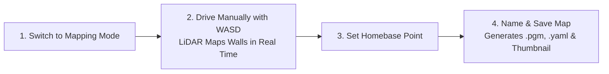
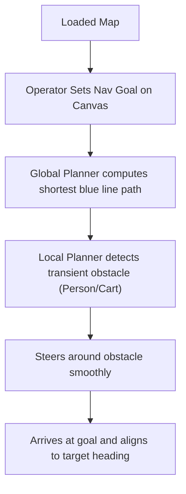
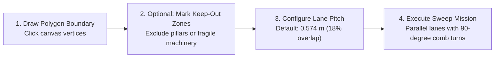
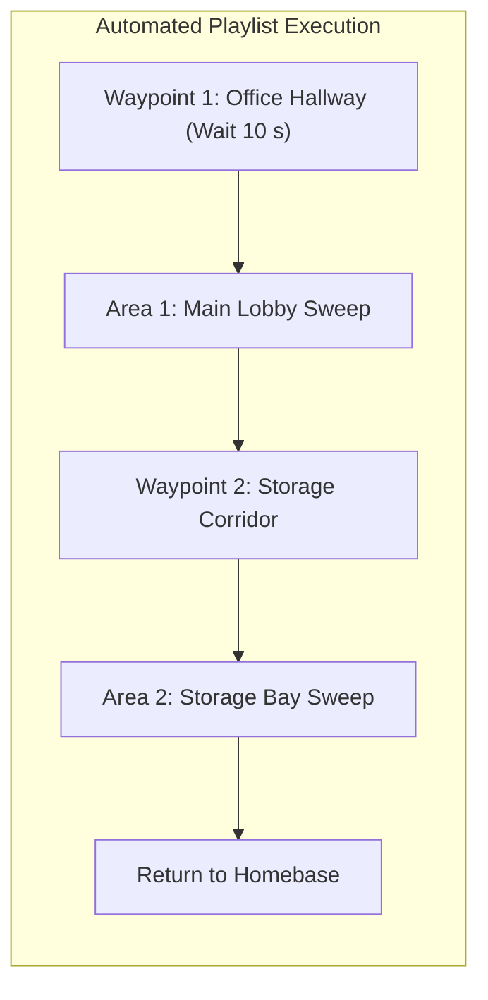

# Fitur Sistem & Panduan Pengguna

<RoleBadge role="user" />

Dokumen ini memberikan panduan operasional komprehensif untuk semua fitur yang tersedia di dasbor web MSD700.

---

## 1. Pemetaan SLAM Otonom

Lokalisasi dan Pemetaan Simultan (SLAM) digunakan untuk menghasilkan denah lantai 2D digital dari fasilitas baru.

### Prosedur Pemetaan Langkah demi Langkah:
1. Di bilah navigasi atas, klik tab **Pemetaan**.
2. Klik **Mulai Sesi Pemetaan**. Robot menginisialisasi LiDAR 360 derajat dan membuka kanvas grid kosong yang baru.
3. Kendarai robot secara perlahan (kira-kira `0.15 m/s`) melintasi lingkungan menggunakan tombol keyboard `W`, `A`, `S`, `D`.
4. Amati kanvas peta langsung saat muncul garis hitam (dinding/penghalang) dan area abu-abu terang (ruang bebas terbuka).
5. Setelah semua ruangan dan koridor terpetakan dengan rapi, arahkan robot kembali ke stasiun awal/pengisian yang dituju.
6. Klik **Set Homebase Here** pada toolbar. Ini menandai asal referensi untuk misi masa depan.
7. Klik **Simpan Peta**, masukkan nama deskriptif (misalnya `First_Floor_Warehouse`), dan klik **Konfirmasi**.
8. Peta disimpan secara lokal ke robot dan disinkronkan ke penyimpanan cloud secara otomatis.

---

## 2. Navigasi Titik-ke-Titik

Memungkinkan pengiriman robot ke koordinat yang tepat dengan perencanaan jalur otomatis dan penghindaran rintangan yang dinamis.

### Indikator Visual Kanvas Jalur:
- **Garis Biru**: Jalur terencana global yang dihitung berdasarkan geometri peta statis.
- **Lintasan Hijau/Merah**: Lintasan lokal aktif dihitung secara real time (hingga 4 meter ke depan).
- **Titik Laser Merah**: Titik refleksi LiDAR 2D langsung yang menunjukkan rintangan waktu nyata.
- **Lambung Tembus**: Selubung jejak keselamatan yang mengelilingi robot.

---

## 3. Penyapuan Cakupan Area Boustrophedon

Untuk pembersihan lantai, desinfeksi ultraviolet, atau inspeksi permukaan, robot melakukan sapuan sistematis dalam batas poligonal khusus.

### Opsi Konfigurasi Cakupan:
1. **Gambar Poligon**: Klik alat **Gambar Area**, lalu klik titik berurutan pada kanvas untuk menguraikan wilayah pembersihan. Klik dua kali atau klik titik sudut pertama untuk menutup poligon.
2. **Zona Terlindungi**: Gambarlah poligon di dalam area yang ditandai **Tanpa Penutup** untuk mencegah robot memasuki zona berbahaya atau terlarang.
3. **Arah Sapu**: Sejajarkan sudut sapuan dengan sumbu panjang ruangan untuk meminimalkan siklus putaran.
4. **Lane Pitch**: Defaultnya adalah `0.574 m`, dihitung dari lebar sasis 0,70 m dengan tumpang tindih jalur 18% untuk menjamin cakupan 100%.

---

## 4. Rute Multi-Titik & Daftar Putar Urutan

Anda dapat merangkai beberapa sasaran navigasi dan area cakupan ke dalam daftar putar misi otomatis.

### Membuat dan Menjalankan Daftar Putar:
1. Navigasikan ke tab **Daftar Putar**.
2. Klik **Buat Daftar Putar Baru** dan beri nama (misalnya `Nightly_Sanitization_Routine`).
3. Klik **Tambahkan Langkah** dan pilih titik jalan atau area jangkauan yang disimpan dari perpustakaan Anda.
4. Tetapkan waktu tunggu jeda opsional pada titik jalan tertentu (misalnya, tunggu 30 detik di pos pemeriksaan inspeksi).
5. Alihkan **Mode Autopilot AKTIF** dan klik **Mulai Daftar Putar**.
6. Robot akan menjalankan setiap langkah secara berurutan dan kembali ke markasnya setelah selesai.

---

## 5. Penyelarasan Pos Putar Nol (Penyelarasan Otomatis)

Saat menempatkan robot di ruangan yang petanya sudah terekam, robot tradisional harus berputar 360 derajat untuk menemukan arahnya, yang dapat bertabrakan dengan dinding atau palet di dekatnya.

MSD700 mencakup **Penyelarasan Otomatis Putaran Nol**:
- Klik **Perataan Otomatis** pada bilah alat navigasi.
- Robot melakukan Correlative Scan Matching (CSM) terhadap peta statis dalam **kurang dari 50 milidetik tanpa bergerak**.
- Jika robot berada dalam koridor simetris, robot akan melakukan joging halus ke depan/belakang sejauh 15 cm untuk menetapkan arah tanpa berputar di tempatnya.

---

## 6. Streaming Video HD Langsung

Panel kanan atas menyediakan streaming video WebRTC latensi rendah secara real-time langsung dari kamera onboard.

- **Tampilan Layar Penuh**: Klik ikon perluas untuk memperbesar umpan video.
- **Stall Detector**: Jika streaming video terhenti karena gangguan jaringan sementara, pemutar secara otomatis memicu koneksi ulang ICE refleksif rekan.

---

## 7. Operasi Lokal Offline

Saat menyebarkan robot di fasilitas tanpa internet atau konektivitas seluler:

1. Hubungkan komputer atau tablet Anda ke hotspot Wi-Fi bawaan robot (`MSD700_Unit_<ULID>`).
2. Buka `http://<jetson-ip>:3000` di browser Anda.
3. **Lencana Mode Lokal** di header mengonfirmasi pengoperasian offline.
4. Seluruh fitur pemetaan, navigasi, dan cakupan area beroperasi dengan fungsionalitas penuh.
5. Saat robot terhubung kembali ke Wi-Fi internet, klik Lencana Lokal dan pilih **Sinkronkan Sekarang** untuk memasukkan peta yang direkam ke database cloud.

---

## Dokumentasi Terkait

- [Panduan Memulai Cepat](/id/getting-started/quick-start): Memulai dalam 5 menit.
- [Bagaimana Robot Berperilaku](/id/getting-started/behavior): Pengawas keselamatan dan pemulihan sesi.
- [Pemecahan Masalah Operator](/id/getting-started/troubleshooting): Mendiagnosis masalah umum operator.