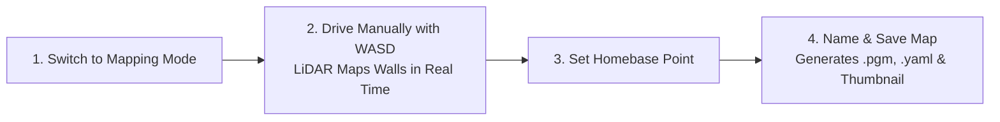
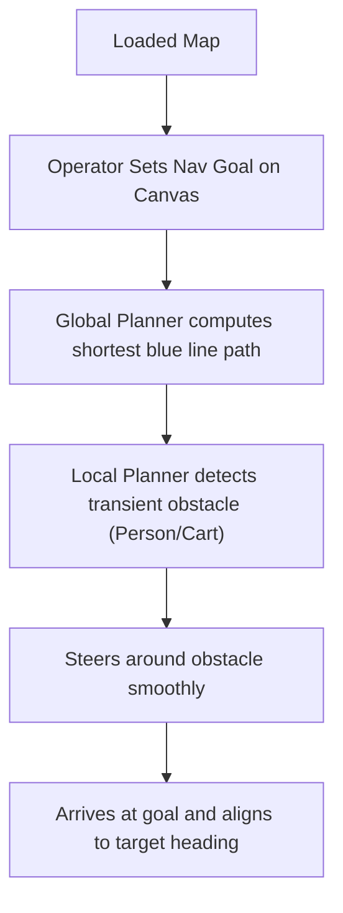
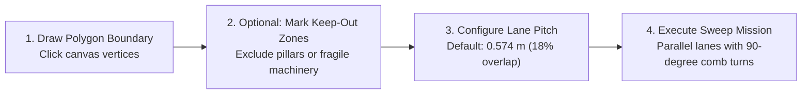
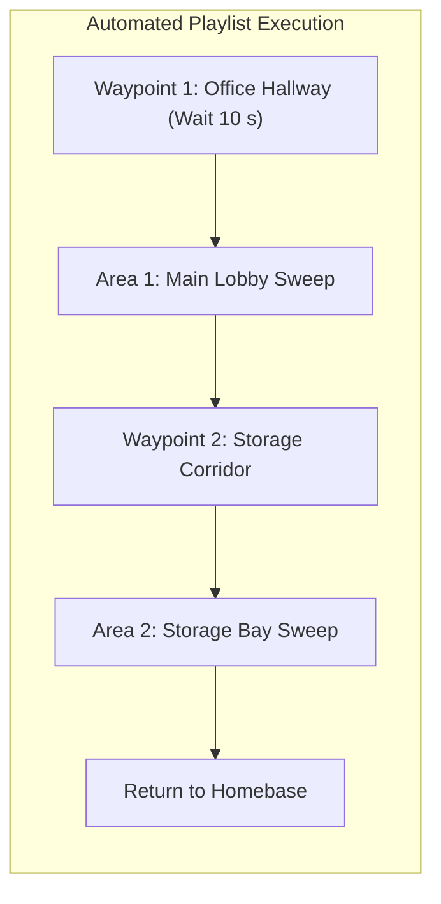

# Fitur Sistem & Panduan Pengguna

<RoleBadge role="user" />

Dokumen ini menyediakan panduan operasional lengkap untuk semua fitur yang tersedia di dashboard web MSD700.

---

## 1. Pemetaan SLAM Otonom

Simultaneous Localization and Mapping (SLAM) digunakan untuk menghasilkan denah lantai 2D digital dari fasilitas baru.

### Prosedur Pemetaan Langkah demi Langkah:
1. Pada bilah navigasi atas, klik tab **Mapping**.
2. Klik **Start Mapping Session**. Robot menginisialisasi LiDAR 360 derajatnya dan membuka kanvas grid kosong yang baru.
3. Kendarai robot secara perlahan (kira-kira `0.15 m/s`) melintasi lingkungan menggunakan tombol keyboard `W`, `A`, `S`, `D`.
4. Amati kanvas peta langsung saat garis hitam (dinding/halangan) dan area abu-abu terang (ruang kosong terbuka) muncul.
5. Setelah semua ruangan dan koridor terpetakan dengan bersih, kendarai robot kembali ke stasiun awal/pengisian daya yang dimaksud.
6. Klik **Set Homebase Here** pada toolbar. Ini menandai titik acuan asal untuk misi di masa mendatang.
7. Klik **Save Map**, masukkan nama deskriptif (misalnya `First_Floor_Warehouse`), lalu klik **Confirm**.
8. Peta disimpan secara lokal di robot dan disinkronkan ke repositori cloud secara otomatis.

---

## 2. Navigasi Titik-ke-Titik

Memungkinkan pengiriman robot ke koordinat yang presisi dengan perencanaan jalur otomatis dan penghindaran halangan dinamis.

### Indikator Visual Kanvas Jalur:
- **Garis Biru**: Jalur global yang direncanakan, dihitung berdasarkan geometri peta statis.
- **Trajektori Hijau/Merah**: Trajektori lokal aktif yang dihitung secara real time (hingga 4 meter ke depan).
- **Titik Laser Merah**: Titik pantulan LiDAR 2D langsung yang menunjukkan halangan secara real time.
- **Selubung Tembus Pandang**: Envelope jejak keselamatan yang mengelilingi robot.

---

## 3. Penyapuan Cakupan Area Boustrophedon

Untuk pembersihan lantai, disinfeksi ultraviolet, atau inspeksi permukaan, robot melakukan penyapuan berpola serpentine sistematis dalam batas poligon khusus.

### Opsi Konfigurasi Cakupan:
1. **Menggambar Poligon**: Klik alat **Draw Area**, lalu klik titik-titik berurutan pada kanvas untuk menggambar batas area pembersihan. Klik dua kali atau klik titik pertama untuk menutup poligon.
2. **Zona Terlarang (Keep-Out)**: Gambar poligon di dalam area yang ditandai sebagai **No-Cover** untuk mencegah robot memasuki zona berbahaya atau terlarang.
3. **Arah Penyapuan**: Selaraskan sudut penyapuan dengan sumbu panjang ruangan untuk meminimalkan siklus belokan.
4. **Jarak Antar-Jalur**: Default `0.574 m`, dihitung dari lebar chassis 0,70 m dengan overlap jalur 18% untuk menjamin cakupan 100%.

---

## 4. Rute Multi-Waypoint & Playlist Berurutan

Anda dapat merangkaikan beberapa goal navigasi dan area cakupan menjadi playlist misi otomatis.

### Membuat dan Menjalankan Playlist:
1. Navigasikan ke tab **Playlists**.
2. Klik **Create New Playlist** dan beri nama (misalnya `Nightly_Sanitization_Routine`).
3. Klik **Add Step** dan pilih waypoint atau area cakupan tersimpan dari library Anda.
4. Atur waktu jeda opsional pada waypoint tertentu (misalnya tunggu 30 detik di titik pemeriksaan inspeksi).
5. Aktifkan **Autopilot Mode ON** lalu klik **Start Playlist**.
6. Robot akan menjalankan setiap langkah secara berurutan dan kembali ke homebase-nya setelah selesai.

---

## 5. Penyelarasan Heading Tanpa Putaran (Auto-Align)

Saat menempatkan robot di ruangan yang petanya sudah direkam, robot konvensional harus berputar 360 derajat untuk menemukan headingnya, yang dapat bertabrakan dengan dinding atau palet di dekatnya.

MSD700 dilengkapi **Zero-Spin Auto-Align**:
- Klik **Auto Align** pada toolbar navigasi.
- Robot melakukan Correlative Scan Matching (CSM) terhadap peta statis dalam **kurang dari 50 milidetik tanpa bergerak**.
- Jika robot berada di koridor simetris, robot melakukan gerakan maju/mundur halus sejauh 15 cm untuk menetapkan heading tanpa berputar di tempat.

---

## 6. Streaming Video HD Langsung

Panel kanan atas menyediakan streaming video WebRTC real time dengan latensi rendah langsung dari kamera onboard.

- **Tampilan Layar Penuh**: Klik ikon perbesar untuk memperbesar feed video.
- **Detektor Macet**: Jika streaming video membeku akibat gangguan jaringan sementara, pemutar secara otomatis memicu rekoneksi ICE peer-reflexive.

---

## 7. Operasi Lokal Offline

Saat menerapkan robot di fasilitas tanpa konektivitas internet atau seluler:

1. Hubungkan komputer atau tablet Anda ke hotspot Wi-Fi onboard robot (`MSD700_Unit_<ULID>`).
2. Buka `http://<jetson-ip>:3000` di peramban Anda.
3. **Local Mode Badge** pada header mengonfirmasi operasi offline.
4. Semua fitur pemetaan, navigasi, dan cakupan area berfungsi dengan kapabilitas penuh.
5. Saat robot terhubung kembali ke Wi-Fi internet, klik Local Badge dan pilih **Sync Now** untuk mendorong peta yang telah direkam ke database cloud.

---

## Dokumentasi Terkait

- [Panduan Cepat](/id/getting-started/quick-start): Mulai dalam 5 menit.
- [Bagaimana Robot Berperilaku](/id/getting-started/behavior): Watchdog keselamatan dan pemulihan sesi.
- [Pemecahan Masalah Operator](/id/getting-started/troubleshooting): Mendiagnosis masalah operator umum.
