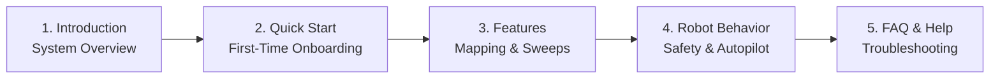

# Memulai

<RoleBadge role="user" />

Selamat datang di **Panduan Pengguna Operator MSD700**. Dokumentasi ini dirancang untuk operator armada, peneliti, dan teknisi lapangan yang menggunakan dasbor web untuk mengontrol, memetakan, dan mengawasi robot otonom MSD700.

Tidak diperlukan pengalaman pemrograman atau robotika untuk mengoperasikan robot melalui antarmuka web.

<LinkCards>
  <LinkCard icon="📖" title="Introduction" details="Learn about the MSD700 platform, hardware capabilities, and cloud architecture." link="/getting-started/introduction" />
  <LinkCard icon="🚀" title="Quick Start Guide" details="Step-by-step instructions to log in, select a robot, and execute your first mission." link="/getting-started/quick-start" />
  <LinkCard icon="✨" title="System Features" details="Comprehensive guide to teleoperation, SLAM mapping, area sweeps, and camera streaming." link="/getting-started/features" />
  <LinkCard icon="🤖" title="How the Robot Behaves" details="Understand safety watchdogs, operating leases, Autopilot persistence, and session recovery." link="/getting-started/behavior" />
  <LinkCard icon="❓" title="Frequently Asked Questions" details="Answers to common operational questions regarding battery, maps, and connectivity." link="/getting-started/faq" />
  <LinkCard icon="🛠️" title="Operator Troubleshooting" details="Quick solutions for common operator symptoms like video stalls and goal aborts." link="/getting-started/troubleshooting" />
</LinkCards>

## Jalur Bacaan yang Direkomendasikan untuk Operator

## Persyaratan Sistem

- **Browser yang Didukung**: Google Chrome (disarankan) atau Microsoft Edge (browser modern berbasis Chromium dengan dukungan WebRTC).
- **Resolusi Tampilan**: Dioptimalkan untuk tampilan desktop dan laptop (1366 x 768 atau lebih tinggi) untuk menampilkan kanvas peta, umpan kamera langsung, dan telemetri secara berdampingan.
- **Jaringan**: Akses internet untuk cloud dashboard (`msd.nglobal.jp`), atau koneksi Wi-Fi lokal saat mengoperasikan robot secara offline di lapangan.