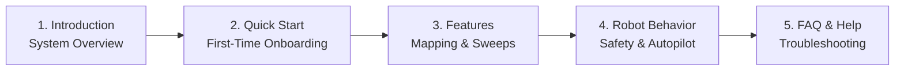

# Memulai

<RoleBadge role="user" />

Selamat datang di **Panduan Pengguna Operator MSD700**. Dokumentasi ini dirancang untuk operator armada, peneliti, dan teknisi lapangan yang menggunakan dasbor web untuk mengontrol, memetakan, dan mengawasi robot otonom MSD700.

Tidak diperlukan pengalaman pemrograman atau robotika untuk mengoperasikan robot melalui antarmuka web.

<LinkCards>
  <LinkCard icon="📖" title="Perkenalan" details="Pelajari tentang platform MSD700, kemampuan perangkat keras, dan arsitektur cloud." link="/id/getting-started/introduction" />
  <LinkCard icon="🚀" title="Panduan Memulai Cepat" details="Petunjuk langkah demi langkah untuk masuk, memilih robot, dan menjalankan misi pertama Anda." link="/id/getting-started/quick-start" />
  <LinkCard icon="✨" title="Fitur Sistem" details="Panduan komprehensif untuk teleoperasi, pemetaan SLAM, sapuan area, dan streaming kamera." link="/id/getting-started/features" />
  <LinkCard icon="🤖" title="Bagaimana Robot Berperilaku" details="Pahami pengawas keselamatan, sewa operasi, persistensi Autopilot, dan pemulihan sesi." link="/id/getting-started/behavior" />
  <LinkCard icon="❓" title="Pertanyaan yang Sering Diajukan" details="Jawaban atas pertanyaan operasional umum mengenai baterai, peta, dan konektivitas." link="/id/getting-started/faq" />
  <LinkCard icon="🛠️" title="Pemecahan Masalah Operator" details="Solusi cepat untuk gejala umum operator seperti video terhenti dan tujuan dibatalkan." link="/id/getting-started/troubleshooting" />
</LinkCards>

## Jalur Bacaan yang Direkomendasikan untuk Operator

## Persyaratan Sistem

- **Browser yang Didukung**: Google Chrome (disarankan) atau Microsoft Edge (browser modern berbasis Chromium dengan dukungan WebRTC).
- **Resolusi Tampilan**: Dioptimalkan untuk tampilan desktop dan laptop (1366 x 768 atau lebih tinggi) untuk menampilkan kanvas peta, umpan kamera langsung, dan telemetri secara berdampingan.
- **Jaringan**: Akses internet untuk cloud dashboard (`msd.nglobal.jp`), atau koneksi Wi-Fi lokal saat mengoperasikan robot secara offline di lapangan.