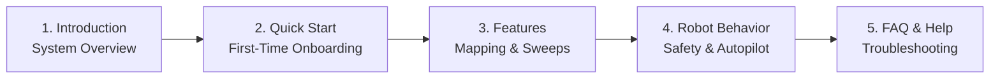

# Panduan Memulai

<RoleBadge role="user" />

Selamat datang di **Panduan Pengguna Operator MSD700**. Dokumentasi ini dirancang untuk operator armada, peneliti, dan teknisi lapangan yang menggunakan dashboard web untuk mengendalikan, memetakan, dan mengawasi robot otonom MSD700.

Tidak diperlukan pengalaman pemrograman atau robotika untuk mengoperasikan robot melalui antarmuka web.

<LinkCards>
  <LinkCard icon="📖" title="Pendahuluan" details="Pelajari tentang platform MSD700, kemampuan perangkat keras, dan arsitektur cloud." link="/id/getting-started/introduction" />
  <LinkCard icon="🚀" title="Panduan Cepat" details="Instruksi langkah demi langkah untuk masuk, memilih robot, dan menjalankan misi pertama Anda." link="/id/getting-started/quick-start" />
  <LinkCard icon="✨" title="Fitur Sistem" details="Panduan lengkap untuk teleoperasi, pemetaan SLAM, penyapuan area, dan streaming kamera." link="/id/getting-started/features" />
  <LinkCard icon="🤖" title="Bagaimana Robot Berperilaku" details="Pahami watchdog keselamatan, lease operasi, persistensi Autopilot, dan pemulihan sesi." link="/id/getting-started/behavior" />
  <LinkCard icon="❓" title="Tanya Jawab (FAQ)" details="Jawaban untuk pertanyaan operasional umum mengenai baterai, peta, dan konektivitas." link="/id/getting-started/faq" />
  <LinkCard icon="🛠️" title="Pemecahan Masalah Operator" details="Solusi cepat untuk gejala umum operator seperti video macet dan goal dibatalkan." link="/id/getting-started/troubleshooting" />
</LinkCards>

## Alur Bacaan yang Disarankan untuk Operator

## Persyaratan Sistem

- **Peramban yang Didukung**: Google Chrome (disarankan) atau Microsoft Edge (peramban modern berbasis Chromium dengan dukungan WebRTC).
- **Resolusi Layar**: Dioptimalkan untuk layar desktop dan laptop (1366 x 768 atau lebih tinggi) agar kanvas peta, feed kamera langsung, dan telemetri dapat ditampilkan berdampingan.
- **Jaringan**: Akses internet untuk dashboard cloud (`msd.nglobal.jp`), atau koneksi Wi-Fi lokal saat mengoperasikan robot secara offline di lapangan.
