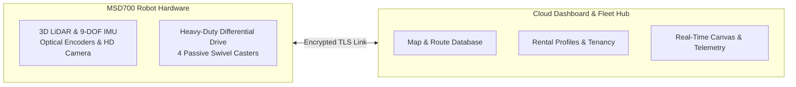

# Pengantar MSD700

<RoleBadge role="user" />

## Apa itu MSD700?

**MSD700** adalah robot bergerak otonom tingkat industri yang dikembangkan oleh **ITB de Labo Research Lab**. Ini dirancang khusus untuk melakukan pemetaan lingkungan otonom, navigasi titik-ke-titik, dan cakupan area sistematis di lingkungan dalam ruangan yang kompleks seperti gudang, koridor kantor, terowongan, dan lantai industri terbuka.

Dilengkapi dengan sensor LiDAR 3D 360 derajat, unit pengukuran inersia (IMU), dan kamera optik resolusi tinggi, robot ini membuat peta grid hunian dengan akurasi sentimeter secara real-time menggunakan Simultaneous Localization and Mapping (SLAM).

## Kemampuan Operator Utama

1. **Lokalisasi dan Pemetaan Simultan (SLAM)**: Mengendarai robot melalui lingkungan baru untuk membuat denah lantai 2D.
2. **Navigasi Titik-ke-Titik**: Klik di mana saja pada peta untuk mengirim robot ke lokasi tersebut dengan penghindaran rintangan secara otonom.
3. **Penyapuan Area Boustrophedon**: Gambarlah poligon di sekitar ruangan atau koridor dan perintahkan robot untuk menyapu seluruh area lantai secara sistematis dalam jalur paralel.
4. **Daftar Putar Misi Otomatis**: Merangkai beberapa rute titik arah dan area pembersihan ke dalam daftar putar berurutan tanpa pengawasan.
5. **Penyelarasan Pos Putar Nol (Penyelarasan Otomatis)**: Tempatkan robot di ruangan yang dipetakan dan sejajarkan posisinya secara instan tanpa mengganggu rotasi 360 derajat.
6. **Streaming Video HD Langsung**: Pantau sudut pandang robot secara real-time melalui streaming WebRTC dengan latensi sangat rendah.
7. **Operasi Mandiri Offline**: Saat bekerja di fasilitas jarak jauh tanpa akses internet, sambungkan langsung ke Wi-Fi lokal robot untuk menggunakan dasbor penuh secara offline.

## Arsitektur Sistem untuk Pengguna

Sistem ini terdiri dari dua lapisan utama:

| Lapisan | Komponen | Interaksi Pengguna |
| --- | --- | --- |
| **Dasbor Cloud** | Server Pusat (`https://msd.nglobal.jp`) | Aplikasi web pusat tempat Anda masuk, mengelola peta, menetapkan rute, dan memantau status armada di semua robot yang disewa. |
| **Robot Fisik (Unit)** | Komputer Jetson Onboard | Mesin fisik yang menjalankan tujuan navigasi Anda. Setiap unit memiliki pengidentifikasi unik (ULID) dan terhubung dengan aman ke cloud. |

## Peran dan Akses Pengguna

Akses ke robot diatur oleh **Profil Penyewaan**:

- **Operator Armada**: Akun pengguna standar yang ditetapkan ke satu atau lebih profil persewaan. Anda dapat mengemudikan robot yang ditugaskan, mencatat peta, membuat rute, dan memantau telemetri.
- **Administrator Lab**: Kelola profil penyewaan penyewa, sediakan akun operator, dan setujui pendaftaran robot perangkat keras baru.

## Langkah Selanjutnya

- Lanjutkan ke [Panduan Memulai Cepat](/id/getting-started/quick-start) untuk login dan mengontrol robot pertama Anda.
- Baca [Fitur Sistem](/id/getting-started/features) untuk rincian lengkap kemampuan pemetaan dan navigasi.
- Tinjau [Bagaimana Robot Berperilaku](/id/getting-started/behavior) untuk memahami pengawas keselamatan dan kegigihan Autopilot.