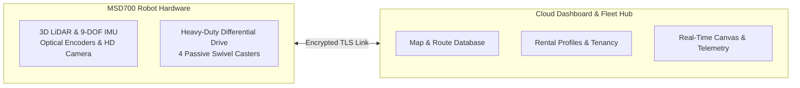

# Pendahuluan MSD700

<RoleBadge role="user" />

## Apa itu MSD700?

**MSD700** adalah robot mobile otonom kelas industri yang dirancang dan diproduksi oleh **Nakayama Iron Works Ltd.** Dashboard **ROS Web UI** yang digunakan untuk mengoperasikannya dikembangkan oleh **ITB de Labo**. Robot ini dirancang khusus untuk melakukan pemetaan lingkungan otonom, navigasi titik-ke-titik, dan cakupan area sistematis di lingkungan indoor yang kompleks seperti gudang, koridor kantor, terowongan, dan lantai industri terbuka.

Dilengkapi dengan sensor LiDAR 3D 360 derajat, inertial measurement unit (IMU), dan kamera optik beresolusi tinggi, robot ini membangun peta occupancy grid dengan akurasi sentimeter secara real time menggunakan Simultaneous Localization and Mapping (SLAM).

## Kemampuan Utama Operator

1. **Simultaneous Localization and Mapping (SLAM)**: Kendarai robot melintasi lingkungan baru untuk membuat denah lantai 2D.
2. **Navigasi Titik-ke-Titik**: Klik di mana saja pada peta untuk mengirim robot ke lokasi tersebut dengan penghindaran halangan otonom.
3. **Penyapuan Area Boustrophedon**: Gambar poligon di sekitar ruangan atau koridor dan perintahkan robot untuk menyapu seluruh area lantai secara sistematis dalam jalur paralel.
4. **Playlist Misi Otomatis**: Rangkaikan beberapa rute waypoint dan area pembersihan menjadi urutan playlist tanpa pengawasan.
5. **Penyelarasan Heading Tanpa Putaran (Auto-Align)**: Tempatkan robot di ruangan yang sudah dipetakan dan selaraskan posisinya secara instan tanpa rotasi 360 derajat yang mengganggu.
6. **Streaming Video HD Langsung**: Pantau sudut pandang robot secara real time melalui streaming WebRTC dengan latensi sangat rendah.
7. **Operasi Mandiri Offline**: Saat bekerja di fasilitas terpencil tanpa akses internet, hubungkan langsung ke Wi-Fi lokal robot untuk menggunakan dashboard lengkap secara offline.

## Arsitektur Sistem untuk Pengguna

Sistem ini terdiri dari dua lapisan utama:

| Lapisan | Komponen | Interaksi Pengguna |
| --- | --- | --- |
| **Dashboard Cloud** | Server Pusat (`https://msd.nglobal.jp`) | Aplikasi web pusat tempat Anda masuk, mengelola peta, menetapkan rute, dan memantau status armada di seluruh robot yang disewa. |
| **Robot Fisik (Unit)** | Komputer Jetson Onboard | Mesin fisik yang menjalankan goal navigasi Anda. Setiap unit memiliki identifier unik (ULID) dan terhubung secara aman ke cloud. |

## Peran dan Akses Pengguna

Akses ke robot diatur oleh **Profil Penyewaan (Rental Profiles)**:

- **Operator Armada**: Akun pengguna standar yang ditetapkan ke satu atau lebih profil penyewaan. Anda dapat mengendarai robot yang ditetapkan, merekam peta, membuat rute, dan memantau telemetri.
- **Administrator Lab**: Mengelola profil penyewaan penyewa, menyediakan akun operator, dan menyetujui pendaftaran perangkat keras robot baru.

## Langkah Selanjutnya

- Lanjutkan ke [Panduan Cepat](/id/getting-started/quick-start) untuk masuk dan mengendalikan robot pertama Anda.
- Baca [Fitur Sistem](/id/getting-started/features) untuk uraian lengkap kemampuan pemetaan dan navigasi.
- Tinjau [Bagaimana Robot Berperilaku](/id/getting-started/behavior) untuk memahami watchdog keselamatan dan persistensi Autopilot.
