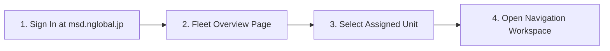
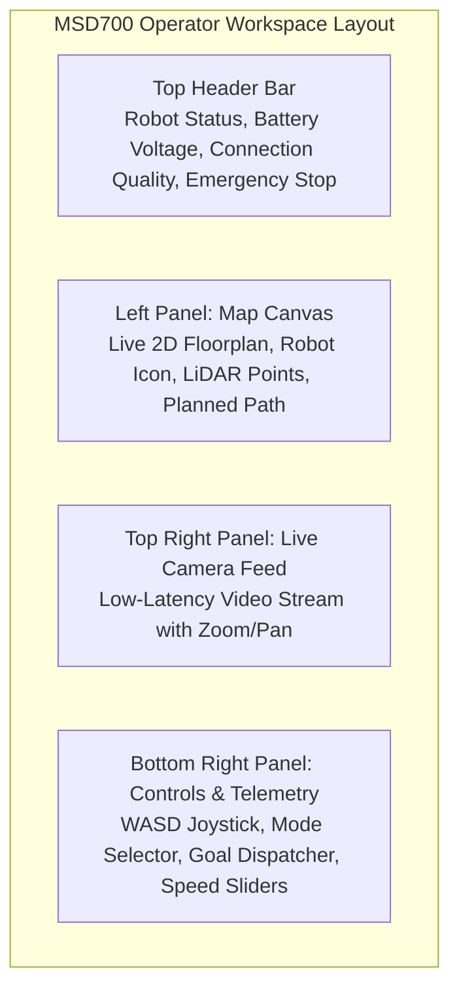
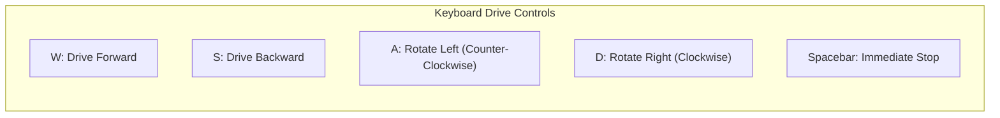
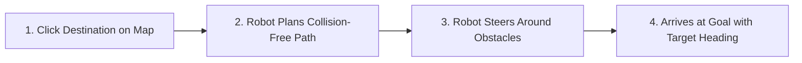

# Panduan Memulai Cepat

<RoleBadge role="user" />

Panduan ini memandu Anda masuk ke dasbor MSD700, mengambil kendali unit robot yang ditugaskan, memuat peta, dan menjalankan misi navigasi pertama Anda.

## Prasyarat

Sebelum memulai, pastikan Anda memiliki:
1. Akun pengguna aktif di dashboard.
2. Setidaknya satu robot ditugaskan ke akun Anda oleh administrator.
3. Google Chrome atau Microsoft Edge di laptop atau komputer desktop.

---

## Langkah 1: Masuk ke Dasbor

1. Buka browser Anda dan navigasikan ke: `https://msd.nglobal.jp`.
2. Masukkan nama pengguna dan kata sandi Anda, lalu klik **Masuk**.

---

## Langkah 2: Pilih Unit Robot

Setelah masuk, **Dasbor Armada** menampilkan semua robot yang ditugaskan ke profil persewaan Anda:

| Lencana Status | Arti | Tindakan Diizinkan |
| --- | --- | --- |
| <Badge type="tip" text="Online" /> | Robot aktif, terhubung, dan siap menerima perintah. | Klik kartu unit untuk membuka dasbor. |
| <Badge type="warning" text="In Use" /> | Operator lain terhubung secara aktif. | Anda dapat membuka unit dalam mode tampilan atau meminta pengambilalihan kendali. |
| <Badge type="danger" text="Offline" /> | Robot dimatikan atau terputus dari jaringan. | Tunggu hingga unit menyambung kembali atau periksa daya perangkat keras. |

Klik kartu robot **Online** mana pun untuk memasuki ruang kerja kontrolnya.

---

## Langkah 3: Pahami Ruang Kerja Operator

Antarmuka operator dibagi menjadi tiga panel operasional utama:

---

## Langkah 4: Muat Peta

1. Di header panel kiri, klik dropdown **Pilih Peta**.
2. Pilih peta yang telah direkam sebelumnya dari daftar (misalnya `Warehouse_Floor_1`).
3. Denah lantai 2D ditampilkan di kanvas beserta posisi robot saat ini (ikon lingkaran biru dengan panah arah).

::: tip No map available?
Jika tidak ada peta di dropdown, lihat [Membuat Peta Baru (SLAM)](/id/getting-started/features#1-autonomous-slam-mapping) untuk membuat peta pertama Anda.
:::

---

## Langkah 5: Berkendara Secara Manual (Teleoperasi)

Anda dapat mengemudikan robot secara manual menggunakan keyboard atau joystick virtual di layar:

### Kontrol Teleoperasi:
- **Penggeser Kecepatan Linier**: Menyesuaikan kecepatan maju maksimum (default: `0.20 m/s`, rentang: `0.05` hingga `0.40 m/s`).
- **Angular Speed ​​Slider**: Menyesuaikan kecepatan putaran rotasi (default: `0.40 rad/s`).
- **Virtual Joystick**: Klik dan seret pegangan joystick di layar ke arah yang diinginkan.

---

## Langkah 6: Mengirimkan Sasaran Navigasi (Titik-ke-Titik)

Untuk mengirim robot ke tujuan target secara mandiri:

1. Klik tombol **Navigate Goal** pada toolbar kanvas.
2. Klik pada titik tujuan yang diinginkan pada peta.
3. Klik dan seret ke arah luar untuk mengarahkan panah arah sasaran, lalu lepaskan.
4. Robot menghitung jalur global bebas tabrakan (garis biru) dan menavigasi secara mandiri menuju target.

---

## Langkah 7: Berhenti Darurat (E-Stop)

Tombol **Berhenti Darurat** terletak jelas di kanan atas setiap halaman:

- **Aktifkan E-Stop**: Klik tombol merah **Emergency Stop** (atau tekan tombol `Escape`). Robot segera mengerem dan menghentikan semua rutinitas otonom.
- **Hapus E-Stop**: Selesaikan kondisi keselamatan dan klik **Lanjutkan Pengoperasian** untuk memulihkan daya motor.

---

## Langkah Selanjutnya

- Pelajari cara melakukan cakupan area sistematis di [Fitur Sistem](/id/getting-started/features).
- Memahami pengatur waktu keselamatan dan Autopilot di [Bagaimana Perilaku Robot](/id/getting-started/behavior).