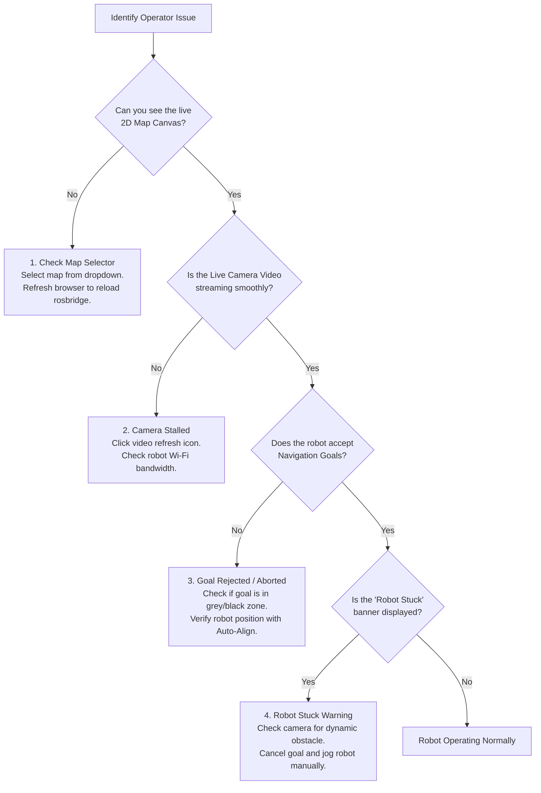

# Panduan Mengatasi Masalah Operator

<RoleBadge role="user" />

Panduan ini memberikan solusi cepat untuk gejala operasional umum yang ditemui saat mengendalikan robot MSD700 dari dasbor web.

::: tip Technical or Hardware Diagnostics
Untuk kesalahan server tingkat rendah, log kontainer Docker, atau diagnostik driver ROS, lihat [Panduan Mengatasi Masalah Teknisi](/id/setup/troubleshooting) atau [Diagnostik Pengembang](/id/development/troubleshooting-guide).
:::

## Diagram Alir Diagnostik Operator

---

## Masalah Umum dan Solusinya

### 1. Kanvas Peta Kosong atau Spinner Pemuatan Tak Terbatas
- **Gejala**: Halaman navigasi terbuka, namun area tengah tetap berupa layar abu-abu gelap dengan loader yang berputar.
- **Kemungkinan Penyebab**:
  - Tidak ada peta aktif yang dipilih untuk unit ini.
  - Koneksi WebSocket browser ke `rosbridge` terputus untuk sementara.
- **Tindakan Operator**:
  1. Lihat tarik-turun **Pilih Peta** di kiri atas. Jika muncul "Tidak Ada Peta yang Dimuat", klik dan pilih peta fasilitas Anda.
  2. Jika peta sudah dipilih namun masih kosong, segarkan tab browser Anda (`Ctrl + F5` atau `Cmd + Shift + R`).
  3. Pastikan lencana status unit di header ditampilkan **Online** (hijau).

---

### 2. Umpan Video Kamera Langsung Beku atau Hitam
- **Gejala**: Jendela kamera menampilkan bingkai beku, roda berputar, atau persegi panjang hitam.
- **Kemungkinan Penyebab**:
  - Kehilangan paket sementara pada tautan Wi-Fi antara robot dan server.
  - Browser memblokir negosiasi ICE WebRTC.
- **Tindakan Operator**:
  1. Klik ikon kecil **Refresh Stream** di header kamera.
  2. Jika menggunakan Chrome, pastikan akselerasi perangkat keras diaktifkan di pengaturan browser.
  3. Jika beroperasi di jaringan fasilitas lokal tanpa internet, pastikan Anda terhubung ke Wi-Fi lokal robot dan mengakses `http://<unit-ip>:3000`.

---

### 3. Sasaran Navigasi Dibatalkan / Robot Menolak Bergerak
- **Gejala**: Anda menetapkan Sasaran Navigasi 2D atau memulai rute, tetapi robot berbunyi bip dan status segera beralih dari `On Progress` kembali ke `Idle` atau `Goal Aborted`.
- **Kemungkinan Penyebab**:
  - Titik tujuan ditempatkan di dalam tembok hitam, di dalam penghalang, atau di dalam penyangga inflasi yang mematikan (dalam jarak 0,575 m dari tembok).
  - Robot kehilangan koordinat lokalisasi relatif terhadap peta.
- **Tindakan Operator**:
  1. Klik sasaran di ruang bebas yang lebar dan terbuka (area abu-abu terang) yang bersih dari dinding dan pilar.
  2. Klik tombol **Auto Align** pada toolbar untuk menyinkronkan ulang pemindaian LiDAR robot dengan peta statis.
  3. Jika Penyelarasan Otomatis gagal, dorong robot maju 0,5 meter secara manual dan aktifkan kembali Penyelarasan Otomatis.

---

### 4. Spanduk "Robot Terjebak" Tidak Dapat Dihapus
- **Gejala**: Spanduk kuning di bagian atas kanvas bertuliskan "Robot Terjebak: Pemulihan Sedang Berlangsung".
- **Kemungkinan Penyebab**:
  - Seseorang, forklift, atau kotak yang baru ditempatkan menghalangi jalur lintasan yang direncanakan.
  - Robot sedang mencoba menyapu cakupan area di koridor sempit yang lebih sempit dari 1,15 meter.
- **Tindakan Operator**:
  1. Periksa umpan kamera langsung dan titik LiDAR merah di kanvas untuk mengetahui adanya penghalang fisik di sekitar.
  2. Jika jalur terhalang oleh benda sementara, tunggu 10 detik; perencana lokal secara otomatis menghindari rintangan begitu izin dibuka.
  3. Jika robot tidak dapat mengatasi keadaan terjepit, klik **Jeda / Batalkan Sasaran**, alihkan ke **Penggerak Manual**, dan gerakkan robot ke ruang terbuka sebelum melanjutkan.

---

### 5. Kontrol Terkunci: "Digunakan oleh Operator Lain"
- **Gejala**: Anda membuka robot dan semua tombol drive dinonaktifkan dengan spanduk "Sedang Digunakan".
- **Kemungkinan Penyebab**:
  - Akun operator lain di organisasi Anda sedang menjalankan unit ini.
  - Anda membiarkan tab atau laptop lain terbuka dan masuk ke robot yang sama.
- **Tindakan Operator**:
  1. Jika banner menunjukkan nama rekan kerja yang berbeda, berkoordinasilah dengan mereka sebelum meminta kontrol.
  2. Jika banner menampilkan akun Anda sendiri (misalnya dari tab lama), klik tombol **Ambil Alih Kendali**. Sesi sebelumnya dipisahkan dengan baik dan mengontrol transfer ke jendela aktif Anda.

---

### 6. Berhenti Darurat Terlibat
- **Gejala**: Header berkedip merah dengan "Emergency Stop Engaged" dan semua gerakan terkunci.
- **Kemungkinan Penyebab**:
  - Operator menekan tombol `Escape` atau mengklik tombol E-Stop di layar.
  - Seorang teknisi memicu bumper perangkat keras fisik E-Stop pada robot.
- **Tindakan Operator**:
  1. Verifikasi bahwa lingkungan fisik robot benar-benar aman.
  2. Jika E-Stop perangkat keras fisik ditekan, putar dan lepaskan tombol perangkat keras pada sasis robot.
  3. Di dasbor web, klik **Lepaskan Berhenti Darurat** untuk mengaktifkan kembali pengontrol motor.

---

## Jalur Eskalasi

Jika langkah di atas tidak menyelesaikan masalah:
1. Hubungi **Teknisi Lapangan** di lokasi Anda untuk memeriksa daya dan sensor perangkat keras fisik.
2. Berikan ULID robot kepada teknisi (ditampilkan di header dasbor, misalnya `01JZ8P9WZ...`).
3. Rujuk teknisi ke [Panduan Mengatasi Masalah Teknisi](/id/setup/troubleshooting).