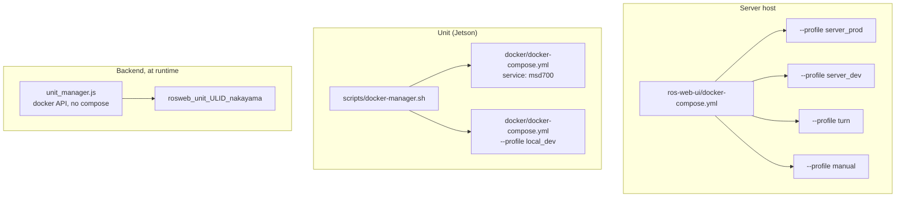
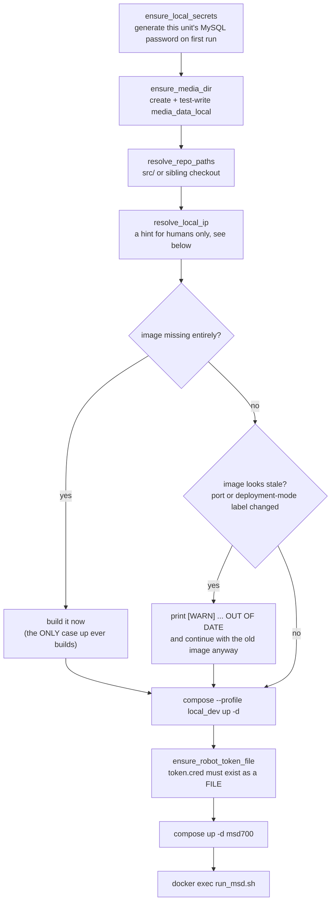

# Referensi Docker

<RoleBadge role="technician" />

Setiap perintah Docker, tandai dan buat konstruksi yang digunakan di MSD700, dan apa sebenarnya masing-masing konstruksi tersebut
melakukan. Halaman ini adalah referensi tautan halaman pengaturan: baca
[Server Setup](/id/setup/server-setup) dan [Unit Setup](/id/setup/unit-setup) untuk prosedur yang dipesan,
dan datang ke sini ketika Anda perlu mengetahui mengapa sebuah bendera ada di sana atau apa yang terjadi jika Anda menjatuhkannya.

## File penulisan manakah yang saya lihat?

Ada tiga, dan keduanya bukan varian satu sama lain. Mereka menggambarkan mesin yang berbeda.

| Berkas | Berjalan pada | Memunculkan |
| --- | --- | --- |
| `ros-web-ui/docker-compose.yml` | **Server** | seluruh tumpukan cloud: MySQL, HiveMQ, backend + rosbridge, media, pensinyalan, dasbor, coturn |
| `msd700_noetic/docker/docker-compose.yml` | a **Satuan** | wadah robot `msd700`, ditambah tumpukan server `local_dev` milik unit |
| `ros-web-ui/docker-compose.robot.yml` | laptop pengembang | robot setengah sendirian, mandiri, tanpa orkestrasi unit |



## Server: membuat profil

Compose menjalankan layanan ketika **salah satu** profil yang dinyatakan aktif. Tidak ada sesuatu pun yang dimulai tanpa a
profil, itulah sebabnya `docker compose up -d` kosong di repositori ini tidak ada gunanya.

| Profil | Layanan | Tujuan |
| --- | --- | --- |
| `server_prod` | `db`, `hivemq`, `fix_perms_prod`, `nakayama_cloud`, `nakayama_media`, `nakayama_signalling`, `frontend_prod`, `coturn` | Penerapan langsung |
| `server_dev` | `db_dev`, `hivemq_dev`, `fix_perms_dev`, `nakayama_cloud_dev`, `nakayama_media_dev`, `nakayama_signalling_dev`, `frontend_dev` | Tumpukan paralel penuh pada port berbeda dan database berbeda |
| `turn` | `coturn` saja | Mulai atau mulai ulang relai dengan sendirinya, tanpa menyentuh sisa prod |
| `manual` | `dev`, `aws`, `hive`, `hive_serverless`, `nakayama_msd`, `nakayama_msd_sim` | Layanan setengah robot khusus cloud yang lama. Bukan bagian dari penerapan normal |

::: warning `coturn` is in two profiles on purpose
`profiles: ["server_prod", "turn"]` berarti dorongan normal `up` membawa relay bersamanya, **dan** Anda
dapat memulainya sendiri dengan `--profile turn`. Sengaja **tidak** di `server_dev`: ada
contoh relay dan itu milik prod. Memunculkan tumpukan dev tidak boleh memulai produksi
infrastruktur. Berbagi aman karena relai tidak memiliki status dan tidak ada yang memasangkan siapa pun: rekan menemukan masing-masing
lainnya melalui server persinyalan, dan **terpisah** (3001 prod, 4001 dev).
:::

### Layanan dan peta pelabuhan

| Layanan | Wadah | Jaringan | Pelabuhan tuan rumah | Catatan |
| --- | --- | --- | --- | --- |
| `db` / `db_dev` | `ros_web_ui_v2_db[_dev]` | jembatan | `3307` / `3308` | Diperiksa kesehatannya; backend menunggunya |
| `hivemq` / `hivemq_dev` | `ros_web_ui_v2_hivemq[_dev]` | jembatan | `8883` / `8884` | Port internal kontainer adalah `8883` di keduanya |
| `nakayama_cloud[_dev]` | `ros_web_ui_v2_nakayama_ros[_dev]` | **tuan rumah** | `5000` / `5001` API, `9090` / `9091` rosbridge | Juga menjadi tuan rumah `unit_manager` |
| `nakayama_media[_dev]` | `ros_web_ui_v2_nakayama_media[_dev]` | **tuan rumah** | `3003` / `4003` | |
| `nakayama_signalling[_dev]` | `ros_web_ui_v2_nakayama_signalling[_dev]` | **tuan rumah** | `3001` / `4001` WS, `3002` / `4002` HTTP | |
| `frontend_prod` / `frontend_dev` | `ros_web_ui_v2_frontend[_dev]` | jembatan | `3000` / `3100` | Poin umum Apache di `3000` |
| `coturn` | `ros_web_ui_v2_coturn` | **tuan rumah** | `3478` + jangkauan relai | Hanya produksi |

## Tulis referensi perintah

### Meningkatkan layanan

```bash
# The normal case: start (or restart into) an entire profile, detached.
docker compose --profile server_prod up -d

# Rebuild the images first, then start. Needed after pulling code that changes a dependency.
docker compose --profile server_prod up -d --build

# Start ONE service without starting the rest of its profile.
docker compose up -d nakayama_cloud

# Start the relay alone, without touching anything else in prod.
docker compose --profile turn up -d coturn
```

| Bendera | Efek | Ketika Anda benar-benar membutuhkannya |
| --- | --- | --- |
| `--profile <name>` | Mengaktifkan profil. Dapat diulang. | Selalu, di repositori ini |
| `-d`, `--detach` | Kembali ke shell alih-alih streaming log | Selalu, kecuali saat men-debug kegagalan start-up |
| `--build` | Bangun kembali gambar sebelum memulai | Setelah ketergantungan atau perubahan Dockerfile |
| `--force-recreate` | Buat ulang container meskipun konfigurasi dan gambar tidak berubah | Jarang; wadah yang macet biasanya lebih baik ditangani dengan `down` kemudian `up` |
| `--no-deps` | Mulai layanan bernama tanpa rantai `depends_on` | Men-debug layanan yang ketergantungannya sengaja diturunkan |
| `--remove-orphans` | Hapus kontainer dari layanan yang tidak lagi ada di file | Setelah layanan diganti namanya atau dihapus |
| `--pull always` | Tarik kembali gambar dasar | Mengambil patch upstream baru `mysql:8.0` atau `hivemq4` |

### Gedung

```bash
docker compose --profile server_prod build          # all services in the profile
docker compose build nakayama_cloud                 # one service
docker compose build --no-cache nakayama_cloud      # ignore every cached layer
docker compose build --progress plain nakayama_cloud # full build output, not the collapsed view
```

`--no-cache` adalah jawaban ketika build "berhasil" tetapi menghasilkan konten basi: Docker menyimpan cache a
`COPY` atau lapisan `RUN apt-get` yang masukannya tidak dapat diubah. Ini lambat, jadi raihlah
hanya ketika build normal telah gagal mengambil sesuatu.

### Memeriksa

```bash
docker compose ps                        # services in this project and their health
docker compose ps -a                     # including stopped ones
docker compose logs -f nakayama_cloud    # follow one service
docker compose logs --tail=200 hivemq    # last 200 lines, no follow
docker compose logs --since=10m          # everything in the last 10 minutes
docker compose exec nakayama_cloud bash  # shell inside a RUNNING container
docker compose run --rm busybox sh       # one-off container, removed on exit
docker compose config                    # the fully-resolved file, with all variables expanded
```

::: tip `docker compose config` is the fastest `.env` debugging tool there is
Ini mencetak file penulisan dengan setiap `${VARIABLE}` diganti. Jika sebuah port, jalur atau kata sandinya
bukan yang Anda harapkan, ini menunjukkan kepada Anda komposisi apa yang sebenarnya terselesaikan, yang sering kali "kosong
string, karena kuncinya salah eja di `.env`".
:::

### Menghentikan dan menghapus

```bash
docker compose --profile server_prod stop   # stop, keep the containers
docker compose --profile server_prod down   # stop AND remove containers + networks
docker compose down --remove-orphans        # also remove containers of deleted services
docker compose down -v                      # ALSO DELETE NAMED VOLUMES
```

::: danger `down -v` deletes HiveMQ's data and log volumes
`ros_webui_hivemq_data_prod` menyimpan pesan yang disimpan, sesi klien, dan pesan QoS>0 yang diantri.
Hampir tidak pernah ada alasan untuk menjalankan `-v` pada proyek ini. Jika Anda ingin broker yang bersih, hapus saja
satu volume berdasarkan nama, dengan sengaja.
:::

## Tulis konstruksi yang digunakan dalam proyek ini

File penulisan server menggunakan beberapa konstruksi yang bersifat menahan beban, bukan gaya. Masing-masing
satu ada di sini karena menjatuhkannya menyebabkan pemadaman listrik yang nyata.

### Jangkar YAML (`x-common-env`, `<<: *`)

```yaml
x-common-env: &common-env
  ROS_DISTRO: "noetic"
  MAPS_FOLDER: "${MAPS_FOLDER:-/home/ubuntu/ros_maps}"

x-common-env-prod: &common-env-prod
  <<: *common-env          # inherit, then override
  PORT_SQL: "${MYSQL_PORT_PROD:-3307}"
```

`&name` mendefinisikan sebuah jangkar, `*name` mereferensikannya, `<<:` menggabungkannya. `${VAR:-default}` adalah milik composer
interpolasi sendiri: gunakan `VAR` jika disetel dan tidak kosong, jika tidak maka default.

### `network_mode: host`

Digunakan oleh setiap layanan pembawa ROS dan oleh `coturn`. Artinya, container tersebut berbagi jaringan host
namespace: tidak ada pemetaan port, tidak ada NAT, `localhost` di dalam wadah adalah hostnya.

| Layanan | Mengapa menjadi tuan rumah jaringan |
| --- | --- |
| `nakayama_*` | Node ROS 1 menegosiasikan port sementara yang sewenang-wenang satu sama lain. Jaringan yang dijembatani merusak URI yang dikembalikan master ROS. |
| `coturn` | Sebuah relai membagikan satu port per alokasi dari `min-port..max-port`. Menerbitkan rentang tersebut melalui jembatan berarti satu proses `docker-proxy` per port. Pada default port 16384 coturn, mesin akan mati. Host ini juga sudah berada di belakang NAT, dan sebuah jembatan menambahkan terjemahan kedua, yang mematahkan satu hal yang harus dilakukan dengan benar oleh server TURN: mengetahui dan mengiklankan alamat eksternalnya sendiri. |

### `depends_on` dengan syarat

```yaml
depends_on:
  db:
    condition: service_healthy
  fix_perms_prod:
    condition: service_completed_successfully
```

| Kondisi | Arti |
| --- | --- |
| `service_started` | Standarnya. Hanya menunggu containernya ada. Hampir tidak pernah cukup. |
| `service_healthy` | Menunggu `healthcheck` lewat. Inilah yang menghentikan balap backend MySQL dan gagal dengan `Connection lost`. |
| `service_completed_successfully` | Menunggu container one-shot keluar `0`. Digunakan untuk pemecah izin. |

### Pemecah izin sekali pakai

```yaml
fix_perms_prod:
  image: busybox
  profiles: ["server_prod"]
  network_mode: "none"
  user: root
  volumes:
    - /srv/msd/media/map:/srv/msd/media/map
  command: >
    sh -c "mkdir -p ... && chown -R $$USER_UID:$$USER_GID ..."
```

Jalur host yang dipasang pada ikatan yang belum ada dibuat secara otomatis **oleh daemon Docker, sebagai root**,
bukan sebagai pengguna aplikasi. Kontainer aplikasi berjalan tanpa hak istimewa, sehingga penulisan pertamanya mendapat `EACCES`. Ini
container dijalankan terlebih dahulu, sebagai root, dan memperbaiki kepemilikan sehingga host baru melakukan koreksi sendiri tanpa manual
`chown`.

::: warning `network_mode: "none"` on this service is not cosmetic
Tanpa kunci `networks:`, composer menempatkan layanan pada jaringan default proyek. Sebuah wadah
mencatat jaringannya berdasarkan **ID**. Setelah jaringan default tersebut dihapus dan dibuat ulang (apa saja
`docker compose down`, dan dua checkout berbagi nama proyek `ros-web-ui`, jadi keduanya bisa melakukannya),
penampung ini tidak akan pernah dapat dimulai lagi: `gagal menyiapkan jaringan penampung: jaringan <old-id> tidak
ditemukan`. Every app service depends on it with `service_completed_successously`, jadi keseluruhan profil
kemudian menolak untuk muncul di balik pekerjaan `chown` yang macet. Ini terjadi dua kali sebelumnya `network_mode: none`
telah ditambahkan. Itu mkdirs dan chowns; itu tidak pernah membutuhkan jaringan.
:::

### `user:` dan `group_add:`

```yaml
user: "itbdelabo"
group_add:
  - "${DOCKER_GID:-998}"
```

`group_add` menempatkan pengguna container di grup `docker` host sehingga `backend_node` dapat berbicara dengan
dipasang `/var/run/docker.sock` dan mengelola kontainer per unit. Temukan nilai yang tepat dengan
`getent group docker | cut -d: -f3` pada tuan rumah.

HiveMQ menggunakan `user: "1001:0"` sebagai gantinya, dan kedua bagian itu penting: uid `1001` memiliki `0600` keystore,
jadi penampung harus *menjadi* pengguna tersebut untuk membaca kunci pribadinya sendiri. Gid `0` bukan merupakan perampasan hak istimewa:
gambar dikirimkan `/opt/hivemq` sebagai `root:root 775` dan `bin/run.sh` menolak untuk memulai kecuali
`$HIVEMQ_HOME` dapat ditulis, root grup mana yang dapat dipenuhi tanpa memakan apa pun.

### Pemasangan ikatan sintaksis panjang

```yaml
- type: bind
  source: ${HIVEMQ_KEYSTORE:-/srv/msd/secrets/hivemq/keystore.p12}
  target: /opt/hivemq/conf/keystore.p12
  read_only: true
  bind:
    create_host_path: false
```

Sintaks panjang digunakan di sini murni untuk `create_host_path: false`. Default Docker adalah **membuat**
sumber pengikatan yang hilang, dan untuk pemasangan file tunggal, ia membuat **direktori** di sana. Hilang
keystore kemudian akan muncul sebagai kesalahan kunci yang tidak dapat dibaca jauh di dalam startup HiveMQ, bukan sebagai "ini
file tidak ada di host". Gagal di `up` adalah hasil yang jujur.

### Volume bernama vs pengikatan pengikat

| Jalur | Jenis | Mengapa |
| --- | --- | --- |
| `./mysql_data/prod` | mengikat | Tinggal di dalam repo dan dicadangkan |
| `hivemq_data_prod`, `hivemq_log_prod` | bernama volume | Docker memilikinya, menyemainya dari gambar saat pertama kali digunakan, dan mereka bertahan dalam `rm -rf` apa pun di bawah `$HOME` |
| `./Docker/hivemq/config.xml` | ikat, `:ro` | Konfigurasi termasuk dalam git |
| `/srv/msd/secrets/...` | ikat, `:ro` | Rahasia tidak pernah masuk ke dalam gambar |

::: danger A bind mount MASKS the image's own directory
HiveMQ digunakan untuk mengikat-mount `conf/ data/ log/` dari tarball yang diekstraksi dengan tangan di direktori home. SEBUAH
`sudo rm -rf` dari direktori "sisa" tersebut membawa konfigurasinya, dan host kosong
direktori bukanlah broker yang terdegradasi: ini adalah broker yang tidak dapat memulai sama sekali
(`The configuration file /opt/hivemq/conf/config.xml does not exist`). Tidak ada apa pun di repo yang direkam
apa blok pendengar tadi. Itulah sebabnya host sekarang tidak memiliki apa pun yang perlu di-boot oleh broker.
:::

### Pemeriksaan kesehatan

```yaml
healthcheck:
  test: ["CMD", "bash", "-c", "exec 3<>/dev/tcp/127.0.0.1/8080"]
  interval: 30s
  timeout: 5s
  retries: 3
  start_period: 60s
```

Dua detail yang patut ditiru. Ini menyelidiki port **Pusat Kontrol** HiveMQ (8080), bukan pendengar MQTT:
probe TCP kosong terhadap port MQTT ditutup sebelum mengirim `CONNECT`, dan HiveMQ mencatat semuanya
dari mereka yang ada di `log/event.log` sebagai `Client ID: UNKNOWN ... disconnected ungracefully`, yaitu tentang
2880 baris sampah sehari dalam file persis yang digunakan untuk mengaudit robot mana yang terhubung. Kedua pendengar itu milik
ke JVM yang sama, jadi jawaban 8080 merupakan sinyal keaktifan yang memadai.

Dan tertulis `bash` secara eksplisit, karena `/bin/sh` pada gambar tersebut adalah `dash`, yang tidak memiliki `/dev/tcp` dan
gagal setiap penyelidikan dengan `Directory nonexistent`.

### Rotasi log

```yaml
logging:
  driver: json-file
  options:
    max-size: "20m"
    max-file: "3"
```

Hanya `coturn` yang saat ini membatasi lognya, karena konfigurasinya mencatat alokasi di `verbose` dan
pemindai yang tidak diautentikasi yang memalu 3478 dapat mengisi disk dengan 401s. Setiap layanan lainnya
masih mencatat tanpa batas. Memperbaiki itu layak dilakukan dengan sengaja, bukan secara kebetulan, karena
mengubah driver logging memaksa pembuatan ulang container pada setiap layanan yang disentuhnya.

### Tag gambar

| Tandai | Digunakan oleh |
| --- | --- |
| `ros-noetic-webui-app-v2:latest` | layanan prod dan prod per unit kontainer |
| `ros-noetic-webui-app-v2:dev` | layanan dev dan kontainer dev per unit |
| `ros-dashboard-next-v2:prod` / `:dev` | dua dasbor dibuat |
| `ros-noetic-webui-app-local:latest` | backend, media, dan sinyal milik unit |
| `ros-dashboard-next-local:latest` | dashboard unit sendiri |
| `msd700:latest` / `msd700-simulator:latest` | wadah robot |

::: warning Prod and dev must never share a tag
Kedua profil server digunakan untuk membangun `ros-noetic-webui-app-v2:latest`. Sebuah pembangunan dilakukan untuk dev secara diam-diam
mengubah produksi apa yang akan dijalankan pada pembuatan ulang berikutnya, tanpa penerapan dan tanpa pengumuman. Tag
sekarang terpecah, dan `UNIT_IMAGE` disetel per profil sehingga kontainer unit dev menjalankan kode dev.
:::

## coturn: layanan khusus produksi

Relai adalah salah satu bagian dari tumpukan yang ada di prod dan tidak ada di tempat lain.

### Konfigurasi

Nilai per host diteruskan sebagai **flags**, bukan dalam file konfigurasi, karena coturn memperluas no
variabel lingkungan dalam konfigurasinya. Bendera memenangkan file, sehingga kebijakan bersama tetap ada di git dan
alamat tetap di `.env`.

```bash
# ros-web-ui/.env
TURN_LISTENING_IP=192.168.100.10     # the host's own LAN address
TURN_EXTERNAL_IP=118.22.31.252       # the PUBLIC address, seen from the internet
TURN_USER=msd700
TURN_PASSWORD=<a long random string>
TURN_MIN_PORT=49152                  # optional, coturn's own default
TURN_MAX_PORT=65535                  # optional
```

Keempat nilai pertama diperiksa di **container start**, bukan di `${VAR:?}` composer
sintaks variabel yang diperlukan. Compose menginterpolasi setiap layanan dalam file, apa pun profilnya
sedang dimunculkan, jadi variabel yang diperlukan di sini akan membuat `--profile server_dev up` gagal pada a
relay tidak ada yang meminta untuk memulai.

::: warning `TURN_EXTERNAL_IP` is the one that breaks video silently
Tanpa itu, coturn mengiklankan alamat pribadinya sebagai kandidat relay. Setiap browser di luar
LAN kemudian mencoba menjangkau alamat yang tidak dirutekan, dan umpan kamera tidak pernah muncul,
tanpa error di dashboard.
:::

### Menjalankannya

```bash
# Prod: comes up with the rest of the stack.
docker compose --profile server_prod up -d

# Just the relay: restart it, or start it before joining it to the stack.
docker compose --profile turn up -d coturn

# Watch allocations (the config logs at `verbose` to stdout).
docker compose logs -f coturn

# Stop just the relay.
docker compose --profile turn stop coturn
```

### Pengembang tumpukan dan relai

`server_dev` tidak termasuk `coturn`, dan itu benar. Jika Anda menguji WebRTC terhadap
dev stack, server pensinyalan dev (`4001`) akan memberikan alamat relai **prod** kepada rekan-rekannya, yaitu
apa yang Anda inginkan: satu relai, dibagikan, tanpa kewarganegaraan.

Jika Anda benar-benar membutuhkan relay dan prod tidak berjalan, mulailah secara eksplisit:

```bash
docker compose --profile turn up -d coturn
```

### Bermigrasi dari coturn apt/systemd

Jika host ini masih menjalankan coturn di bawah systemd, urutannya penting sekali. Port 3478 adalah satu
pelabuhan yang terkenal dan keduanya tidak dapat keduanya menampungnya.

```bash
sudo systemctl disable --now coturn                 # 1. free the port
docker compose --profile turn up -d coturn          # 2. prove the container works
docker compose logs -f coturn                       # 3. confirm it bound and is listening
docker compose --profile server_prod up -d          # 4. now it is just another prod service
```

Jalankan prod `up` saat unit systemd masih mendengarkan dan container gagal diikat, lalu
`restart: always` mencobanya kembali selamanya: berisik, tidak berbahaya, dan jauh dari penyebabnya.

## Satuan: `docker-manager.sh`

Unit tidak pernah menelepon `docker compose` secara langsung. `scripts/docker-manager.sh` membungkusnya, karena
beberapa hal harus diputuskan **sekali** dan diserahkan ke kedua bagian (wadah robot dan
tumpukan server unit sendiri) sehingga mereka tidak bisa berselisih.

### Perintah

| Perintah | Apa fungsinya |
| --- | --- |
| `up` | Mulai wadah robot **dan** tumpukan server `local_dev` unit, lalu jalankan `run_msd.sh` di dalam wadah |
| `down` / `stop` | Hentikan dan hapus wadah robot dan tumpukan lokal |
| `build` | Bangun gambar robot |
| `build-clean` | Bangun citra robot dengan `--no-cache` |
| `shell` | `docker exec -it` shell login bash di container yang sedang berjalan |
| `logs` | Ikuti log penampung robot |
| `status` | `docker compose ps` untuk wadah robot |
| `local-up` | Mulai **hanya** tumpukan server lokal, tanpa munculnya robot |
| `local-down` | Hentikan hanya tumpukan server lokal |
| `local-build` | Bangun kembali gambar tumpukan lokal |
| `local-logs` | Ikuti log tumpukan lokal |
| `local-status` | `docker compose ps` untuk tumpukan lokal |
| `help` | Bantuan bendera dan lingkungan lengkap |

### Bendera

| Bendera | Berlaku untuk | Efek |
| --- | --- | --- |
| `--simulator`, `-s` | `build`, `up` | Gunakan gambar Gazebo (`msd700-simulator:latest`) dan container. Diteruskan ke `run_msd.sh` juga, karena itulah yang sebenarnya menentukan `use_simulator_val:=true` |
| `--dev` | `up` | **cloud** mana yang merupakan rekan unit ini: tumpukan pengembangan, bukan produksi. Mengubah MQTT menjadi 8884, master ROS menjadi 11312, dan pendaftaran ke backend dev |
| `--build` | `up` | Bangun kembali gambar sebelum memulai |
| `-d`, `--detach` | `up` saja | Serahkan kembali terminal setelah semuanya berjalan |
| `--debug` | diteruskan | `run_msd.sh` mode verbose. **Ketik lengkap**: `-d` adalah tanda detach skrip ini |
| `--dry-run` | diteruskan | Cetak apa yang akan dijalankan tanpa menjalankannya |
| `--kill` | diteruskan | Matikan sesi tmux di dalam wadah |
| `--local` | diterima, diabaikan | Tidak digunakan lagi. Tumpukan lokal dimulai dengan cara apa pun |
| `--unit_id` | **ditolak** | Dihapus dengan sengaja. Identitas berasal dari konsol admin cloud |

::: info What `-d` actually changes, and what it does not
Permulaan masih berjalan di **latar depan**: pembuatan gambar, kode klaim pendaftaran, dan kegagalan apa pun
adalah semua hal yang ingin Anda lihat, dan Ctrl-C sebelum layanan aktif masih membatalkan dan merobeknya
setengah mulai menumpuk. Yang berubah adalah akhirnya. Setelah setiap layanan berjalan, perintah kembali
ke shell, dan menutup terminal tersebut tidak lagi menghentikan robot. Ini adalah bentuk yang dimilikinya
unit systemd atau `ssh unit './scripts/docker-manager.sh up -d'` one-liner.
:::

::: danger `--unit_id` is rejected, not ignored
Mengetiknya menghasilkan kesalahan saat menjelaskan penggantian. Robot tanpa identitas cache melakukan pendaftaran mandiri
dan mencetak kode klaim, dan admin **mendaftarkannya** (unit baru) atau **mengadopsinya** ke
ULID (pertukaran perangkat keras, cache yang hilang) unit yang ada dari konsol admin cloud. Keduanya membutuhkan unit
untuk memiliki akses internet pada saat itu. Setelah itu, `Certificates/robot/device.json` dibaca
secara otomatis setiap kali dijalankan nanti.
:::

### Variabel lingkungan `docker-manager.sh` maju

| Variabel | Bawaan | Tujuan |
| --- | --- | --- |
| `DEVICE_FINGERPRINT` | berasal dari **host** | sha256 dari serial Jetson (atau id mesin, atau MAC asli pertama) ditambah modelnya. Baca hostnya agar container yang dibangun kembali tidak muncul kembali sebagai unit baru yang tertunda |
| `ENROLL_SERVER_URL` | turunan | Menggantikan titik akhir pendaftaran secara langsung |
| `ENROLL_BOOTSTRAP_KEY` | tidak disetel | Kunci gambar bersama. Penanda kepercayaan di konsol, bukan gerbang |
| `ENROLL_CODE` | tidak disetel | Voucher pendaftaran sekali pakai, lewati kumpulan yang tertunda |
| `DEV_SERVER_HOST` | `118.22.31.252` | Dimana `--dev` poin. Setel ke `localhost` saat dijalankan pada host itu |
| `DEV_BACKEND_PORT` | `5001` | Port ujung belakang untuk `--dev` |
| `CLOUD_BASE_URL` | turunan | Mengarahkan seluruh armada ke cloud yang berbeda tanpa mengubah kode |
| `ROS_MASTER_PORT` | `11312` dengan `--dev`, yang lain `11311` | Diserahkan kepada **keduanya** container dan `backend_local`, sehingga tidak bisa berbeda pendapat |
| `BACKEND_PORT_LOCAL` | `5002` | Apa yang dibicarakan oleh browser dasbor lokal, dan di mana `camera_client` mengambil token unit-lokal |

::: warning One decision, handed to both halves
`CLOUD_BASE_URL` dan `ROS_MASTER_PORT` diselesaikan satu kali di `docker-manager.sh` dan diteruskan ke
wadah **dan** untuk menulis. Mereka biasanya diturunkan secara independen di kedua sisi, dan itulah tepatnya
bagaimana `--dev` merusak unit: `run_msd.sh` memindahkan master ke 11312 sementara `backend_local` tetap
menanyakan 11311, jadi masternya ada dan tidak ada yang bisa menemukannya.
:::

### Apa yang dilakukan `up` secara berurutan



::: warning `up` builds only when an image does not exist at all
Sebelum 13-08-2026, gambar usang (sumber diedit, atau port diubah di `docker/.env`) memicu
pembangunan kembali otomatis pada `up` berikutnya. Artinya, membuat unit online tiba-tiba membutuhkan internet,
yang merupakan kebalikan dari perangkat keras yang seluruh tujuannya berjalan tanpa perangkat keras tersebut. Sekarang gambar basi
hanya mencetak `[WARN] ... is OUT OF DATE` dan tetap memulai dengan apa yang sudah dibuat. Membangun kembali
sengaja: `./scripts/docker-manager.sh build` (atau `local-build` hanya untuk separuh web), atau
`up --build` untuk melakukan keduanya dalam satu perintah. `build-clean` memaksa pembangunan kembali tanpa cache lapisan sama sekali.
:::

Dua lagi dari langkah-langkah tersebut terjadi karena kegagalan yang tampaknya tidak ada sama sekali:

- **`ensure_robot_token_file`.** Empat layanan bind-mount `Certificates/robot/token.cred`. Bawa apa saja
  di antaranya ada pada robot yang tidak pernah terdaftar dan Docker, karena tidak menemukan file host seperti itu, membuat a
  **direktori** kosong milik root di sana. `enroll.py` maka tidak dapat menulis token yang baru saja diperoleh, dan
  robot mendaftar ulang dari awal pada setiap boot.
- **Pemeriksaan kekekalan sendiri.** `Dockerfile.webui-local` **SALIN** sumber ke dalam gambar; di sana
  tidak ada pengikatan untuk layanan tersebut. Tanpa membandingkan waktu file sumber dengan pembuatan gambar
  waktu (ditambah label port dan mode penerapan), suatu unit tidak akan menyadari bahwa unit tersebut sedang ditayangkan
  backend minggu lalu sama sekali. Begitulah cara titik akhir baru mengembalikan 404 pada unit yang sumbernya
  pohon jelas memuatnya, lihat [Pemecahan Masalah](/id/setup/troubleshooting).

## Satuan: `run_msd.sh`

Berjalan **di dalam** container robot dan meluncurkan setiap layanan ROS dalam sesi tmux
(`robot_services`). `docker-manager.sh` biasanya mengendarainya, tetapi Anda dapat memanggilnya langsung dari
`docker-manager.sh shell`.

| Bendera | Efek |
| --- | --- |
| `-s`, `--simulator` | Sumber datanya adalah Gazebo, bukan perangkat keras robot |
| `--dev` | Semuanya dev: MQTT 8884, ROS master 11312, pensinyalan dev, pendaftaran dev. Port layanan **milik** unit tidak bergeser |
| `-d`, `--debug` | Keluaran verbose |
| `-n`, `--dry-run` | Cetak perintah tanpa menjalankannya |
| `-k`, `--kill` | Matikan sesi tmux dan keluar |
| `--detach` | Mulai semuanya, cetak status, keluar. Hanya bentuk panjang |
| `--unit_id <ULID>` | Sematkan identitas secara eksplisit. Penggantian pemulihan opsional |
| `--camera_device <path>` | Ganti jalur atau indeks perangkat kamera |

| Lingkungan | Bawaan | Tujuan |
| --- | --- | --- |
| `SERVICE_HOST` | `localhost` | Tempat layanan sisi server robot ini berada |
| `ROS_LOG_CAP_MB` | `512` | Plafon untuk `~/.ros/log`, yang ROS 1 tidak pernah putar |
| `ROS_LOG_SWEEP_SECONDS` | `60` | Seberapa sering petugas kebersihan memeriksa |

jendela tmux di sesi `robot_services`: `roscore`, `ros_webui`, `camera_client`,
`switch_mode`, `log_janitor`.

```bash
docker exec -it msd700 tmux attach -t robot_services   # attach
# Ctrl-b then d to detach without stopping anything
docker exec -it msd700 tmux list-windows -t robot_services
```

::: danger `--detach` is wrong for `docker-compose.robot.yml`
Di jalur itu `run_msd.sh` **adalah** perintah utama penampung, sehingga pengembalian akan menghentikan penampung dan
membawa server tmux bersamanya. Jalur tersebut sudah terlepas di tingkat penulisan; latar depan
loop inilah yang membuat container tetap hidup.
:::

## Tumpukan unit itu sendiri (`local_dev` profile)

| Layanan | Wadah | Pelabuhan | Terikat ke |
| --- | --- | --- | --- |
| `db_local` | `msd700_db_local` | `3306` | `127.0.0.1` |
| `mosquitto_local` | `msd700_mosquitto_local` | `1883` | `127.0.0.1` |
| `backend_local` | `msd700_backend_local` | `5002` API, `9090` rosbridge | semua antarmuka |
| `media_local` | `msd700_media_local` | `3003` | semua antarmuka |
| `signalling_local` | `msd700_signalling_local` | `3001` WS, `3002` HTTP | semua antarmuka |
| `frontend_local` | `msd700_frontend_local` | `3000` | semua antarmuka |

Masing-masing dari mereka menggunakan `network_mode: host`, jadi **Docker tidak menerbitkan apa pun** dan unit itu sendiri
firewall adalah yang terpenting. Izinkan lima port yang menghadap browser; MySQL dan Mosquitto memang sengaja
terikat pada loopback dan tidak memerlukan aturan.

Konfigurasi tinggal di `msd700_noetic/docker/.env` (dibuat dari `.env.example` secara otomatis aktif
dijalankan pertama kali). Kunci yang paling layak untuk ditinjau:

```bash
MAPS_FOLDER_LOCAL=/home/ubuntu/ros_maps
#LOCAL_IP=192.168.4.1     # leave commented to auto-detect each run
WITH_SIMULATOR=false      # adds the Gazebo stack to the image; costs over a GB
USER_UID=                 # empty = detect from `id -u` (Jetson 2002, laptop 1000)
USER_GID=
```

::: info `LOCAL_IP` stopped being part of the bundle on 2026-08-13
Dulu: `NEXT_PUBLIC_*` URL dikompilasi ke dalam JS dengan IP unit dimasukkan, jadi pindah
unit ke jaringan baru berarti pembangunan kembali wajib. Bundel tersebut sekarang mengambil **host**nya dari apa pun
alamat browser operator yang sebenarnya digunakan untuk membuka halaman tersebut
(`src/config/apiConfig.ts` di `ROS-dashboard-next-ts`), yang secara konstruksi merupakan mesin yang sama, 
hanya **port** yang masih berasal dari build. Unit yang dijangkau berdasarkan IP, nama host, mDNS
(`msd700.local`), atau terowongan SSH di `localhost` semuanya berfungsi dengan benar sekarang, tidak ada yang mungkin
sebelumnya. `LOCAL_IP` di `docker/.env` ditinggalkan sebagai petunjuk untuk URL cetakan skrip itu sendiri dan
Penggantian tanpa DHCP dilakukan sebelum browser ada, kesalahan tidak lagi berakibat fatal
dasbor, hanya untuk apa yang dicetak skrip.
:::

## Kontainer per unit (dibuat oleh backend, bukan oleh penulisan)

`unit_manager.js` membuatnya melalui Docker API. Tidak ada file penulisan untuk mereka. Itu
setara `docker run` adalah:

```bash
docker run -d \
  --name rosweb_unit_01JZ8P9WZ0UNIT00000000000_nakayama \
  --network host \
  --user itbdelabo \
  --restart unless-stopped \
  --log-driver json-file --log-opt max-size=50m --log-opt max-file=3 \
  -v /home/ubuntu/ros_maps:/home/ubuntu/ros_maps \
  -e UNIT_ID=01JZ8P9WZ0UNIT00000000000 \
  -e ROS_DISTRO=noetic -e ROS_PYTHON_VERSION=3 \
  -e MAPS_FOLDER=/home/ubuntu/ros_maps \
  -e NAKAYAMA_PORT=8883 \
  -e ROS_MASTER_URI=http://localhost:11311 \
  ros-noetic-webui-app-v2:latest \
  bash -c "cd /home/itbdelabo/ros-web-ui-ws && catkin_make && source devel/setup.bash && \
    roslaunch msd700_webui_bringup bringup_cloud.launch use_cloud:=true use_nakayama:=true \
    use_backend_web:=false use_unit_relays:=true unit_id:=01JZ8P9WZ0UNIT00000000000"
```

Perintah yang berguna untuk melawan mereka:

```bash
docker ps --filter "name=rosweb_unit_"           # every running unit bridge
docker logs -f rosweb_unit_<ULID>_nakayama       # one unit's relays
docker stop rosweb_unit_<ULID>_nakayama          # the backend will restart it on next use
```

::: warning Recreating the backend orphans every unit container
Kontainer unit dimulai dengan proses `backend_node` tertentu. Setelah
`docker compose up -d nakayama_cloud` membuat ulang backend, restart setiap `rosweb_unit_*`
container juga, atau mereka akan berjalan sementara backend baru tidak menganggapnya diadopsi.
:::

## Memecahkan masalah Docker itu sendiri

| Gejala | Penyebab | Perbaiki |
| --- | --- | --- |
| `permission denied ... /var/run/docker.sock` | Pengguna Anda tidak tergabung dalam grup `docker`, atau keanggotaannya belum berlaku untuk shell | ini `sudo usermod -aG docker $USER`, lalu logout dan masuk kembali (atau `newgrp docker`) |
| `network <id> not found` di awal | Sebuah wadah mencatat jaringan yang dibuat ulang | `docker compose down --remove-orphans` lalu `up` |
| `port is already allocated` | Proses lain (seringkali layanan systemd, atau profil lain) menyimpannya | `sudo ss -lptn 'sport = :3478'` untuk menemukannya |
| Log backend `Connection lost` tepat setelah `up` | Ini dimulai sebelum MySQL melewati pemeriksaan kesehatan | Ini mencoba lagi; jika tidak, `docker compose up -d <backend>` sekali `ps` menampilkan DB `healthy` |
| Build berhasil tapi perubahannya tidak ada | Lapisan cache | `docker compose build --no-cache <service>` |
| Pengisian disk | Gambar lama dan buat cache | `docker system df`, lalu `docker image prune -a` dan `docker builder prune` |
| `the input device is not a TTY` | `docker exec -t` dalam konteks non-interaktif | Diharapkan dalam skrip; `docker-manager.sh` sudah turun `-t` ketika stdin bukan TTY |

## Terkait

- [Pengaturan Server](/id/setup/server-setup)
- [Pengaturan Unit](/id/setup/unit-setup)
- [Pemeliharaan](/id/setup/maintenance)
- [Pemecahan Masalah](/id/setup/troubleshooting)