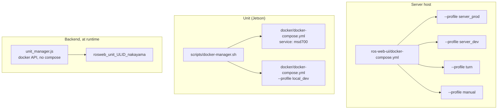
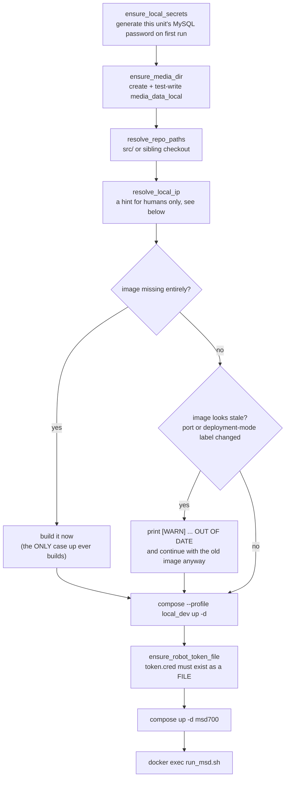

# Referensi Docker

<RoleBadge role="technician" />

Setiap perintah Docker, flag, dan konstruksi compose yang digunakan di MSD700, serta apa yang
sebenarnya dilakukan masing-masing. Halaman ini adalah referensi yang ditautkan oleh halaman-halaman
penyiapan lainnya: baca [Penyiapan Server](/id/setup/server-setup) dan [Penyiapan Unit](/id/setup/unit-setup)
untuk prosedur berurutan, dan kembali ke sini saat Anda perlu tahu mengapa sebuah flag ada di sana atau
apa yang terjadi jika Anda menghapusnya.

## File compose mana yang sedang saya lihat?

Ada tiga file, dan ketiganya bukan varian satu sama lain. Ketiganya menggambarkan mesin yang berbeda.

| File | Berjalan pada | Mengaktifkan |
| --- | --- | --- |
| `ros-web-ui/docker-compose.yml` | **Server** | seluruh stack cloud: MySQL, HiveMQ, backend + rosbridge, media, signalling, dashboard, coturn |
| `msd700_noetic/docker/docker-compose.yml` | sebuah **Unit** | container robot `msd700`, ditambah stack server `local_dev` milik unit itu sendiri |
| `ros-web-ui/docker-compose.robot.yml` | laptop dev | hanya separuh robot saja, berdiri sendiri, tanpa orkestrasi unit |



## Server: profil compose

Compose menjalankan sebuah service ketika **salah satu** dari profil yang dideklarasikannya aktif.
Tidak ada yang dimulai tanpa profil, itulah sebabnya `docker compose up -d` polos di repositori ini
tidak melakukan apa pun yang berguna.

| Profil | Service | Tujuan |
| --- | --- | --- |
| `server_prod` | `db`, `hivemq`, `fix_perms_prod`, `nakayama_cloud`, `nakayama_media`, `nakayama_signalling`, `frontend_prod`, `coturn` | Deployment yang live |
| `server_dev` | `db_dev`, `hivemq_dev`, `fix_perms_dev`, `nakayama_cloud_dev`, `nakayama_media_dev`, `nakayama_signalling_dev`, `frontend_dev` | Stack paralel lengkap pada port dan database yang berbeda |
| `turn` | hanya `coturn` | Menjalankan atau me-restart relay itu sendiri, tanpa menyentuh sisa prod lainnya |
| `manual` | `dev`, `aws`, `hive`, `hive_serverless`, `nakayama_msd`, `nakayama_msd_sim` | Service legacy separuh-robot khusus cloud. Bukan bagian dari deployment normal mana pun |

::: warning `coturn` sengaja ada di dua profil
`profiles: ["server_prod", "turn"]` berarti `up` prod normal membawa relay bersamanya, **dan** Anda
bisa menjalankannya sendiri dengan `--profile turn`. Ia sengaja **tidak** ada di `server_dev`: hanya
ada satu instance relay dan itu milik prod. Menjalankan stack dev tidak boleh menyalakan infrastruktur
produksi. Berbagi ini aman karena relay tidak menyimpan state dan tidak memasangkan siapa pun: peer
saling menemukan lewat signalling server, dan itu **memang** dipisah (3001 prod, 4001 dev).
:::

### Peta service dan port

| Service | Container | Jaringan | Port host | Catatan |
| --- | --- | --- | --- | --- |
| `db` / `db_dev` | `ros_web_ui_v2_db[_dev]` | bridge | `3307` / `3308` | Ada healthcheck; backend menunggunya |
| `hivemq` / `hivemq_dev` | `ros_web_ui_v2_hivemq[_dev]` | bridge | `8883` / `8884` | Port internal container adalah `8883` pada keduanya |
| `nakayama_cloud[_dev]` | `ros_web_ui_v2_nakayama_ros[_dev]` | **host** | `5000` / `5001` API, `9090` / `9091` rosbridge | Juga menampung `unit_manager` |
| `nakayama_media[_dev]` | `ros_web_ui_v2_nakayama_media[_dev]` | **host** | `3003` / `4003` | |
| `nakayama_signalling[_dev]` | `ros_web_ui_v2_nakayama_signalling[_dev]` | **host** | `3001` / `4001` WS, `3002` / `4002` HTTP | |
| `frontend_prod` / `frontend_dev` | `ros_web_ui_v2_frontend[_dev]` | bridge | `3000` / `3100` | Catch-all Apache mengarah ke `3000` |
| `coturn` | `ros_web_ui_v2_coturn` | **host** | `3478` + rentang relay | Hanya prod |

## Referensi perintah compose

### Menjalankan service

```bash
# The normal case: start (or restart into) an entire profile, detached.
docker compose --profile server_prod up -d

# Rebuild the images first, then start. Needed after pulling code that changes a dependency.
docker compose --profile server_prod up -d --build

# Start ONE service without starting the rest of its profile.
docker compose up -d nakayama_cloud

# Start the relay alone, without touching anything else in prod.
docker compose --profile turn up -d coturn
```

| Flag | Efek | Kapan Anda benar-benar membutuhkannya |
| --- | --- | --- |
| `--profile <name>` | Mengaktifkan sebuah profil. Bisa diulang. | Selalu, di repositori ini |
| `-d`, `--detach` | Kembali ke shell alih-alih menampilkan log secara terus-menerus | Selalu, kecuali saat mendiagnosis kegagalan start-up |
| `--build` | Membangun ulang image sebelum memulai | Setelah perubahan dependency atau Dockerfile |
| `--force-recreate` | Membuat ulang container meski konfigurasi dan image tidak berubah | Jarang; container yang macet biasanya lebih baik ditangani dengan `down` lalu `up` |
| `--no-deps` | Menjalankan service yang disebutkan tanpa rantai `depends_on`-nya | Mendiagnosis service yang dependensinya sengaja dimatikan |
| `--remove-orphans` | Menghapus container dari service yang sudah tidak ada di file | Setelah sebuah service diganti nama atau dihapus |
| `--pull always` | Menarik ulang base image | Mengambil patch upstream baru seperti `mysql:8.0` atau `hivemq4` |

### Membangun (Building)

```bash
docker compose --profile server_prod build          # all services in the profile
docker compose build nakayama_cloud                 # one service
docker compose build --no-cache nakayama_cloud      # ignore every cached layer
docker compose build --progress plain nakayama_cloud # full build output, not the collapsed view
```

`--no-cache` adalah jawabannya saat sebuah build "berhasil" tetapi menghasilkan konten basi: Docker
meng-cache layer `COPY` atau `RUN apt-get` yang perubahan inputnya tidak dapat dideteksinya. Ini
lambat, jadi gunakan hanya saat build normal sudah gagal menangkap sesuatu.

### Memeriksa

```bash
docker compose ps                        # services in this project and their health
docker compose ps -a                     # including stopped ones
docker compose logs -f nakayama_cloud    # follow one service
docker compose logs --tail=200 hivemq    # last 200 lines, no follow
docker compose logs --since=10m          # everything in the last 10 minutes
docker compose exec nakayama_cloud bash  # shell inside a RUNNING container
docker compose run --rm busybox sh       # one-off container, removed on exit
docker compose config                    # the fully-resolved file, with all variables expanded
```

::: tip `docker compose config` adalah alat debugging `.env` tercepat yang ada
Perintah ini mencetak file compose dengan setiap `${VARIABLE}` sudah disubstitusikan. Jika sebuah port,
path, atau password tidak sesuai harapan Anda, ini menunjukkan apa yang sebenarnya di-resolve oleh
compose, yang sangat sering ternyata "string kosong, karena key-nya salah eja di `.env`".
:::

### Menghentikan dan menghapus

```bash
docker compose --profile server_prod stop   # stop, keep the containers
docker compose --profile server_prod down   # stop AND remove containers + networks
docker compose down --remove-orphans        # also remove containers of deleted services
docker compose down -v                      # ALSO DELETE NAMED VOLUMES
```

::: danger `down -v` menghapus volume data dan log milik HiveMQ
`ros_webui_hivemq_data_prod` menyimpan pesan yang di-retain, sesi klien, dan pesan QoS>0 yang antre.
Hampir tidak pernah ada alasan untuk menjalankan `-v` di proyek ini. Jika Anda ingin broker yang bersih,
hapus volume itu satu per satu berdasarkan nama, dengan sengaja.
:::

## Konstruksi compose yang digunakan di proyek ini

File compose server menggunakan beberapa konstruksi yang bersifat struktural, bukan sekadar gaya
penulisan. Masing-masing ada di sini karena menghapusnya pernah menyebabkan outage sungguhan.

### YAML anchor (`x-common-env`, `<<: *`)

```yaml
x-common-env: &common-env
  ROS_DISTRO: "noetic"
  MAPS_FOLDER: "${MAPS_FOLDER:-/home/ubuntu/ros_maps}"

x-common-env-prod: &common-env-prod
  <<: *common-env          # inherit, then override
  PORT_SQL: "${MYSQL_PORT_PROD:-3307}"
```

`&name` mendefinisikan sebuah anchor, `*name` mereferensikannya, `<<:` menggabungkannya (merge).
`${VAR:-default}` adalah mekanisme interpolasi milik compose sendiri: gunakan `VAR` jika ada dan tidak
kosong, jika tidak gunakan default.

### `network_mode: host`

Digunakan oleh setiap service yang membawa ROS dan oleh `coturn`. Artinya container berbagi network
namespace milik host: tidak ada pemetaan port, tidak ada NAT, `localhost` di dalam container adalah
host itu sendiri.

| Service | Mengapa host networking |
| --- | --- |
| `nakayama_*` | Node ROS 1 saling bernegosiasi port ephemeral secara arbitrer. Bridged networking merusak URI yang dikembalikan oleh ROS master. |
| `coturn` | Sebuah relay membagikan satu port per alokasi dari `min-port..max-port`. Mempublikasikan rentang tersebut lewat bridge berarti satu proses `docker-proxy` per port. Pada default 16384 port milik coturn, ini akan menjatuhkan mesin. Host ini juga sudah berada di balik NAT, dan bridge menambahkan translasi kedua, yang merusak satu hal yang harus benar-benar dilakukan dengan tepat oleh server TURN: mengetahui dan mengumumkan alamat eksternalnya sendiri. |

### `depends_on` dengan kondisi

```yaml
depends_on:
  db:
    condition: service_healthy
  fix_perms_prod:
    condition: service_completed_successfully
```

| Kondisi | Arti |
| --- | --- |
| `service_started` | Default. Hanya menunggu container tersebut ada. Hampir tidak pernah cukup. |
| `service_healthy` | Menunggu `healthcheck` lulus. Inilah yang mencegah backend berpacu dengan MySQL dan gagal dengan `Connection lost`. |
| `service_completed_successfully` | Menunggu container one-shot keluar dengan kode `0`. Dipakai untuk pembetul izin (permissions fixer). |

### Pembetul izin one-shot

```yaml
fix_perms_prod:
  image: busybox
  profiles: ["server_prod"]
  network_mode: "none"
  user: root
  volumes:
    - /srv/msd/media/map:/srv/msd/media/map
  command: >
    sh -c "mkdir -p ... && chown -R $$USER_UID:$$USER_GID ..."
```

Path host yang di-bind-mount tapi belum ada akan dibuat otomatis **oleh Docker daemon, sebagai root**,
bukan sebagai pengguna aplikasi. Container aplikasi berjalan tanpa hak istimewa (unprivileged), jadi
tulisan pertama mereka mendapat `EACCES`. Container ini berjalan lebih dulu, sebagai root, dan
membetulkan kepemilikan sehingga host yang baru bisa mengoreksi dirinya sendiri tanpa `chown` manual.

::: warning `network_mode: "none"` pada service ini bukan sekadar kosmetik
Tanpa key `networks:`, compose menaruh sebuah service pada jaringan default proyek. Sebuah container
mencatat jaringannya berdasarkan **ID**. Begitu jaringan default itu dihapus dan dibuat ulang (`docker
compose down` mana pun, dan dua checkout berbagi nama proyek yang sama `ros-web-ui`, jadi keduanya bisa
melakukannya), container ini tidak akan pernah bisa dimulai lagi: `failed to set up container
networking: network <old-id> not found`. Setiap service aplikasi bergantung padanya dengan
`service_completed_successfully`, jadi seluruh profil menolak untuk naik karena tersandera job `chown`
yang macet. Ini terjadi dua kali sebelum `network_mode: none` ditambahkan. Ia hanya melakukan mkdir dan
chown; tidak pernah membutuhkan jaringan.
:::

### `user:` dan `group_add:`

```yaml
user: "itbdelabo"
group_add:
  - "${DOCKER_GID:-998}"
```

`group_add` menempatkan user milik container ke dalam grup `docker` milik host sehingga `backend_node`
dapat berbicara dengan `/var/run/docker.sock` yang di-mount dan mengelola container per-unit. Temukan
nilai yang tepat dengan `getent group docker | cut -d: -f3` di host.

HiveMQ menggunakan `user: "1001:0"` sebagai gantinya, dan kedua bagiannya penting: uid `1001` memiliki
keystore `0600`, jadi container harus *menjadi* user tersebut untuk membaca private key-nya sendiri.
Gid `0` bukan pengambilan hak istimewa: image tersebut menyertakan `/opt/hivemq` sebagai `root:root
775` dan `bin/run.sh` menolak untuk dimulai kecuali `$HIVEMQ_HOME` dapat ditulisi, yang dipenuhi oleh
grup root tanpa perlu chown apa pun.

### Bind mount sintaks panjang

```yaml
- type: bind
  source: ${HIVEMQ_KEYSTORE:-/srv/msd/secrets/hivemq/keystore.p12}
  target: /opt/hivemq/conf/keystore.p12
  read_only: true
  bind:
    create_host_path: false
```

Sintaks panjang ini digunakan di sini semata-mata untuk `create_host_path: false`. Default Docker
adalah **membuat** sumber bind yang hilang, dan untuk mount satu file, ia membuat sebuah **direktori**
di sana. Keystore yang hilang kemudian akan muncul sebagai error kunci-tak-terbaca jauh di dalam
startup HiveMQ, bukan sebagai "file ini tidak ada di host". Gagal saat `up` adalah hasil yang jujur.

### Named volume vs bind mount

| Path | Jenis | Alasan |
| --- | --- | --- |
| `./mysql_data/prod` | bind | Berada di dalam repo dan ikut ter-backup bersamanya |
| `hivemq_data_prod`, `hivemq_log_prod` | named volume | Dimiliki oleh Docker, diisi (seed) dari image saat pertama kali digunakan, dan tetap ada meski `$HOME` di-`rm -rf` |
| `./Docker/hivemq/config.xml` | bind, `:ro` | Konfigurasi termasuk milik git |
| `/srv/msd/secrets/...` | bind, `:ro` | Secrets tidak pernah masuk ke dalam image |

::: danger Bind mount MENUTUPI direktori milik image itu sendiri
HiveMQ dulu melakukan bind-mount `conf/ data/ log/` dari tarball yang diekstrak manual di sebuah home
directory. `sudo rm -rf` terhadap direktori "sisa" tersebut ikut menghapus konfigurasinya, dan direktori
host yang kosong bukanlah broker yang menurun kemampuannya: itu adalah broker yang sama sekali tidak
bisa start (`The configuration file /opt/hivemq/conf/config.xml does not exist`). Tidak ada apa pun di
repo yang mencatat seperti apa blok listener-nya dulu. Itulah sebabnya host sekarang tidak menyimpan
apa pun yang dibutuhkan broker untuk boot.
:::

### Healthcheck

```yaml
healthcheck:
  test: ["CMD", "bash", "-c", "exec 3<>/dev/tcp/127.0.0.1/8080"]
  interval: 30s
  timeout: 5s
  retries: 3
  start_period: 60s
```

Ada dua detail yang layak ditiru. Ia memeriksa port **Control Center** milik HiveMQ (8080), bukan
listener MQTT: probe TCP polos terhadap port MQTT akan menutup sebelum mengirim `CONNECT`, dan HiveMQ
mencatat setiap kejadian itu di `log/event.log` sebagai `Client ID: UNKNOWN ... disconnected
ungracefully`, yang berarti sekitar 2880 baris sampah per hari di file yang justru dipakai untuk
mengaudit robot mana saja yang terhubung. Kedua listener berada pada JVM yang sama, jadi 8080 yang
menjawab sudah menjadi sinyal liveness yang memadai.

Dan ia secara eksplisit menyebut `bash`, karena `/bin/sh` di image tersebut adalah `dash`, yang tidak
memiliki `/dev/tcp` dan gagal di setiap probe dengan `Directory nonexistent`.

### Rotasi log

```yaml
logging:
  driver: json-file
  options:
    max-size: "20m"
    max-file: "3"
```

Saat ini hanya `coturn` yang membatasi ukuran log-nya, karena konfigurasinya mencatat alokasi pada
level `verbose` dan scanner tak terautentikasi yang menggempur 3478 bisa saja memenuhi disk dengan
401. Setiap service lainnya masih mencatat log tanpa batas. Memperbaiki itu layak dilakukan dengan
sengaja, bukan sebagai efek samping, karena mengubah driver logging memaksa container recreate pada
setiap service yang tersentuh olehnya.

### Tag image

| Tag | Digunakan oleh |
| --- | --- |
| `ros-noetic-webui-app-v2:latest` | service prod dan container per-unit prod |
| `ros-noetic-webui-app-v2:dev` | service dev dan container per-unit dev |
| `ros-dashboard-next-v2:prod` / `:dev` | dua build dashboard |
| `ros-noetic-webui-app-local:latest` | backend, media, dan signalling milik unit sendiri |
| `ros-dashboard-next-local:latest` | dashboard milik unit sendiri |
| `msd700:latest` / `msd700-simulator:latest` | container robot |

::: warning Prod dan dev tidak boleh pernah berbagi tag
Dulu kedua profil server sama-sama membangun `ros-noetic-webui-app-v2:latest`. Sebuah build yang
dilakukan untuk dev secara diam-diam mengubah apa yang akan dijalankan produksi pada recreate
berikutnya, tanpa deploy dan tanpa pemberitahuan apa pun. Tag sekarang sudah dipisah, dan `UNIT_IMAGE`
diatur per profil sehingga container unit dev menjalankan kode dev.
:::

## coturn: service khusus produksi

Relay adalah satu-satunya bagian dari stack yang ada di prod dan tidak di tempat lain mana pun.

### Konfigurasi

Nilai per-host diteruskan sebagai **flag**, bukan di dalam file konfigurasi, karena coturn tidak
melakukan ekspansi variabel environment apa pun di file konfigurasinya. Flag menang atas file, jadi
kebijakan bersama tetap di git dan alamat tetap di `.env`.

```bash
# ros-web-ui/.env
TURN_LISTENING_IP=192.168.100.10     # the host's own LAN address
TURN_EXTERNAL_IP=118.22.31.252       # the PUBLIC address, seen from the internet
TURN_USER=msd700
TURN_PASSWORD=<a long random string>
TURN_MIN_PORT=49152                  # optional, coturn's own default
TURN_MAX_PORT=65535                  # optional
```

Keempat nilai pertama tersebut diperiksa pada **saat container dimulai**, bukan lewat sintaks
variabel-wajib `${VAR:?}` milik compose. Compose melakukan interpolasi setiap service di dalam file
tanpa peduli profil mana yang sedang dijalankan, jadi variabel wajib di sini akan membuat
`--profile server_dev up` gagal karena relay yang tidak diminta siapa pun untuk dimulai.

::: warning `TURN_EXTERNAL_IP` adalah yang merusak video secara diam-diam
Tanpanya, coturn mengumumkan alamat privatnya sendiri sebagai kandidat relay. Setiap browser di luar
LAN kemudian mencoba menjangkau alamat yang tidak dapat di-routing, dan feed kamera pun tidak pernah
muncul, tanpa error apa pun di dashboard.
:::

### Menjalankannya

```bash
# Prod: comes up with the rest of the stack.
docker compose --profile server_prod up -d

# Just the relay: restart it, or start it before joining it to the stack.
docker compose --profile turn up -d coturn

# Watch allocations (the config logs at `verbose` to stdout).
docker compose logs -f coturn

# Stop just the relay.
docker compose --profile turn stop coturn
```

### Stack dev dan relay

`server_dev` tidak menyertakan `coturn`, dan itu memang benar. Jika Anda sedang menguji WebRTC
terhadap stack dev, signalling server dev (`4001`) akan memberikan peer alamat relay **prod**, dan
memang itulah yang Anda inginkan: satu relay, dibagi bersama, tanpa state.

Jika Anda benar-benar membutuhkan relay dan milik prod belum berjalan, jalankan secara eksplisit:

```bash
docker compose --profile turn up -d coturn
```

### Migrasi dari coturn apt/systemd

Jika host ini masih menjalankan coturn di bawah systemd, urutan berikut penting persis satu kali.
Port 3478 adalah port dikenal-tunggal (well-known) dan keduanya tidak bisa sama-sama memegangnya.

```bash
sudo systemctl disable --now coturn                 # 1. free the port
docker compose --profile turn up -d coturn          # 2. prove the container works
docker compose logs -f coturn                       # 3. confirm it bound and is listening
docker compose --profile server_prod up -d          # 4. now it is just another prod service
```

Menjalankan `up` prod sementara unit systemd masih mendengarkan akan membuat container gagal bind,
lalu `restart: always` mencobanya berulang kali selamanya: berisik, tidak berbahaya, tetapi jauh dari
akar penyebabnya.

## Unit: `docker-manager.sh`

Unit tidak pernah memanggil `docker compose` secara langsung. `scripts/docker-manager.sh`
membungkusnya, karena beberapa hal harus diputuskan **satu kali** dan diberikan ke kedua belah pihak
(container robot dan stack server milik unit itu sendiri) sehingga keduanya tidak bisa berbeda
pendapat.

### Perintah

| Perintah | Apa yang dilakukannya |
| --- | --- |
| `up` | Memulai container robot **dan** stack server `local_dev` milik unit, lalu menjalankan `run_msd.sh` di dalam container |
| `down` / `stop` | Menghentikan dan menghapus container robot serta stack lokal |
| `build` | Membangun image robot |
| `build-clean` | Membangun image robot dengan `--no-cache` |
| `shell` | `docker exec -it` shell login bash di container yang sedang berjalan |
| `logs` | Mengikuti (follow) log container robot |
| `status` | `docker compose ps` untuk container robot |
| `local-up` | Memulai **hanya** stack server lokal, tanpa menjalankan robot |
| `local-down` | Menghentikan hanya stack server lokal |
| `local-build` | Membangun ulang image stack lokal |
| `local-logs` | Mengikuti log stack lokal |
| `local-status` | `docker compose ps` untuk stack lokal |
| `help` | Bantuan lengkap flag dan environment |

### Flag

| Flag | Berlaku untuk | Efek |
| --- | --- | --- |
| `--simulator`, `-s` | `build`, `up` | Menggunakan image Gazebo (`msd700-simulator:latest`) dan container-nya. Juga diteruskan ke `run_msd.sh`, karena itulah yang benar-benar mengatur `use_simulator_val:=true` |
| `--dev` | `up` | Cloud mana yang menjadi peer unit ini: stack dev, bukan produksi. Mengubah MQTT ke 8884, ROS master milik robot ini sendiri ke 11322, dan enrolment ke backend dev |
| `--build` | `up` | Membangun ulang image sebelum memulai |
| `-d`, `--detach` | hanya `up` | Mengembalikan terminal begitu semuanya berjalan |
| `--debug` | diteruskan | Mode verbose `run_msd.sh`. **Ketik lengkap**: `-d` adalah flag detach milik skrip ini |
| `--dry-run` | diteruskan | Mencetak apa yang akan dijalankan tanpa benar-benar menjalankannya |
| `--kill` | diteruskan | Mematikan sesi tmux di dalam container |
| `--local` | diterima, diabaikan | Deprecated. Stack lokal tetap dimulai bagaimanapun |
| `--unit_id` | **ditolak** | Dihapus dengan sengaja. Identitas berasal dari konsol admin cloud |

::: info Apa yang sebenarnya diubah oleh `-d`, dan apa yang tidak
Start-up tetap berjalan di **foreground**: build image, claim code enrolment, dan kegagalan apa pun
adalah hal-hal yang ingin Anda lihat, dan Ctrl-C sebelum service naik tetap membatalkan dan
membongkar stack yang baru setengah jalan dimulai. Yang berubah adalah bagian akhirnya. Begitu setiap
service berjalan, perintah kembali ke shell, dan menutup terminal tersebut tidak lagi menghentikan
robot. Inilah bentuk yang cocok untuk unit systemd atau one-liner
`ssh unit './scripts/docker-manager.sh up -d'`.
:::

::: danger `--unit_id` ditolak, bukan diabaikan
Mengetiknya menghasilkan error yang menjelaskan penggantinya. Robot tanpa identitas ter-cache akan
melakukan self-enrol dan mencetak claim code, dan seorang admin baik **mendaftarkannya** (unit yang
benar-benar baru) atau **mengadopsinya** ke ULID unit yang sudah ada (pertukaran perangkat keras,
cache hilang) dari konsol admin cloud. Keduanya membutuhkan unit memiliki akses internet pada saat
itu. Setelahnya, `Certificates/robot/device.json` dibaca secara otomatis pada setiap run berikutnya.
:::

### Variabel environment yang diteruskan `docker-manager.sh`

| Variabel | Default | Tujuan |
| --- | --- | --- |
| `DEVICE_FINGERPRINT` | diturunkan dari **host** | sha256 dari serial Jetson (atau machine-id, atau MAC asli pertama) ditambah model. Dibaca di host agar container yang dibangun ulang tidak muncul kembali sebagai unit pending baru |
| `ENROLL_SERVER_URL` | diturunkan | Menimpa endpoint enrolment sepenuhnya |
| `ENROLL_BOOTSTRAP_KEY` | tidak diatur | Key image bersama. Sebuah penanda kepercayaan di console, bukan pernah sebuah gerbang |
| `ENROLL_CODE` | tidak diatur | Voucher registrasi sekali pakai, melewati pool pending |
| `DEV_SERVER_HOST` | `118.22.31.252` | Ke mana `--dev` mengarah. Diatur ke `localhost` saat berjalan di host tersebut |
| `DEV_BACKEND_PORT` | `5001` | Port backend untuk `--dev` |
| `CLOUD_BASE_URL` | diturunkan | Mengarahkan seluruh armada ke cloud yang berbeda tanpa perubahan kode |
| `ROS_MASTER_PORT` | `11322` dengan `--dev`, jika tidak `11321` | Diberikan ke **kedua** container dan `backend_local`, sehingga keduanya tidak bisa berbeda pendapat. Tidak pernah `11311`/`11312` milik cloud |
| `BACKEND_PORT_LOCAL` | `5002` | Yang diajak bicara oleh browser dashboard lokal, dan tempat `camera_client` mengambil token unit-lokal |

::: warning Satu keputusan, diberikan ke kedua belah pihak
`CLOUD_BASE_URL` dan `ROS_MASTER_PORT` di-resolve satu kali di `docker-manager.sh` lalu diberikan ke
container **dan** ke compose. Dulu keduanya diturunkan secara independen di kedua sisi, dan itu
persis bagaimana `--dev` rusak di sebuah unit: `run_msd.sh` memindahkan master sementara
`backend_local` tetap meminta port lama, sehingga master itu ada tapi tidak ada yang bisa menemukannya.

Aturan yang sama sekarang berlaku **di dalam** `run_msd.sh` untuk backend enrolment.
`resolve_enroll_base_url()` menurunkan satu `ENROLL_BASE_URL` (`ENROLL_SERVER_URL`, lalu backend dev
`--dev`, lalu produksi) dan kedua pengonsumsinya menggunakannya: resolusi "unit mana saya ini" saat
boot **dan** token refresher yang memperbarui `token.cred` setiap 6 jam. Dulu keduanya bisa berbeda,
karena refresher menetapkan `CLOUD_BASE_URL` produksi secara hardcode, sehingga `run_msd.sh --dev`
melakukan enrolment di backend dev tetapi refresh terhadap produksi, yang menolak `device_secret`
yang diterbitkan dev dengan `401 reenroll` pada setiap refresh (insiden 2026-09-01).
:::

### Apa yang dilakukan `up`, secara berurutan



::: warning `up` hanya membangun ketika image sama sekali tidak ada
Sebelum 2026-08-13, image yang basi (source diedit, atau port berubah di `docker/.env`) memicu
rebuild otomatis pada `up` berikutnya. Itu berarti membawa unit online bisa tiba-tiba membutuhkan
internet, yang justru bertentangan dengan seluruh maksud perangkat keras yang dirancang untuk
berjalan tanpanya. Sekarang image yang basi hanya mencetak `[WARN] ... is OUT OF DATE` dan tetap
dimulai dengan apa yang sudah dibangun. Bangun ulang secara sengaja:
`./scripts/docker-manager.sh build` (atau `local-build` untuk separuh web saja), atau `up --build`
untuk melakukan keduanya dalam satu perintah. `build-clean` memaksa rebuild tanpa cache layer sama
sekali.
:::

Dua langkah lagi ada karena kegagalan yang tampak seperti tidak ada apa-apa sama sekali:

- **`ensure_robot_token_file`.** Empat service melakukan bind-mount `Certificates/robot/token.cred`.
  Menjalankan salah satu dari mereka pada robot yang belum pernah melakukan enrolment membuat Docker,
  karena tidak menemukan file host semacam itu, membuat sebuah **direktori** kosong milik root di
  sana. `enroll.py` kemudian tidak bisa menulis token yang baru saja diperolehnya, dan robot melakukan
  re-enrol dari awal pada setiap boot.
- **Token refresher tidak pernah menghapus `device.json`.** `run_msd.sh` menjalankan
  `enroll.py --refresh` setiap 6 jam untuk menjaga `token.cred` tetap segar. Saat mendapat
  `401 reenroll`, kini ia mencatat log dan berhenti, membiarkan `device.json` tetap ada; hanya boot
  sungguhan yang boleh menghapusnya. Sebelum ini, refresh terhadap backend yang salah (atau gangguan
  server sesaat) menghapus file identitas, dan restart berikutnya memaksa persetujuan ulang penuh
  dari admin, pada hampir setiap restart begitu refresher dan resolver boot melenceng ke backend yang
  berbeda.
- **Pemeriksaan kebasian itu sendiri.** `Dockerfile.webui-local` melakukan **COPY** source ke dalam
  image; tidak ada bind mount untuk service tersebut. Tanpa membandingkan mtime file source terhadap
  waktu build image (ditambah label port dan mode deployment), sebuah unit tidak akan punya cara
  untuk menyadari bahwa ia sedang menyajikan backend minggu lalu sama sekali. Begitulah cara sebuah
  endpoint baru berakhir mengembalikan 404 pada unit yang source tree-nya jelas-jelas sudah
  memuatnya, lihat [Pemecahan Masalah](/id/setup/troubleshooting).

## Unit: `run_msd.sh`

Berjalan **di dalam** container robot dan meluncurkan setiap service ROS dalam sebuah sesi tmux
(`robot_services`). `docker-manager.sh` biasanya yang mengendalikannya, tetapi Anda bisa memanggilnya
langsung dari `docker-manager.sh shell`.

| Flag | Efek |
| --- | --- |
| `-s`, `--simulator` | Sumber data adalah Gazebo, bukan perangkat keras robot |
| `--dev` | Semuanya dev: MQTT 8884, ROS master robot ini 11322, signalling dev, enrolment dev. Port service milik unit **sendiri** tidak bergeser |
| `-d`, `--debug` | Output verbose |
| `-n`, `--dry-run` | Mencetak perintah tanpa menjalankannya |
| `-k`, `--kill` | Mematikan sesi tmux dan keluar |
| `--detach` | Memulai semuanya, mencetak status, keluar. Hanya bentuk panjang |
| `--unit_id <ULID>` | Mematok identitas secara eksplisit. Override pemulihan opsional |
| `--camera_device <path>` | Menimpa path atau index perangkat kamera |

| Environment | Default | Tujuan |
| --- | --- | --- |
| `SERVICE_HOST` | `localhost` | Di mana service sisi-server robot ini berada |
| `ROS_LOG_CAP_MB` | `512` | Batas untuk `~/.ros/log`, yang tidak pernah dirotasi oleh ROS 1 |
| `ROS_LOG_SWEEP_SECONDS` | `60` | Seberapa sering si "janitor" memeriksa |

Window tmux di dalam sesi `robot_services`: `roscore`, `ros_webui`, `camera_client`, `switch_mode`,
`log_janitor`.

```bash
docker exec -it msd700 tmux attach -t robot_services   # attach
# Ctrl-b then d to detach without stopping anything
docker exec -it msd700 tmux list-windows -t robot_services
```

::: danger `--detach` salah untuk `docker-compose.robot.yml`
Pada jalur itu, `run_msd.sh` **adalah** perintah utama container, jadi ia kembali (return) akan
menghentikan container dan membawa serta tmux server-nya. Jalur itu sudah detached pada level
compose; loop foreground itulah yang menjaga container tetap hidup.
:::

## Stack milik unit itu sendiri (profil `local_dev`)

| Service | Container | Port | Terikat pada |
| --- | --- | --- | --- |
| `db_local` | `msd700_db_local` | `3306` | `127.0.0.1` |
| `mosquitto_local` | `msd700_mosquitto_local` | `1883` | `127.0.0.1` |
| `backend_local` | `msd700_backend_local` | `5002` API, `9090` rosbridge | semua interface |
| `media_local` | `msd700_media_local` | `3003` | semua interface |
| `signalling_local` | `msd700_signalling_local` | `3001` WS, `3002` HTTP | semua interface |
| `frontend_local` | `msd700_frontend_local` | `3000` | semua interface |

Setiap satu dari mereka menggunakan `network_mode: host`, jadi **Docker tidak mempublikasikan apa
pun** dan firewall milik unit itu sendirilah yang menentukan. Izinkan kelima port yang menghadap
browser; MySQL dan Mosquitto sengaja diikat ke loopback dan tidak memerlukan aturan apa pun.

Konfigurasi berada di `msd700_noetic/docker/.env` (dibuat secara otomatis dari `.env.example` pada
run pertama). Key yang paling layak ditinjau:

```bash
MAPS_FOLDER_LOCAL=/home/ubuntu/ros_maps
#LOCAL_IP=192.168.4.1     # leave commented to auto-detect each run
WITH_SIMULATOR=false      # adds the Gazebo stack to the image; costs over a GB
USER_UID=                 # empty = detect from `id -u` (Jetson 2002, laptop 1000)
USER_GID=
```

::: info `LOCAL_IP` berhenti menjadi bagian dari bundle pada 2026-08-13
Dulunya: URL `NEXT_PUBLIC_*` dikompilasi ke dalam JS dengan IP unit sudah dipatri (baked-in) di
dalamnya, jadi memindahkan unit ke jaringan baru berarti rebuild wajib. Bundle sekarang mengambil
**host**-nya dari alamat apa pun yang benar-benar digunakan browser operator untuk membuka halaman
(`src/config/apiConfig.ts` di `ROS-dashboard-next-ts`), yang secara konstruksi adalah mesin yang
sama, hanya **port**-nya saja yang masih berasal dari build. Unit yang dijangkau lewat IP, hostname,
mDNS (`msd700.local`), atau SSH tunnel di `localhost` sekarang semuanya berfungsi dengan benar, tidak
satu pun dari itu dimungkinkan sebelumnya. `LOCAL_IP` di `docker/.env` dibiarkan sebagai petunjuk
untuk URL yang dicetak oleh skrip itu sendiri dan fallback tanpa-DHCP yang dipatri sebelum browser ada
sama sekali; salah mengaturnya tidak lagi fatal bagi dashboard, hanya bagi apa yang dicetak skrip.
:::

## Container per-unit (dibuat oleh backend, bukan oleh compose)

`unit_manager.js` membuat container-container ini lewat Docker API. Tidak ada file compose untuk
mereka. Padanan `docker run`-nya adalah:

```bash
docker run -d \
  --name rosweb_unit_01JZ8P9WZ0UNIT00000000000_nakayama \
  --network host \
  --user itbdelabo \
  --restart unless-stopped \
  --log-driver json-file --log-opt max-size=50m --log-opt max-file=3 \
  -v /home/ubuntu/ros_maps:/home/ubuntu/ros_maps \
  -e UNIT_ID=01JZ8P9WZ0UNIT00000000000 \
  -e ROS_DISTRO=noetic -e ROS_PYTHON_VERSION=3 \
  -e MAPS_FOLDER=/home/ubuntu/ros_maps \
  -e NAKAYAMA_PORT=8883 \
  -e ROS_MASTER_URI=http://localhost:11311 \
  ros-noetic-webui-app-v2:latest \
  bash -c "cd /home/itbdelabo/ros-web-ui-ws && catkin_make && source devel/setup.bash && \
    roslaunch msd700_webui_bringup bringup_cloud.launch use_cloud:=true use_nakayama:=true \
    use_backend_web:=false use_unit_relays:=true unit_id:=01JZ8P9WZ0UNIT00000000000"
```

Perintah yang berguna terhadap mereka:

```bash
docker ps --filter "name=rosweb_unit_"           # every running unit bridge
docker logs -f rosweb_unit_<ULID>_nakayama       # one unit's relays
docker stop rosweb_unit_<ULID>_nakayama          # the backend will restart it on next use
```

::: warning Membuat ulang backend membuat setiap container unit menjadi yatim
Container-container unit dimulai oleh proses `backend_node` tertentu. Setelah
`docker compose up -d nakayama_cloud` membuat ulang backend, restart juga setiap container
`rosweb_unit_*`, jika tidak mereka akan tetap berjalan sementara backend baru tidak menganggap mereka
teradopsi.
:::

## Pemecahan masalah Docker itu sendiri

| Gejala | Penyebab | Perbaikan |
| --- | --- | --- |
| `permission denied ... /var/run/docker.sock` | Pengguna Anda tidak ada di grup `docker`, atau keanggotaannya belum diterapkan pada shell ini | `sudo usermod -aG docker $USER`, lalu log out dan masuk kembali (atau `newgrp docker`) |
| `network <id> not found` saat start | Sebuah container mencatat jaringan yang telah dibuat ulang | `docker compose down --remove-orphans` lalu `up` |
| `port is already allocated` | Proses lain (sering kali service systemd, atau profil lain) memegangnya | `sudo ss -lptn 'sport = :3478'` untuk menemukannya |
| Log backend menampilkan `Connection lost` tepat setelah `up` | Ia dimulai sebelum MySQL lolos healthcheck-nya | Ia mencoba ulang secara otomatis; jika tidak, `docker compose up -d <backend>` begitu `ps` menunjukkan DB `healthy` |
| Build berhasil tapi perubahan tidak ada | Sebuah layer yang di-cache | `docker compose build --no-cache <service>` |
| Disk penuh | Image dan build cache lama | `docker system df`, lalu `docker image prune -a` dan `docker builder prune` |
| `the input device is not a TTY` | `docker exec -t` dalam konteks non-interaktif | Diharapkan dalam skrip; `docker-manager.sh` sudah menghilangkan `-t` saat stdin bukan TTY |

## Terkait

- [Penyiapan Server](/id/setup/server-setup)
- [Penyiapan Unit](/id/setup/unit-setup)
- [Pemeliharaan](/id/setup/maintenance)
- [Pemecahan Masalah](/id/setup/troubleshooting)
