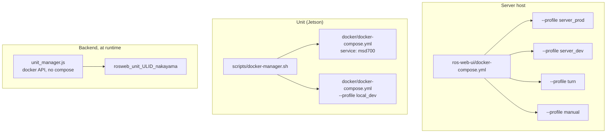
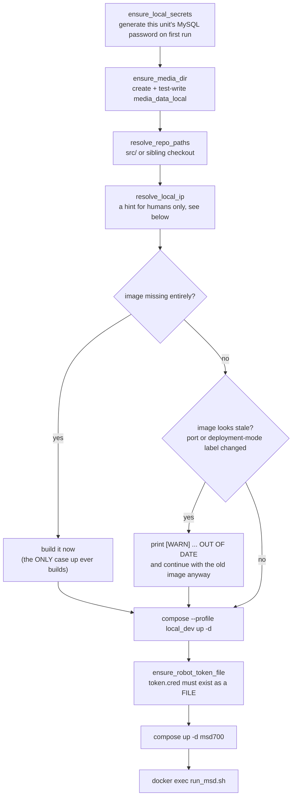

# Docker Reference

<RoleBadge role="technician" />

Every Docker command, flag and compose construct used in MSD700, and what each one is actually
doing. This page is the reference the setup pages link into: read
[Server Setup](/id/setup/server-setup) and [Unit Setup](/id/setup/unit-setup) for the ordered procedure,
and come here when you need to know why a flag is there or what happens if you drop it.

## Which compose file am I looking at?

There are three, and they are not variants of each other. They describe different machines.

| File | Runs on | Brings up |
| --- | --- | --- |
| `ros-web-ui/docker-compose.yml` | the **Server** | the whole cloud stack: MySQL, HiveMQ, backend + rosbridge, media, signalling, dashboard, coturn |
| `msd700_noetic/docker/docker-compose.yml` | a **Unit** | the `msd700` robot container, plus the unit's own `local_dev` server stack |
| `ros-web-ui/docker-compose.robot.yml` | a dev laptop | the robot half alone, standalone, no unit orchestration |



## Server: compose profiles

Compose runs a service when **any** of its declared profiles is active. Nothing starts without a
profile, which is why a bare `docker compose up -d` in this repository does nothing useful.

| Profile | Services | Purpose |
| --- | --- | --- |
| `server_prod` | `db`, `hivemq`, `fix_perms_prod`, `nakayama_cloud`, `nakayama_media`, `nakayama_signalling`, `frontend_prod`, `coturn` | The live deployment |
| `server_dev` | `db_dev`, `hivemq_dev`, `fix_perms_dev`, `nakayama_cloud_dev`, `nakayama_media_dev`, `nakayama_signalling_dev`, `frontend_dev` | A full parallel stack on different ports and a different database |
| `turn` | `coturn` only | Start or restart the relay on its own, without touching the rest of prod |
| `manual` | `dev`, `aws`, `hive`, `hive_serverless`, `nakayama_msd`, `nakayama_msd_sim` | Legacy cloud-only robot-half services. Not part of any normal deployment |

::: warning `coturn` is in two profiles on purpose
`profiles: ["server_prod", "turn"]` means a normal prod `up` brings the relay with it, **and** you
can start it alone with `--profile turn`. It is deliberately **not** in `server_dev`: there is one
relay instance and it belongs to prod. Bringing up the dev stack must not start production
infrastructure. Sharing is safe because a relay holds no state and pairs nobody: peers find each
other through the signalling servers, and those **are** split (3001 prod, 4001 dev).
:::

### Service and port map

| Service | Container | Network | Host port | Notes |
| --- | --- | --- | --- | --- |
| `db` / `db_dev` | `ros_web_ui_v2_db[_dev]` | bridge | `3307` / `3308` | Healthchecked; the backend waits on it |
| `hivemq` / `hivemq_dev` | `ros_web_ui_v2_hivemq[_dev]` | bridge | `8883` / `8884` | Container-internal port is `8883` in both |
| `nakayama_cloud[_dev]` | `ros_web_ui_v2_nakayama_ros[_dev]` | **host** | `5000` / `5001` API, `9090` / `9091` rosbridge | Also hosts `unit_manager` |
| `nakayama_media[_dev]` | `ros_web_ui_v2_nakayama_media[_dev]` | **host** | `3003` / `4003` | |
| `nakayama_signalling[_dev]` | `ros_web_ui_v2_nakayama_signalling[_dev]` | **host** | `3001` / `4001` WS, `3002` / `4002` HTTP | |
| `frontend_prod` / `frontend_dev` | `ros_web_ui_v2_frontend[_dev]` | bridge | `3000` / `3100` | Apache's catch-all points at `3000` |
| `coturn` | `ros_web_ui_v2_coturn` | **host** | `3478` + relay range | Prod only |

## Compose command reference

### Bringing services up

```bash
# The normal case: start (or restart into) an entire profile, detached.
docker compose --profile server_prod up -d

# Rebuild the images first, then start. Needed after pulling code that changes a dependency.
docker compose --profile server_prod up -d --build

# Start ONE service without starting the rest of its profile.
docker compose up -d nakayama_cloud

# Start the relay alone, without touching anything else in prod.
docker compose --profile turn up -d coturn
```

| Flag | Effect | When you actually need it |
| --- | --- | --- |
| `--profile <name>` | Activates a profile. Repeatable. | Always, in this repository |
| `-d`, `--detach` | Return to the shell instead of streaming logs | Always, except when debugging a start-up failure |
| `--build` | Rebuild images before starting | After a dependency or Dockerfile change |
| `--force-recreate` | Recreate containers even if config and image are unchanged | Rarely; a stuck container is usually better handled with `down` then `up` |
| `--no-deps` | Start the named service without its `depends_on` chain | Debugging a service whose dependency is deliberately down |
| `--remove-orphans` | Delete containers from services no longer in the file | After a service is renamed or removed |
| `--pull always` | Re-pull base images | Picking up a new upstream `mysql:8.0` or `hivemq4` patch |

### Building

```bash
docker compose --profile server_prod build          # all services in the profile
docker compose build nakayama_cloud                 # one service
docker compose build --no-cache nakayama_cloud      # ignore every cached layer
docker compose build --progress plain nakayama_cloud # full build output, not the collapsed view
```

`--no-cache` is the answer when a build "succeeds" but produces stale content: Docker cached a
`COPY` or a `RUN apt-get` layer whose inputs it cannot see changing. It is slow, so reach for it
only when a normal build has already failed to pick something up.

### Inspecting

```bash
docker compose ps                        # services in this project and their health
docker compose ps -a                     # including stopped ones
docker compose logs -f nakayama_cloud    # follow one service
docker compose logs --tail=200 hivemq    # last 200 lines, no follow
docker compose logs --since=10m          # everything in the last 10 minutes
docker compose exec nakayama_cloud bash  # shell inside a RUNNING container
docker compose run --rm busybox sh       # one-off container, removed on exit
docker compose config                    # the fully-resolved file, with all variables expanded
```

::: tip `docker compose config` is the fastest `.env` debugging tool there is
It prints the compose file with every `${VARIABLE}` substituted. If a port, a path or a password is
not what you expected, this shows you what compose actually resolved, which is very often "empty
string, because the key is misspelled in `.env`".
:::

### Stopping and removing

```bash
docker compose --profile server_prod stop   # stop, keep the containers
docker compose --profile server_prod down   # stop AND remove containers + networks
docker compose down --remove-orphans        # also remove containers of deleted services
docker compose down -v                      # ALSO DELETE NAMED VOLUMES
```

::: danger `down -v` deletes HiveMQ's data and log volumes
`ros_webui_hivemq_data_prod` holds retained messages, client sessions and queued QoS>0 messages.
There is almost never a reason to run `-v` on this project. If you want a clean broker, delete that
one volume by name, deliberately.
:::

## Compose constructs used in this project

The server compose file uses several constructs that are load-bearing rather than stylistic. Each
one is here because dropping it caused a real outage.

### YAML anchors (`x-common-env`, `<<: *`)

```yaml
x-common-env: &common-env
  ROS_DISTRO: "noetic"
  MAPS_FOLDER: "${MAPS_FOLDER:-/home/ubuntu/ros_maps}"

x-common-env-prod: &common-env-prod
  <<: *common-env          # inherit, then override
  PORT_SQL: "${MYSQL_PORT_PROD:-3307}"
```

`&name` defines an anchor, `*name` references it, `<<:` merges it. `${VAR:-default}` is compose's
own interpolation: use `VAR` if set and non-empty, otherwise the default.

### `network_mode: host`

Used by every ROS-carrying service and by `coturn`. It means the container shares the host's network
namespace: no port mapping, no NAT, `localhost` inside the container is the host.

| Service | Why host networking |
| --- | --- |
| `nakayama_*` | ROS 1 nodes negotiate arbitrary ephemeral ports with each other. Bridged networking breaks the ROS master's returned URIs. |
| `coturn` | A relay hands out one port per allocation from `min-port..max-port`. Publishing that range through the bridge means one `docker-proxy` process per port. At coturn's 16384-port default it takes the machine down. This host is also already behind NAT, and a bridge adds a second translation, which breaks the one thing a TURN server must get right: knowing and advertising its own external address. |

### `depends_on` with conditions

```yaml
depends_on:
  db:
    condition: service_healthy
  fix_perms_prod:
    condition: service_completed_successfully
```

| Condition | Meaning |
| --- | --- |
| `service_started` | The default. Only waits for the container to exist. Almost never enough. |
| `service_healthy` | Waits for the `healthcheck` to pass. This is what stops the backend racing MySQL and failing with `Connection lost`. |
| `service_completed_successfully` | Waits for a one-shot container to exit `0`. Used for the permissions fixer. |

### The one-shot permissions fixer

```yaml
fix_perms_prod:
  image: busybox
  profiles: ["server_prod"]
  network_mode: "none"
  user: root
  volumes:
    - /srv/msd/media/map:/srv/msd/media/map
  command: >
    sh -c "mkdir -p ... && chown -R $$USER_UID:$$USER_GID ..."
```

A bind-mounted host path that does not exist yet is auto-created **by the Docker daemon, as root**,
not as the app user. The app containers run unprivileged, so their first write gets `EACCES`. This
container runs first, as root, and fixes ownership so a fresh host self-corrects with no manual
`chown`.

::: warning `network_mode: "none"` on this service is not cosmetic
Without a `networks:` key, compose puts a service on the project default network. A container
records its network by **ID**. Once that default network is removed and recreated (any
`docker compose down`, and two checkouts share the project name `ros-web-ui`, so either can do it),
this container can never start again: `failed to set up container networking: network <old-id> not
found`. Every app service depends on it with `service_completed_successfully`, so the whole profile
then refuses to come up behind a stuck `chown` job. This happened twice before `network_mode: none`
was added. It mkdirs and chowns; it has never needed networking.
:::

### `user:` and `group_add:`

```yaml
user: "itbdelabo"
group_add:
  - "${DOCKER_GID:-998}"
```

`group_add` puts the container's user in the host's `docker` group so `backend_node` can talk to the
mounted `/var/run/docker.sock` and manage per-unit containers. Find the right value with
`getent group docker | cut -d: -f3` on the host.

HiveMQ uses `user: "1001:0"` instead, and both halves matter: uid `1001` owns the `0600` keystore,
so the container has to *be* that user to read its own private key. Gid `0` is not a privilege grab:
the image ships `/opt/hivemq` as `root:root 775` and `bin/run.sh` refuses to start unless
`$HIVEMQ_HOME` is writable, which group root satisfies without chowning anything.

### Long-syntax bind mounts

```yaml
- type: bind
  source: ${HIVEMQ_KEYSTORE:-/srv/msd/secrets/hivemq/keystore.p12}
  target: /opt/hivemq/conf/keystore.p12
  read_only: true
  bind:
    create_host_path: false
```

The long syntax is used here purely for `create_host_path: false`. Docker's default is to **create**
a missing bind source, and for a single-file mount it creates a **directory** there. A missing
keystore would then surface as an unreadable-key error deep in HiveMQ's startup rather than as "this
file is not on the host". Failing at `up` is the honest outcome.

### Named volumes vs bind mounts

| Path | Kind | Why |
| --- | --- | --- |
| `./mysql_data/prod` | bind | Lives inside the repo and is backed up with it |
| `hivemq_data_prod`, `hivemq_log_prod` | named volume | Docker owns them, seeds them from the image on first use, and they survive an `rm -rf` of anything under `$HOME` |
| `./Docker/hivemq/config.xml` | bind, `:ro` | Configuration belongs in git |
| `/srv/msd/secrets/...` | bind, `:ro` | Secrets never enter an image |

::: danger A bind mount MASKS the image's own directory
HiveMQ used to bind-mount `conf/ data/ log/` from a hand-extracted tarball in a home directory. A
`sudo rm -rf` of those "leftover" directories took the configuration with it, and an empty host
directory is not a degraded broker: it is a broker that cannot start at all
(`The configuration file /opt/hivemq/conf/config.xml does not exist`). Nothing in the repo recorded
what the listener block had been. That is why the host now holds nothing a broker needs to boot.
:::

### Healthchecks

```yaml
healthcheck:
  test: ["CMD", "bash", "-c", "exec 3<>/dev/tcp/127.0.0.1/8080"]
  interval: 30s
  timeout: 5s
  retries: 3
  start_period: 60s
```

Two details worth copying. It probes HiveMQ's **Control Center** port (8080), not the MQTT listener:
a bare TCP probe against the MQTT port closes before sending `CONNECT`, and HiveMQ records every one
of those in `log/event.log` as `Client ID: UNKNOWN ... disconnected ungracefully`, which is about
2880 junk lines a day in the exact file used to audit which robots connected. Both listeners belong
to the same JVM, so 8080 answering is an adequate liveness signal.

And it says `bash` explicitly, because `/bin/sh` in that image is `dash`, which has no `/dev/tcp` and
fails every probe with `Directory nonexistent`.

### Log rotation

```yaml
logging:
  driver: json-file
  options:
    max-size: "20m"
    max-file: "3"
```

Only `coturn` currently caps its logs, because its config logs allocations at `verbose` and an
unauthenticated scanner hammering 3478 could otherwise fill the disk with 401s. Every other service
still logs unbounded. Fixing that is worth doing on purpose rather than incidentally, because
changing a logging driver forces a container recreate on every service it touches.

### Image tags

| Tag | Used by |
| --- | --- |
| `ros-noetic-webui-app-v2:latest` | prod services and prod per-unit containers |
| `ros-noetic-webui-app-v2:dev` | dev services and dev per-unit containers |
| `ros-dashboard-next-v2:prod` / `:dev` | the two dashboard builds |
| `ros-noetic-webui-app-local:latest` | a unit's own backend, media and signalling |
| `ros-dashboard-next-local:latest` | a unit's own dashboard |
| `msd700:latest` / `msd700-simulator:latest` | the robot container |

::: warning Prod and dev must never share a tag
Both server profiles used to build `ros-noetic-webui-app-v2:latest`. A build done for dev silently
changed what production would run on its next recreate, with no deploy and no announcement. The tags
are split now, and `UNIT_IMAGE` is set per profile so dev unit containers run dev code.
:::

## coturn: the production-only service

The relay is the one piece of the stack that exists in prod and nowhere else.

### Configuration

Per-host values are passed as **flags**, not in the config file, because coturn expands no
environment variables in its config. Flags win over the file, so shared policy stays in git and
addresses stay in `.env`.

```bash
# ros-web-ui/.env
TURN_LISTENING_IP=192.168.100.10     # the host's own LAN address
TURN_EXTERNAL_IP=118.22.31.252       # the PUBLIC address, seen from the internet
TURN_USER=msd700
TURN_PASSWORD=<a long random string>
TURN_MIN_PORT=49152                  # optional, coturn's own default
TURN_MAX_PORT=65535                  # optional
```

All four of the first values are checked at **container start**, not by compose's `${VAR:?}`
required-variable syntax. Compose interpolates every service in the file regardless of which profile
is being brought up, so a required variable here would make `--profile server_dev up` fail on a
relay nobody asked to start.

::: warning `TURN_EXTERNAL_IP` is the one that breaks video silently
Without it, coturn advertises its private address as the relay candidate. Every browser outside the
LAN then tries to reach an address that does not route, and the camera feed simply never appears,
with no error in the dashboard.
:::

### Running it

```bash
# Prod: comes up with the rest of the stack.
docker compose --profile server_prod up -d

# Just the relay: restart it, or start it before joining it to the stack.
docker compose --profile turn up -d coturn

# Watch allocations (the config logs at `verbose` to stdout).
docker compose logs -f coturn

# Stop just the relay.
docker compose --profile turn stop coturn
```

### Dev stacks and the relay

`server_dev` does not include `coturn`, and that is correct. If you are testing WebRTC against the
dev stack, the dev signalling server (`4001`) will hand peers the **prod** relay's address, which is
what you want: one relay, shared, stateless.

If you genuinely need a relay and prod's is not running, start it explicitly:

```bash
docker compose --profile turn up -d coturn
```

### Migrating off the apt/systemd coturn

If this host still runs coturn under systemd, the order matters exactly once. Port 3478 is a single
well-known port and the two cannot both hold it.

```bash
sudo systemctl disable --now coturn                 # 1. free the port
docker compose --profile turn up -d coturn          # 2. prove the container works
docker compose logs -f coturn                       # 3. confirm it bound and is listening
docker compose --profile server_prod up -d          # 4. now it is just another prod service
```

Run a prod `up` while the systemd unit is still listening and the container fails to bind, then
`restart: always` retries it forever: noisy, harmless, and a long way from its cause.

## Unit: `docker-manager.sh`

The unit never calls `docker compose` directly. `scripts/docker-manager.sh` wraps it, because
several things have to be decided **once** and handed to both halves (the robot container and the
unit's own server stack) so they cannot disagree.

### Commands

| Command | What it does |
| --- | --- |
| `up` | Start the robot container **and** the unit's `local_dev` server stack, then run `run_msd.sh` inside the container |
| `down` / `stop` | Stop and remove the robot container and the local stack |
| `build` | Build the robot image |
| `build-clean` | Build the robot image with `--no-cache` |
| `shell` | `docker exec -it` a bash login shell in the running container |
| `logs` | Follow the robot container's logs |
| `status` | `docker compose ps` for the robot container |
| `local-up` | Start **only** the local server stack, no robot bringup |
| `local-down` | Stop only the local server stack |
| `local-build` | Rebuild the local stack images |
| `local-logs` | Tail the local stack logs |
| `local-status` | `docker compose ps` for the local stack |
| `help` | Full flag and environment help |

### Flags

| Flag | Applies to | Effect |
| --- | --- | --- |
| `--simulator`, `-s` | `build`, `up` | Use the Gazebo image (`msd700-simulator:latest`) and container. Forwarded to `run_msd.sh` too, because that is what actually sets `use_simulator_val:=true` |
| `--dev` | `up` | Which **cloud** is this unit's peer: the dev stack instead of production. Changes MQTT to 8884, this robot's own ROS master to 11322, and enrolment to the dev backend |
| `--build` | `up` | Rebuild the image before starting |
| `-d`, `--detach` | `up` only | Hand the terminal back once everything is running |
| `--debug` | forwarded | `run_msd.sh` verbose mode. **Type it in full**: `-d` is this script's detach flag |
| `--dry-run` | forwarded | Print what would run without running it |
| `--kill` | forwarded | Kill the tmux session inside the container |
| `--local` | accepted, ignored | Deprecated. The local stack starts either way |
| `--unit_id` | **rejected** | Removed on purpose. Identity comes from the cloud admin console |

::: info What `-d` actually changes, and what it does not
Start-up still runs in the **foreground**: the image build, the enrolment claim code and any failure
are all things you want to see, and a Ctrl-C before the services are up still aborts and tears the
half-started stack down. What changes is the end. Once every service is running, the command returns
to the shell, and closing that terminal no longer stops the robot. This is the form that belongs in
a systemd unit or an `ssh unit './scripts/docker-manager.sh up -d'` one-liner.
:::

::: danger `--unit_id` is rejected, not ignored
Typing it produces an error explaining the replacement. A robot with no cached identity self-enrols
and prints a claim code, and an admin either **registers** it (brand new unit) or **adopts** it onto
an existing unit's ULID (hardware swap, lost cache) from the cloud admin console. Both need the unit
to have internet access at that moment. After that, `Certificates/robot/device.json` is read
automatically on every later run.
:::

### Environment variables `docker-manager.sh` forwards

| Variable | Default | Purpose |
| --- | --- | --- |
| `DEVICE_FINGERPRINT` | derived from the **host** | sha256 of the Jetson serial (or machine-id, or first real MAC) plus the model. Read on the host so a rebuilt container does not reappear as a new pending unit |
| `ENROLL_SERVER_URL` | derived | Overrides the enrolment endpoint outright |
| `ENROLL_BOOTSTRAP_KEY` | unset | Shared image key. A trust marker in the console, never a gate |
| `ENROLL_CODE` | unset | Single-use registration voucher, skips the pending pool |
| `DEV_SERVER_HOST` | `118.22.31.252` | Where `--dev` points. Set to `localhost` when running on that host |
| `DEV_BACKEND_PORT` | `5001` | Backend port for `--dev` |
| `CLOUD_BASE_URL` | derived | Points a whole fleet at a different cloud without a code change |
| `ROS_MASTER_PORT` | `11322` with `--dev`, else `11321` | Handed to **both** the container and `backend_local`, so they cannot disagree. Never the cloud's `11311`/`11312` |
| `BACKEND_PORT_LOCAL` | `5002` | What the local dashboard's browser talks to, and where `camera_client` fetches a unit-local token |

::: warning One decision, handed to both halves
`CLOUD_BASE_URL` and `ROS_MASTER_PORT` are resolved once in `docker-manager.sh` and passed to the
container **and** to compose. They used to be derived independently on both sides, which is exactly
how `--dev` broke on a unit: `run_msd.sh` moved the master while `backend_local` kept asking for
the old port, so the master existed and nothing could find it.
:::

### What `up` does, in order



::: warning `up` builds only when an image does not exist at all
Before 2026-08-13, a stale image (source edited, or a port changed in `docker/.env`) triggered an
automatic rebuild on the next `up`. That meant bringing a unit online could suddenly need internet,
which is exactly backwards for hardware whose entire point is running without it. Now a stale image
only prints `[WARN] ... is OUT OF DATE` and starts anyway with what is already built. Rebuild
deliberately: `./scripts/docker-manager.sh build` (or `local-build` for just the web half), or
`up --build` to do both in one command. `build-clean` forces a rebuild with no layer cache at all.
:::

Two more of those steps exist because of failures that looked like nothing at all:

- **`ensure_robot_token_file`.** Four services bind-mount `Certificates/robot/token.cred`. Bring any
  of them up on a robot that has never enrolled and Docker, finding no such host file, creates a
  root-owned empty **directory** there. `enroll.py` then cannot write the token it just earned, and
  the robot re-enrols from scratch on every boot.
- **The staleness check itself.** `Dockerfile.webui-local` **COPY**s the source into the image; there
  is no bind mount for those services. Without comparing source-file mtimes against the image build
  time (plus the port and deployment-mode labels), a unit would have no way to notice it is serving
  last week's backend at all. That is how a new endpoint ends up returning 404 on a unit whose source
  tree plainly contains it, see [Troubleshooting](/id/setup/troubleshooting).

## Unit: `run_msd.sh`

Runs **inside** the robot container and launches every ROS service in a tmux session
(`robot_services`). `docker-manager.sh` normally drives it, but you can call it directly from
`docker-manager.sh shell`.

| Flag | Effect |
| --- | --- |
| `-s`, `--simulator` | Data source is Gazebo instead of the robot's hardware |
| `--dev` | Everything dev: MQTT 8884, this robot's ROS master 11322, dev signalling, dev enrolment. The unit's **own** service ports do not shift |
| `-d`, `--debug` | Verbose output |
| `-n`, `--dry-run` | Print the commands without running them |
| `-k`, `--kill` | Kill the tmux session and exit |
| `--detach` | Start everything, print status, exit. Long form only |
| `--unit_id <ULID>` | Pin the identity explicitly. Optional recovery override |
| `--camera_device <path>` | Override the camera device path or index |

| Environment | Default | Purpose |
| --- | --- | --- |
| `SERVICE_HOST` | `localhost` | Where this robot's server-side services live |
| `ROS_LOG_CAP_MB` | `512` | Ceiling for `~/.ros/log`, which ROS 1 never rotates |
| `ROS_LOG_SWEEP_SECONDS` | `60` | How often the janitor checks |

tmux windows in the `robot_services` session: `roscore`, `ros_webui`, `camera_client`,
`switch_mode`, `log_janitor`.

```bash
docker exec -it msd700 tmux attach -t robot_services   # attach
# Ctrl-b then d to detach without stopping anything
docker exec -it msd700 tmux list-windows -t robot_services
```

::: danger `--detach` is wrong for `docker-compose.robot.yml`
On that path `run_msd.sh` **is** the container's main command, so returning stops the container and
takes the tmux server with it. That path is already detached at the compose level; the foreground
loop is what keeps the container alive.
:::

## The unit's own stack (`local_dev` profile)

| Service | Container | Port | Bound to |
| --- | --- | --- | --- |
| `db_local` | `msd700_db_local` | `3306` | `127.0.0.1` |
| `mosquitto_local` | `msd700_mosquitto_local` | `1883` | `127.0.0.1` |
| `backend_local` | `msd700_backend_local` | `5002` API, `9090` rosbridge | all interfaces |
| `media_local` | `msd700_media_local` | `3003` | all interfaces |
| `signalling_local` | `msd700_signalling_local` | `3001` WS, `3002` HTTP | all interfaces |
| `frontend_local` | `msd700_frontend_local` | `3000` | all interfaces |

Every one of them uses `network_mode: host`, so **Docker publishes nothing** and the unit's own
firewall is what matters. Allow the five browser-facing ports; MySQL and Mosquitto are deliberately
bound to loopback and need no rule.

Configuration lives in `msd700_noetic/docker/.env` (created from `.env.example` automatically on
first run). The keys most worth reviewing:

```bash
MAPS_FOLDER_LOCAL=/home/ubuntu/ros_maps
#LOCAL_IP=192.168.4.1     # leave commented to auto-detect each run
WITH_SIMULATOR=false      # adds the Gazebo stack to the image; costs over a GB
USER_UID=                 # empty = detect from `id -u` (Jetson 2002, laptop 1000)
USER_GID=
```

::: info `LOCAL_IP` stopped being part of the bundle on 2026-08-13
It used to be: `NEXT_PUBLIC_*` URLs were compiled into the JS with the unit's IP baked in, so moving
a unit to a new network meant a mandatory rebuild. The bundle now takes its **host** from whatever
address the operator's browser actually used to open the page
(`src/config/apiConfig.ts` in `ROS-dashboard-next-ts`), which by construction is the same machine , 
only the **port** still comes from the build. A unit reached by IP, hostname, mDNS
(`msd700.local`), or an SSH tunnel on `localhost` all work correctly now, none of which was possible
before. `LOCAL_IP` in `docker/.env` is left as a hint for the script's own printed URLs and the
DHCP-less fallback baked in before a browser ever exists, getting it wrong is no longer fatal to
the dashboard, only to what the script prints.
:::

## Per-unit containers (created by the backend, not by compose)

`unit_manager.js` creates these through the Docker API. There is no compose file for them. The
equivalent `docker run` is:

```bash
docker run -d \
  --name rosweb_unit_01JZ8P9WZ0UNIT00000000000_nakayama \
  --network host \
  --user itbdelabo \
  --restart unless-stopped \
  --log-driver json-file --log-opt max-size=50m --log-opt max-file=3 \
  -v /home/ubuntu/ros_maps:/home/ubuntu/ros_maps \
  -e UNIT_ID=01JZ8P9WZ0UNIT00000000000 \
  -e ROS_DISTRO=noetic -e ROS_PYTHON_VERSION=3 \
  -e MAPS_FOLDER=/home/ubuntu/ros_maps \
  -e NAKAYAMA_PORT=8883 \
  -e ROS_MASTER_URI=http://localhost:11311 \
  ros-noetic-webui-app-v2:latest \
  bash -c "cd /home/itbdelabo/ros-web-ui-ws && catkin_make && source devel/setup.bash && \
    roslaunch msd700_webui_bringup bringup_cloud.launch use_cloud:=true use_nakayama:=true \
    use_backend_web:=false use_unit_relays:=true unit_id:=01JZ8P9WZ0UNIT00000000000"
```

Useful commands against them:

```bash
docker ps --filter "name=rosweb_unit_"           # every running unit bridge
docker logs -f rosweb_unit_<ULID>_nakayama       # one unit's relays
docker stop rosweb_unit_<ULID>_nakayama          # the backend will restart it on next use
```

::: warning Recreating the backend orphans every unit container
The unit containers were started by a specific `backend_node` process. After
`docker compose up -d nakayama_cloud` recreates the backend, restart every `rosweb_unit_*`
container too, or they will be running while the new backend does not consider them adopted.
:::

## Troubleshooting Docker itself

| Symptom | Cause | Fix |
| --- | --- | --- |
| `permission denied ... /var/run/docker.sock` | Your user is not in the `docker` group, or the membership has not applied to this shell | `sudo usermod -aG docker $USER`, then log out and back in (or `newgrp docker`) |
| `network <id> not found` on start | A container recorded a network that was recreated | `docker compose down --remove-orphans` then `up` |
| `port is already allocated` | Another process (often a systemd service, or the other profile) holds it | `sudo ss -lptn 'sport = :3478'` to find it |
| Backend logs `Connection lost` right after `up` | It started before MySQL passed its healthcheck | It retries; if not, `docker compose up -d <backend>` once `ps` shows the DB `healthy` |
| Build succeeds but the change is not there | A cached layer | `docker compose build --no-cache <service>` |
| Disk filling up | Old images and build cache | `docker system df`, then `docker image prune -a` and `docker builder prune` |
| `the input device is not a TTY` | `docker exec -t` in a non-interactive context | Expected in scripts; `docker-manager.sh` already drops `-t` when stdin is not a TTY |

## Related

- [Server Setup](/id/setup/server-setup)
- [Unit Setup](/id/setup/unit-setup)
- [Maintenance](/id/setup/maintenance)
- [Troubleshooting](/id/setup/troubleshooting)
