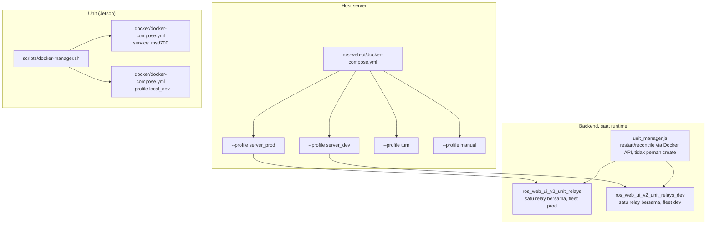
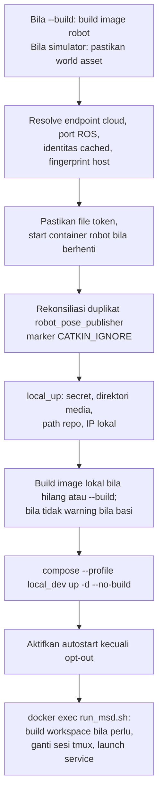

# Referensi Docker

<RoleBadge role="technician" />

Semua perintah Docker, flag, dan konstruksi compose di MSD700, plus artinya. Ini referensi yang ditaut halaman setup: ikuti [Setup Server](/id/setup/server-setup) dan [Setup Unit](/id/setup/unit-setup) untuk urutan langkah, ke sini bila flag atau konstruksi perlu dijelaskan.

## File compose yang mana?

Tiga file, tiga pekerjaan beda. Tidak bisa dipertukarkan.

| File | Jalan di | Menyalakan |
| --- | --- | --- |
| `ros-web-ui/docker-compose.yml` | **Server** | seluruh stack cloud: MySQL, HiveMQ, backend + rosbridge, media, signalling, dashboard, coturn |
| `msd700_noetic/docker/docker-compose.yml` | **Unit** | container robot `msd700` + stack server `local_dev` milik unit |
| `ros-web-ui/docker-compose.robot.yml` | laptop dev | separuh robot saja, standalone, tanpa orkestrasi unit |



## Server: profile compose

Compose menjalankan service bila **salah satu** profile-nya aktif. Tanpa profile tidak ada yang start: `docker compose up -d` polos di repo ini tidak berguna.

| Profile | Service | Tujuan |
| --- | --- | --- |
| `server_prod` | `db`, `hivemq`, `fix_perms_prod`, `nakayama_cloud`, `unit_relays`, `nakayama_media`, `nakayama_signalling`, `frontend_prod`, `coturn` | Deployment live |
| `server_dev` | `db_dev`, `hivemq_dev`, `fix_perms_dev`, `nakayama_cloud_dev`, `unit_relays_dev`, `nakayama_media_dev`, `nakayama_signalling_dev`, `frontend_dev` | Stack paralel: port beda, database beda |
| `turn` | `coturn` saja | Relay saja, tanpa menyentuh sisa prod |
| `manual` | `dev`, `aws`, `hive`, `hive_serverless`, `nakayama_msd`, `nakayama_msd_sim` | Shell interaktif + service legacy. Pilih satu eksplisit; jangan start seluruh profile |

::: warning `coturn` di dua profile itu sengaja
`profiles: ["server_prod", "turn"]` berarti `up` prod membawa relay, **dan** bisa start sendiri dengan `--profile turn`. Relay **tidak** di `server_dev`: satu instance relay, milik prod. Sharing aman karena relay tidak menyimpan state; peer bertemu lewat server signalling yang **dipisah** (3001 prod, 4001 dev).
:::

### Peta service dan port

| Service | Container | Network | Port host | Catatan |
| --- | --- | --- | --- | --- |
| `db` / `db_dev` | `ros_web_ui_v2_db[_dev]` | bridge | `3307` / `3308` | Healthchecked; backend menunggu |
| `hivemq` / `hivemq_dev` | `ros_web_ui_v2_hivemq[_dev]` | bridge | `8883` / `8884` | Di dalam container keduanya `8883` |
| `nakayama_cloud[_dev]` | `ros_web_ui_v2_nakayama_ros[_dev]` | **host** | `5000`/`5001` API, `9090`/`9091` rosbridge, `11311`/`11312` ROS master | Satu ROS graph bersama per environment |
| `unit_relays[_dev]` | `ros_web_ui_v2_unit_relays[_dev]` | **host** | tidak ada (relay) | Satu data plane bersama per fleet (default) |
| `nakayama_media[_dev]` | `ros_web_ui_v2_nakayama_media[_dev]` | **host** | `3003` / `4003` | |
| `nakayama_signalling[_dev]` | `ros_web_ui_v2_nakayama_signalling[_dev]` | **host** | `3001`/`4001` WS, `3002`/`4002` HTTP | |
| `frontend_prod` / `frontend_dev` | `ros_web_ui_v2_frontend[_dev]` | bridge | `3000` / `3100` | Catch-all Apache menunjuk `3000` |
| `coturn` | `ros_web_ui_v2_coturn` | **host** | `3478` + range relay | Hanya prod |

## Referensi perintah compose

### Menyalakan service

```bash
# Kasus normal: seluruh profile, detached
docker compose --profile server_prod up -d

# Rebuild image dulu, lalu start (perlu setelah pull perubahan kode)
docker compose --profile server_prod up -d --build

# Satu service dari profile
docker compose --profile server_prod up -d nakayama_cloud

# Relay saja, sisa prod tak tersentuh
docker compose --profile turn up -d coturn
```

| Flag | Efek | Kapan dipakai |
| --- | --- | --- |
| `--profile <name>` | Mengaktifkan profile (bisa banyak) | Seluruh stack; menarget service juga mengaktifkannya |
| `-d` | Kembali ke shell, bukan streaming log | Selalu, kecuali debug startup failure |
| `--build` | Rebuild image sebelum start | Setelah ubahan source aplikasi, dependensi, atau Dockerfile (service server tidak bind-mount `source/`) |
| `--force-recreate` | Recreate container walau tak berubah | Recovery tertarget; lebih baik dari teardown proyek |
| `--no-deps` | Start service tanpa rantai `depends_on` | Debug dengan dependensi sengaja down |
| `--remove-orphans` | Hapus container service yang dihapus | Setelah service di-rename/hapus |
| `--pull always` | Pull image sebelum `up` | Refresh tag image (bukan versi pinned atau base Dockerfile; itu `build --pull`) |

### Building

```bash
docker compose --profile server_prod build          # semua service di profile
docker compose build nakayama_cloud                 # satu service
docker compose build --no-cache nakayama_cloud      # abaikan cached layer
docker compose build --progress plain nakayama_cloud # output penuh
```

`--no-cache` untuk build yang "sukses" tapi menyajikan konten basi (layer `COPY` / `apt-get` tercache). Lambat; pakai hanya setelah build normal gagal mengangkat perubahan.

### Inspecting

```bash
docker compose ps                        # service proyek ini + health
docker compose ps -a                     # termasuk yang berhenti
docker compose logs -f nakayama_cloud    # follow satu service
docker compose logs --tail=200 hivemq    # 200 baris terakhir
docker compose logs --since=10m          # 10 menit terakhir
docker compose exec nakayama_cloud bash  # shell di container yang JALAN
docker compose --profile server_dev config --quiet    # validasi tanpa dump
docker compose --profile server_dev config --services # list nama service
```

`compose run` menerima **nama service**, bukan image. Tidak ada service bernama `busybox`.

::: warning Jaga secret saat diagnostik
`config` polos, `config --environment`, `inspect` penuh, dan log bisa berisi kredensial. Jangan paste ke tiket/chat. Cek hanya field yang perlu; redact password, token, dan auth header dulu.
:::

### Menghentikan dan menghapus

```bash
docker compose --profile server_prod stop   # stop, container tetap
docker compose --profile server_prod down   # stop DAN hapus container + network
docker compose down --remove-orphans        # plus hapus container service terhapus
docker compose down -v                      # PLUS HAPUS NAMED VOLUME
```

::: danger `down -v` menghapus data HiveMQ
`ros_webui_hivemq_data_prod` menyimpan retained message, sesi client, antrean QoS>0. Hampir tidak pernah pakai `-v` di sini. Untuk membersihkan broker, hapus volume itu by name, dengan sengaja.
:::

## Konstruksi compose di proyek ini

Tiap konstruksi di bawah ada karena menghapusnya pernah merusak sesuatu.

### YAML anchor (`x-common-env`, `<<: *`)

```yaml
x-common-env: &common-env
  ROS_DISTRO: "noetic"
  MAPS_FOLDER: "${MAPS_FOLDER:-/home/ubuntu/ros_maps}"

x-common-env-prod: &common-env-prod
  <<: *common-env          # warisi, lalu override
  PORT_SQL: "${MYSQL_PORT_PROD:-3307}"
```

`&name` mendefinisikan anchor, `*name` memakai, `<<:` menggabung. `${VAR:-default}` artinya: pakai `VAR` bila set dan non-kosong, bila tidak pakai default.

### `network_mode: host`

Dipakai semua service pembawa ROS dan `coturn`. Container berbagi network host: tanpa port mapping, tanpa NAT, `localhost` di dalam adalah host.

| Service | Kenapa host networking |
| --- | --- |
| `nakayama_*` | Node ROS 1 menegosiasi port acak satu sama lain. Bridged networking merusak URI yang dikembalikan master. |
| `coturn` | Relay membagikan satu port per alokasi. Mempublish range 16k-port lewat bridge melahirkan satu `docker-proxy` per port dan menjatuhkan mesin. Bridge juga menambah layer NAT kedua, merusak alamat yang harus diiklankan server TURN. |

### Kondisi `depends_on`

```yaml
depends_on:
  db:
    condition: service_healthy
  fix_perms_prod:
    condition: service_completed_successfully
```

| Kondisi | Arti |
| --- | --- |
| `service_started` | Default. Hanya menunggu container ada. Jarang cukup. |
| `service_healthy` | Menunggu `healthcheck` lolos. Mencegah backend balapan dengan MySQL (`Connection lost`). |
| `service_completed_successfully` | Menunggu one-shot exit `0`. Untuk fixer permission. |

### Fixer permission one-shot

```yaml
fix_perms_prod:
  image: busybox
  profiles: ["server_prod"]
  network_mode: "none"
  user: root
  volumes:
    - /srv/msd/media/map:/srv/msd/media/map
  command: >
    sh -c "mkdir -p ... && chown -R $$USER_UID:$$USER_GID ..."
```

Folder bind-mount yang hilang dibuat otomatis **oleh daemon Docker, sebagai root**. Container aplikasi jalan unprivileged, sehingga write pertamanya gagal. Container root ini jalan duluan dan memperbaiki ownership, sehingga host baru koreksi sendiri.

::: warning `network_mode: "none"` itu load-bearing
Tanpanya, Compose menempelkan service ke network default proyek, tercatat by **ID**. Setelah `down` apa pun membuat ulang network itu (dua checkout berbagi nama proyek `ros-web-ui`, jadi keduanya bisa memicu), fixer tak bisa start lagi (`network <old-id> not found`), dan semua service di belakang `service_completed_successfully` menolak naik. Ia hanya mkdir dan chown; memang tidak butuh networking.
:::

### `user:` dan `group_add:`

```yaml
user: "itbdelabo"
group_add:
  - "${DOCKER_GID:-998}"
```

`group_add` memasukkan user container ke grup `docker` host agar `backend_node` bisa memakai `/var/run/docker.sock` yang di-mount: mode fleet menjaga relay bersama selaras roster; mode legacy mengelola container per-unit. Cari nilainya dengan `getent group docker | cut -d: -f3` di host.

HiveMQ memakai `user: "1001:0"`, dan keduanya penting: uid `1001` memiliki keystore `0600` (container harus *menjadi* user itu untuk membaca key-nya); gid `0` memenuhi cek writability image atas `/opt/hivemq` tanpa chown.

### Bind mount sintaks panjang

```yaml
- type: bind
  source: ${HIVEMQ_KEYSTORE:-/srv/msd/secrets/hivemq/keystore.p12}
  target: /opt/hivemq/conf/keystore.p12
  read_only: true
  bind:
    create_host_path: false
```

Bentuk panjang di sini hanya untuk `create_host_path: false`. Default Docker **membuat** bind source yang hilang, dan untuk single file ia membuat **direktori**. Keystore hilang akan gagal jauh di startup HiveMQ sebagai error unreadable-key, bukan gagal di `up` dengan "file tidak ada di host". Gagal di `up` adalah hasil yang jujur.

### Named volume vs bind mount

| Path | Jenis | Kenapa |
| --- | --- | --- |
| `./mysql_data/prod` | bind | Di dalam repo, ikut ter-backup |
| `hivemq_data_prod`, `hivemq_log_prod` | named volume | Milik Docker, di-seed dari image saat pertama pakai, selamat dari `rm -rf` di `$HOME` |
| `./Docker/hivemq/config.xml` | bind, `:ro` | Config milik git |
| `/srv/msd/secrets/...` | bind, `:ro` | Secret tidak pernah masuk image |

::: danger Bind mount menyembunyikan folder milik image
Folder host kosong yang di-mount di atas folder config bukan service degraded: ia service yang tak bisa start (`config.xml does not exist`). Itu sebabnya host tidak menyimpan apa pun yang dibutuhkan broker untuk boot.
:::

### Healthcheck

```yaml
healthcheck:
  test: ["CMD", "bash", "-c", "exec 3<>/dev/tcp/127.0.0.1/8080"]
  interval: 30s
  timeout: 5s
  retries: 3
  start_period: 60s
```

Dua detail layak ditiru. Probe ke port **Control Center** HiveMQ (8080), bukan MQTT: probe TCP polos di port MQTT menutup sebelum `CONNECT`, dan HiveMQ mencatat tiap satunya sebagai `disconnected ungracefully` (~2880 baris sampah/hari di log audit). JVM yang sama, jadi 8080 sinyal liveness yang cukup.

Tertulis `bash` eksplisit karena `/bin/sh` di sana adalah `dash`, yang tidak punya `/dev/tcp` dan menggagalkan tiap probe.

### Rotasi log

```yaml
logging:
  driver: json-file
  options:
    max-size: "20m"
    max-file: "3"
```

Di file **server** hanya `coturn` menyetel batas ini (config-nya log alokasi verbose). Service server lain memakai default daemon; mengubahnya berarti recreate tiap service tersentuh, jadi lakukan dengan sengaja, bukan insidental. File **unit** beda: tiap service dibatasi 20 MB x 3 via anchor `x-local-logging`.

### Tag image

| Tag | Dipakai |
| --- | --- |
| `ros-noetic-webui-app-v2:latest` | service prod (termasuk fleet relay) + container per-unit prod legacy |
| `ros-noetic-webui-app-v2:dev` | service dev (termasuk fleet relay dev) + container per-unit dev legacy |
| `ros-dashboard-next-v2:prod` / `:dev` | dua build dashboard |
| `ros-noetic-webui-app-local:latest` | backend, media, signalling, network agent milik unit |
| `ros-dashboard-next-local:latest` | dashboard milik unit |
| `msd700:latest` / `msd700-simulator:latest` | container robot |

::: warning Prod dan dev tidak boleh berbagi tag
Kedua profile pernah mem-build `:latest`. Build untuk dev diam-diam mengubah apa yang dijalankan produksi di recreate berikutnya. Tag kini dipisah, dan `UNIT_IMAGE` diset per profile agar container dev legacy menjalankan kode dev.
:::

## coturn: service hanya-produksi

### Konfigurasi

Nilai per-host masuk sebagai **flag**, bukan di file config: coturn tidak mengekspansi environment variable di config-nya. Flag menang atas file, sehingga policy bersama tetap di git dan address tetap di `.env`.

```bash
# ros-web-ui/.env
TURN_LISTENING_IP=192.168.100.10     # alamat LAN host ini sendiri
TURN_EXTERNAL_IP=118.22.31.252       # alamat PUBLIK, terlihat dari internet
TURN_USER=msd700
TURN_PASSWORD=<string acak panjang>
TURN_MIN_PORT=49152                  # optional, default coturn
TURN_MAX_PORT=65535                  # optional
```

Keempat nilai pertama dicek saat **container start**, bukan oleh sintaks `${VAR:?}` Compose. Compose menginterpolasi tiap service apa pun profile-nya, sehingga required variable di sini akan merusak `--profile server_dev up` untuk relay yang tak diminta.

::: warning `TURN_EXTERNAL_IP` merusak video diam-diam
Tanpanya, coturn mengiklankan alamat privatnya. Tiap browser di luar LAN mencoba alamat tak routable, dan feed kamera tak pernah muncul, tanpa error dashboard.
:::

### Menjalankannya

```bash
# Prod: ikut naik dengan stack
docker compose --profile server_prod up -d

# Relay saja (restart, atau start sebelum gabung stack)
docker compose --profile turn up -d coturn

# Awasi alokasi (verbose logging ke stdout)
docker compose logs -f coturn

# Stop hanya relay
docker compose --profile turn stop coturn
```

### Stack dev dan relay

`server_dev` mengecualikan `coturn`, benar begitu. Testing WebRTC terhadap dev? Server signalling dev (`4001`) menyerahkan alamat relay **prod** ke peer. Satu relay, bersama, stateless: persis yang diinginkan.

Butuh relay padahal prod mati? Start eksplisit:

```bash
docker compose --profile turn up -d coturn
```

### Pindah dari coturn apt/systemd

Bila host masih menjalankan coturn di bawah systemd, urutan penting sekali. Port 3478 hanya muat satu pemegang.

```bash
sudo systemctl disable --now coturn                 # 1. bebaskan port
docker compose --profile turn up -d coturn          # 2. buktikan container bekerja
docker compose logs -f coturn                       # 3. konfirmasi listen
docker compose --profile server_prod up -d          # 4. kini ia service prod biasa
```

`up` prod saat systemd masih memegang port gagal bind, lalu `restart: always` retry selamanya: berisik, harmless, jauh dari penyebabnya.

## Unit: `docker-manager.sh`

Unit tidak pernah memanggil `docker compose` langsung. `scripts/docker-manager.sh` membungkusnya, memutuskan nilai bersama **sekali** dan menyerahkannya ke kedua belah (container robot + stack server unit) agar tak bisa beda.

### Perintah

| Perintah | Artinya |
| --- | --- | --- |
| `up` | Start container robot **dan** stack `local_dev`, jalankan `run_msd.sh` di dalam. Pasang/aktifkan `msd700.service` untuk reboot |
| `down` / `stop` | Stop dan hapus container robot + stack lokal, nonaktifkan `msd700.service` |
| `build` | Build image robot + image stack lokal, pull MySQL/Mosquitto, agar `up` berikutnya tak butuh internet |
| `build-clean` | Sama, tanpa cache layer Docker |
| `shell` | Shell login bash di container jalan (nyalakan bila perlu) |
| `logs` | Follow log container robot |
| `status` | `docker compose ps` untuk container robot |
| `local-up` | Stack server lokal saja, tanpa bringup robot |
| `local-down` | Stop stack server lokal saja |
| `local-build` | Rebuild image stack lokal |
| `local-logs` | Tail log stack lokal |
| `local-status` | `docker compose ps` untuk stack lokal |
| `reenroll` | Backup data unit, hapus identitas cached; `up` berikutnya mencetak kode klaim. Pilih **Unbind** admin bila unit masih ada di console |
| `print-autostart-unit` | Cetak render `msd700.service`, untuk instal di mana `up` tak bisa sudo |
| `help` | Bantuan flag + environment lengkap |

### Flag

| Flag | Berlaku untuk | Efek |
| --- | --- | --- |
| `--simulator`, `-s` | `build`, `up` | Image Gazebo (`msd700-simulator:latest`) + container. Diteruskan juga ke `run_msd.sh`, yang menyetel `use_simulator_val:=true` |
| `--dev` | `up` | Cloud peer: stack dev, bukan produksi. MQTT 8884, ROS master robot ini 11322, enrolment backend dev |
| `--build` | `up` | Rebuild image robot/lokal + workspace catkin dalam container. Robot jalan mempertahankan image lama sampai recreated |
| `--no-autostart` | `up`, `down` | Biarkan `msd700.service` (`up` mengaktifkan autostart boot, `down` menonaktifkan) |
| `-d` | hanya `up` | Kembalikan terminal setelah semua jalan |
| `--debug` | diteruskan | Verbose `run_msd.sh`. **Ketik penuh**: `-d` di sini artinya detach |
| `--dry-run` | diteruskan | Bukan preview aman: tetap start container, ubah host state, bisa kill sesi dan hubungi enrolment |
| `--kill` | diteruskan | Kill sesi tmux di container |
| `--local` | diterima, diabaikan | Deprecated. Stack lokal tetap start |
| `--unit_id` | **ditolak** | Sengaja dihapus. Identitas dari admin console cloud |

::: info Apa yang diubah `-d` (dan tidak)
Startup tetap jalan di **foreground**: build image, kode klaim, failure semua tampil, dan Ctrl-C sebelum service naik membatalkan dan merobohkan stack setengah jalan. Yang berubah hanya akhir: setelah semua jalan, perintah kembali, dan menutup terminal tak lagi menghentikan robot. Ini bentuk untuk unit systemd dan one-liner `ssh`.
:::

::: danger `--unit_id` ditolak, bukan diabaikan
Ia error dengan penjelasan. Robot tanpa identitas cached enrol mandiri dan mencetak kode klaim; admin **mendaftarkan** (unit baru) atau **mengadopsi** ke ULID yang ada (ganti hardware, cache hilang) di console cloud. Keduanya butuh internet saat itu. Setelahnya `Certificates/robot/device.json` termuat otomatis tiap run.
:::

### Environment variable yang diteruskan

| Variable | Default | Tujuan |
| --- | --- | --- |
| `DEVICE_FINGERPRINT` | diturunkan dari **host** | sha256 serial Jetson (atau machine-id / MAC real pertama) + model. Dibaca di host agar container rebuilt tak muncul sebagai pending unit baru |
| `ENROLL_SERVER_URL` | diturunkan | Override endpoint enrolment mentah |
| `ENROLL_BOOTSTRAP_KEY` | unset | Key image bersama. Penanda trust di console, bukan gate |
| `ENROLL_CODE` | unset | Voucher registrasi sekali pakai, melewati pending pool |
| `DEV_SERVER_HOST` | `118.22.31.252` | Tujuan `--dev` (`localhost` bila jalan di host itu) |
| `DEV_BACKEND_PORT` | `5001` | Port backend untuk `--dev` |
| `CLOUD_BASE_URL` | diturunkan | Arahkan se-fleet ke cloud lain tanpa ubah kode |
| `ROS_MASTER_PORT` | `11322` dengan `--dev`, bila tidak `11321` | Diberikan ke container **dan** `backend_local`. Tidak pernah `11311`/`11312` cloud |
| `BACKEND_PORT_LOCAL` | `5002` | Port backend dashboard lokal; `camera_client` mengambil token unit-lokal di sini |

`CLOUD_BASE_URL` dan `ROS_MASTER_PORT` di-resolve sekali dan diteruskan ke kedua belah. Dulu diturunkan sendiri-sendiri di tiap sisi, begitulah `--dev` rusak: `run_msd.sh` memindah master sementara `backend_local` menanyakan port lama. Aturan sama di dalam `run_msd.sh` untuk enrolment: satu `ENROLL_BASE_URL` melayani resolusi identitas boot-time dan refresher token 6-jam (keduanya pernah beda dan tiap refresh gagal `401 reenroll`).

### Apa yang dilakukan `up`, berurutan



Tanpa `--build`, image lokal yang ada dipakai ulang dan yang basi hanya warning (`[WARN] ... is OUT OF DATE`). Image hilang, asset simulator, dan enrolment pertama tetap bisa butuh internet. Rebuild dengan sengaja (`build`, `local-build`, atau `up --build`); `build-clean` membuang cache. Robot yang jalan tidak pernah recreated oleh `up`, bahkan setelah build: recreate saat stop terencana dengan flag `--dev`/`--simulator` yang sama.

Tiga langkah ada karena failure diam-diam:

- **File token dulu.** Empat service me-mount `Certificates/robot/token.cred`. Di robot yang belum pernah enrol Docker membuat **direktori** kosong milik root di sana, `enroll.py` tak bisa menulis token yang baru didapat, dan robot re-enrol tiap boot.
- **Refresher tak pernah menghapus identitas.** Saat `401 reenroll` ia log dan berhenti, mempertahankan `device.json`. Hanya boot nyata boleh menghapusnya. Menghapusnya saat refresh gagal pernah memaksa re-approval admin penuh hampir tiap restart.
- **Cek image basi.** Image web lokal meng-**COPY** source masuk (tanpa bind mount). Mtime source dibandingkan waktu build image, sehingga unit bisa sadar ia menyajikan backend minggu lalu (klasik "endpoint baru 404 padahal source punya").

## Unit: `run_msd.sh`

Jalan **di dalam** container robot, meluncurkan tiap service ROS di sesi tmux (`robot_services`). Normalnya dikemudikan `docker-manager.sh`; bisa dipanggil langsung dari `docker-manager.sh shell`.

| Flag | Efek |
| --- | --- |
| `-s`, `--simulator` | Gazebo, bukan hardware |
| `--dev` | Semua dev: MQTT 8884, ROS master robot ini 11322, signalling + enrolment dev. Port service milik unit **sendiri** tak bergerak |
| `-d`, `--debug` | Output verbose |
| `-n`, `--dry-run` | Tidak read-only: melewati sebagian launch/build tapi tetap jalan setup, kill sesi tmux, bisa hubungi enrolment |
| `-k`, `--kill` | Kill sesi tmux, exit |
| `--detach` | Start semua, cetak status, exit. Hanya bentuk panjang |
| `--unit_id <ULID>` | Pin identitas eksplisit. Override recovery |
| `--camera_device <path>` | Override path/index device kamera |
| `--build` / `--no-build` | Paksa/lewati build catkin; default build hanya bila `devel/setup.bash` tidak ada |

| Environment | Default | Tujuan |
| --- | --- | --- |
| `SERVICE_HOST` | `localhost` | Tempat service sisi-server robot ini tinggal |
| `ROS_LOG_CAP_MB` | `512` | Batas `~/.ros/log`, yang tak pernah dirotasi ROS 1 |
| `ROS_LOG_SWEEP_SECONDS` | `60` | Interval cek janitor |

Ini setting **inner-launcher**. Wrapper tidak meneruskannya lewat `docker exec`; export host atau entri `docker/.env` tak sampai ke inner launcher. Tree dan batas log: [Maintenance](/id/setup/maintenance#housekeeping-log).

Window tmux di `robot_services`: `roscore`, `ros_webui`, `camera_client`, `switch_mode`, `log_janitor`, plus `token_refresh` (memperbarui `token.cred` tiap 6 jam) dan `enrol_collect` (hanya saat re-enrolment menunggu approval admin).

```bash
docker exec -it msd700 tmux attach -t robot_services   # attach
# Ctrl-b lalu d untuk detach tanpa menghentikan apa-apa
docker exec -it msd700 tmux list-windows -t robot_services
```

::: danger `--detach` salah untuk `docker-compose.robot.yml`
Di sana `run_msd.sh` **adalah** perintah utama container, sehingga return menghentikan container dan server tmux-nya. Path itu sudah detached di level compose; foreground loop yang membuatnya hidup.
:::

## Stack milik unit (`local_dev` profile)

| Service | Container | Port | Bound ke |
| --- | --- | --- | --- |
| `db_local` | `msd700_db_local` | `3306` | `127.0.0.1` |
| `mosquitto_local` | `msd700_mosquitto_local` | `1883` MQTT; `9001` WebSocket | MQTT: `127.0.0.1`; WebSocket: semua interface |
| `backend_local` | `msd700_backend_local` | `5002` API, `9090` rosbridge | semua interface |
| `media_local` | `msd700_media_local` | `3003` | semua interface |
| `signalling_local` | `msd700_signalling_local` | `3001` WS, `3002` HTTP | semua interface |
| `frontend_local` | `msd700_frontend_local` | `3000` | semua interface |
| `network_local` | `msd700_network_local` | `5011` network API | loopback; di-proxy backend |

Default, bukan hasil ukur host-mu. Tiap service memakai `network_mode: host`, sehingga **Docker mem-publish nothing**; firewall unit mengontrol akses. Default menghadap browser: `3000`, `5002`, `9090`, `3003`, `3001`, `3002`, `9001`. MySQL `3306`, MQTT polos `1883`, dan network agent `5011` internal unit. Listener MQTT WebSocket mengizinkan client anonymous di config checked-in: simpan di jaringan operator tepercaya, jangan internet publik.

Config tinggal di `msd700_noetic/docker/.env` (otomatis dibuat dari `.env.example` saat pertama run). Key layak review:

```bash
MAPS_FOLDER_LOCAL=/home/ubuntu/ros_maps
#LOCAL_IP=192.168.4.1     # biarkan comment untuk auto-detect tiap run
WITH_SIMULATOR=false      # menambah stack Gazebo ke image; makan 1+ GB
USER_UID=                 # kosong = deteksi dari `id -u` (Jetson 2002, laptop 1000)
USER_GID=
```

::: info `LOCAL_IP` tak lagi membentuk bundle
JS dashboard mengambil **host**-nya dari alamat yang dipakai browser membuka halaman; hanya **port** yang masih dari build. IP, hostname, mDNS (`msd700.local`), atau tunnel SSH `localhost` semua bekerja. `LOCAL_IP` tersisa hanya sebagai hint URL cetakan dan fallback tanpa-DHCP.
:::

## Fleet relay (default) vs container per-unit (legacy)

Data plane cloud tiap robot jalan di SATU container bersama: `ros_web_ui_v2_unit_relays` (prod) atau `..._dev` (dev). Berbagi ROS master dan rosbridge backend: satu ROS graph per environment. Memegang satu koneksi `mqtt_client` nodelet/TLS untuk fleet plus relay topik multi-unit. Perintah start-nya membangun peta bridge dari roster database (atau override `MULTI_UNIT_LIST`). Roster kosong atau database tak terjangkau: menunggu dan retry. Menambah robot tidak membuat container per-unit.

Default karena `UNIT_CONTAINERS_ENABLED` default `false`: `unit_manager.js` jalan mode **FLEET**, melacak pemakaian unit dan menjaga satu relay selaras roster, tidak pernah spawn per-unit.

```bash
docker ps --filter "name=unit_relays"       # relay fleet bersama
docker logs -f ros_web_ui_v2_unit_relays    # bridge MQTT/ROS se-fleet
docker restart ros_web_ui_v2_unit_relays    # ambil perubahan roster
```

::: warning Jangan jalankan fleet relay dan container per-unit bersamaan
Dua bridge di topik MQTT yang sama mengantar tiap goal dan result dua kali, memajukan ganda loop ACK waypoint (terlihat seperti waypoint dilewati). Relay menolak start saat node `cloud_mqtt_client` per-unit terdaftar, dan `unit_manager.js` me-log (bukan kill) container `rosweb_unit_*` nyasar di mode fleet.
:::

### Legacy: container per-unit

`UNIT_CONTAINERS_ENABLED=true` **di environment proses backend** mengembalikan satu container relay per robot: `rosweb_unit_<ULID>_nakayama` (prod) atau `..._nakayama_dev` (dev), dibuat on demand, direap setelah 30 mnt idle (Autopilot mem-pin). File Compose checked-in tidak meneruskan variable ini, sehingga edit `.env` saja tidak mengaktifkan. Config deployment harus meneruskannya eksplisit dan mengecualikan fleet relay environment itu, atau `up` profile berikutnya menyalakan relay lagi. Tidak ada service Compose menjelaskan container dinamis ini.

```bash
docker ps --filter "name=rosweb_unit_"           # bridge per-unit (hanya legacy)
docker logs -f rosweb_unit_<ULID>_nakayama       # relay satu unit
docker stop rosweb_unit_<ULID>_nakayama          # stop; backend restart saat dipakai lagi
```

Mode fleet: `unit_manager.init()` me-restart relay bersama yang ada saat startup backend agar node-nya terdaftar ke master baru; poll roster 60-detik juga me-restart saat list unit berubah. Relay hilang tidak pernah dibuat manager; Compose yang membuatnya. Tiap restart relay sempat memutus data plane cloud semua unit.

Mode legacy: `adoptExisting()` mengadopsi container jalan untuk lifecycle management tapi tidak me-restart node ROS-nya. Bila master diganti, cek registrasi dan pulihkan hanya container terdampak di environment itu. Jangan bulk-restart list `rosweb_unit_*` tanpa scope lintas dev dan produksi.

## Troubleshooting Docker sendiri

| Gejala | Penyebab | Perbaikan |
| --- | --- | --- |
| `permission denied ... /var/run/docker.sock` | User belum di grup `docker` | `sudo usermod -aG docker $USER`, logout/in (atau `newgrp docker`) |
| `network <id> not found` saat start | Container mencatat network yang direcreate | `docker compose down --remove-orphans`, lalu `up` |
| `port is already allocated` | Proses lain memegangnya (service systemd, atau profile lain) | `sudo ss -lptn 'sport = :3478'` untuk menemukan |
| Backend `Connection lost` setelah `up` | Start sebelum healthcheck MySQL | Retry; bila tidak `docker compose up -d <backend>` setelah DB `healthy` |
| Build sukses tapi perubahan hilang | Cached layer | `docker compose build --no-cache <service>` |
| Disk penuh | Image lama + build cache | `docker system df`, `docker image prune -a`, `docker builder prune` |
| `the input device is not a TTY` | `docker exec -t` tanpa TTY | Wajar di script; `docker-manager.sh` sudah melepas `-t` tanpa stdin TTY |

## Terkait

- [Setup Server](/id/setup/server-setup)
- [Setup Unit](/id/setup/unit-setup)
- [Maintenance](/id/setup/maintenance)
- [Troubleshooting](/id/setup/troubleshooting)
