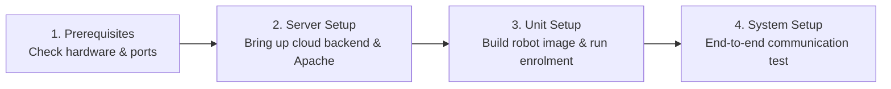

# Panduan Penyiapan dan Penerapan

<RoleBadge role="technician" />

Bagian ini berisi dokumentasi teknis untuk **teknisi, teknisi sistem, dan pemasang lapangan** yang mengonfigurasi perangkat keras dan perangkat lunak MSD700.

Setiap prosedur mencakup perintah shell langkah demi langkah, keluaran yang diharapkan, templat konfigurasi, dan penjelasan arsitektur.

<LinkCards>
  <LinkCard icon="✅" title="Prerequisites" details="Hardware sizing, compute requirements, OS versions, and network port firewall rules." link="/setup/prerequisites" />
  <LinkCard icon="🖥️" title="Server Setup" details="Step-by-step production cloud deployment: Docker Compose, Apache reverse proxy, and SSL." link="/setup/server-setup" />
  <LinkCard icon="📡" title="Unit Setup" details="Install and configure the physical robot on NVIDIA Jetson SBCs, build runtime, and enrol." link="/setup/unit-setup" />
  <LinkCard icon="🔗" title="System Setup" details="End-to-end integration checklist, network verification, and operator handover." link="/setup/system-setup" />
  <LinkCard icon="🐳" title="Docker Reference" details="Exhaustive reference for Docker Compose profiles, environment variables, and volume mounts." link="/setup/docker-reference" />
  <LinkCard icon="📶" title="WiFi Hotspot + Client" details="Configure onboard Wi-Fi hotspot, Access Point mode, and local network client bridge." link="/setup/wifi-hotspot" />
  <LinkCard icon="🧰" title="Maintenance" details="Routine log rotation, JWT keyring rotation, Certbot Let's Encrypt updates, and backups." link="/setup/maintenance" />
  <LinkCard icon="🛠️" title="Technician Troubleshooting" details="Diagnose and resolve hardware, container, MQTT broker, and sensor issues." link="/setup/troubleshooting" />
</LinkCards>

## Kemajuan Penerapan yang Direkomendasikan

Platform MSD700 menggunakan model dua mesin (Server + Unit Fisik). Ikuti urutan ini untuk instalasi baru:

1. [Prasyarat](/id/setup/prerequisites): Verifikasi ukuran komputasi, periferal perangkat keras Jetson, dan aturan firewall jaringan.
2. [Pengaturan Server](/id/setup/server-setup): Tampilkan tumpukan server cloud terlebih dahulu sehingga unit fisik memiliki titik akhir pusat untuk didaftarkan.
3. [Penyiapan Unit](/id/setup/unit-setup): Bangun wadah robot di Jetson SBC dan selesaikan jabat tangan pendaftaran kriptografi otomatis.
4. [Pengaturan Sistem](/id/setup/system-setup): Jalankan daftar periksa verifikasi operasional ujung ke ujung 10 poin.

Setelah instalasi awal, lihat [Pemeliharaan](/id/setup/maintenance) dan [Pemecahan Masalah](/id/setup/troubleshooting) untuk pemeliharaan armada yang sedang berlangsung.